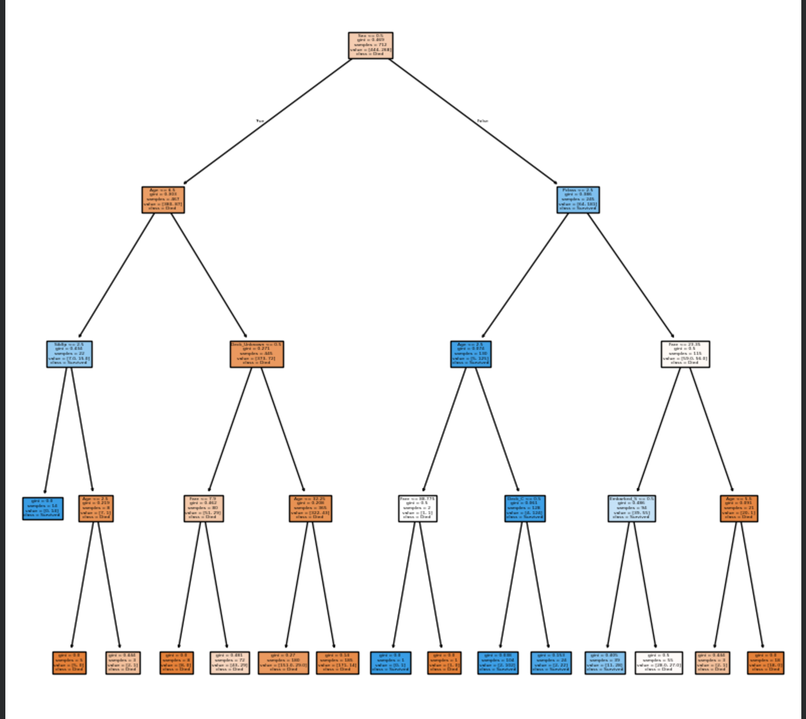
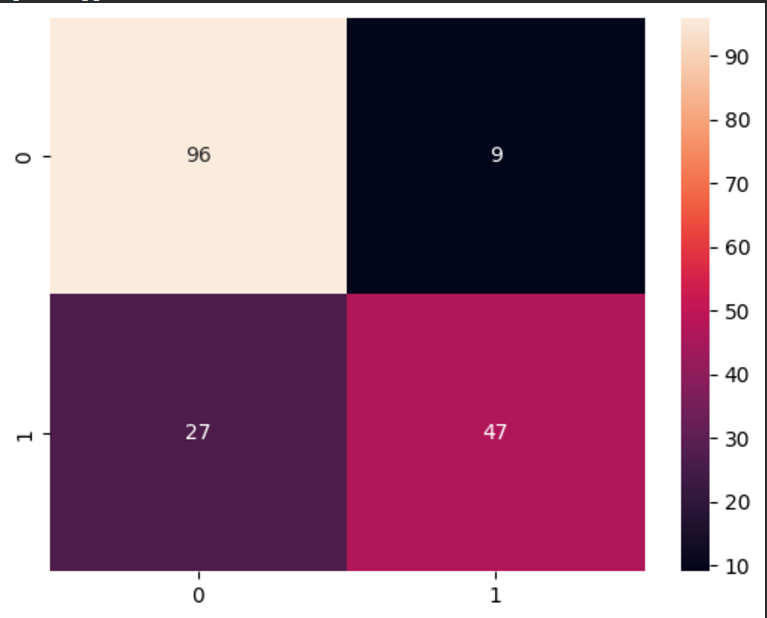

# Titanic Survival Prediction 

## Problem Statement : 

Predict whether a passenger survived the Titanic disaster. This is a **binary classification** problem.

**Target variable :** `Survived`
- $0$ : Did not survive
- $1$ : Survived

**Dataset size :** 891 samples, sourced from the [Kaggle Titanic competition](https://www.kaggle.com/competitions/titanic/data) (`train.csv`).

---

## ML Pipeline : 

1. Data Loading
2. Data Exploration
3. Handling Missing Values
4. Feature Engineering
5. Encoding Categorical Variables
6. Train/Test Split
7. Decision Tree Training
8. Model Evaluation
9. Tree Visualization
10. Feature Importance Analysis

---

## Handling Missing Values : 

**Age :** missing values replaced with the median age of the dataset.

**Cabin :** approximately 77% of values were missing, making the raw column unusable. Instead, the **deck** was extracted from the first letter of the cabin number:

$$\text{C85} \rightarrow \text{Deck C}$$

Passengers with no cabin record were labeled `"Unknown"`. This converts a mostly-missing column into a usable categorical feature.

---

## Feature Encoding : 

Categorical features were converted to numeric values using **one-hot encoding**. For example, `Embarked` with values $\{S, C, Q\}$ becomes binary columns `Embarked_C` and `Embarked_Q`. The first category is dropped to avoid multicollinearity.

---

## Decision Tree Model : 

```python
DecisionTreeClassifier(max_depth=4)
```

Tree depth is capped at 4 to control overfitting. Without a depth limit, a decision tree will keep splitting until every leaf is pure, which means it will memorize the training data rather than learning generalizable patterns. Restricting depth forces the model to find splits that work broadly, not just on individual training examples.

---

### Entropy : 

Entropy measures the **impurity** of a node: how mixed the class labels are among the samples it contains.

$$H(S) = -\sum_{k} p_k \log_2(p_k)$$

where $p_k$ is the proportion of samples belonging to class $k$ in the node, and the sum runs over all classes.

- All samples belong to one class: $H(S) = 0$ (perfectly pure, no uncertainty)
- Classes are evenly split: $H(S) = 1$ (maximum impurity)

---

### Information Gain : 

At each node, the tree evaluates every possible split and selects the one that reduces impurity the most. This reduction is called **Information Gain**:

$$IG = H(\text{parent}) - \sum_{v} \frac{|S_v|}{|S|} \cdot H(S_v)$$

where $S_v$ is the subset of samples going to child node $v$, $|S_v|$ is its size, and $|S|$ is the total number of samples in the parent. The weighted sum accounts for the fact that larger children contribute more to the overall impurity after the split. The split with the highest $IG$ is chosen.

---

### Gini Impurity : 

An alternative to entropy used by CART-style trees:

$$G(S) = 1 - \sum_{k} p_k^2$$

where $p_k$ is the proportion of class $k$ in the node. A lower Gini value indicates a purer node. Gini tends to be computationally cheaper than entropy since it avoids the logarithm.

---

## Overfitting in Decision Trees : 

Decision trees naturally overfit: without constraints, they split until every leaf is pure, producing rules that memorize individual training samples rather than learning general patterns.

**eg :**

```
If PassengerID == 438 → Survived
```

Such a rule is perfectly accurate on training data and completely useless on unseen data. Limiting `max_depth` prevents the tree from reaching this level of specificity, forcing it to find splits that hold across many samples.

---

## Model Evaluation : 

**Metrics used :** Accuracy, Precision, Recall, F1 Score, Confusion Matrix.

### Cross Validation : 

5-fold cross validation was performed to ensure the evaluation is not dependent on a single train/test split. The dataset is divided into 5 equal folds; the model trains on 4 and validates on the remaining 1, rotating until every fold has served as the validation set.

```
Cross Validation Scores: [0.80, 0.83, 0.79, 0.82, 0.81]
Mean CV Score: 0.81
Std Dev: 0.014
```

The mean score provides a more reliable performance estimate than any single split.

---

## Visualizations : 

### Decision Tree Structure : 



The tree visualization shows exactly how the model makes decisions; which features it splits on (sex, passenger class, fare), at what thresholds, and what survival probability each leaf assigns.

### Confusion Matrix : 



Shows the count of true positives, true negatives, false positives, and false negatives, giving a complete picture of where the model is correct and where it fails.

---

## Feature Importance : 

Decision trees expose feature importance scores based on how much each feature reduces impurity across all splits. Top predictors for Titanic survival:

- **Sex:** strongest predictor by a significant margin
- **Pclass:** passenger class encodes both socioeconomic status and deck location
- **Fare:** correlated with class and cabin position
- **Age:** children had higher survival priority

---

## Time and Space Complexity : 

### Training : 

At each node, the algorithm evaluates all possible split thresholds across all $F$ features.
Sorting feature values dominates the cost :

$$O(f \cdot n \log n)$$

where $f$ is the number of features and $N$ is the number of training samples.

### Prediction : 

Each prediction follows a single root-to-leaf path; 

$$O(\text{depth})$$

### Space

The tree stores one node per split. In the worst case (fully grown tree), this is :

$$O(n)$$

nodes. With `max_depth=4`, the upper bound is $2^4 - 1 = 15$ internal nodes regardless of dataset size.
