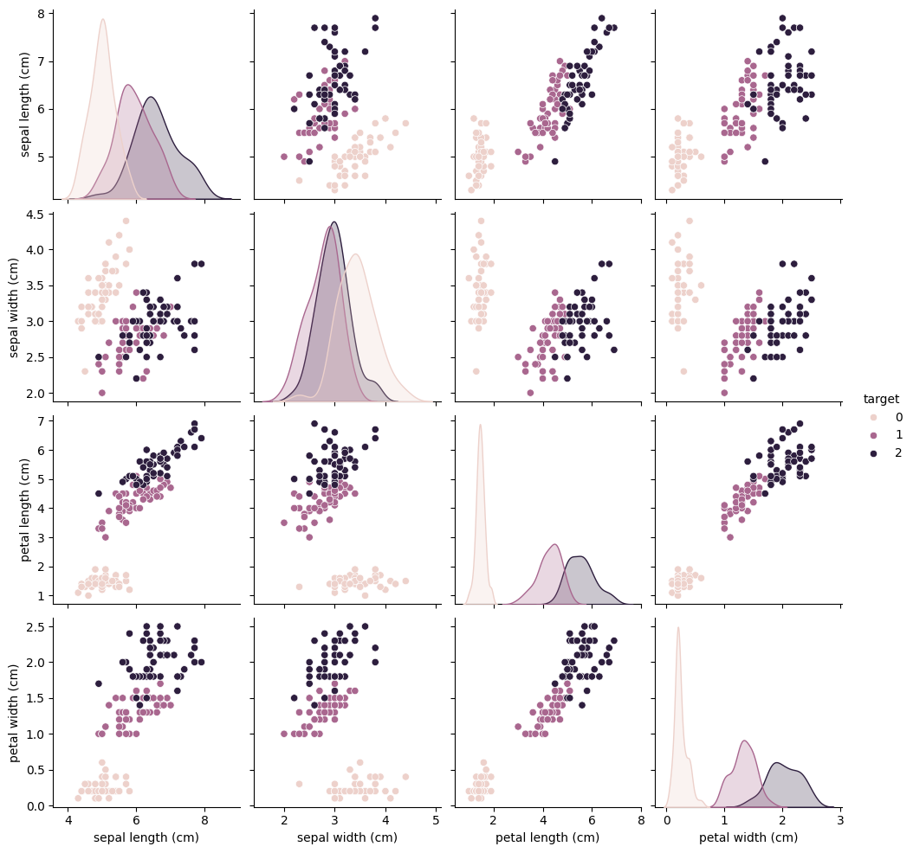
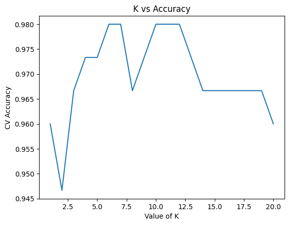
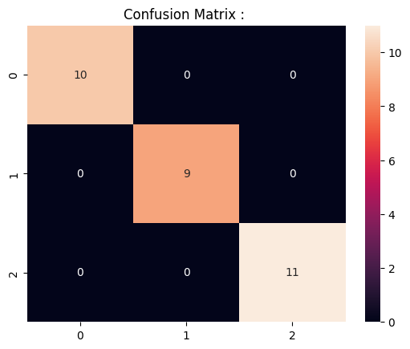

# Iris Classification

## Problem

The objective of this project is to classify iris flowers into three species using their physical measurements.

This is a **multiclass classification problem** where the model predicts the flower species using four numerical features.

Target classes:

- Setosa
- Versicolor
- Virginica

Features used:

- sepal length
- sepal width
- petal length
- petal width

The model learns patterns in these measurements to determine the correct species.

---

# Dataset

Dataset used: **Iris Dataset**

Source:

```
sklearn.datasets.load_iris()
```

Dataset statistics:

- Total samples: 150
- Number of features: 4
- Number of classes: 3
- Samples per class: 50

Feature names:

- sepal length (cm)
- sepal width (cm)
- petal length (cm)
- petal width (cm)

This dataset is widely used in machine learning because it is:

- clean
- balanced
- well structured
- easy to visualize

---

# Machine Learning Pipeline

The project follows a structured ML workflow:

1. Data Loading  
2. Data Inspection  
3. Exploratory Data Analysis  
4. Feature Scaling  
5. Train Test Split  
6. Model Training  
7. Hyperparameter Tuning  
8. Model Evaluation  
9. Cross Validation  
10. Visualization  

---

# Data Loading

Unlike previous projects that load CSV files, the Iris dataset is available directly inside **scikit-learn**.

```python
from sklearn.datasets import load_iris

iris = load_iris()
```

This function returns a **Bunch object**, which behaves like a dictionary containing:

- data
- target
- feature names
- class labels
- dataset description

Features and labels are extracted as:

```python
X = iris.data
y = iris.target
```

Where:

- **X → feature matrix**
- **y → class labels**

---

# Converting to DataFrame for EDA

To perform exploratory analysis, the dataset is converted into a pandas DataFrame.

```python
df = pd.DataFrame(X, columns=iris.feature_names)
df["target"] = y
```

Optional mapping to readable class labels:

```python
df["species"] = df["target"].map({
0: "setosa",
1: "versicolor",
2: "virginica"
})
```

---

# Exploratory Data Analysis

EDA helps understand the dataset structure.

Typical inspection:

```python
df.head()
df.describe()
df["species"].value_counts()
df.isnull().sum()
```

Observations:

- No missing values
- All features are numerical
- Dataset is perfectly balanced

---

# Feature Visualization

Relationships between features were visualized using a **pairplot**.

```python
sns.pairplot(df, hue="species")
```

This plot shows pairwise feature relationships.

Key observation:

- **Setosa forms a clearly separable cluster**
- Versicolor and Virginica overlap slightly

This indicates the classification task is relatively straightforward.

---

# Feature Scaling

KNN is a **distance-based algorithm**, so feature scaling is necessary.

Without scaling, features with larger ranges dominate the distance calculation.

Scaling was performed using:

```python
from sklearn.preprocessing import StandardScaler
```

Implementation:

```python
scaler = StandardScaler()

X_train = scaler.fit_transform(X_train)
X_test = scaler.transform(X_test)
```

---

# K-Nearest Neighbors Model

KNN is a **non-parametric lazy learning algorithm**.

Unlike many models, it does not learn explicit parameters during training.

Instead, it stores the training data and predicts new samples based on the **nearest neighbors in feature space**.

Prediction process:

1. Compute distance between the new sample and all training samples  
2. Select the **K nearest neighbors**  
3. Assign the class with the **majority vote**

---

# Mathematical Intuition

KNN classification relies on **distance metrics**.

The most commonly used metric is **Euclidean distance**.

Formula:

```
distance(x,y) = sqrt( Σ (xi − yi)^2 )
```

Where:

- xi = feature value of sample x  
- yi = feature value of sample y  

Distance represents similarity in feature space.

Prediction rule:

```
Find K closest neighbors
Take majority class among them
```

Thus the model decision boundary depends entirely on **local neighborhood structure**.

---

# Hyperparameter Selection

The most important hyperparameter in KNN is:

```
K = number of neighbors
```

Small K values:

- model becomes sensitive to noise
- risk of overfitting

Large K values:

- smoother decision boundary
- risk of underfitting

---

# Methods for Choosing K

Several approaches exist.

### Empirical Rule

A common heuristic suggests:

```
K ≈ √N
```

Where **N = number of samples**.

For Iris:

```
N = 150
√150 ≈ 12
```

However this is only a rough estimate.

---

### Elbow Method

Plot model accuracy against different K values.

The optimal K is where accuracy stabilizes.

---

### Cross Validation (Used in this project)

Cross validation evaluates model performance across multiple dataset splits.

Advantages:

- more robust performance estimate
- less dependent on a single split
- reduced evaluation bias

Silhouette score is **not applicable** because it is used for **unsupervised clustering algorithms**, not supervised classification.

---

# Hyperparameter Tuning Implementation

Values of K from **1 to 20** were tested.

```python
for k in range(1,21):

    model = KNeighborsClassifier(n_neighbors=k)

    scores = cross_val_score(model, X, y, cv=5)

    accuracies.append(scores.mean())
```

Results were visualized using a **K vs Accuracy graph**.

---

# Why Not GridSearchCV?

GridSearchCV is useful when tuning **multiple hyperparameters**.

Example for KNN:

- number of neighbors
- distance metric
- weight function

Since this experiment only tunes **one parameter**, a simple loop combined with cross validation provides:

- clearer visualization
- easier interpretation
- simpler implementation

---

# Model Evaluation

Model performance was evaluated using:

- Accuracy
- Classification Report
- Confusion Matrix

Accuracy measures overall prediction correctness.

The classification report provides:

- precision
- recall
- F1-score

for each class.

---

# Visualization

## Feature Relationships



This visualization shows relationships between feature pairs.

Setosa forms a clearly separable cluster while Versicolor and Virginica overlap slightly.

---

## Hyperparameter Tuning



This plot shows how classification accuracy changes for different values of **K**.

---

## Confusion Matrix



The confusion matrix summarizes prediction performance across the three classes.

---

# Time Complexity

Training complexity:

```
O(1)
```

KNN stores the training dataset without learning parameters.

Prediction complexity:

```
O(N × d)
```

Where:

- N = number of training samples  
- d = number of features  

Each prediction requires computing distance to all samples.

---

# Space Complexity

```
O(N × d)
```

The entire dataset must be stored in memory.

---

# Key Learnings

- distance metrics are fundamental for KNN
- feature scaling is critical for distance-based models
- cross validation helps select stable hyperparameters
- small K values may overfit
- large K values may underfit
