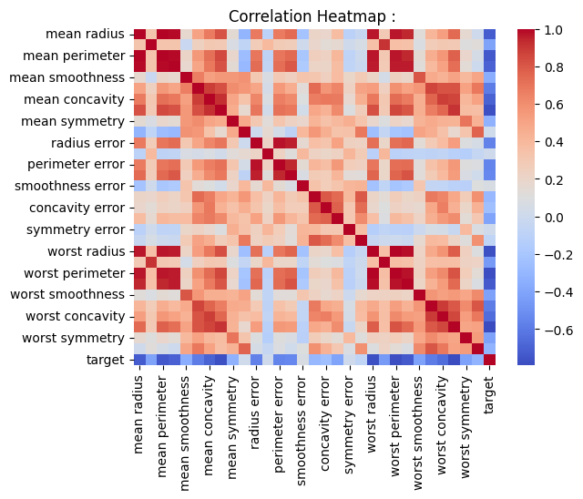
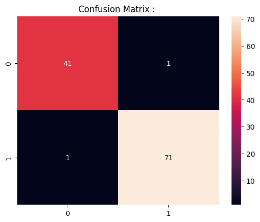
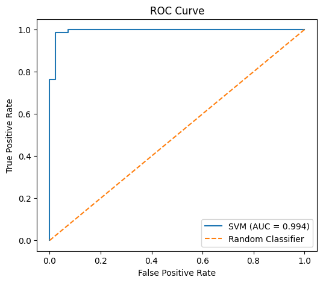
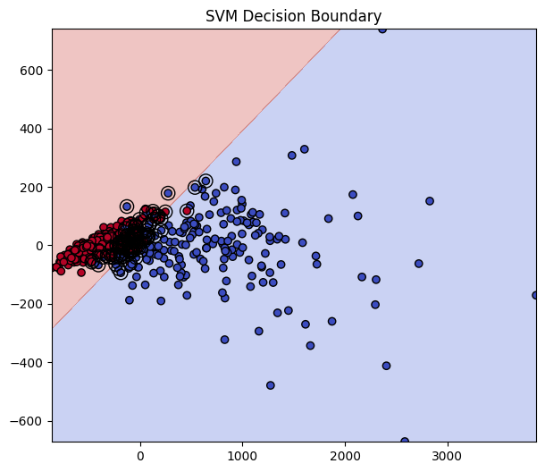

# Breast Cancer Classification 

## Project Overview

Early detection of breast cancer significantly improves treatment success rates. Machine learning models can assist in identifying malignant tumors based on diagnostic measurements.

In this project, we implement a **Support Vector Machine (SVM)** classifier to predict whether a tumor is **malignant or benign** using diagnostic features extracted from cell nuclei images.

The focus of this implementation is building a **structured machine learning pipeline**, including:

- Exploratory Data Analysis
- Feature scaling
- Model training
- Hyperparameter tuning
- Cross validation
- Model evaluation
- Visualization

---

# Dataset

Dataset Used: **Breast Cancer Wisconsin Dataset**

Dataset Source (built into sklearn):

```
sklearn.datasets.load_breast_cancer()
```

Dataset Characteristics:

| Property | Value |
|------|------|
| Samples | 569 |
| Features | 30 |
| Classes | 2 |

Target classes:

| Label | Meaning |
|------|------|
| 0 | Malignant |
| 1 | Benign |

Example features include:

| Feature | Description |
|------|------|
| radius_mean | Mean radius of cell nuclei |
| texture_mean | Texture of cell nuclei |
| perimeter_mean | Perimeter of nucleus |
| area_mean | Area of nucleus |

---

# Machine Learning Pipeline

The following pipeline was implemented:

```
Dataset
   ↓
Exploratory Data Analysis
   ↓
Train-Test Split
   ↓
Feature Scaling
   ↓
SVM Model
   ↓
Hyperparameter Tuning
   ↓
Cross Validation
   ↓
Model Evaluation
   ↓
Visualization
```

---

# Exploratory Data Analysis

EDA is performed to understand the dataset structure before modeling.

Typical checks include:

- Dataset Shape
- Feature Statistics
- Class Distribution
- Correlation Analysis

Example analysis performed:

```
df.head()
df.describe()
df["target"].value_counts()
```

Observations:

- Dataset contains **30 numerical features**
- Classes are **slightly imbalanced**
- Many features show strong correlation

---

# Feature Correlation Heatmap

A correlation heatmap helps visualize relationships between features.



This visualization highlights highly correlated features and helps understand the feature structure.

---

# Train-Test Split

The dataset is split into:

- **80% Training Data**
- **20% Testing Data**

Stratified sampling is used to preserve class distribution.

---

# Feature Scaling

Support Vector Machines rely heavily on **distance calculations**.

Without scaling, features with large ranges dominate the model.

Scaling was performed using:

```
StandardScaler
```

This standardizes features so that:

```
Mean = 0
Standard Deviation = 1
```

---

# Support Vector Machine Model

SVM is a **margin-based classifier** that tries to find the optimal decision boundary separating classes.

The boundary is defined by a **hyperplane**.

```
w · x + b = 0
```

Where:

- x → feature vector
- w → weight vector
- b → bias

Prediction rule:

```
w · x + b ≥ 0 → Class 1
w · x + b < 0 → Class 0
```

---

# Mathematical Intuition

SVM aims to maximize the **margin**, defined as the distance between the decision boundary and the nearest data points.

These nearest points are called **support vectors**.

Margin formula:

```
Margin = 2 / ||w||
```

The optimization objective becomes:

```
minimize ||w||²
```

subject to:

```
yi (w · xi + b) ≥ 1
```

Maximizing the margin improves model generalization.

---

# Blessing of Dimensionality

In high-dimensional feature spaces, it becomes easier to find a separating hyperplane.

As the number of features increases:

```
more possible hyperplanes exist
```

This phenomenon is sometimes called the **blessing of dimensionality**.

It explains why **linear SVM performs well in high-dimensional datasets** such as text classification and bioinformatics.

---

# Hyperparameters

Key hyperparameters in SVM:

| Parameter | Description |
|------|------|
| C | Regularization strength |
| kernel | Type of decision boundary |
| gamma | Influence of individual data points |

---

## Parameter C

C controls the tradeoff between:

```
margin size
classification error
```

Small C:

```
large margin
more misclassifications allowed
risk of underfitting
```

Large C:

```
small margin
strict classification
risk of overfitting
```

---

## Gamma

Gamma controls how far the influence of each training point extends.

Small gamma:

```
smooth decision boundary
possible underfitting
```

Large gamma:

```
complex boundary
risk of overfitting
```

---

# Kernel Functions

When data cannot be separated linearly, SVM uses **kernel functions**.

The kernel trick allows SVM to operate in higher-dimensional feature spaces without explicitly computing transformations.

Common kernels include:

| Kernel | Description |
|------|------|
| Linear | Straight hyperplane |
| Polynomial | Curved decision boundary |
| RBF | Nonlinear radial boundary |

---

## RBF Kernel

The Radial Basis Function kernel is defined as:

```
K(x, x') = exp( -γ ||x - x'||² )
```

It measures similarity between points.

RBF is the **default kernel in sklearn** because it handles nonlinear boundaries effectively.

---

# Hyperparameter Tuning

Hyperparameters were tuned using **GridSearchCV**.

Parameters explored:

```
C
kernel
gamma
```

GridSearchCV performs cross validation to determine the best parameter combination.

---

# Cross Validation

Cross validation helps produce a more reliable performance estimate.

In **5-fold cross validation**:

1. Dataset is divided into 5 parts.
2. Model trains on 4 folds.
3. Remaining fold is used for validation.
4. Process repeats 5 times.
5. Final score is averaged.

Benefits:

- Reduces variance.
- Improves evaluation stability.
- Detects OF.

---

# Model Evaluation

The model is evaluated using multiple classification metrics.

| Metric | Description |
|------|------|
| Accuracy | Overall correctness |
| Precision | Correct positive predictions |
| Recall | Ability to detect positive cases |
| F1 Score | Balance between precision and recall |
| ROC-AUC | Model discrimination ability |

ROC-AUC is particularly useful for binary classification.

---

# Confusion Matrix



The confusion matrix shows the number of:

- TP
- TN
- FP
- FN

This helps analyze classification errors.

---

# ROC Curve



The ROC curve visualizes the tradeoff between:

```
True Positive Rate
False Positive Rate
```

The **Area Under the Curve (ROC-AUC)** measures how well the model distinguishes between classes.

---

# Support Vector Visualization



This visualization shows:

- Decision Boundary
- Margin
- Support Vectors

Support vectors are the data points closest to the hyperplane.

---

# Time Complexity

Training complexity of SVM is approximately:

```
O(n² × d)
```

Where:

- n = number of samples
- d = number of features

Kernel-based SVM requires computing pairwise similarities between samples.

---

# Prediction Complexity

Prediction depends on the number of support vectors.

```
O(s × d)
```

Where:

- s = number of support vectors
- d = number of features

---

# Space Complexity

Space complexity mainly depends on storing support vectors:

```
O(s × d)
```

---

# When to Use SVM

SVM performs well when:

```
dataset size is small to medium
feature space is high dimensional
clear margin exists between classes
```

Common applications include:

- bioinformatics
- text classification
- image recognition with small datasets

---

# When to Avoid SVM

SVM may struggle when:

```
dataset is extremely large
many noisy features exist
training time becomes prohibitive
```

In such cases, tree-based models or NN may scale better.

---

# Key Learnings

- SVM maximizes the margin between classes.
- Only support vectors define the decision boundary.
- Kernel functions enable nonlinear classification.
- Feature Scaling is critical for SVM performance.
- Hyperparameter tuning significantly affects model behavior.
