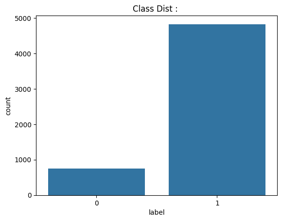
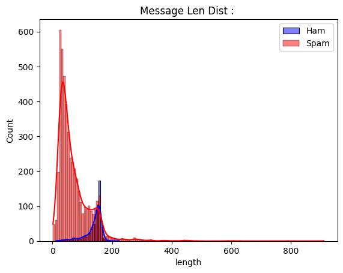
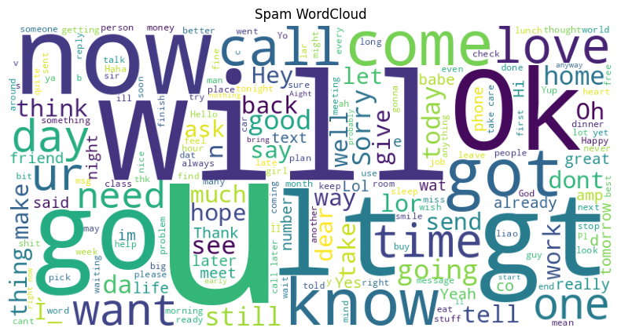
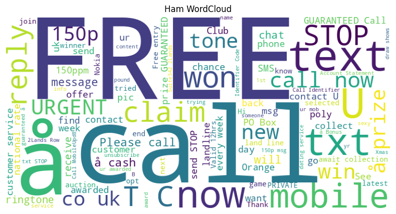
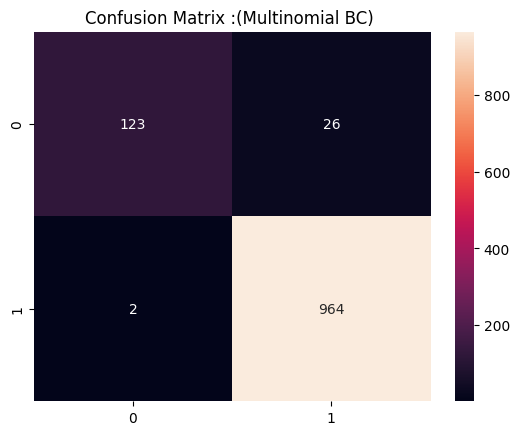
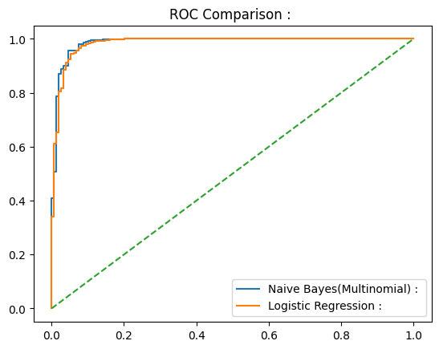
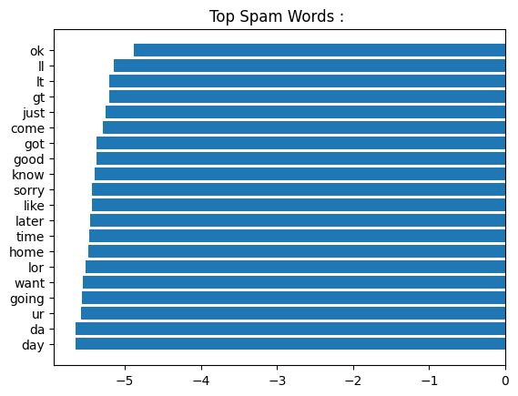

#  SMS Spam Classification 

---

##  Project Overview

Spam detection is a classical Natural Language Processing (NLP) problem where machine learning models automatically classify messages as spam or legitimate communication.

In this project, we build an **end-to-end probabilistic text classification pipeline** using **Multinomial Naive Bayes** and compare it with **Bernoulli Naive Bayes and Logistic Regression.**

Focus Areas:

- NLP Exploratory Data Analysis  
- TF-IDF Feature Engineering  
- Bayes Theorem and Multinomial Naive Bayes Mathematics  
- Model Comparison  
- Engineering Tradeoffs  
- Failure Case Analysis  
- Complexity Analysis  

---

## Dataset

**Dataset:** SMS Spam Collection  

- ~5572 SMS messages  
- Binary classification  
- Imbalanced dataset  

Target Encoding:

| Label | Meaning |
|------|--------|
| 0 | Ham |
| 1 | Spam |

---

## Text Exploratory Data Analysis

### Class Distribution

Spam messages form a minority class.

Accuracy alone is misleading → Recall and F1 Score are important.

---

### Message Length Distribution

Spam messages tend to be longer due to promotional content, links and structured language.

This provides intuition about separability.

---

### WordCloud Visualization

WordCloud shows token frequency visually.

Spam messages contain:

- free  
- win  
- claim  
- call  

Ham messages contain conversational vocabulary.

#### Spam WordCloud

#### Ham WordCloud

---

## Text Preprocessing Pipeline

Steps:

1. Label Encoding.
2. TF-IDF Vectorization.  
3. Train-Test Split.  

TF-IDF internally performs tokenization, lowercasing and stopword removal.

---

## TF-IDF Mathematical Intuition

\[
TFIDF(t,d) = TF(t,d)\times \log\left(\frac{N}{DF(t)}\right)
\]

Common words get lower importance.  
Discriminative words get higher importance.

---

## Bayes Theorem

\[
P(y|x)=\frac{P(x|y)P(y)}{P(x)}
\]

Since \(P(x)\) is constant:

\[
P(y|x)\propto P(x|y)P(y)
\]

---

## Multinomial Naive Bayes Model

Likelihood model:

\[
P(x|y)=\prod_{i=1}^{D} P(w_i|y)^{x_i}
\]

Log form:

\[
\hat{y}=\arg\max_y \left[\log P(y)+\sum_{i=1}^{D}x_i\log P(w_i|y)\right]
\]

---

## Laplace Smoothing (Alpha)

\[
P(w|y)=\frac{count(w,y)+\alpha}{\sum count+\alpha V}
\]

Alpha prevents zero probability collapse.

- Small α → trust data  
- Large α → smoother distribution  

---

## Models Compared

- Multinomial Naive Bayes (Primary)
- Bernoulli Naive Bayes
- Logistic Regression

---

## Evaluation Metrics

- Accuracy  
- Precision  
- Recall  
- F1 Score  
- ROC-AUC  

Spam detection prioritizes **Recall**.

---

## Confusion Matrix (Multinomial NB)

---

## ROC Curve Comparison

---

## Top Spam Indicative Tokens

Model coefficients / log probabilities reveal influential tokens.

---

## Engineering Tradeoffs

| Model | Training Speed | Inference Latency | Memory | Expressiveness |
|------|---------------|------------------|-------|---------------|
| Multinomial NB | Extremely Fast | Very Low | Low | Limited |
| Bernoulli NB | Very Fast | Low | Low | Limited |
| Logistic Regression | Moderate | Very Low | Medium | Moderate |

---

## Failure Case Analysis

Misclassification scenarios:

- Conversational spam messages.
- Ham containing promotional tokens.  
- Word order ignored.  
- Context not modeled.  

---

## Time Complexity

Training:

\[
O(ND)
\]

Prediction:

\[
O(D)
\]

---

## Space Complexity

Model stores:

- Vocabulary  
- Class conditional probabilities  

Sparse representation reduces memory usage.

---

## Inference Latency

\[
Latency=\frac{Total\ Prediction\ Time}{Number\ of\ Samples}
\]

Naive Bayes enables real-time spam filtering systems.

---

## Key Learnings

- Power of probabilistic models in NLP  
- Importance of sparse feature engineering  
- Tradeoff between simplicity and modeling capacity  
- Engineering scalability considerations  

---
