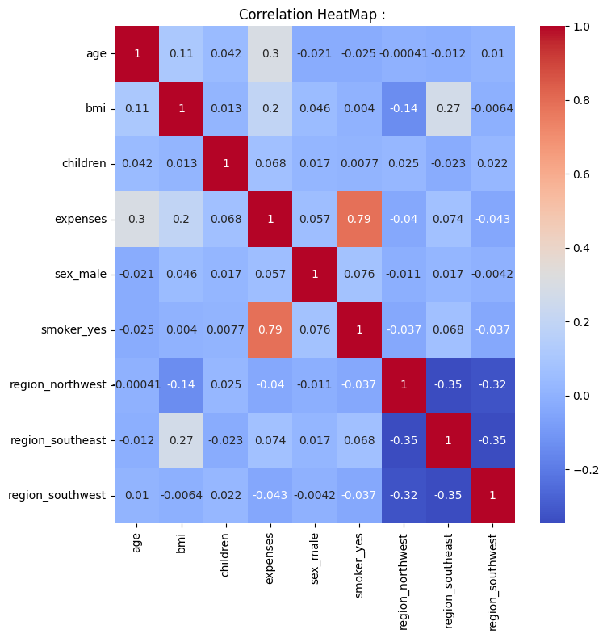
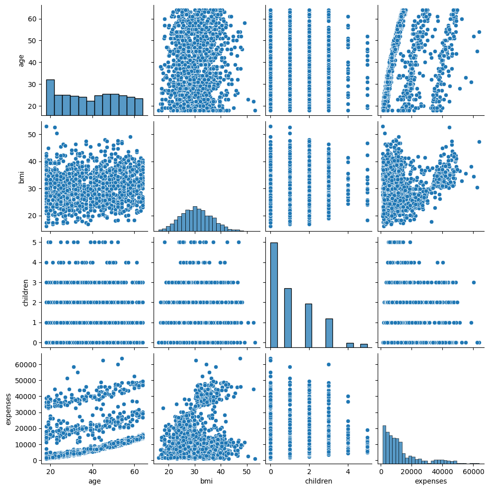
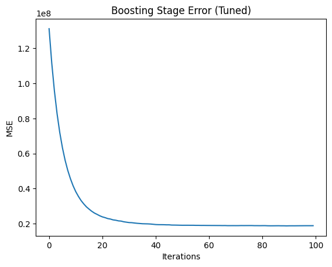
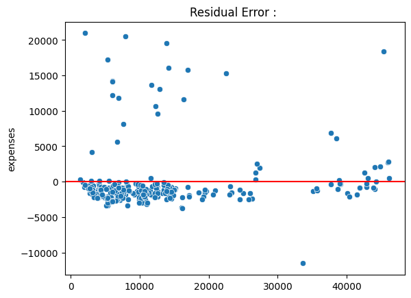
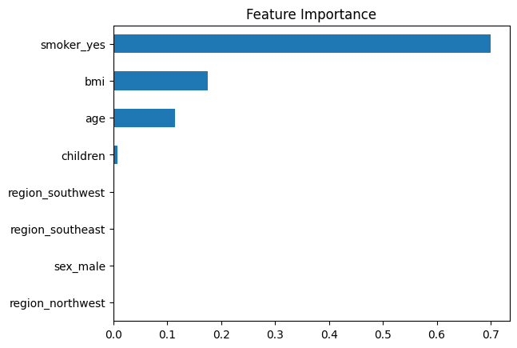
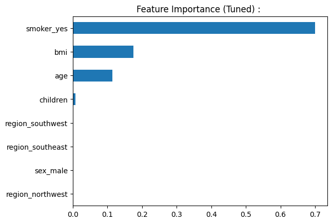

# Insurance Expense Prediction

##  Project Overview

Insurance companies must estimate expected medical expenses of customers to design premium pricing strategies, manage financial risk, and identify high-risk segments.

This project builds a **Regression model using Gradient Boosting** to predict annual insurance expenses from demographic and lifestyle features.

Focus areas:

- Structured Data Exploratory Data Analysis  
- Residual Learning & Functional Gradient Descent  
- Learning Rate and Ensemble Depth Tradeoffs  
- Training vs Inference Efficiency  
- Bias–Variance Behavior  
- Failure Case Analysis  
- Computational Complexity  

---

##  Problem Statement

The objective is to predict **annual medical insurance expenses** using features such as:

- age  
- sex  
- bmi  
- number of children  
- smoker status  
- region  

Insurance pricing exhibits strong **non-linear relationships and feature interactions**, making Gradient Boosting an effective modeling approach.

---

##  Dataset

Target Variable:

**Expenses;  Annual insurance medical cost**

Regression Task: Continuous Value Prediction  

---

##  Exploratory Data Analysis

### Correlation Heatmap

Observations:

- Smoking status shows strongest positive relationship with expenses  
- BMI interaction with age contributes significantly  
- Weak purely linear correlations suggest need for nonlinear models  

---

### Pairplot Visualization

Insights:

- Expense distribution is right-skewed  
- Smokers form a high-expense cluster  
- Feature interaction patterns visible  

---

## Why Linear Regression Underperforms

Linear models assume:

**y = wᵀx + b**

But real expense behavior shows:

- stepwise increase for smokers  
- nonlinear BMI influence  
- interaction between multiple features  

This leads to **systematic bias and structured residuals.**

---

##  Gradient Boosting Intuition

Gradient Boosting constructs prediction function sequentially.

Initial model:

**F₀(x) = mean(y)**

Residual:

**r₁ = y − F₀(x)**

Train first tree on residual.

Update rule:

**F₁(x) = F₀(x) + η · Tree₁(x)**

After M stages:

**F_M(x) = F₀(x) + η Σ Tree_m(x)**

Each tree learns to **correct previous prediction errors.**

---

## Functional Gradient Descent Intuition in Gradient Boosting

The goal of training is to minimize prediction loss.

For regression using Mean Squared Error :

L = Σ ( yᵢ − F(xᵢ) )²

Where:

- yᵢ → Actual Value  
- F(xᵢ) → Model Prediction  

---

### Gradient Meaning

The derivative of the loss with respect to the prediction function is :

dL/dF(xᵢ) = −2 ( yᵢ − F(xᵢ) )

This quantity represents the **Direction in which loss Increases the fastest.**
To reduce loss, the model must move in the opposite direction.

Therefore, the negative gradient becomes :

− dL/dF(xᵢ) = 2 ( yᵢ − F(xᵢ) )

Ignoring the constant factor:

Residual ≈ ( yᵢ − prediction )

---

### What the Tree Actually Learns : 

Each boosting stage trains a decision tree to approximate these residuals.

This means the tree is not directly predicting the final target value.  
Instead, it predicts **Extant by which the current prediction should change to reduce loss.**

---

### Model Update Rule

The prediction function is updated as:

F_new(x) = F_old(x) + η · h(x)

Where:

- η → learning rate (step size).
- h(x) → tree prediction (approximation of negative gradient).

Thus, Gradient Boosting performs **gradient descent in function space**, updating predictions iteratively in the direction that most rapidly decreases loss.

---

### Key Intuition

At every stage:

- The model identifies the direction of steepest increase in loss.  
- Then it updates predictions by moving in the opposite direction.  
- This sequential correction mechanism allows the ensemble to approximate complex nonlinear relationships.

---

##  Learning Rate (η) :

Update:

**F_new(x) = F_old(x) + η · Tree(x)**

Learning rate controls how far prediction moves opposite gradient direction.

| Learning Rate | Trees Needed | Overfitting Risk |
|--------------|-------------|----------------|
| High | Few | High |
| Medium | Moderate | Balanced |
| Low | Many | Low |

---

##  Important Hyperparameters :

### n_estimators  
Number of boosting stages.

- More trees reduce bias  
- Excessive trees increase overfitting risk  
- Directly increases training time  

### max_depth  
Controls complexity of each tree.

- Shallow → weak learner  
- Moderate → captures interactions  
- Deep → risk of memorization  

### learning_rate  
Controls shrinkage of gradient step.

### subsample  
Random fraction of data per tree → variance reduction.

---

##  Model Performance Comparison

| Model | RMSE | R² Score | Training Time | Inference Latency |
|------|------|---------|--------------|----------------|
| Baseline Gradient Boosting | 4313.93 | 0.8801 | 0.50 | 0.000021 |
| Tuned Gradient Boosting | 4335.86 | 0.8789 | 39.194146 | 0.000013 |

---

## Training vs Inference

Training:

- Sequential tree building  
- Computationally intensive  
- Depends on number of estimators and depth  

Inference:

- Must traverse all trees  
- Latency proportional to ensemble size  

---

##  Time Complexity

Training Complexity:

**O(T · N log N)**  

Where:

- T → number of trees  
- N → number of samples  

Prediction Complexity:

**O(T · depth)**  

---

## Space Complexity

Model stores all trees in ensemble:

**O(T · nodes_per_tree)**  

Memory usage increases linearly with ensemble size.

---

##  Boosting Stage Error Curve

Error reduces as boosting progresses until convergence.

---

##  Residual Plot

Random residual distribution indicates reduced bias.

---

##  Feature Importance

         

Top predictors:

- smoker status  
- bmi  
- age  

---

## Failure Case Analysis

- Extreme expense outliers underpredicted  
- Sensitive to learning rate tuning  
- Large ensembles increase memory footprint  
- Cannot extrapolate beyond training distribution  

---

##  Key Learnings

- Gradient Boosting reduces bias via residual learning  
- Sequential trees approximate nonlinear functions  
- Learning rate stabilizes optimization  
- Ensemble depth controls interaction modeling  
- Tradeoff exists between accuracy and computational cost  

---

##  Future Improvements

- Compare with XGBoost / LightGBM  
- Log transform target for skew handling  
- SHAP interpretability  
- Deployment as pricing prediction API  

---
