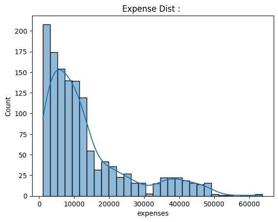
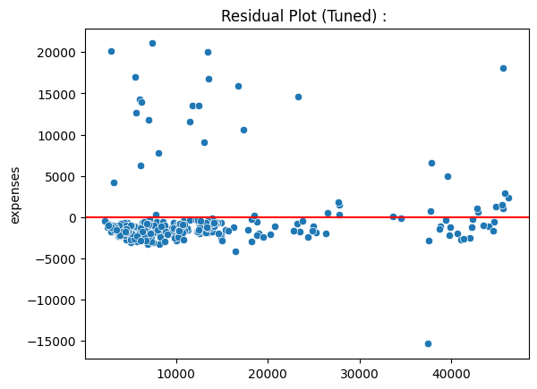
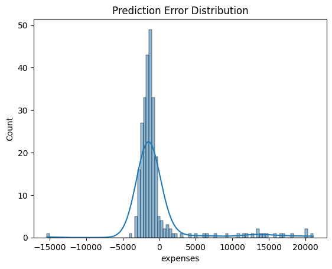
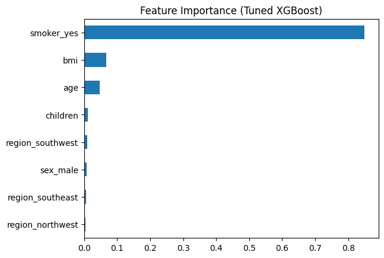
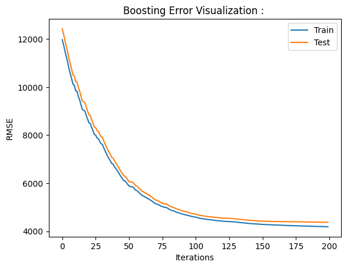

# Insurance Expense Prediction :

---

## Overview

In the previous problem (Day 8), Gradient Boosting was used to model nonlinear relationships in insurance expense prediction. While Gradient Boosting significantly improved performance over linear regression, it still had limitations:

- No explicit regularization on tree complexity.
- Uses only first-order gradient information.  
- Greedy tree growth can cause overfitting.  
- Training instability with deeper trees.  
- Slower convergence in some regimes.  

XGBoost improves upon classical Gradient Boosting by introducing : 

- Regularized objective optimization  
- Second-order (Newton) updates  
- Split pruning using gain thresholds  
- Row and column stochastic sampling  
- Highly optimized parallel tree construction  

---

## Problem Statement

Predict continuous insurance expenses from structured features such as:

- age  
- bmi  
- smoker status  
- number of children  
- region  

The target variable:

**expenses → annual medical insurance cost**

This is a nonlinear regression task with skewed distribution and interaction effects.

---

## Exploratory Data Analysis

Understanding the dataset structure and feature relationships is essential before modeling.

### Expense Distribution

The target variable shows a right-skewed distribution, indicating presence of high-cost outliers.

---

### Feature Correlation Heatmap

Smoking status shows the strongest positive correlation with insurance expenses.  
BMI and age also demonstrate meaningful relationships.

---

## Additive Model Representation

XGBoost builds prediction as a sum of trees.

Prediction for sample i:

y_hat_i = f1(x_i) + f2(x_i) + ... + fT(x_i)

Each tree divides feature space into regions (leaves).

If sample falls into leaf j:

f_t(x_i) = w_j

So the model becomes a piecewise constant function.

---

## Regularized Objective Function

At boosting iteration `t`, the model tries to minimize:

Objective = Training Loss + Model Complexity Penalty

Objective :

    Obj(t) = Σ L( y_i , ŷ_i^(t−1) + f_t(x_i) )  +  Ω( f_t )

Where the regularization term is :

    Ω( f_t ) = γ * T  +  (1/2) * λ * Σ ( w_j² )

Meaning:

- γ (gamma) penalizes number of leaves → controls tree complexity  
- λ (lambda) penalizes large leaf weights → controls update magnitude  

So the model optimizes:

    Fit to Data  +  Simplicity of Model

This is a major improvement over classical Gradient Boosting.

---

## Second Order Loss Approximation

Loss is approximated using Taylor expansion:

    L ≈ g_i * f_t(x_i)  +  (1/2) * h_i * ( f_t(x_i) )²

Where:

    g_i = ∂L / ∂ŷ_i     → gradient (direction of error)
    h_i = ∂²L / ∂ŷ_i²   → hessian (confidence / curvature)

This allows Newton-style optimization rather than simple gradient descent.

---

## Region-wise Aggregation

Since each tree assigns a constant prediction inside a leaf:

    f_t(x_i) = w_j     if sample i falls in leaf j

So we group gradient signals:

    G_j = Σ g_i   (sum of gradients in that leaf)
    H_j = Σ h_i   (sum of hessians in that leaf)

### Interpretation

- Large |G_j| → region predictions very wrong  
- Large H_j → stable / confident region  
- Small H_j → uncertain region  

---

## Optimal Leaf Weight

To minimize objective with respect to leaf output:

    w_j* = − G_j / ( H_j + λ )

Intuition:

- Larger gradient → stronger correction  
- Larger λ → smaller update (regularization effect)  
- Larger Hessian → cautious update  

Thus Hessian behaves like an **adaptive learning rate.**

---

## Tree Quality Score

After substituting optimal weights:

    Score(tree) = − (1/2) * Σ [ G_j² / ( H_j + λ ) ]  +  γ * T

This score represents:

How much training loss reduction this tree structure can achieve.

Better trees → larger reduction → better score.

---

## Split Gain Formula

When splitting a node into left and right:

    Gain =
    0.5 * [ ( G_L² / ( H_L + λ ) )
          + ( G_R² / ( H_R + λ ) )
          − ( (G_L + G_R)² / ( H_L + H_R + λ ) ) ]
          − γ

Split is accepted only if:

    Gain > 0

Thus every split must reduce loss enough to justify increased model complexity.

### Intuition

- Larger gradient → stronger correction  
- Larger lambda → smaller update  
- Larger Hessian → cautious update  

Thus Hessian acts like adaptive learning rate.

---

## Why XGBoost is Strong

It combines:

- Gradient descent direction  
- Newton curvature correction  
- Structural risk minimization  
- Stochastic regularization  
- Hardware-aware computation  

This leads to:

- Faster convergence  
- Better bias-variance tradeoff  
- Robust performance on tabular datasets  

---

## Training Time

Training time depends on :

- number of trees (n_estimators). 
- tree depth. 
- dataset size.
- hyperparameter tuning.  

Baseline Training Time : 0.101504
Tuned Training Time : 77.837326

Training Complexity :

Training ≈ O(T * N log N)

Histogram optimization reduces practical cost.

---

## Inference Latency

Each prediction requires traversal of all trees.

Prediction complexity : Prediction ≈ O(T * depth)

Per-sample Inference Latency :

Baseline Latency : 0.000020
Tuned Latency : 0.000029

Tree ensembles typically provide very fast real-time inference.

---

## Space Complexity

Model stores:

- tree structures  
- thresholds  
- leaf outputs  

Space ≈ O( T * number_of_nodes )

Memory grows linearly with ensemble size.

---

## Evaluation Metrics

Primary Metric :

RMSE = sqrt( mean( (y − y_hat)^2 ) )

Captures large errors important in financial modeling.

Secondary Metric :

R² = explained variance ratio.

---

## Model Performance Comparison

| Model | RMSE | R² Score | Training Time (sec) | Inference Latency (sec/sample) |
|------|------|----------|--------------------|-------------------------------|
| Baseline XGBoost | 4519.78 | 0.8684 | 0.10 | 0.000020 |
| Tuned XGBoost | 4375.50 | 0.8767 | 77.84 | 0.000029 |

### Interpretation

- Hyperparameter tuning reduced RMSE, indicating improved prediction accuracy.  
- R² increased, meaning the tuned model explains more variance in insurance expenses.  
- Training time increased significantly due to cross-validated search over multiple parameter combinations.  
- Inference latency increased slightly because the tuned model typically uses more complex ensemble structure.

This demonstrates the tradeoff between **predictive performance and computational cost** in boosted tree systems.

---

## Residual Analysis

Residuals are approximately centered around zero, suggesting reduced systematic bias.

---

## Error Distribution

The distribution highlights occasional large prediction errors, mainly due to extreme expense outliers.

---

## Feature Importance

Smoking status remains the dominant predictor, followed by BMI and age.

---

## Boosting Error Curve

Training error decreases steadily as boosting iterations increase, while validation error stabilizes, indicating controlled learning dynamics.

---

## Failure Case Analysis

- Extreme expense outliers may still be underpredicted  
- Overfitting possible with large depth and high learning rate  
- Cannot extrapolate beyond training feature ranges  
- Not suitable for spatial or sequential patterns compared to CNN / Transformers  

---

## Why XGBoost Often Beats Deep Learning on Tabular Data

- Tabular datasets often small to medium sized  
- Feature interactions sparse and threshold-based  
- Missing values common  
- No spatial structure  

Tree ensembles naturally capture such patterns.

Deep neural networks require:

- large datasets  
- careful normalization  
- expensive training  

Thus boosted trees frequently dominate structured ML tasks.

---

## Visualizations Included

- Correlation heatmap  
- Residual scatter plot  
- True vs Predicted plot  
- Error distribution  
- Feature importance  
- Boosting stage error curve  

---

## Key Learnings

- Regularized boosting improves stability  
- Second order optimization enables precise updates  
- Split gain provides principled tree growth  
- Hyperparameters control bias-variance-compute tradeoff  
- Tree ensembles remain extremely strong for structured ML problems  

---
