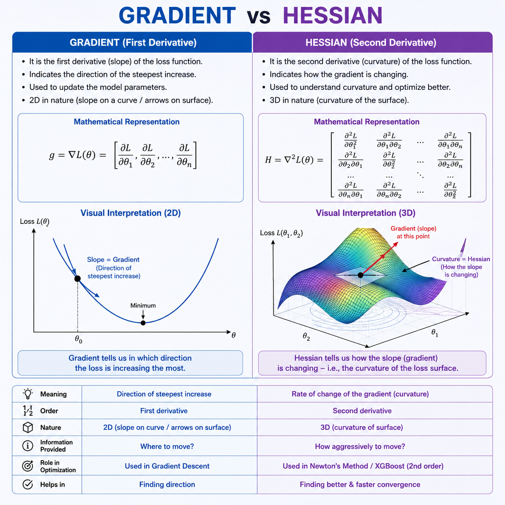

# Insurance Expense Prediction : 

## Overview : 

In the previous problem (Day 8), Gradient Boosting was used to model nonlinear relationships in insurance expense prediction. While Gradient Boosting significantly improved performance over linear regression, it still had limitations : 

- No explicit regularization on tree.
- Using only first-order gradient information.
- Greedy tree growth which may cause overfitting.
- Training instability risk with deeper trees.
- Slower convergence in some cases.

XGBoost addresses all of these by introducing *regularized objective optimization, second-order (Newton) updates, principled split pruning via gain thresholds, row and column subsampling, and highly optimized parallel tree construction*. The result is a model that is simultaneously faster, more accurate, and more resistant to overfitting than classical Gradient Boosting, which is why it has dominated structured ML competitions for years.

---

## Problem Statement : 

Predict continuous annual insurance expenses from structured features: age, BMI, smoker status, number of children, and region.

This is a nonlinear regression task with a skewed target distribution and strong feature interaction effects, particularly between smoking status, BMI, and age.

---

## Dataset :

**Source :** `insurance.csv`, 1338 records, 7 columns.

| Feature | Type | Description |
|---|---|---|
| `age` | Numeric | Age of the insured individual |
| `sex` | Categorical | Male or female |
| `bmi` | Numeric | Body Mass Index |
| `children` | Numeric | Number of dependents covered |
| `smoker` | Categorical | Whether the individual smokes |
| `region` | Categorical | Residential region in the US |
| `expenses` | Numeric | **Target: annual medical insurance cost** |

Categorical features were one-hot encoded using `pd.get_dummies(drop_first=True)` before modeling.

---

## EDA : 

### Expense Distribution : 


The target variable is right-skewed, with a long tail of high-cost individuals. This means most people have moderate expenses, but a small group drives extreme values, which directly creates the outlier prediction challenge.

---

### Correlation Heatmap : 


- `smoker_yes` has the strongest positive correlation with expenses (0.79);  by far the dominant predictor.
- `age` (0.30) and `bmi` (0.20) show moderate positive correlation.
- Regional features and `sex_male` contribute negligible linear signal.
- Weak linear correlations across most features confirm the need for a non-linear model.

---

## Additive Model Representation : 

XGBoost builds the final prediction as a sum of trees.
For sample $i$ :

$$\hat{y}_i = \sum_{t=1}^{T} f_t(x_i)$$

where $T$ is the total number of trees, $x_i$ is the feature vector for sample $i$, and $f_t(x_i)$ is the prediction contributed by tree $t$.

Each tree $f_t$ divides the feature space into regions (leaves). If sample $i$ falls into leaf $j$ of tree $t$;

$$f_t(x_i) = w_j$$

where $w_j$ is the scalar output value (weight) assigned to leaf $j$. The full model is therefore a piecewise constant function, built up one tree at a time.

---

## Regularized Objective Function : 

At each boosting iteration $t$, XGBoost minimizes a regularized objective combining training loss and a penalty on model complexity; 

$$\text{Obj}^{(t)} = \sum_{i=1}^{n} L\!\left(y_i,\ \hat{y}_i^{(t-1)} + f_t(x_i)\right) + \Omega(f_t)$$

Where; 

- $n$ is the number of training samples
- $y_i$ is the true expense for sample $i$
- $\hat{y}_i^{(t-1)}$ is the prediction from all previous $t-1$ trees
- $f_t(x_i)$ is what the new tree contributes for sample $i$
- $L$ is the loss function (MSE for regression), measuring how wrong the predictions are
- $\Omega(f_t)$ is the regularization term penalizing tree complexity

The regularization term is; 

$$\Omega(f_t) = \gamma \cdot T + \frac{1}{2} \lambda \sum_{j=1}^{T} w_j^2$$

where; 

- $T$ is the number of leaves in tree $t$
- $w_j$ is the output weight of leaf $j$
- $\gamma$ (gamma) penalizes the number of leaves: more leaves means more complexity, and each new leaf must justify itself
- $\lambda$ (lambda) penalizes large leaf weight values: prevents any single leaf from making an aggressively large correction

**Changing $\gamma$ :** increasing $\gamma$ makes the model prefer shallower trees with fewer splits. A high $\gamma$ forces every split to produce a large gain, pruning away marginal splits that barely help.

**Changing $\lambda$ :** increasing $\lambda$ shrinks the magnitude of all leaf outputs, acting like L2 regularization. It smooths the corrections each tree makes, reducing variance at the cost of slightly slower convergence.

This combination means XGBoost jointly optimizes; *fit to data + simplicity of model*, which classical Gradient Boosting does not do explicitly.

---

## Second-Order Taylor Approximation : 

Rather than using only the gradient (first derivative) to guide each tree, XGBoost uses a second-order Taylor expansion of the loss around the current prediction.

The original loss at step $t$ is :

$$\sum_{i=1}^{n} L\!\left(y_i,\ \hat{y}_i^{(t-1)} + f_t(x_i)\right)$$

We approximate this using the Taylor expansion up to second order : 

$$\approx \sum_{i=1}^{n} \left[ L\\left(y_i, \hat{y}_i^{(t-1)}\right) + g_i \cdot f_t(x_i) + \frac{1}{2} h_i \cdot f_t(x_i)^2 \right]$$

Where;

$$g_i = \frac{\partial L(y_i, \hat{y}_i^{(t-1)})}{\partial \hat{y}_i^{(t-1)}} \quad \text{(first derivative: gradient)}$$

$$h_i = \frac{\partial^2 L(y_i, \hat{y}_i^{(t-1)})}{\partial \left(\hat{y}_i^{(t-1)}\right)^2} \quad \text{(second derivative: hessian)}$$

The $\frac{1}{2}$ in front of the hessian term comes directly from the Taylor expansion formula ($f(x+\delta) \approx f(x) + f'(x)\delta + \frac{1}{2}f''(x)\delta^2$), and the constant $L(y_i, \hat{y}_i^{(t-1)})$ does not involve $f_t$, so it is dropped from the optimization. The effective objective per sample becomes:

$$\tilde{\mathcal{L}}^{(t)} = \sum_{i=1}^{n} \left[ g_i \cdot f_t(x_i) + \frac{1}{2} h_i \cdot f_t(x_i)^2 \right] + \Omega(f_t)$$

For MSE loss $L = (y_i - \hat{y}_i)^2$, note that we drop the $\frac{1}{n}$ normalization because it is a constant that does not affect which tree minimizes the objective. This gives:
- $g_i = -2(y_i - \hat{y}_i^{(t-1)})$: the residual signal, pointing in the direction of error
- $h_i = 2$: constant for MSE, meaning equal confidence everywhere

The key advantage of using $h_i$ (the hessian) is that it encodes the curvature of the loss surface. This allows Newton-style updates rather than simple gradient steps, leading to faster and more precise convergence.

---

## Region-wise Aggregation : 

Since each tree assigns a constant output $w_j$ to all samples in leaf $j$, we group all gradient and hessian signals by leaf;

$$G_j = \sum_{i \in \text{leaf}_j} g_i \qquad \text{(sum of gradients in leaf } j\text{)}$$

$$H_j = \sum_{i \in \text{leaf}_j} h_i \qquad \text{(sum of hessians in leaf } j\text{)}$$

**Interpretation :**

- Large $|G_j|$ : the model is consistently wrong in this region and needs a strong correction.
- Large $H_j$ : many samples and high curvature, meaning the region is stable and confident.
- Small $H_j$ : uncertain region, where the loss surface is flat and corrections should be cautious.

---

## Optimal Leaf Weight : 

Minimizing the objective with respect to $w_j$ (taking the derivative and setting it to zero) gives the closed-form optimal leaf output; 

$$w_j^* = -\frac{G_j}{H_j + \lambda}$$

Intuition :

- Larger $G_j$ (bigger error signal) produces a larger correction.
- Larger $\lambda$ shrinks the update: regularization in action.
- Larger $H_j$ makes the update more cautious: the hessian acts as an adaptive learning rate, automatically scaling corrections based on local curvature.

---

## Tree Quality Score : 

Substituting the optimal leaf weights back into the objective gives the best possible score for a given tree structure;

$$\text{Score}(\text{tree}) = -\frac{1}{2} \sum_{j=1}^{T} \frac{G_j^2}{H_j + \lambda} + \gamma \cdot T$$

This score measures how much training loss reduction this tree structure can achieve, after accounting for its complexity cost $\gamma \cdot T$. A better tree structure produces a more negative score (lower loss), and XGBoost searches for the structure that minimizes this.

---

## Split Gain Formula : 

When evaluating whether to split a node into left ($L$) and right ($R$) children, XGBoost computes the gain from the split;

$$\text{Gain} = \frac{1}{2} \left[ \frac{G_L^2}{H_L + \lambda} + \frac{G_R^2}{H_R + \lambda} - \frac{(G_L + G_R)^2}{H_L + H_R + \lambda} \right] - \gamma$$

where $G_L, H_L$ are the gradient and hessian sums in the left child, and $G_R, H_R$ are those in the right child.

A split is accepted only if $\text{Gain} > 0$: the improvement in loss from splitting must outweigh the complexity cost $\gamma$ of adding a new leaf. This is principled pruning built directly into the math, not a post-hoc heuristic.

---

## Gradient vs Hessian Intuition : 



| Concept | Significance | Role in XGBoost |
|---|---|---|
| $g_i$ (Gradient) | Direction of error; how wrong we are and which way to correct | Tells each leaf which direction to push the prediction |
| $h_i$ (Hessian) | Confidence in that direction; Curvature of the loss surface | Scales the correction; high hessian means move cautiously |
| Gain | Whether the split is worth the added complexity | Accepts a split only if it reduces loss more than $\gamma$ |

The gradient answers : **Where are we wrong?**
The hessian answers : **How aggressively should we correct?**
The gain answers : **Is this split actually worth making?**

Together, these three quantities drive every decision XGBoost makes during tree construction.

---

## Key Hyperparameters : 

| Parameter | Significance | Effect of increasing |
|---|---|---|
| `n_estimators` | Number of boosting rounds | More trees, lower bias, higher overfitting risk |
| `learning_rate` ($\eta$) | Shrinkage per tree | Slower, more stable convergence; needs more trees |
| `max_depth` | Maximum tree depth | More complex trees, higher variance |
| `gamma` ($\gamma$) | Minimum gain required to split | Fewer, more conservative splits |
| `lambda` ($\lambda$) | L2 regularization on leaf weights | Smaller leaf outputs, smoother model |
| `subsample` | Fraction of rows sampled per tree | Reduces variance, introduces randomness |
| `colsample_bytree` | Fraction of features sampled per tree | Reduces correlation between trees |

---

## Baseline and Tuned Model : 

A baseline XGBoost model was first trained with default parameters to establish a reference point. Hyperparameter tuning was then performed using Grid Search with 5-fold Cross-Validation over a structured parameter grid. The best configuration was selected based on cross-validated MSE.

**Best parameters found :**

```
n_estimators = 200,  learning_rate = 0.03,  max_depth = 3,
gamma = 0,  lambda = 5,  subsample = 0.8,  colsample_bytree = 0.8
```

---

## Model Performance : 

| Model | RMSE | $R^2$ | Training Time (s) | Inference Latency (s/sample) |
|---|---|---|---|---|
| Baseline XGBoost | 4519.78 | 0.8684 | 0.10 | 0.000020 |
| Tuned XGBoost | 4375.50 | 0.8767 | 77.84 | 0.000029 |

**Interpretation of Results :**

- Tuning reduced RMSE from 4519.78 to 4375.50, a meaningful improvement in prediction accuracy.
- $R^2$ increased from 0.8684 to 0.8767, meaning the tuned model explains more variance in insurance expenses.
- Training time increased significantly (0.10 s to 77.84 s) due to the cost of Grid Search: multiple parameter combinations each trained across 5 folds.
- Inference latency increased slightly because the tuned model may use a larger or deeper ensemble, but both remain well within real-time serving requirements.

---

## Feature Importance : 


- **`smoker_yes`** dominates with approximately 0.70 importance: smoking status is the single largest driver of insurance expenses.
- **`bmi`** is second, capturing the non-linear BMI-expense relationship.
- **`age`** is third.
- Regional dummies, `children`, and `sex_male` contribute negligibly.

These rankings are consistent with what the correlation heatmap showed, confirming they are stable properties of the data.

---

## Boosting Stage Error Curve : 


Training error decreases steadily as boosting iterations increase, while validation error stabilizes. This indicates that the model is learning genuine signal rather than memorizing noise, and that the selected number of estimators sits at a good point before overfitting begins.

---

## Residual Analysis : 


Residuals are approximately centered around zero, suggesting reduced systematic bias. Larger residuals are concentrated at the extremes of the predicted range, corresponding to the highest-expense individuals that the model struggles to estimate precisely.

---

## Error Distribution : 


The error distribution is approximately normal and centered near zero, with occasional large errors from extreme expense outliers. This shape is consistent with a well-calibrated model that has low bias but cannot fully account for rare, high-cost individuals.

---

## Time and Space Complexity : 

### Training Complexity

Fitting one tree on $N$ samples costs $O(N \log N)$. With $T$ trees and Grid Search over $C$ combinations across $K$ folds;

$$O(C \times K \times T \cdot N \log N)$$

XGBoost's histogram-based split finding reduces the practical constant significantly compared to exact greedy methods, which is a large part of why it trains faster than classical Gradient Boosting.

### Prediction Complexity : 

Each sample traverses all $T$ trees, one root-to-leaf path per tree;

$$O(T \cdot \text{depth})$$

Both models deliver sub-millisecond per-sample latency, making them suitable for real-time inference.

### Space Complexity : 

The model stores all tree structures, split thresholds, and leaf outputs;

$$O(T \cdot 2^{\text{depth}})$$

Memory grows linearly with the number of trees and exponentially with depth, reinforcing the preference for shallow trees.

---

## Failure Cases : 

**Noisy or mislabeled data :**
Gradient Boosting variants, including XGBoost, are sensitive to label noise because they directly fit residuals. A mislabeled training sample produces a large, incorrect residual, and subsequent trees will work to correct it, potentially distorting the model around that point. Subsampling (`subsample`, `colsample_bytree`) partially mitigates this, but fundamentally noisy targets degrade performance.

**Extreme expense outliers :**
The model consistently underestimates expenses for the highest-cost individuals. These cases, typically high-BMI smokers with compounding risk factors, lie far from the bulk of the training distribution. Gradient-based ensembles regress toward the center of the data and cannot fully extend their predictions to rare, extreme values. The residual plot confirms this: large positive residuals cluster at the high end of the predicted range.

**Extrapolation beyond the training distribution :**
The dataset covers ages 18 to 64, BMI roughly 16 to 53, and expenses up to approximately $63,000. For individuals whose features fall outside these observed ranges, the model produces unreliable estimates silently, with no uncertainty signal. Tree-based models cannot extrapolate: they can only interpolate within the feature space seen during training.

**High-dimensional sparse feature spaces :**
XGBoost performs well on dense, structured tabular data with a moderate number of meaningful features. When the feature space becomes very large and sparse (e.g., after aggressive one-hot encoding of high-cardinality categoricals, or in NLP-style bag-of-words settings), tree-based models struggle to find informative splits efficiently. In such cases, regularized linear models or neural approaches are often more appropriate.

---

## XGBoost over Deep Learning on Tabular Data(<10 million samples) : 

- Tabular datasets are typically small to medium in size whereas deep networks need far more data to generalize.
- Feature interactions in structured data are sparse and threshold-based; trees capture these naturally.
- Missing values are common in tabular data and XGBoost handles them natively.
- No spatial or sequential structure exists so there is no advantage to convolutions or attention.
- Training cost is orders of magnitude lower, and results are reproducible and interpretable.

Tree ensembles consistently dominate structured ML benchmarks, and XGBoost in particular has been the winning model in more Kaggle competitions than any other algorithm.
