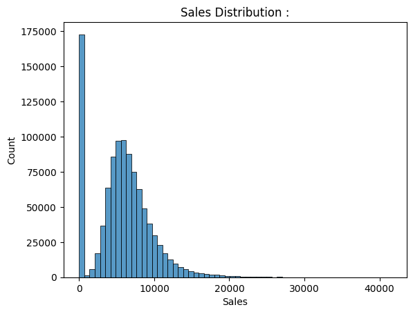
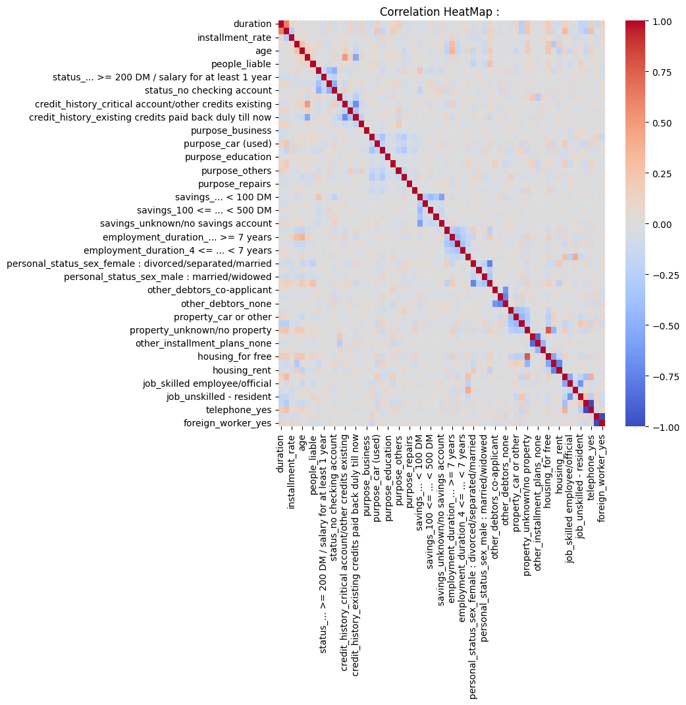
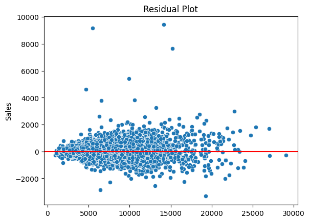
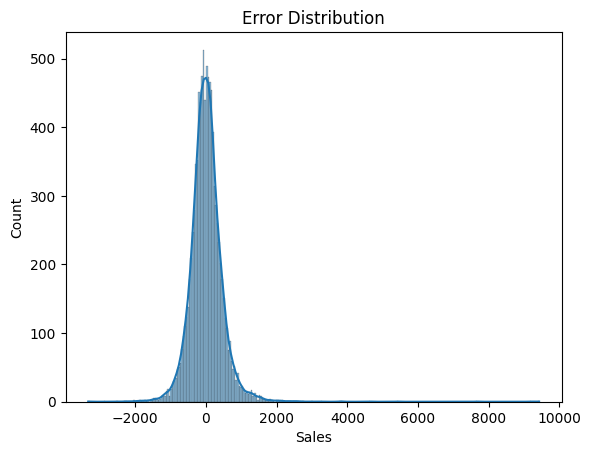
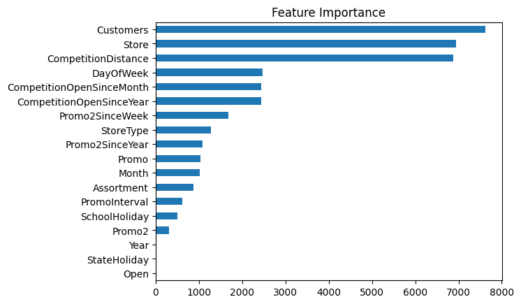

# Rossmann Store Sales Forecasting : 

[](https://python.org)
[](https://lightgbm.readthedocs.io)
[](https://scikit-learn.org)

---

## Problem Statement : 

Predict **daily store-level sales** across 1,115 Rossmann drug stores using structured retail features. The goal is to build a robust regression model that captures nonlinear demand behaviour across promotions, holidays, store types, and time.

**Input Features :**
- Store type and assortment class
- Promotion status and promotion intervals
- Competition distance and opening dates
- Holiday indicators (state, school, public)
- Temporal signals (day, month, year, day of week)

**Target:** `Sales` ;daily revenue per store (€)

> This is a **nonlinear regression problem** involving regime shifts, interaction effects, and heavy target skew; a near-perfect use case for gradient boosting.

---

## Dataset : 

From the [Kaggle Rossmann Store Sales](https://www.kaggle.com/c/rossmann-store-sales) competition. Two files are required :

| File | Description |
|---|---|
| `train.csv` | Historical daily sales per store |
| `store.csv` | Store metadata (type, assortment, competition, promotions) |

> The two files are **merged on `Store` ID** before any processing — `train.csv` alone is missing key feature columns.

---

## EDA : 

### Sales Distribution : 

Sales exhibits strong **right skew** with a long tail of extreme revenue days. This causes heteroscedastic noise, gradient instability during training, and large residual dominance risk.

**Fix:** Log-transform the target via `np.log1p(Sales)` before training, reversed with `np.expm1()` at evaluation.



### Correlation Heatmap : 

Most pairwise linear correlations are weak. This confirms that linear models will underfit and nonlinear tree-based partitioning is required.



---

## Feature Engineering : 

| Step | Detail |
|---|---|
| Date parsing | `Year`, `Month` extracted; raw `Date` column dropped |
| Closed store removal | Rows where `Open == 0` excluded |
| Log transform | `Sales = np.log1p(Sales)` to stabilize variance |
| Categorical encoding | `StoreType`, `Assortment`, `StateHoliday`, `PromoInterval` label-encoded via `cat.codes` |
| Missing value fill | `fillna(0)` applied after encoding |

---

## Model -> LightGBM

### Why LightGBM?

LightGBM uses **histogram-based gradient boosting** with leaf-wise tree growth. For tabular retail data with mixed feature types and nonlinear interactions, it consistently outperforms linear and shallow models.

---

### LightGBM vs XGBoost

Both are gradient boosting frameworks but they differ in meaningful ways under the hood:

| | LightGBM | XGBoost |
|---|---|---|
| **Tree growth strategy** | Leaf-wise (best-first) | Level-wise (depth-first) |
| **Split search** | Histogram-based binning | Exact greedy or approximate |
| **Training speed** | Faster on large datasets | Slower; more memory hungry |
| **Memory usage** | Lower (binned histograms) | Higher (stores exact values) |
| **Categorical features** | Native support | Requires manual encoding |
| **Overfitting risk** | Higher (deep asymmetric trees) | Lower (balanced level-wise growth) |
| **Small datasets** | Can overfit more easily | More stable |

**In Laymans terms : ** XGBoost grows trees level by level, keeping them balanced and conservative. LightGBM always splits whichever leaf has the highest gain regardless of depth.
This means it converges faster and hits lower training loss, but needs tighter regularization to stay in check. On large structured datasets like Rossmann, LightGBM is typically both faster and more accurate.

---

### Additive Ensemble : 

Predictions are built as a sum of weak learners:

$$\hat{y}_i = \sum_{t=1}^{T} f_t(x_i)$$

Each tree $f_t$ partitions feature space into leaves. Inside leaf $j$:

$$f_t(x_i) = w_j$$

LightGBM approximates a **piecewise constant nonlinear function** over the full feature space.

---

### Regularized Objective : 

At boosting iteration $t$:

$$\text{Obj}^{(t)} = \sum_i L\left(y_i,\ \hat{y}_i^{(t-1)} + f_t(x_i)\right) + \Omega(f_t)$$

With regularization:

$$\Omega(f_t) = \gamma \cdot T + \frac{1}{2} \lambda \sum_j w_j^2$$

- $\gamma$ : penalises number of leaves (controls complexity)
- $\lambda$ : penalises leaf weight magnitude (prevents overfit)

---

### Second-Order Optimization : 

The loss is approximated via Taylor expansion:

$$L \approx g_i \cdot f_t(x_i) + \frac{1}{2} h_i \cdot f_t(x_i)^2$$

Where:
- $g_i = \partial L / \partial \hat{y}_i$ : first-order gradient
- $h_i = \partial^2 L / \partial \hat{y}_i^2$ : second-order Hessian

This enables **Newton-style weight updates** rather than vanilla gradient descent.

---

### Optimal Leaf Weights : 

Aggregating over leaf $j$:

$$G_j = \sum_{i \in j} g_i, \quad H_j = \sum_{i \in j} h_i$$

The optimal leaf output is:

$$w_j^* = -\frac{G_j}{H_j + \lambda}$$

- Large $|G_j|$ : region poorly predicted, stronger correction applied
- Large $\lambda$ : shrinks the update, safer step taken
- Large $H_j$ : stable curvature, confident update issued

---

### Split Gain Formula : 

$$\text{Gain} = \frac{1}{2} \left[ \frac{G_L^2}{H_L + \lambda} + \frac{G_R^2}{H_R + \lambda} - \frac{(G_L+G_R)^2}{H_L+H_R+\lambda} \right] - \gamma$$

A split is accepted only if $\text{Gain} > 0$.

---

### Leaf-Wise Growth : 

Unlike level-wise trees (XGBoost default), LightGBM **always splits the leaf with the highest gain**, regardless of depth. This leads to faster training loss reduction and deeper partitions in high-error regions — with overfitting risk mitigated via `num_leaves` and `max_depth` constraints.

---

### Histogram Optimization : 

Continuous feature values are discretized into bins. Gradient and Hessian statistics are aggregated per bin — split search becomes a **linear scan over bins** rather than over raw values, reducing training complexity significantly.

---

## Hyperparameter Tuning : 

Grid search with 5-fold Cross Validation:

```python
param_grid = {
    "n_estimators":   [300, 600],
    "learning_rate":  [0.03, 0.05, 0.1],
    "num_leaves":     [31, 63],
    "max_depth":      [-1, 10]
}
```

Scoring metric: `neg_mean_squared_error`. Best parameters printed after grid search completes.

---

## Results : 

| Model | RMSE (€) | R² | Training Time | Inference Latency |
|---|---|---|---|---|
| Base LightGBM | 684.398745 | 0.950694 | Fast | Very low |
| Tuned LightGBM | 470.709523 | 0.976677 | Slower (CV) | Marginally higher |

> Tuning reduces bias at the cost of increased computational time. Inference latency remains negligible for both — prediction complexity is $O(T \cdot \text{depth})$.

---

## Residual Analysis : 

Residuals distributed around zero with no strong systematic trend; the model is largely unbiased across the prediction range. Variance increases for high sales values, indicating **multiplicative noise** at extreme revenue points (expected for log-scale targets).



Error distribution is heavy-tailed due to rare extreme promotional spikes. The model underestimates outlier events, which is expected behaviour for ensemble regressors without explicit outlier modelling.



---

## Feature Importance : 

Top predictive signals from LightGBM split-gain importance:

1. **Promotion status** : dominant regime-switch effect
2. **Store ID** : captures store-level fixed effects
3. **Day of week** : strong cyclic demand signal
4. **Month / Year** : seasonal and trend components
5. **Competition distance** : structural competitive pressure
6. **Store type and assortment** : baseline revenue tier



---

## Failure Cases and Limitations : 

- **Extreme promotional events** : underpredicted due to sparse training examples
- **Structural regime shifts** : sudden store refits or market changes not captured
- **High leaf count overfitting** : risk when `num_leaves` is large and data is limited
- **Extrapolation beyond training range** : boosted trees cannot extrapolate; future sales exceeding historical max will be underestimated
- **Heavy tail errors** : log-transform helps but does not fully resolve extreme outlier prediction

---

## Key Takeaways : 

- **Leaf-wise boosting** reduces bias faster than level-wise growth for retail demand data
- **Histogram optimization** makes LightGBM practical at scale with no meaningful accuracy loss
- **Second-order updates** (Newton steps) stabilize training vs first-order gradient descent
- **Log-transform on target** is non-negotiable for right-skewed sales data : gradients behave far better in log space
- **Temporal feature engineering** (day of week, month, year) contributes substantially to model quality
- **Gradient boosted trees remain the dominant paradigm for structured tabular retail forecasting**
