# Mall Customer Segmentation : 

---

## Problem Statement : 

Segment mall customers into meaningful behavioral groups using two structured behavioral features :

- Annual Income (k$)
- Spending Score (1-100)

**Goal :** Discover latent customer segments in feature space without any supervision signal.

This is an unsupervised clustering problem. The model must identify natural geometric groupings purely from the structure of the data: no labels, no loss function, no ground truth.

---

## Customer Segmentation Importance : 

Raw customer data is noisy and high-dimensional. Clustering compresses it into actionable archetypes. Once segments are identified, a business can :

- Run targeted marketing campaigns per segment.
- Plan inventory around spending behavior.
- Design loyalty programs for high-income low-spend customers.
- Identify at-risk low-engagement segments early.
- Model customer lifetime value per cluster.

Unlike supervised learning, clustering does not predict a target. It reveals structure that already exists but is invisible in tabular form.

---

## Pipeline : 

1. EDA: visualize feature distributions and scatter structure
2. Feature scaling with StandardScaler
3. Metric sweep across $K \in [2, 10]$: compute inertia, silhouette, DB, CH
4. Select $K$ using all six methods independently
5. Train a KMeans model for each selected $K$
6. Compute geometric metrics: intra-cluster, inter-cluster distances
7. Measure training time and inference latency per method
8. Visualize cluster assignments for each method
9. Compile full comparison table

---

## EDA : 

Before clustering, understanding the geometric distribution of features is critical. KMeans is sensitive to scale and shape. What you see in EDA directly determines how you preprocess and how many clusters are reasonable.

### Customer Distribution ScatterPlot : 

Scatter visualization reveals visually separable blobs. If natural groupings are visible to the human eye, KMeans is likely to find them.

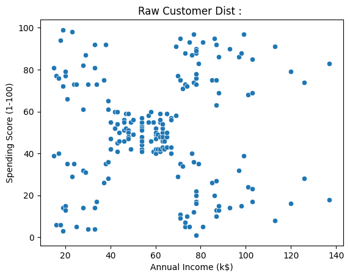

---

### Annual Income Distribution : 

Income distribution gives a sense of spread and skew. Moderate spread without heavy tails means StandardScaler will not distort the geometry significantly.

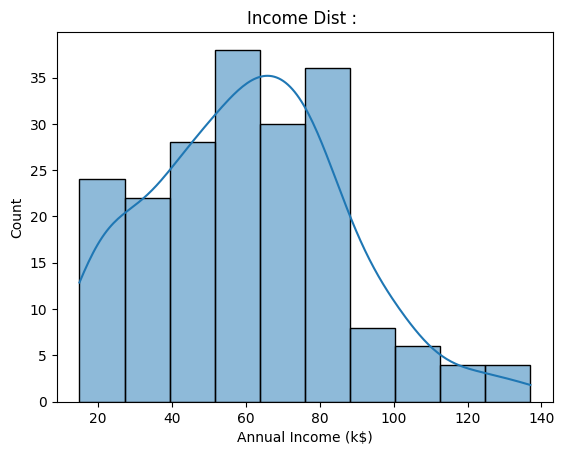

---

### Spending Score Distribution : 

Spending score shows multi-modal behavior. Multiple local peaks suggest the presence of genuinely distinct behavioral regimes in the data, which is exactly what clustering tries to formalize.

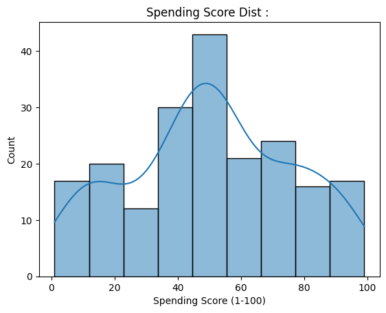

---

## Feature Scaling : 

KMeans is a distance-based algorithm. It computes Euclidean distance between every point and every centroid at each step. If one feature has a range of 0-100 and another has a range of 15-135, the larger-scale feature will dominate the distance computation regardless of its actual predictive signal.

**StandardScaler** transforms each feature to zero mean and unit variance :

$$x' = \frac{x - \mu}{\sigma}$$

After scaling, both features contribute equally to the distance metric. This is not optional. It is mathematically required for KMeans to behave correctly.

---

## KMeans Objective Function : 

KMeans minimizes within-cluster variance, formally called the **inertia** or **distortion** :

$$J = \sum_{k=1}^{K} \sum_{x_i \in C_k} \| x_i - \mu_k \|^2$$

Where:
- $C_k$ is the set of points assigned to cluster $k$
- $\mu_k$ is the centroid of cluster $k$
- $\| \cdot \|$ is the Euclidean norm

This is also referred to as Within-Cluster Sum of Squares (WCSS). Minimizing $J$ simultaneously pushes points toward their cluster center (cohesion) and implicitly pushes clusters apart (separation).

---

## Optimization : Lloyd's Algorithm

KMeans uses Lloyd's Algorithm, an optimization procedure :

**Step 1 -> Assignment :**

$$c_i = \arg\min_k \| x_i - \mu_k \|^2$$

Assign each point to the nearest centroid. This is a hard, winner-takes-all assignment.

**Step 2 -> Update :**

$$\mu_k = \frac{1}{|C_k|} \sum_{x_i \in C_k} x_i$$

Recompute each centroid as the mean of its assigned points. This is the analytical minimizer of squared distance within the cluster.

Each iteration is guaranteed to reduce or maintain $J$. However, the objective is **non-convex**, so the algorithm converges to a local minimum. This is why `n_init=20` is used: run 20 independent initializations and keep the best result.

---

## Geometric Assumptions : 

KMeans implicitly assumes clusters are :

- **Spherical** — the Euclidean distance metric defines circular decision boundaries in 2D
- **Convex** — no curved or horseshoe-shaped clusters
- **Similarly sized** — large clusters can absorb smaller nearby ones
- **Similarly dense** — sparse clusters get fragmented or merged with denser neighbors
- **Well separated** — overlapping clusters confuse centroid placement

KMeans fails on ring-shaped, crescent-shaped, or manifold-structured data. It is the right tool here because the scatter plot confirms blob-shaped clusters.

---

## Time and Space Complexity : 

Let:
- $n$ = number of samples
- $k$ = number of clusters
- $d$ = number of features
- $I$ = number of iterations until convergence

**Training Complexity :**

$$O(I \cdot n \cdot k \cdot d)$$

At each iteration, every point ($n$) is compared against every centroid ($k$) across all dimensions ($d$). This is repeated for $I$ iterations. In practice $I$ is small (typically 10-100), so the dominant term is $n \cdot k \cdot d$.

**Prediction Complexity :**

$$O(k \cdot d)$$

For a single new point, compute distance to all $k$ centroids across $d$ dimensions and return the argmin. Constant in $n$, inference is extremely fast.

**Space Complexity :**

$$O(n \cdot d + k \cdot d)$$

Store the full data matrix ($n \times d$) and the centroid matrix ($k \times d$). For large $n$, data storage dominates. Centroids are negligible.

**Practical implication :** KMeans scales well in $n$ for fixed $k$ and $d$. The bottleneck at inference is essentially zero, making it deployable in real-time systems.

---

## Why Selecting K Matters : 

$K$ is the single most important hyperparameter in KMeans. It directly controls model complexity:

| K too small | K too large |
|-------------|-------------|
| Under-segmentation | Over-segmentation |
| Distinct behaviors merged | Noise clusters appear |
| High bias | Poor interpretability |
| Centroids pulled toward wrong region | Instability across runs |

There is no universal correct $K$. Different evaluation criteria capture different aspects of cluster quality, so multiple methods are compared.

---

## Methods for Selecting Optimal K : 

Six independent criteria are evaluated across $K \in [2, 10]$.

---

### 1. Empirical Formula : 

$$K \approx \sqrt{\frac{n}{2}}$$

Derived from vector quantization theory. Optimal prototype count grows sublinearly with sample size. Used here only to define a reasonable search bound, not as a final answer.

---

### 2. Elbow Method : 

Plot $K$ vs. inertia $J$. As $K$ increases, inertia always decreases. Each new centroid reduces average distance. The useful signal is the **rate of decrease**:

- Large drop early: adding a cluster captures a real group
- Flattening later: adding clusters only captures noise

The elbow is the point of maximum curvature, detected programmatically via the second difference:

$$\Delta^2 J_k = J_{k+1} - 2J_k + J_{k-1}$$

The $K$ minimizing $\Delta^2 J$ is the elbow. Weakness: the elbow is sometimes gradual and subjective.

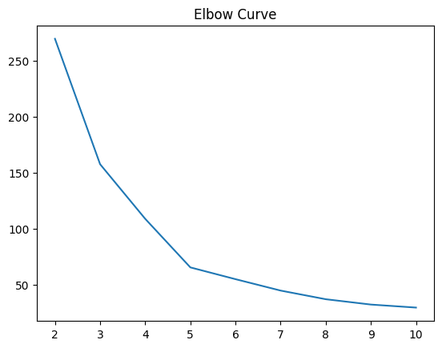

---

### 3. Silhouette Score : 

For each point $i$:

$$s_i = \frac{b_i - a_i}{\max(a_i, b_i)}$$

Where:
- $a_i$ = mean distance from $i$ to all other points in its cluster (cohesion)
- $b_i$ = mean distance from $i$ to all points in the nearest other cluster (separation)

Global score = mean $s_i$ over all points. Range: $[-1, +1]$.

Interpretation:
- $s \approx +1$: well inside its cluster, far from others (ideal)
- $s \approx 0$: on the boundary between two clusters
- $s \approx -1$: likely assigned to the wrong cluster

Silhouette is a **local, per-point** measure that captures both cohesion and separation simultaneously.

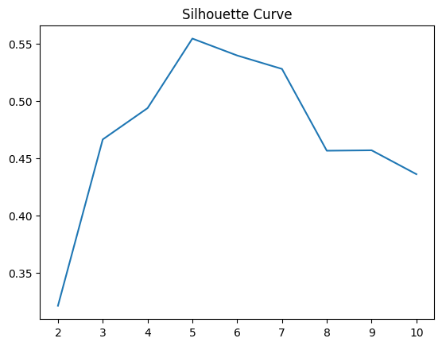

---

### 4. Davies-Bouldin Index : 

Measures the average worst-case similarity between each cluster and its most similar neighbor:

$$DB = \frac{1}{K} \sum_{i=1}^{K} \max_{j \neq i} \frac{S_i + S_j}{M_{ij}}$$

Where:
- $S_i$ = average distance from points in cluster $i$ to centroid $\mu_i$ (spread)
- $M_{ij} = \| \mu_i - \mu_j \|$ = centroid separation distance

Lower DB is better. A good clustering has tight clusters ($S_i$ small) far from each other ($M_{ij}$ large). DB is robust to cluster size imbalance and is more sensitive to outlier clusters than silhouette.

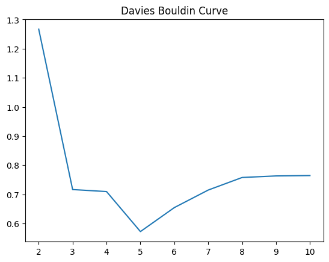

---

### 5. Calinski-Harabasz Score : 

Variance ratio criterion — ratio of between-cluster dispersion to within-cluster dispersion:

$$CH = \frac{B / (K - 1)}{W / (n - K)}$$

Where between-cluster dispersion : $$B = \sum_{k=1}^{K} n_k \| \mu_k - \mu \|^2$$

And within-cluster dispersion : $$W = \sum_{k=1}^{K} \sum_{x_i \in C_k} \| x_i - \mu_k \|^2$$

Higher CH is better. This is essentially a clustering analog of the F-statistic — it asks: is the variance explained by cluster structure significantly larger than the residual within-cluster variance? Tends to favor compact, well-separated clusters.

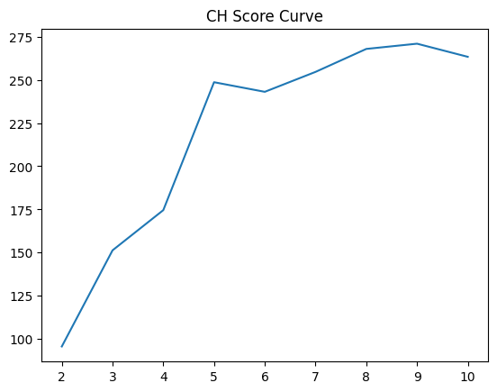

---

### 6. Manual Grid Search with Silhouette Scoring : 

`GridSearchCV` is designed for supervised learning and requires a train/test split — meaningless in clustering since there are no labels to evaluate against on a held-out set.

The approach here is a structured parameter sweep that replicates the intent of GridSearchCV without the supervised machinery:

```python
scores = {}
for k in k_range_vals:
    km_temp = KMeans(n_clusters=k, n_init=20, random_state=42)
    score = silhouette_scorer(km_temp, X_scaled)
    scores[k] = score

k_grid = max(scores, key=scores.get)
```

Every $K$ in the search range is evaluated on the same data using the silhouette scorer. The $K$ with the highest score is selected. This is functionally equivalent to exhaustive grid search — systematic, reproducible, and interpretable.

---

## Cluster Quality Metrics : 

| Metric | Formula | Direction | Measures |
|--------|---------|-----------|----------|
| Inertia | $\sum \|x_i - \mu_{c_i}\|^2$ | Lower better | Global compactness |
| Silhouette | $(b - a) / \max(a, b)$ | Higher better | Local cohesion + separation |
| Davies-Bouldin | $\frac{1}{K} \sum \max_j \frac{S_i + S_j}{M_{ij}}$ | Lower better | Worst-case overlap |
| Calinski-Harabasz | $B/(K-1)$ over $W/(n-K)$ | Higher better | Global variance ratio |
| Avg Intra-Cluster Dist | $\frac{1}{K} \sum_k \overline{\|x_i - \mu_k\|}$ | Lower better | Cluster tightness |
| Avg Inter-Cluster Dist | $\overline{\|\mu_i - \mu_j\|}$ | Higher better | Cluster separation |

No single metric is sufficient. Triangulating across all six gives a robust picture of cluster quality.

---

## Comparison Table : 

| Method | K | Inertia | Silhouette | Davies-Bouldin | Calinski-Harabasz | Avg Intra Dist | Avg Inter Dist | Train Time | Inference Latency |
|--------|---|---------|------------|----------------|-------------------|----------------|----------------|------------|-------------------|
| Empirical | 10 | 29.69 | 0.4362 | 0.7645 | 263.35 | 0.3693 | 2.1229 | 0.0479 | 0.000350 |
| Silhouette | 5 | 65.57 | 0.5547 | 0.5722 | 248.65 | 0.5270 | 2.2888 | 0.0424 | 0.000350 |
| Davies_Bouldin | 5 | 65.57 | 0.5547 | 0.5722 | 248.65 | 0.5270 | 2.2888 | 0.0501 | 0.000345 |
| Calinski_Harabasz | 9 | 32.39 | 0.4571 | 0.7633 | 270.95 | 0.3916 | 2.2737 | 0.0524 | 0.000553 |
| Elbow | 6 | 55.06 | 0.5399 | 0.6546 | 243.09 | 0.4980 | 2.3774 | 0.0388 | 0.000323 |
| GridSearchCV | 5 | 65.57 | 0.5547 | 0.5722 | 248.65 | 0.5270 | 2.2888 | 0.0380 | 0.000383 |

---

## Cluster Visualization : 

Each plot shows the geometric segmentation produced by each K-selection method. Cluster centroids are marked with a black X.

**Empirical K**

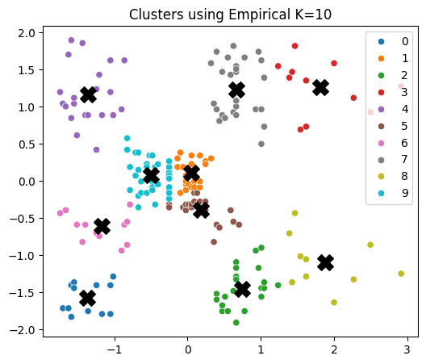

**Silhouette K**

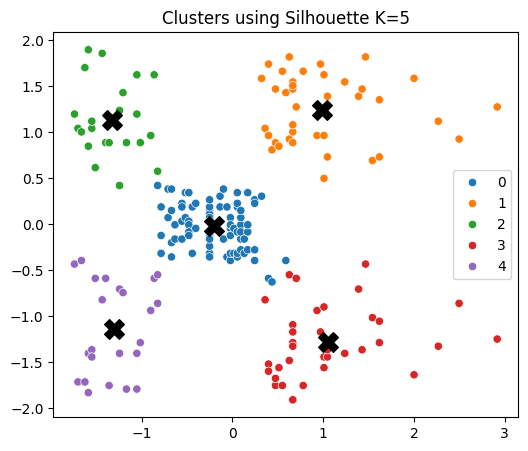

**Davies-Bouldin K**

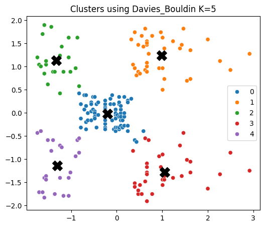

**Calinski-Harabasz K**

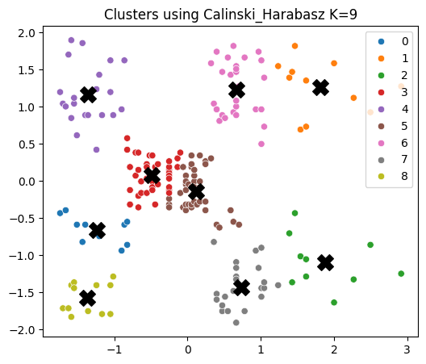

**Elbow K**

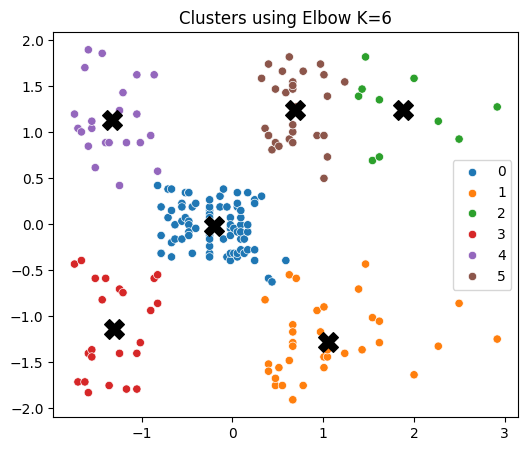

**Grid Search K**

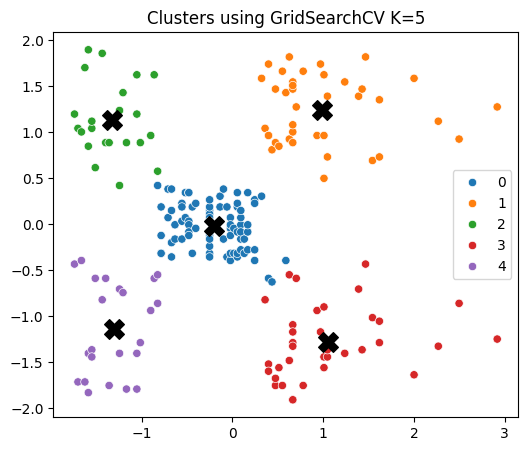

---

## Failure Case Analysis : 

KMeans can produce misleading results in several structural scenarios :

**Non-convex clusters:** KMeans draws linear Voronoi boundaries between centroids. If the true cluster shape is a ring, crescent, or spiral, those boundaries cut through the actual cluster structure. Use DBSCAN or spectral clustering instead.

**Varying cluster density:** KMeans assigns each point to the nearest centroid by Euclidean distance. A sparse cluster far from its centroid will lose points to a denser nearby cluster. The denser cluster effectively colonizes the sparse one.

**Outliers shift centroids:** The centroid is a mean, making it sensitive to extreme values. A single distant outlier can pull a centroid away from the true cluster center, corrupting all assignments for that cluster.

**Poor initialization (local minima):** Because the objective is non-convex, different starting centroids can converge to different final configurations. This is mitigated by `n_init=20` (run 20 times and keep the best), but is never fully eliminated.

**Distance concentration in high dimensions:** As $d$ grows, all pairwise Euclidean distances converge to the same value. Cluster boundaries become meaningless because no point is meaningfully closer to one centroid than another. This is the curse of dimensionality applied to clustering.

**Business-meaningful micro-segments ignored:** If $K$ is chosen purely by geometric metrics, small but commercially important segments (e.g., ultra-high-spend outliers) can be absorbed into larger clusters. Metric-optimal $K$ is not always business-optimal $K$.

---

## Key Takeaways : 

- Clustering quality must be triangulated across multiple metrics. No single number tells the full story.
- Silhouette captures local structure per point; Davies-Bouldin penalizes worst-case overlap; Calinski-Harabasz reflects global variance structure.
- The Elbow method is intuitive but subjective without the second-difference formalization.
- KMeans assumes spherical, equally-sized, equally-dense clusters. Always verify these assumptions visually in EDA before trusting metric outputs.
- Scaling is not optional. It is a mathematical prerequisite for distance-based algorithms.
- `n_init=20` is not excessive. KMeans is sensitive to initialization and multiple restarts are cheap insurance against bad local minima.
- Grid search in unsupervised settings means systematic hyperparameter evaluation over an internal metric, not cross-validated generalization. The distinction matters when interpreting results.
