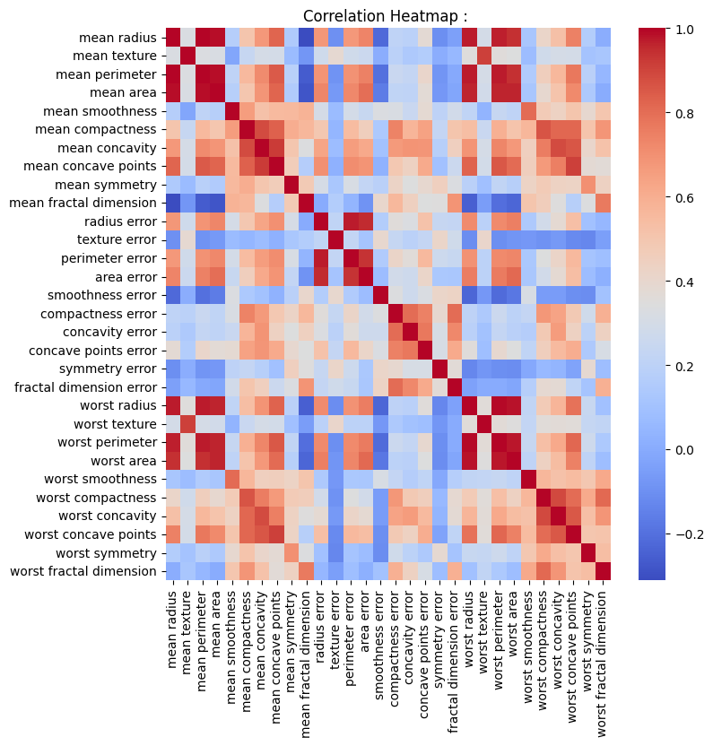
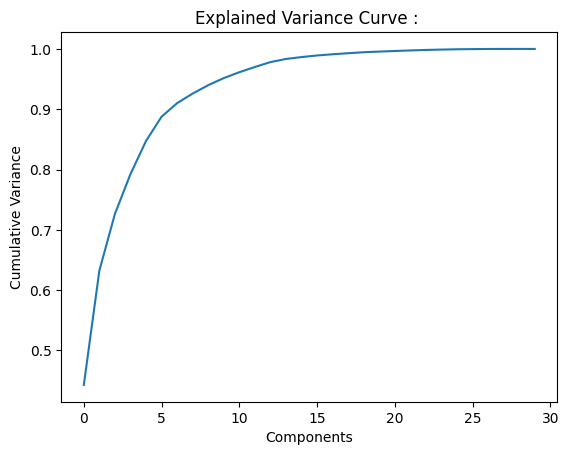
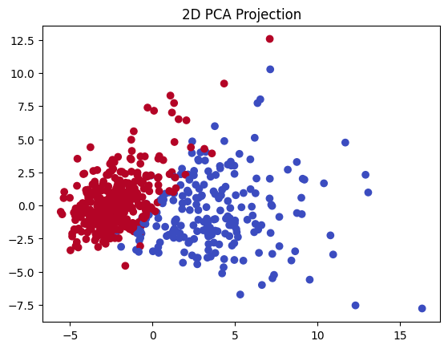

# Dimensionality Reduction  : 

---

## Problem Statement : 

Predict whether a tumor is malignant or benign using 30 real-valued numerical features derived from digitized images of fine needle aspirate (FNA) of breast masses.

Target variable: `diagnosis` : binary classification label (Malignant / Benign).

Objective: Study the impact of PCA as a preprocessing step. Compare classifier performance and efficiency before and after dim reduction.

---

## Problem Overview : 

Breast cancer diagnosis from image features presents a classic high-dimensional structured data problem. 
With 30 features, many of which are geometrically related; the raw feature space contains substantial redundancy. 
This makes it an ideal candidate to study what dimensionality reduction actually buys you in practice; in terms of both computational efficiency and generalization.

---

## Pipeline : 

1. Load dataset and inspect feature structure.
2. EDA: correlation heatmap to identify multicollinearity.
3. Feature scaling with StandardScaler.
4. Train/test split.
5. Train baseline Logistic Regression on full 30-dimensional space.
6. Fit PCA, plot explained variance curve.
7. Select number of components capturing 95% variance.
8. Retrain Logistic Regression on reduced space.
9. Compare accuracy, precision, recall, F1, ROC AUC, training time, inference latency.

---

## Dimensionality : 

Each feature represents an independent geometric axis. A dataset with $d$ features places every sample as a point in $\mathbb{R}^d$.

As $d$ grows, something counterintuitive happens. The volume of the space grows exponentially with dimension :

$$\text{Volume of unit hypercube} = 1^d = 1, \quad \text{but volume of inscribed hypersphere} = \frac{\pi^{d/2}}{\Gamma(d/2 + 1)} \cdot r^d \to 0$$

The sphere shrinks relative to the cube. Data points cluster near the corners and edges of the space. Almost all volume is in the shell near the boundary, not the interior. 

This means:

- Pairwise **distances between points concentrate** around the same value; the nearest and farthest neighbor become indistinguishable.
- **Density estimation becomes impossible**, we need exponentially more data to fill the space.
- **Gradient-based optimization** becomes **unstable** ie loss landscapes flatten.
- **Model variance increases** so more parameters needed to cover the space.

This is the **Curse of Dimensionality**, and it is the fundamental motivation for dimensionality reduction.

---

## Dimensionality Reduction Significance : 

Not all dimensions carry equal information. In real life datasets :

- Some features are correlated and encode the same underlying signal. 
- Some dimensions are dominated by noise.
- Some directions in feature space have near-zero variance and contribute nothing to separability.

Dimensionality reduction finds a lower-dimensional subspace that retains the signal while discarding redundancy and noise. 

The benefits are:

- **Reduced overfitting risk** through lower model complexity.
- **Faster training and inference** : fewer computations per sample.
- **Improved numerical stability** : fewer collinear directions confusing gradient descent.
- **Visualization** : projecting to 2D or 3D makes structure visible.

The cost is potential information loss if reduction is too aggressive.

---

## EDA : 

### Correlation Heatmap : 

Before applying PCA, examining feature correlations reveals the degree of redundancy in the raw space.

The heatmap shows strong multicollinearity among radius, perimeter, and area-based features across mean, error, and worst measurements. 
Correlations exceeding 0.9 between several feature pairs confirm that the 30-dimensional space contains far fewer than 30 independent directions of variation. 
PCA is the natural tool to find those true independent directions.

---

## PCA : 

PCA finds a new coordinate system for your data. Instead of the original $d$ axes (features), it defines new axes called **Principal Components**. 
These new axes are chosen to point in the directions of maximum variance in the data.

Analogy : 

Imagine a cloud of points shaped like a stretched ellipsoid. 
The longest axis of the ellipsoid is the direction along which the data varies most. 
PCA finds that axis first, then the second longest orthogonal axis, and so on. 
By keeping only the first $k$ axes, you project the cloud onto its most informative directions.

---

## PCA Mathematical Derivation : 

### Step 1 : Center the Data : 

PCA operates on deviations from the mean. Subtract the mean of each feature:

$$\tilde{x}_i = x_i - \bar{x}$$

This shifts the data cloud so its centroid sits at the origin. Variance is then purely about the spread around the center, not the location.

### Step 2 : Computing the Covariance Matrix : 

The covariance matrix $\Sigma \in \mathbb{R}^{d \times d}$ captures how every pair of features varies together:

$$\Sigma = \frac{1}{N} \tilde{X}^\top \tilde{X}$$

Where $\tilde{X} \in \mathbb{R}^{N \times d}$ is the centered data matrix. Entry $\Sigma_{ij}$ is the covariance between feature $i$ and feature $j$. 
Diagonal entries are variances. Off-diagonal entries are covariances; large positive values indicate features that move together, large negative values indicate features that move oppositely.

The covariance matrix encodes the entire geometric structure of the data cloud. PCA reads this structure.

### Step 3 : Defining the Optimization Problem : 

We want to find a unit direction vector $w \in \mathbb{R}^d$ such that the projection of data onto $w$ has maximum variance.

The scalar projection of point $x_i$ onto direction $w$ is :

$$z_i = w^\top x_i$$

The variance of these projections across all $N$ points is :

$$\text{Var}(z) = \frac{1}{N} \sum_{i=1}^{N} z_i^2 = \frac{1}{N} \sum_{i=1}^{N} (w^\top x_i)^2 = w^\top \left(\frac{1}{N} \tilde{X}^\top \tilde{X}\right) w = w^\top \Sigma w$$

So we want to solve:

$$\max_w \; w^\top \Sigma w \quad \text{subject to} \quad w^\top w = 1$$

The constraint $\|w\| = 1$ is essential. Without it, we could scale $w$ arbitrarily large and drive variance to infinity. 
The constraint forces us to find a direction, not a scale.

---

## Lagrange Multipliers :

Lagrange multipliers are the standard tool for constrained optimization. 
The idea is elegant: if we are maximizing $f(w)$ subject to a constraint $g(w) = 0$, at the optimum the gradient of $f$ must be parallel to the gradient of $g$. 

If they were not parallel, you could move slightly along the constraint surface and increase $f$, contradicting optimality.

Formally, at the optimum :

$$\nabla f(w) = \lambda \nabla g(w)$$

for some scalar $\lambda$ called the Lagrange multiplier. $\lambda$ tells us that the rate at which the optimal value of $f$ would change if we relaxed the constraint.

For PCA, encoding the constraint as $g(w) = w^\top w - 1 = 0$ and forming Lagrangian:

$$\mathcal{L}(w, \lambda) = w^\top \Sigma w - \lambda (w^\top w - 1)$$

The $-\lambda(\cdot)$ term penalizes violations of the constraint. At the optimum, the penalty term is zero (constraint is satisfied), so $\mathcal{L}$ equals the objective. 
The multiplier $\lambda$ floats to whatever value enforces the constraint.

Take the gradient with respect to $w$ and set to zero :

$$\frac{\partial \mathcal{L}}{\partial w} = 2\Sigma w - 2\lambda w = 0$$

$$\Sigma w = \lambda w$$

This is the eigenvalue equation. The constrained optimization problem has transformed into a pure linear algebra problem.

---

## Eigenvectors and Eigenvalues : 

The equation $\Sigma w = \lambda w$ says: $w$ is a direction that the covariance matrix only stretches, never rotates. When you apply $\Sigma$ to $w$, you get back $w$ scaled by $\lambda$.

**Geometric interpretation :** The covariance matrix $\Sigma$ describes an ellipsoid; the shape of the data cloud. 
The eigenvectors of $\Sigma$ are the axes of that ellipsoid. 
The eigenvalues are the lengths of those axes (proportional to variance along each axis).

- The eigenvector with the largest eigenvalue points along the longest axis of the data ellipsoid; the direction of maximum spread. This is the first principal component.
- The eigenvector with the second largest eigenvalue points along the second longest axis, orthogonal to the first. This is the second principal component.
- And so on.

**Why does the Eigenvalue equal the Variance?** Substituting $\Sigma w = \lambda w$ back into the variance expression :

$$\text{Var}(z) = w^\top \Sigma w = w^\top (\lambda w) = \lambda w^\top w = \lambda$$

The variance of the projection onto eigenvector $w$ is exactly $\lambda$. 
The eigenvalue is not just a scaling factor; it is literally the amount of variance captured by that component.

This is why we sort eigenvectors by descending eigenvalue. We are sorting directions by how much variance they carry.

---

## Multiple Components and Projection : 

Select the top $k$ eigenvectors (those with the $k$ largest eigenvalues) and stack them as columns of a projection matrix:

$$W_k \in \mathbb{R}^{d \times k}$$

Transform the data:

$$Z = \tilde{X} W_k \in \mathbb{R}^{N \times k}$$

Each row of $Z$ is a point in the new $k$-dimensional space. The columns of $Z$ are the principal components. They are orthogonal by construction (eigenvectors of a symmetric matrix are orthogonal) and uncorrelated (covariance between any two principal components is zero).

---

## Variance Ratio : 

The fraction of total variance captured by component $i$ is:

$$\text{EVR}_i = \frac{\lambda_i}{\sum_{j=1}^{d} \lambda_j}$$

Cumulative explained variance determines how many components are needed :

$$\text{Cumulative EVR}_k = \frac{\sum_{i=1}^{k} \lambda_i}{\sum_{j=1}^{d} \lambda_j}$$

Common practice: retain components until cumulative EVR exceeds 0.95. This keeps 95% of the information while discarding the remaining 5%, which is typically noise.

### Variance Curve : 

The curve shows rapid saturation: the first component alone captures approximately 44% of variance, the first 5 components capture roughly 88%, and 10 components reach 95%. 
The remaining 20 components contribute only 5% of total variance; almost entirely noise and redundancy from the correlated feature groups identified in the heatmap.

---

## Time and Space Complexity : 

Let:
- $N$ = number of samples
- $d$ = number of original features
- $k$ = number of selected components

**Covariance matrix computation :**

$$O(N d^2)$$

Computing $\tilde{X}^\top \tilde{X}$ requires summing $N$ outer products of $d$-dimensional vectors. This is the dominant cost for large $N$.

**Eigendecomposition :**

$$O(d^3)$$

Full eigendecomposition of the $d \times d$ covariance matrix. For $d = 30$ this is negligible. For $d = 10{,}000$ (e.g., genomics), this becomes a bottleneck. In such cases, truncated SVD (computing only the top $k$ eigenvectors) reduces this to $O(N d k)$.

**Projection (Training and Inference) :**

$$O(N d k)$$

Multiply the $N \times d$ data matrix by the $d \times k$ projection matrix. For inference on a single new point, cost is $O(dk)$ — constant in $N$.

**Space complexity :**

$$O(d^2 + dk)$$

Store the covariance matrix ($d \times d$) and the projection matrix ($d \times k$). The data itself requires $O(Nd)$ but this is shared with the rest of the pipeline.

**Practical implication :** PCA is cheap on this dataset ($N = 569$, $d = 30$). The real gain is in the downstream classifier — Logistic Regression trained on $k = 10$ features instead of 30 converges faster, has fewer parameters to estimate, and makes predictions with fewer multiply-accumulate operations per sample.

---

## Geometric Assumptions : 

PCA assumes:

- **Variance equals information : ** High-variance directions are assumed to be signal. Low-variance directions are assumed to be noise. This is reasonable in many settings but fails when the signal is weak and the noise is large.
- **Linear structure : ** PCA finds linear projections. If the meaningful structure in the data lies on a nonlinear manifold (e.g., a swiss roll or a sphere), PCA cannot find it. Kernel PCA or autoencoders are needed.
- **Gaussian-like data : ** Variance is a complete summary of spread only for Gaussian distributions. For multimodal or heavy-tailed data, variance-maximizing directions may not be the most discriminative.
- **Scale invariance requires preprocessing : ** PCA is not scale invariant. Features with larger ranges will dominate the covariance matrix. StandardScaler is mandatory before PCA.

---

## Model Performance Comparison : 

| Model | Accuracy | Precision | Recall | F1 Score | ROC AUC | Training Time | Inference Latency |
|-------|----------|-----------|--------|----------|---------|---------------|-------------------|
| Logistic Regression (Before PCA) | 0.9737 | 0.9722 | 0.9859 | 0.9790 | 0.9974 | 0.0246s | 0.000530s |
| Logistic Regression (After PCA) | 0.9825 | 0.9859 | 0.9859 | 0.9859 | 0.9977 | 0.0287s | 0.000623s |

Original dimension: 30. Reduced dimension: 10 components (capturing 95% variance).

---

## Interpretation : 

After PCA, accuracy improved from 97.37% to 98.25% and F1 from 0.979 to 0.986. This is not always expected; dimensionality reduction does not always improve classification performance. 

Here it works because :

- The 20 discarded components were dominated by correlated noise between geometrically redundant features. 
- Logistic Regression is a linear classifier. It benefits from decorrelated inputs; the orthogonal principal components remove the multicollinearity that complicates gradient descent on the original features.
- Removing noise dimensions reduces the effective complexity of the decision boundary, reducing overfitting on the training set.

Training time increased slightly here because PCA adds a preprocessing step; but in larger datasets with $d \gg 30$, the classifier training time reduction dominates and total pipeline time decreases.

---

## 2D PCA Visualization : 

Projecting onto the first two principal components (capturing the two highest-variance directions) provides a visual sanity check on class separability.

The two classes show meaningful separation along PC1 (the horizontal axis), which captures the largest variance direction. Malignant tumors (red) cluster toward negative PC1 values, reflecting smaller, more compact geometries. 
Benign tumors (blue) spread along positive PC1, reflecting larger, more variable geometries. Overlap exists, confirming that no linear 2D projection perfectly separates the classes; but the structure is clear enough that a classifier in 10D has strong signal to work with.

---

## Failure Case Analysis : 

**Aggressive dimensionality reduction discards discriminative variance :** If the threshold is set too low (e.g., 80% variance), components that carry weak but class-relevant signal get discarded. Recall drops first — the model fails to catch minority class positives.

**Nonlinear manifold structure :** PCA finds linear subspaces. If the true data manifold is curved (e.g., two interleaved spirals), PCA projects both spirals onto the same line, destroying separability entirely. Use Kernel PCA or UMAP instead.

**Scale sensitivity :** If features are not standardized before PCA, features with large numerical ranges (e.g., area measured in mm squared vs smoothness measured as a ratio near zero) dominate the covariance matrix. The resulting components reflect scale artifacts, not true structure.

**Outlier distortion of covariance :** PCA is based on the covariance matrix, which is a second-order moment. Outliers inflate variance estimates in their direction, pulling principal components toward noise. Robust PCA variants use median-based scatter matrices to address this.

**Interpretability loss :** Principal components are linear combinations of all original features. After projection, you can no longer say "feature X was important." The transformed features have no direct physical meaning, which is a problem in regulated domains like clinical decision support where model interpretability is required.

**Stationarity assumption :** PCA is fit on training data and applied to test data. If the test distribution shifts (new imaging equipment, different patient population), the principal components learned at training time may no longer align with the variance structure of the test data, silently degrading performance.

---

## Takeaways : 

- The curse of dimensionality is not a vague warning : it has precise mathematical consequences for distance concentration, density estimation, and optimization stability.
- PCA converts a constrained variance-maximization problem into an eigendecomposition via Lagrange multipliers. The math is exact and closed-form.
- Eigenvectors of the covariance matrix are the principal components. Eigenvalues are exactly the variance captured along each component, not just a scaling factor.
- Orthogonality of principal components is not a design choice but a mathematical consequence of the covariance matrix being real and symmetric.
- The explained variance curve is the primary diagnostic for selecting $k$. The 95% threshold is a heuristic, not a law. 
- PCA is a linear method. It is powerful, fast, and interpretable as a geometric operation, but it cannot capture nonlinear structure.
- Standardization before PCA is mandatory. PCA is variance-based and variance is scale-dependent.
- Performance improvement after PCA is not guaranteed. The gain here comes specifically from removing correlated noise in a linearly separable problem with a linear classifier.
