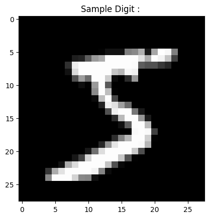
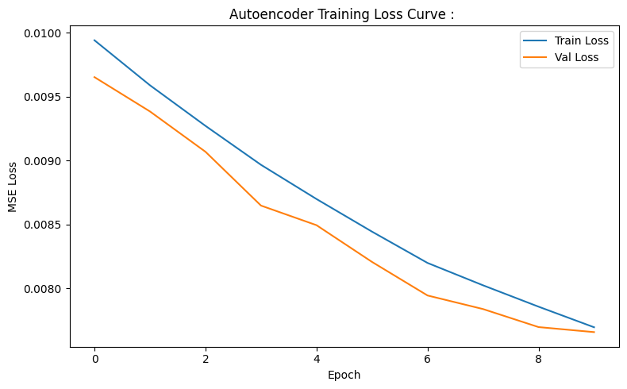
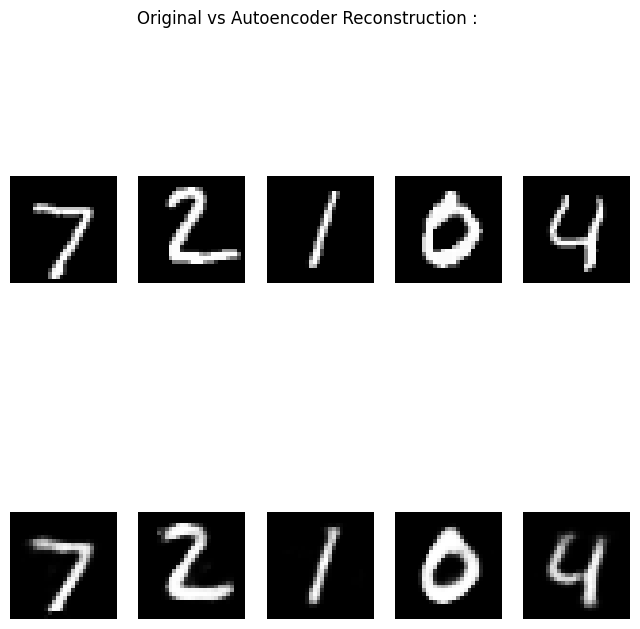

# Non-linear Feature Compression : 

---

## Problem : 

Learn a compressed representation of high-dim image data while preserving maximum reconstructive information, and compare it against the linear baseline of PCA.

Dataset: MNIST handwritten digits. Each sample is a 28x28 grayscale image, flattened into a vector :

$$x \in \mathbb{R}^{784}$$

Goal : Learn a compact latent representation :

$$z \in \mathbb{R}^{32}$$

Such that the reconstructed output :

$$\hat{x} \approx x$$

This is an unsupervised representation learning problem. No labels are used at any point during training.

---

## Feature Compression Significance : 

Raw pixel space is a poor working space. 784 dimensions sounds manageable, but the actual information content of handwritten digits is far lower. Strokes, curves, and loops live on a smooth low-dimensional manifold embedded inside that 784-dimensional space. 
Most pixels are empty black background.

Working in raw pixel space causes : 

- Distance concentration : all pixel vectors look roughly equidistant, making similarity-based methods unreliable.
- Slow optimization : more parameters, more gradient steps, slower convergence.
- Large memory footprint : storing full-resolution representations at every layer.
- Poor generalization : models fit pixel-level noise rather than digit structure.

Compression forces the model to discover what actually matters. Once a good compressed representation exists, every downstream task such as classification, retrieval, anomaly detection, and generation becomes easier and cheaper.

---

## EDA : 

Before building anything, it is worth understanding what the raw data looks like in pixel space.

Each image is a 28x28 grid of grayscale intensity values in $[0, 255]$, normalized to $[0, 1]$ before processing. 
The digit occupies a small central region and the surrounding pixels are near-zero background. 

---

## Pipeline : 

1. Load MNIST and normalize pixel values to $[0, 1]$ by dividing by 255.
2. Flatten each 28x28 image to a 784-dimensional vector.
3. Build encoder and decoder networks.
4. Train autoencoder end-to-end using MSE reconstruction loss with Adam optimizer.
5. Track loss epoch by epoch on both train and validation sets.
6. Evaluate reconstruction MSE on held-out test set.
7. Fit PCA with 32 components on the same training data as a linear baseline.
8. Compare reconstruction MSE, training time, and inference latency.
9. Visualize original vs reconstructed digit pairs side by side.

---

## Linear Compression vs Nonlinear Compression : 

PCA performs linear projection :

$$z = W^\top x, \qquad \hat{x} = Wz = WW^\top x$$

The reconstruction lives in a flat $k$-dimensional subspace. If the data lies on a curved manifold, a flat plane is a poor approximation regardless of how well it is oriented.

Autoencoder learns nonlinear mappings instead :

$$z = f_\theta(x) \qquad \text{(encoder)}$$

$$\hat{x} = g_\phi(z) \qquad \text{(decoder)}$$

Where $f_\theta$ and $g_\phi$ are neural networks parameterized by $\theta$ and $\phi$. Neural networks with nonlinear activations can approximate arbitrary nonlinear functions, so the autoencoder can follow the curved manifold the data actually lives on. 
This is the core advantage over PCA, and is exactly why at the same latent dimension of 32, the autoencoder achieves lower reconstruction error.

---

## Latent Dimension : 

The latent dimension is the size of the bottleneck vector $z$. It is the number of coordinates used to describe each data point in a new, learned coordinate system.

For MNIST with latent dimension 32 :

- Raw  Data Space : 784 numbers per image, mostly redundant background pixels
- Latent Space : 32 numbers encoding stroke shape, thickness, angle, loop presence, etc.

The latent dimension is a direct control on the information bottleneck. Too large and the model memorizes the input without learning structure. 
Too small and the model cannot store enough information to reconstruct faithfully. Choosing it is a Bias-Variance tradeoff in representation space.

---

## Architecture : 

The autoencoder is a symmetric bottleneck network built with fully connected layers.

**Encoder (compression) :**

$$784 \xrightarrow{\text{ReLU}} 256 \xrightarrow{\text{ReLU}} 64 \xrightarrow{\text{linear}} 32$$

**Decoder (reconstruction) :**

$$32 \xrightarrow{\text{ReLU}} 64 \xrightarrow{\text{ReLU}} 256 \xrightarrow{\text{sigmoid}} 784$$

The encoder compresses step by step, learning increasingly abstract representations at each layer. The decoder expands step by step, reconstructing spatial detail from the abstract code. 
The two halves are mirrors of each other which match capacity ensures the decoder can invert what the encoder does.

---

## Activation Functions : 

**Hidden layers : ReLU**

$$\text{ReLU}(a) = \max(0, a)$$

ReLU is used in all hidden layers for three reasons. First, it introduces the nonlinearity that separates autoencoders from PCA; without it, the entire encoder-decoder stack collapses to a linear transformation. 
Second, it produces sparse activations; neurons with negative pre-activations output exactly zero, creating sparse internal representations that generalize well. 
Third, it avoids the vanishing gradient problem; its gradient is either 0 or 1, never exponentially small, keeping gradients healthy through many layers.

**Output layer : Sigmoid**

$$\sigma(a) = \frac{1}{1 + e^{-a}}$$

Sigmoid is used only at the output because pixel intensities live in $[0, 1]$ after normalization. Sigmoid squashes any real-valued output into this range, ensuring reconstructed pixel values are valid. This is a data-dependent design decision; the output activation is always chosen to match the range of the target variable.

**Latent layer : No activation (linear)**

The latent layer has no activation function, allowing latent codes to take any real value. This gives the encoder full freedom to organize the latent space without artificial constraints. Applying ReLU here would force all latent coordinates to be non-negative, unnecessarily restricting the geometry of the learned representation.

---

## Math : 

**Encoder forward pass :**

$$h_1 = \text{ReLU}(W_1 x + b_1)$$

$$h_2 = \text{ReLU}(W_2 h_1 + b_2)$$

$$z = W_3 h_2 + b_3$$

**Decoder forward pass :**

$$h_3 = \text{ReLU}(W_4 z + b_4)$$

$$h_4 = \text{ReLU}(W_5 h_3 + b_5)$$

$$\hat{x} = \sigma(W_6 h_4 + b_6)$$

**Reconstruction loss (MSE) :**

$$\mathcal{L}(\theta, \phi) = \frac{1}{N} \sum_{i=1}^{N} \|x^{(i)} - \hat{x}^{(i)}\|^2$$

The loss measures average squared pixel-wise error between original and reconstructed images. The optimization objective is:

$$\min_{\theta,\, \phi} \;\; \mathcal{L}(\theta, \phi)$$

Both encoder weights $\theta$ and decoder weights $\phi$ are optimized jointly via backpropagation.

---

## Training Parameters : 

**Epochs (10) :** One epoch is a full pass through all 60,000 training images. The validation loss curve after each epoch reveals whether the model is still improving or has plateaued.

**Batch size (256) :** Rather than computing the gradient on the full dataset (too slow) or one sample at a time (too noisy), batches of 256 images produce one gradient update each. This is minibatch SGD; balancing efficiency with gradient quality.

**Optimizer (Adam) :** Adam maintains per-parameter momentum (first moment) and per-parameter squared gradient estimates (second moment), using them to scale updates individually:

$$m_t = \beta_1 m_{t-1} + (1 - \beta_1) g_t$$

$$v_t = \beta_2 v_{t-1} + (1 - \beta_2) g_t^2$$

$$W \leftarrow W - \frac{\eta}{\sqrt{v_t} + \epsilon} \cdot \hat{m}_t$$

This makes Adam robust to features with different gradient scales, which matters here because different layers operate at very different activation magnitudes.

**Shuffle (True) :** Data is reshuffled before each epoch so the model never sees the same batch composition twice, preventing sequence-level overfitting.

**Validation data :** The test set is monitored after each epoch without gradient updates. If training loss keeps dropping but validation loss stops improving, the model is overfitting and early stopping should be applied.

---

## Backpropagation :

Backpropagation computes the gradient of the loss with respect to every weight by applying the chain rule layer by layer from output to input.

**Step 1 —> Output gradient :**

$$\delta_{\text{out}} = \frac{2}{N}(\hat{x} - x) \odot \hat{x}(1 - \hat{x})$$

The first term is the MSE gradient. The second term $\hat{x}(1-\hat{x})$ is the sigmoid derivative. $\odot$ denotes elementwise multiplication.

**Step 2 —> Propagate through decoder :**

$$\delta_{h_4} = (W_6^\top \,\delta_{\text{out}}) \odot \mathbf{1}[h_4 > 0]$$

$$\delta_{h_3} = (W_5^\top \,\delta_{h_4}) \odot \mathbf{1}[h_3 > 0]$$

$$\delta_z = W_4^\top \,\delta_{h_3}$$

The term $\mathbf{1}[h > 0]$ is the ReLU derivative; it passes the gradient where the pre-activation was positive and zeros it where the neuron was inactive.

**Step 3 —> Propagate through encoder :**

$$\delta_{h_2} = (W_3^\top \,\delta_z) \odot \mathbf{1}[h_2 > 0]$$

$$\delta_{h_1} = (W_2^\top \,\delta_{h_2}) \odot \mathbf{1}[h_1 > 0]$$

**Step 4 —> Weight gradients :**

$$\nabla_{W_k} \mathcal{L} = \delta_k \cdot h_{k-1}^\top$$

**Step 5 —> Weight update via Adam :**

$$W_k \leftarrow W_k - \eta \cdot \text{Adam}(\nabla_{W_k} \mathcal{L})$$

Why does this make the decoder learn to reconstruct? Every update nudges weights in the direction that reduces reconstruction error on the current batch. The decoder has no choice but to learn to invert the encoder's compression — that is the only way to keep $\mathcal{L}$ going down. The encoder simultaneously learns to compress in a way that makes the decoder's job possible. 
They co-adapt through the single shared loss signal.

---

## The Bottleneck : 

Because :

$$\dim(z) = 32 \ll \dim(x) = 784$$

The network cannot copy the input through the bottleneck. It is forced to discard information. The information it discards is whatever cannot be reconstructed; pixel noise, background variation, irrelevant positional jitter. 
The information it retains is whatever is most consistent and predictable across examples: the structural patterns of digit strokes.

This is why autoencoders generalize. The compression constraint acts as an implicit regularizer. The model cannot memorize individual examples because the bottleneck prevents it from storing them in full detail.

---

## Epochwise Training Progress : 

Training and validation loss decrease together epoch by epoch, confirming the model is learning genuine structure.

| Epoch | Train Loss | Val Loss |
|-------|------------|----------|
| 1 | 0.0545 | 0.0289 |
| 2 | 0.0236 | 0.0195 |
| 3 | 0.0180 | 0.0162 |
| 4 | 0.0155 | 0.0141 |
| 5 | 0.0139 | 0.0130 |
| 6 | 0.0129 | 0.0121 |
| 7 | 0.0121 | 0.0116 |
| 8 | 0.0114 | 0.0109 |
| 9 | 0.0108 | 0.0104 |
| 10 | 0.0103 | 0.0102 |

The sharpest drop happens between epoch 1 and 2 where the model learns the dominant stroke structure almost immediately. 
After epoch 5 the curve flattens, with each subsequent epoch giving diminishing returns. 
The gap between train loss and val loss is extremely tight throughout, converging to nearly zero by epoch 10 (0.0103 vs 0.0102). 

This confirms strong generalization with no meaningful overfitting.

---

## Time and Space Complexity : 

Let :
- $N$ = number of training samples (60,000)
- $d$ = input dimension (784)
- $h$ = peak hidden width (256)
- $k$ = latent dimension (32)
- $E$ = number of epochs (10)

**Training complexity :**

$$O(E \cdot N \cdot d \cdot h)$$

At each epoch, every sample passes through all layers. Each dense layer of width $h$ receiving a $d$-dimensional input requires $O(d \cdot h)$ operations. Multiplied across $N$ samples and $E$ epochs. GPU acceleration is essential at this scale.

**Inference complexity per sample :**

$$O(d \cdot h)$$

One forward pass through encoder and decoder. Constant in $N$; scales freely to any dataset size at serving time.

**Space complexity :**

$$O(d \cdot h + h \cdot k)$$

Parameter storage for all weight matrices. The dominant term is the input layer: $784 \times 256 = 200{,}704$ weights. Total parameters across all six layers is approximately 270,000, pretty small by modern standards.

**Comparison with PCA at the same latent dimension :**

| | Training | Inference | Space |
|--|----------|-----------|-------|
| PCA | $O(Nd^2 + d^3)$ | $O(dk)$ | $O(d^2)$ |
| Autoencoder | $O(E \cdot N \cdot d \cdot h)$ | $O(dh)$ | $O(dh + hk)$ |

PCA fits faster via closed-form eigendecomposition. The autoencoder requires gradient optimization but captures nonlinear structure, translating directly to lower reconstruction MSE at the same latent dimension.

---

## Comparison Table : 

| Model | Latent Dim | Reconstruction MSE | Training Time | Inference Latency |
|-------|------------|--------------------|---------------|-------------------|
| Autoencoder | 32 | 0.010182 | 56.863815s | 0.000093s |
| PCA | 32 | 0.016828 | 0.791846s | 0.000006s |

The autoencoder achieves lower reconstruction MSE because its nonlinear encoder-decoder follows the curved digit manifold. PCA projects onto the best flat subspace, which is a strictly worse approximation of curved structure.

---

## Reconstruction Visualization : 

1st row : Original test digits. 
2nd row : Autoencoder reconstructions.

Reconstructed digits are visually recognizable and structurally faithful; stroke shapes, digit identity, and proportions are preserved. Reconstructions appear slightly blurred, which is a known artifact of MSE loss. 
MSE optimizes for average pixel accuracy and therefore produces smooth outputs rather than sharp edges. This is not failure; it is the consequence of minimizing squared error under reconstruction uncertainty. 
Perceptual losses or adversarial training produce sharper outputs but are more complex to train.

---

## Failure Case Analysis : 

**Latent dimension too small :** If $\dim(z)$ is reduced to 4 or 8, the bottleneck is too tight. The model cannot distinguish all digit classes; reconstructions become blurry averages and digit identity collapses.

**Latent dimension too large :** If $\dim(z)$ approaches $d$, the bottleneck vanishes. The model learns a near-identity mapping, copying input through without compression. Reconstruction is perfect but the representation carries no useful structure for downstream tasks.

**MSE loss causes blurry outputs :** For ambiguous pixel regions, the MSE-optimal solution is the pixel-wise mean across plausible reconstructions, which is inherently blurry.

**Out-of-distribution inputs :** The decoder will try to reconstruct anything as a digit-shaped image, since that is all it has ever learned. The model has no mechanism to detect OOD inputs.

**Unstable training :** Too high a learning rate causes gradient explosions in early epochs and the loss diverges. Too low a learning rate stalls training for many epochs. Adam mitigates this but does not eliminate it entirely.

**Overfitting on small datasets :** On small datasets, the autoencoder memorizes training examples rather than learning general structure. Dropout helps regularize this.

---

## Key Takeaways : 

- Autoencoders learn nonlinear compression by jointly training an encoder and decoder to minimize reconstruction error through a bottleneck.
- The latent dimension is the fundamental tradeoff lever: larger gives better reconstruction, smaller forces better abstraction.
- The bottleneck is the regularizer. Compression pressure is what drives the model to discover structure rather than memorize inputs.
- ReLU in hidden layers is what separates autoencoders from PCA. Without nonlinear activations the entire stack collapses to a linear projection.
- Backpropagation propagates reconstruction error jointly through decoder and encoder, forcing both halves toward a compressed representation.
- PCA is faster and closed-form. Autoencoders are slower but strictly more expressive.
