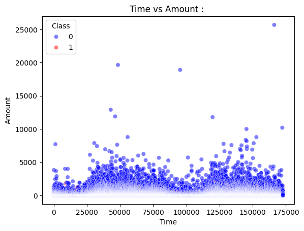
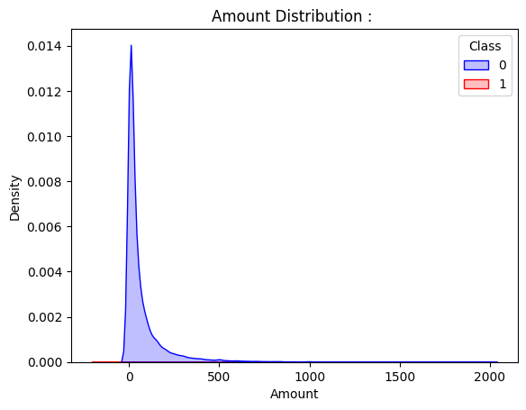
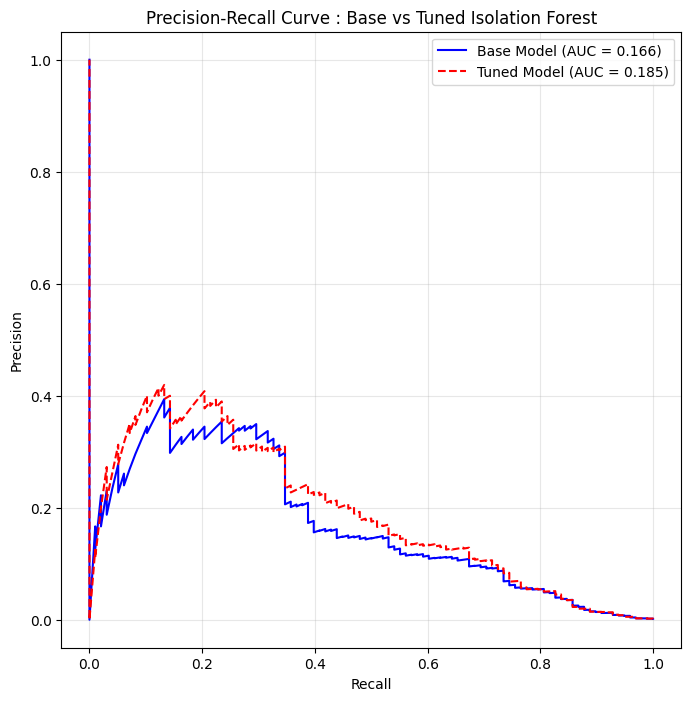

# Credit Card Anomaly Detection  : 

---

## Problem Statement : 

Detect fraudulent credit card transactions in a heavily imbalanced dataset using unsupervised anomaly detection. 
The model must isolate fraudulent behavior purely through structural data partitioning(no labels are used).

**Input features :**

- V1 to V28: PCA-transformed continuous variables (original features anonymized).
- Time : Seconds elapsed since the first transaction in the dataset.
- Amount : Transaction value in euros.

**Target :** `Class` : 0 = Normal, 1 = Fraud.

This is a strict unsupervised anomaly detection problem. Accuracy and ROC-AUC are misleading metrics under extreme class imbalance. 
The correct evaluation metric is Precision-Recall AUC (PR-AUC).

---

## Dataset : 

Source: Kaggle Credit Card Fraud Detection dataset by the ULB Machine Learning Group.

| Property | Value |
|----------|-------|
| Total transactions | 284,807 |
| Total features | 30 |
| Fraud instances | 492 (0.172%) |
| Normal instances | 284,315 (99.828%) |

The fraud rate of 0.172% is the defining challenge of this problem. It shapes every decision; from which model to use, to how to evaluate it, to how to set the contamination parameter.

---

## Pipeline : 

1. Load dataset and inspect class distribution and anomaly ratio.
2. EDA : Time vs Amount scatter, Amount distribution by class. 
3. Preprocessing : Drop `Time` column (monotonically increasing noise).
4. Apply RobustScaler to `Amount` (right-skewed, outlier-heavy).
5. Train/test split with stratification to preserve fraud ratio.
6. Train Base Isolation Forest with default parameters.
7. Train Tuned Isolation Forest with domain-informed parameters.
8. Evaluate both models on PR-AUC, Precision, Recall, F1.
9. Plot Precision-Recall curves for both models.
10. Compare training time and inference latency.

---

## Properties of Anomalies : 

Every anomaly detection method rests on assumptions about what makes an anomaly different from normal data. Isolation Forest is built on exactly two :

**Property 1: Anomalies are few.**
Fraudulent transactions make up 0.172% of this dataset. Anomalies are a small minority in any realistic setting. This is not just a dataset artifact; it is a defining characteristic of the problem. If anomalies were common, they would not be anomalies.

**Property 2: Anomalies are different.**
Fraud transactions occupy regions of feature space that are sparse and distant from the dense cluster of normal transactions. They are not merely slightly unusual; they are structurally isolated points with low probability under the normal data distribution.

These two properties have a direct geometric consequence : Anomalies are **easy to isolate**.
We need very few random cuts to wall off a point that is already far from everything else. Normal points sitting inside a dense cluster require many cuts before they are separated from their neighbors.
Isolation Forest turns this observation into an algorithm.

---

## Shortcomings of Distance-Based or Clustering-Based Methods : 

Before building the model, it is worth understanding why simpler approaches fail here; 

**Distance-based methods (for eg KNN):** Compute the distance from each point to its $k$ nearest neighbors. Points far from their neighbors are flagged. Works in low dimensions but breaks down here because V1-V28 are 28-dimensional PCA features. 
In high dimensions, all pairwise distances concentrate around the same value — there is no meaningful "far" vs "close." The method also requires computing distances to all training points at inference time, which is $O(N \cdot d)$ per query, very slow for streaming fraud detection at scale.

**Clustering-based methods (for eg DBSCAN):** Flag points that do not belong to any cluster as anomalies. Fails under class imbalance because the massive cluster of normal transactions dominates. 
Fraud points that are geographically adjacent to the normal cluster get absorbed into it. Also sensitive to the choice of $\epsilon$ and $\text{minPts}$, which require labeled data to tune properly thus defeating the purpose of unsupervised detection.

Isolation Forest sidesteps both problems. It does not compute distances. It does not form clusters. It exploits **Isolation Depth** directly.

---

## EDA : 

### Time vs Amount : 



`Time` is a monotonically increasing counter; it encodes the order of transactions, not any periodic signal. 
Fraud transactions show no temporal clustering; they are spread uniformly across the time axis. Including `Time` as a feature forces the algorithm to waste random splits on a variable with no discriminative content. It is dropped entirely.

### Amount Distribution : 



Transaction amounts show extreme right skew. A massive density spike sits near zero, with a sparse tail extending beyond 25,000. 
This is a textbook case for RobustScaler; standard scaling uses the mean and standard deviation, both of which are heavily distorted by extreme outliers. Robust scaling uses the median and IQR instead, centering the bulk of the distribution without being pulled by the tail, while leaving the tail values exposed as true structural outliers.

Note : V1-V28 are already PCA-transformed and do not require scaling. Only `Amount` is scaled.

### Anomaly Ratio : 

```
Fraud rate: 0.172%
Normal rate: 99.828%
```

This ratio directly informs the `contamination` parameter of the tuned model.

---

## Isolation Forest : Architecture and Intuition

### The Isolation Tree : 

An Isolation Tree (iTree) is a binary tree built by recursively applying random splits to the data :

1. Select a feature $q$ uniformly at random from all available features.
2. Select a split threshold $p$ uniformly at random between the minimum and maximum values of $q$.
3. Partition the data : points with $q < p$ go left, points with $q \geq p$ go right.
4. Recurse on each partition until every point is isolated or maximum tree depth is reached.

The key insight is that randomness is not a weakness; it is the mechanism. Because splits are random, a point in a sparse region of feature space (an anomaly) will be isolated quickly; the very first random cut is likely to separate it from everything else. 
A point deep inside a dense cluster requires many cuts before it is alone. The depth at which a point is isolated is the signal.

### The Ensemble : 

A single isolation tree has high variance which may lead to OverFitting; the randomness means any individual tree may produce unreliable depths. Isolation Forest builds $t$ trees (default 100, tuned to 300 here) and averages the isolation depth of each point across all trees. 
The ensemble reduces variance while preserving the fundamental isolation signal. This is the same bias-variance logic as Random Forest, applied to path lengths instead of class predictions.

### The BST Isomorphism : 

Random partitioning of continuous data behave like a BST. This is because both operations produce the same recursive halving structure.
A BST with $n$ randomly inserted keys produces a tree where the expected search depth for any key is $O(\log n)$. An isolation tree randomly splitting $n$ data points produces a tree with identical expected structure. 
This isomorphism is not cosmetic; it allows the derivation of a theoretical baseline for what the expected path length of a normal point should be, which is used to normalize the anomaly score.

---

## Sub-sampling:  ($\psi = 256$)

Isolation Forest does not train on the full dataset. It draws a small sub-sample of size $\psi$ (psi) for each tree. The default and theoretically optimal value is $\psi = 256$.

**Swamping :** When $\psi$ is too large, dense normal clusters are represented by many points in each tree. These dense neighborhoods force deeper splits even for mildly anomalous points at the cluster boundary. Normal points "bleed" into anomaly territory. Smaller $\psi$ prevents this by limiting how many normal points can accumulate around any potential anomaly.

**Masking :** When anomalies form small micro-clusters (as fraud often does; certain fraud patterns recur), a large $\psi$ includes many members of that cluster in each tree. The anomalies look structurally "normal" relative to each other and receive deep path lengths. Small $\psi = 256$ breaks up these micro-clusters; with only 256 samples drawn, it is unlikely that many members of a small fraud cluster co-appear in the same tree, so each fraud point is isolated as if it were alone.

The value 256 was established empirically and theoretically in the original paper as the point where both swamping and masking are minimized simultaneously.

---

## Path Length and Anomaly Score Calculation : 

### Path Length $h(x)$ : 

For a single isolation tree, the path length $h(x)$ of point $x$ is the number of edges traversed from the root to the node where $x$ is isolated. 
Short path = isolated quickly = likely anomaly. Long path = required many splits = likely normal.

When a point reaches an external node containing more than one sample (tree was stopped early due to depth limit), the remaining path length is estimated rather than computed exactly.
This is where the BST baseline enters.

### Expected BST Search Cost $c(n)$ : 

For a BST built from $n$ randomly inserted keys, the expected number of comparisons for an unsuccessful search (i.e., finding where a new key would be inserted) is derived from the harmonic series.

The expected depth of insertion in a random BST of $n$ keys is :

$$\mathbb{E}[\text{depth}] = \sum_{i=1}^{n} \frac{2}{i} - \frac{2(n-1)}{n}$$

The sum $\sum_{i=1}^{n} \frac{1}{i}$ is the $n$-th harmonic number $H(n)$, which approximates as :

$$H(n) \approx \ln(n) + \gamma$$

where $\gamma = 0.5772\ldots$ is the Euler-Mascheroni constant.

Therefore the expected unsuccessful search cost in a random BST of $n$ nodes is :

$$c(n) = 2H(n-1) - \frac{2(n-1)}{n}$$

Expanding :

$$c(n) = 2(\ln(n-1) + 0.5772) - \frac{2(n-1)}{n}$$

This is the theoretical expected path length for a point drawn from the same distribution as the $n$ training points; i.e., a normal point.
It serves as the normalization baseline: if a point's actual average path length $E[h(x)]$ matches $c(n)$, it is behaving exactly like a normal point.

### Anomaly Score $s(x, n)$ : 

The anomaly score normalizes the observed path length against the baseline :

$$s(x, n) = 2^{-\dfrac{E[h(x)]}{c(n)}}$$

Where :
- $E[h(x)]$ is the mean path length of $x$ averaged across all $t$ trees.
- $c(n)$ is the expected path length baseline for sub-sample size $n = \psi$.

**Interpretation of Anomaly Score :**

| Condition | Score | Interpretation |
|-----------|-------|----------------|
| $E[h(x)] \to 0$ | $s \to 1$ | Isolated in very few splits -> definite anomaly |
| $E[h(x)] = c(n)$ | $s = 0.5$ | Average depth —> indistinguishable from normal |
| $E[h(x)] \to n-1$ | $s \to 0$ | Never isolated —> deeply embedded in dense cluster |

The score is bounded in $[0, 1]$. Points are flagged as anomalies when $s > 0.5$, or equivalently when the contamination threshold determines the top-$\psi$% of scores.

---

## Scaling is Not Needed (But We Scaled Anyway) : 

Isolation Forest makes random splits based on feature ranges, not distances. It is invariant to monotonic feature transformations; rescaling a feature stretches the range uniformly, and a random threshold within the rescaled range is equivalent to a random threshold within the original range. The tree structure is unchanged.

However, `Amount` was scaled with RobustScaler anyway, for one specific reason: the Amount column has extreme right skew. Without scaling, most random thresholds drawn uniformly between min and max of `Amount` would fall in the near-zero spike region, wasting splits on the uninteresting dense center.
Robust scaling compresses the bulk of the distribution into a tighter range, making random threshold selection more uniformly informative across the feature's actual variation.

---

## Contamination Parameter : 

`contamination` tells the model what fraction of the training data to treat as anomalies when determining the decision threshold.
It does not affect how trees are built but only where the score threshold is drawn when converting continuous anomaly scores to binary labels.

- `contamination = 'auto'` sets the threshold at the score value corresponding to the original paper's default, approximately 0.1 (10% of points flagged as anomalies). This is far too aggressive for a dataset where the true fraud rate is 0.172%.
- `contamination = known_contamination` sets it to the exact observed fraud rate from the training labels (`y_train.mean() = 0.00172`). This tells the model to flag approximately the same proportion of points as the true prevalence, dramatically reducing false positives.

Using the known fraud ratio as contamination is only possible because we have labels but in a truly unsupervised setting this would require domain knowledge or a calibration step.

---

## Hyperparameter Tuning(Manual) : 

| Parameter | Base | Tuned | Reasoning |
|-----------|------|-------|-----------|
| `n_estimators` | 100 | 300 | More trees reduce variance in path length estimates, stabilizing scores for borderline cases |
| `max_samples` | 'auto' | 256 | Theoretical optimum from the original paper; minimizes both swamping and masking |
| `contamination` | 'auto' | 0.00172 | Hardcoded to exact fraud prevalence; eliminates threshold miscalibration from default |

---

## Time, Space, and Prediction Complexity : 

Let:
- $n$ = training samples.
- $t$ = number of trees.
- $\psi$ = sub-sample size (256).
- $d$ = number of features.

**Training complexity :**

$$O(t \cdot \psi \cdot \log \psi)$$

Each tree is built on $\psi$ samples. Building a binary tree of $\psi$ samples takes $O(\psi \log \psi)$. Repeated for $t$ trees. Crucially, this is independent of $n$; training on 284,807 samples costs the same as training on 28,480 because each tree only ever sees 256 points. 
This is what makes Isolation Forest scale to massive datasets.

**Space complexity :**

$$O(t \cdot \psi)$$

Each tree stores at most $2\psi - 1$ nodes (a full binary tree over $\psi$ leaves). Total storage is $t$ such trees. Again independent of $n$.

**Prediction complexity per sample: **

$$O(t \cdot \log \psi)$$

Traversing one tree to find the path length is $O(\log \psi)$ ie the expected depth of the tree. Done for all $t$ trees and averaged. 
Independent of $n$ at inference time, which is why this algorithm is viable for real-time streaming fraud detection.

---

## Comparison Table : 

| Model | PR-AUC | Precision | Recall | F1 Score | Training Time (s) | Inference Latency (s) |
|-------|--------|-----------|--------|----------|-------------------|-----------------------|
| Base | 0.1658 | 0.0384 | 0.8367 | 0.0734 | 0.5244 | 0.000006 |
| Tuned | 0.1855 | 0.3091 | 0.3469 | 0.3269 | 6.3996 | 0.000130 |

The tuned model improves PR-AUC from 0.166 to 0.185 and dramatically improves Precision from 3.8% to 30.9%. The base model achieves high Recall (83.7%) but with catastrophically low Precision; it flags most transactions as fraud.
The tuned model trades some Recall for precision, producing a far more operationally useful detector.

Training time increases from 0.52s to 6.4s due to 3x more trees and the fixed $\psi = 256$ sub-sampling overhead. 
Inference latency remains practically zero — $O(t \log \psi)$; making this viable for real-time transaction scoring.

---

## Metrics : 

In a dataset with 99.83% normal transactions, a model that labels every transaction as normal achieves 99.83% accuracy. 
ROC-AUC is similarly inflated as the massive true negative count (correctly labeled normal transactions) makes the false positive rate always appear small regardless of how many frauds are missed.

PR-AUC evaluates the tradeoff between Precision and Recall across all possible score thresholds, without reference to true negatives. 
It measures exactly what matters operationally: of the transactions the model flags, how many are actually fraudulent, and of all actual frauds, how many does the model catch. 

A random classifier on this dataset achieves a PR-AUC of approximately 0.0017 (the fraud base rate). Both models significantly exceed this baseline.

### Precision-Recall Curve : 



The tuned model (red dashed) maintains higher precision than the base model (blue solid) across the low-to-mid recall range, where operational use cases typically live.
At very high recall (catching nearly all frauds), both models converge; catching the last few frauds requires flagging increasingly many normal transactions regardless of tuning.

---

## Failure Case Analysis : 

**Axis-aligned bias :** Isolation Forest only makes orthogonal splits; cuts parallel to feature axes. If an anomaly's distinguishing characteristic lies along a diagonal direction in feature space (e.g., fraud is identified by a specific combination of V1 and V2 but not either alone), the model requires many "staircase" cuts to isolate it, inflating its apparent path length and lowering its anomaly score. Extended Isolation Forest addresses this with rotated hyperplane splits.

**Local anomalies adjacent to dense clusters :** A fraud transaction that happens to be geometrically close to the dense normal cluster receives long path lengths because the surrounding normal points absorb many splits before the fraud is isolated. Isolation Forest is a global method; it has no mechanism to reason about local density.

**High-dimensional irrelevant features :** Random feature selection means irrelevant features get chosen frequently in high-dimensional settings. If the true fraud signal lives in 3 features but there are 100 noise features, most splits are wasted on noise. The fraud point is never isolated along its truly anomalous dimensions. Feature selection or dimensionality reduction before Isolation Forest helps significantly.

**Contamination miscalibration :** The contamination parameter sets the decision threshold but not the underlying score distribution. If the true fraud rate differs significantly from the contamination value (e.g., fraud patterns shift over time), the threshold becomes miscalibrated and either precision or recall degrades without any signal from the model itself.

**Clustered fraud patterns :** When multiple frauds share the same behavioral signature (same amount range, similar feature values), they form micro-clusters. With large sub-samples, these clusters make fraud look structurally "normal" relative to each other thus the masking problem. The $\psi = 256$ sub-sample mitigates this but does not eliminate it for large, dense fraud clusters.

---

## Key Takeaways

- Isolation Forest exploits the two fundamental properties of anomalies — they are few and structurally different — to isolate them in fewer random splits than normal points.
- The anomaly score $s(x, n) = 2^{-E[h(x)]/c(n)}$ is theoretically grounded in BST search cost, giving a normalized, interpretable score in $[0, 1]$.
- Sub-sampling to $\psi = 256$ is not an approximation — it is a theoretically optimal choice that prevents both masking and swamping simultaneously.
- Training and inference complexity are both independent of $N$, the total dataset size. This is the property that makes Isolation Forest production-viable at massive scale.
- Accuracy and ROC-AUC are invalid under extreme class imbalance. PR-AUC is the correct metric — it ignores true negatives and focuses entirely on the quality of positive detections.
- The contamination parameter sets the decision threshold, not the score distribution. Setting it to the true fraud prevalence dramatically improves operational precision without touching the underlying model.
- RobustScaler on `Amount` is not required by the algorithm — it improves random threshold sampling efficiency by compressing the skewed distribution into a range where uniform random splits are more informative.
