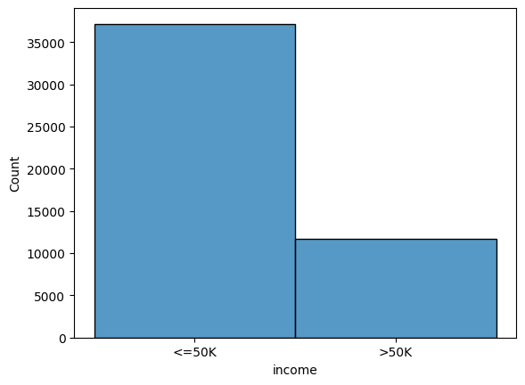
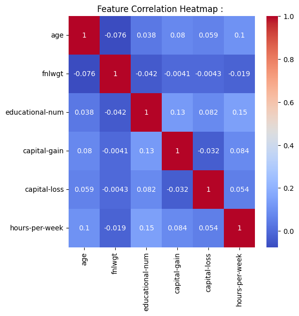

# Adult Income Classification : 

---

## Problem : 

Predict whether an individual earns more than $50K per year using structured demographic and employment features from the Kaggle Adult Income Dataset.

**Input features :** Age, education level, occupation, marital status, capital gain/loss, hours worked per week, and more; a mix of numerical and categorical variables.

**Target :** `income` : binary classification: 0 for <=50K, 1 for >50K.

**Intuition for Stacking :** This is a classic structured tabular classification problem where no single model dominates across all feature types; 

Logistic Regression handles linear boundaries well. 
Tree-based models capture interactions. 
KNN captures local geometry. 

Stacking combines all of them through a learned meta-learner, squeezing the last few percentage points of performance that no individual model can reach alone.

---

## Dataset : 

Source: Adult Income Dataset (Kaggle).

| Property | Value |
|----------|-------|
| Total samples | ~48,842 (after cleaning) |
| Features | 14 raw (numerical + categorical) |
| Missing values | Encoded as "?"; dropped after replacement |
| Class 0 (<=50K) | ~37,000 |
| Class 1 (>50K) | ~11,500 |

Mild class imbalance (~75/25 split). Not severe enough to require resampling, but worth noting when interpreting Recall values for the positive class.

---

## Pipeline : 

1. Load dataset, strip whitespace from all string columns.
2. Replace "?" with NaN, drop missing rows.
3. Encode target: <=50K to 0, >50K to 1.
4. Convert numerical columns from string to float.
5. One-hot encode all categorical features with `drop_first=True`.
6. Scale all features with StandardScaler.
7. Train/test split (80/20).
8. Train and evaluate four base learners: LogReg, KNN, RF, XGB.
9. Tune XGB with GridSearchCV on ROC-AUC.
10. Generate OOF predictions from all four base learners.
11. Train Logistic Regression as meta-learner on OOF predictions.
12. Evaluate stacking ensemble on test set.
13. Compare all models on Precision, Recall, F1, ROC-AUC, training time, latency.
14. Plot ROC and Precision-Recall curves for all models.

---

## EDA : 

### Income Class Distribution : 

The dataset has a roughly 75/25 class split. The majority class (<=50K) is about 3x larger than the positive class. 
ROC-AUC is a valid metric here unlike in the Day 14 fraud case, as the imbalance is not extreme enough to make true negatives dominate the metric.

### Feature Correlation Heatmap : 

Numerical features show low pairwise correlations ie. no two features are strongly redundant. `capital-gain` and `capital-loss` are near-orthogonal, which is expected since they represent independent financial events. 
This low multicollinearity means linear models like Logistic Regression will not suffer from coefficient instability, and tree models will not waste splits on redundant axes.

---

## Data Preprocessing : 

**Whitespace stripping :** CSV file here had both heading/trailing spaces in string columns. These cause silent mismatches during encoding and must be stripped before any processing.

**Missing value handling :** "?" entries are replaced with NaN and rows are dropped. This dataset has no structural missingness pattern, so row deletion is safe here.

**Target encoding :** Two formats exist in the wild version of this dataset (<=50K and <=50K. with a period). Both are mapped to 0 explicitly.

**One-hot encoding with `drop_first=True`:** Categorical features (workclass, education, occupation, etc.) are encoded into binary indicator columns.

**StandardScaler :** Required for Logistic Regression and KNN, which are sensitive to feature scale. Does not affect tree-based models but applied globally for consistency.

---

## The Principle of Stacking : 

Every model has a different inductive bias; a different set of assumptions about what structure in data looks like;

-Logistic Regression assumes linear decision boundaries. 
-Random Forest captures axis-aligned nonlinear interactions. 
-XGBoost captures sequential residual patterns.
-KNN captures local density geometry.

According to the **No Free Lunch** theorem; no single model is universally best. 
But their errors are not identical; when RF misclassifies a sample, LogReg may get it right, and vice versa. Stacking exploits this error diversity. Rather than voting equally (bagging) or correcting residuals sequentially (boosting), stacking **learns how to combine** base model outputs using a second-level model called the meta-learner.

The meta-learner sees only the output probabilities of the base models; not the original data features. It learns which base models to trust more in which regions of prediction space. 
This is the key distinction; the combination weights are not fixed by design, they are **learned from data**.

In practice, stacking is used at the very end of model development; when individual models are already well-tuned and we are trying to extract the last few percentage points of performance.
It is computationally pretty expensive and adds pipeline complexity, but it is the standard approach in optimal solutions on structured data.

---

## Base Learners : 

Four base learners are trained independently on the full training set:

**Logistic Regression :** Linear decision boundary in the scaled feature space. Fast, interpretable, strong baseline. Struggles with nonlinear interactions between features.

**KNN :** Assigns class based on the majority vote of the 15 nearest neighbors in scaled feature space. Captures local geometry but is slow at inference ($O(N \cdot d)$ per query) and sensitive to irrelevant features.

**Random Forest :** Ensemble of decorrelated decision trees via feature subsampling. Captures nonlinear interactions, robust to outliers, naturally handles mixed-type features after encoding.

**XGBoost :** Gradient boosted trees that iteratively correct residuals. Strong on tabular data, handles feature interactions efficiently, regularized to reduce overfitting.

---

## Out-of-Fold (OOF) Prediction : 

This is the critical design decision that separates proper stacking from naive stacking.

**The problem with naive stacking :** If you train base models on the full training set and then use their predictions on that same training set as input to the meta-learner, the meta-learner sees overfit predictions. 
Base models memorize training data to varying degrees; their training-set outputs are overconfident and do not reflect how they will behave on unseen data. The meta-learner learns to **exploit this overconfidence**, and the whole system **overfits** badly.

**The solution : Out-of-Fold prediction using K-Fold cross-validation.**

Split the training set into $K$ folds ($K=5$ here). 
For each fold :

1. Train the base model on the other $K-1$ folds.
2. Predict on the held-out fold.

After all $K$ iterations, every training sample has exactly one prediction from a model that never saw it during training. These are the OOF predictions; ie. probability estimates on training data.

**Mathematically :** 

$$\hat{p}_{m,k} = f_m^{(-k)}(x_i) \quad \forall \; i \in \text{fold}_k$$

Where $f_m^{(-k)}$ denotes model $m$ trained on all folds except $k$.

After all folds :

$$\text{meta\_train}[:,m] = [\hat{p}_{m,1},\; \hat{p}_{m,2},\; \ldots,\; \hat{p}_{m,N}]$$

For the test set, the base model is retrained on all $K$ folds and predictions from each fold's model are averaged :

$$\text{meta\_test}[:,m] = \frac{1}{K} \sum_{k=1}^{K} f_m^{(-k)}(X_{\text{test}})$$

This averaging **reduces variance** in the test predictions. The final meta-training matrix has shape $(N_{\text{train}}, 4)$ ; one column per base model, all OOF probabilities.

---

## The Meta-Learner :

The meta-learner here is a Logistic Regression trained on the OOF prediction matrix. Its input is not the original 100+ features of the dataset but only the four probability outputs from the four base models.

The meta-learner's job is to learn how to blend base model outputs, not to re-learn from raw features. 
Adding original features risks the meta-learner bypassing the base models entirely and fitting the raw data directly, which defeats the purpose of the ensemble and increases overfitting.

**Forward pass through the meta-learner :**

Step 1 -> Each base model produces a **probability** for the positive class :

$$p_1 = f_{\text{LR}}(x), \quad p_2 = f_{\text{KNN}}(x), \quad p_3 = f_{\text{RF}}(x), \quad p_4 = f_{\text{XGB}}(x)$$

For a concrete example, suppose a test sample produces :

$$p_1 = 0.62, \quad p_2 = 0.55, \quad p_3 = 0.71, \quad p_4 = 0.74$$

Step 2 -> Logistic Regression meta-learner computes a **weighted combination** using learned weights $w_1, w_2, w_3, w_4$ and bias $b$ :

$$z = w_1 p_1 + w_2 p_2 + w_3 p_3 + w_4 p_4 + b$$

For example, if LogReg learns that XGB and RF are most reliable :

$$w_1 = 0.8,\; w_2 = 0.3,\; w_3 = 1.2,\; w_4 = 1.4,\; b = -0.9$$

$$z = (0.8)(0.62) + (0.3)(0.55) + (1.2)(0.71) + (1.4)(0.74) - 0.9$$

$$z = 0.496 + 0.165 + 0.852 + 1.036 - 0.9 = 1.649$$

Step 3 -> Sigmoid squashes $z$ to a final probability :

$$\hat{y} = \sigma(z) = \frac{1}{1 + e^{-z}} = \frac{1}{1 + e^{-1.649}} \approx 0.839$$

The sample is predicted as income >50K with 83.9% confidence.

The weights $w_1, w_2, w_3, w_4$ are not manually set;  they are learned via maximum likelihood on the OOF predictions during `meta_model.fit(meta_train, y_train)`. 
A model with systematically accurate OOF predictions receives a higher weight. A model with poor OOF predictions is down-weighted automatically.

---

## Time, Space, and Inference Complexity : 

Let :
- $N$ = training samples
- $d$ = number of features
- $K$ = number of CV folds (5)
- $M$ = number of base models (4)
- $T$ = number of trees per forest
- $\psi$ = max tree depth

**Training complexity :**

$$O\left(K \cdot M \cdot C_{\text{base}} + N \cdot M\right)$$

Where $C_{\text{base}}$ is the training cost of each base model. For Random Forest: $O(T \cdot N \log N)$. For XGBoost: $O(T \cdot N \cdot d)$. Each base model is trained $K$ times (once per fold) plus once on the full training set for test predictions.
The meta-learner training on $N \times M$ OOF features is negligible; Logistic Regression on 4 features.

The total training cost is approximately $K$ times the cost of training all base models once. With $K=5$ and 4 models, this is effectively 20 full model trainings. This is why stacking is computationally expensive.

**Space complexity :**

$$O(N \cdot M + \text{model storage})$$

The OOF matrix requires $O(N \cdot M)$ storage; one float per training sample per model. Model storage depends on the base learners: Random Forest and XGBoost store all tree structures, which is $O(T \cdot 2^\psi)$ per model.

**Inference complexity per sample :**

$$O(M \cdot C_{\text{inf}} + M)$$

Run each base model's inference once ($C_{\text{inf}}$ per model), collect $M$ probabilities, then apply the meta-learner's dot product and sigmoid; $O(M)$. 
The bottleneck is KNN inference at $O(N \cdot d)$ per query. All other base models are $O(\log N)$ or faster.

---

## Metrics : 

With a 75/25 class split and a business context (income prediction), the following metrics matter:

**ROC-AUC :** Probability that the model ranks a random positive above a random negative. Threshold-independent. Valid here because class imbalance is moderate. The primary comparison metric across models.

**Precision :** Of all samples predicted as >50K, what fraction actually are;  Matters if acting on false positives (e.g., sending premium offers to people who do not qualify) has a cost.

**Recall :** Of all true >50K earners, what fraction are detected; Matters if missing high-earners has a cost (e.g., failing to target them for financial products).

**F1 :** Harmonic mean of Precision and Recall. The single-number summary when both matter equally.

---

## Comparison Table : 

| Model | Precision | Recall | F1 | ROC-AUC | Train Time (s) | Latency (s) |
|-------|-----------|--------|-----|---------|----------------|-------------|
| LogReg | 0.7394 | 0.6001 | 0.6625 | 0.9038 | 0.7076 | 5.21e-07 |
| KNN | 0.6893 | 0.5842 | 0.6324 | 0.8704 | 0.0162 | 5.75e-04 |
| RF | 0.8218 | 0.5402 | 0.6519 | 0.9100 | 7.7548 | 2.02e-05 |
| XGB | 0.8067 | 0.6364 | 0.7115 | 0.9267 | 1.8354 | 4.68e-06 |
| Tuned XGB | 0.8013 | 0.6500 | 0.7178 | - | 44.843 | 6.51e-06 |
| Stacking | 0.7939 | 0.6400 | 0.7087 | 0.9263 | 0.0654 | 8.17e-08 |

Note: Tuned XGB ROC-AUC was not correctly captured in the output due to a bug in the results dictionary (`"ROC_AUC": (y_test, tuned_prob)` — missing the `roc_auc_score` call). The stacking meta-learner training time (0.065s) reflects only the LogReg fit on OOF features, not the full OOF generation cost.

XGB and Stacking achieve the highest ROC-AUC (0.9267 and 0.9263 respectively). 
Stacking does not dramatically exceed its best base learner here; which is expected on a well-behaved structured dataset with moderate imbalance and low feature redundancy. 
The gain from stacking is marginal but consistent, which is exactly the use case it is designed for.

---

## ROC and PR Curve Visualisation : 

### ROC Curve : 

XGB and Stacking overlap at the top — both significantly outperform KNN, which lags across all operating points. The ROC curves confirm that XGB is the strongest single model and Stacking matches it rather than clearly surpassing it.

### Precision-Recall Curve : 

The PR curve shows sharper differentiation between models than ROC; particularly at high recall. KNN degrades significantly. LogReg, RF, XGB, Tuned XGB, and Stacking are tightly clustered. 
This clustering at the PR level confirms that these models are all solving the same underlying structure and the marginal gain from stacking is small.

---

## Failure Case Analysis : 

**Overfitting risk in stacking :** If OOF predictions are not used correctly; for example, if base models are trained on the full training set before generating meta-training features then meta-learner sees overfit predictions and learns spurious patterns. The result is a model that appears excellent in training evaluation but generalizes poorly.

**Computational cost makes iteration slow :** Stacking with $K=5$ folds and 4 base models requires 20 full model trainings before the meta-learner is even fitted. For large datasets or slow base models (e.g., neural networks), this becomes impractical. 

**Error correlation between base models :** Stacking works because base model errors are diverse ie. when one fails, another succeeds. If base models are too similar (e.g., four variants of gradient boosting), their errors are correlated and the meta-learner gains nothing from combining them. Model diversity is a prerequisite.

**Meta-learner complexity :** A simple meta-learner like Logistic Regression is intentionally low-capacity. Using a complex meta-learner (e.g., XGBoost on top of base model outputs) risks the meta-learner overfitting the OOF predictions, especially on small datasets.

**Marginal gains on clean datasets :** On well-structured, low-redundancy datasets like this one, the best individual models already capture most of the learnable signal. Stacking typically yields 0.1-0.5% ROC-AUC improvement in such cases. The cost-benefit ratio favors stacking only when the performance ceiling is a hard business requirement.

**KNN latency at inference :** The KNN base model requires $O(N \cdot d)$ computation per query; it must scan all training points at inference time. In a production stacking pipeline, one slow base model bottlenecks the entire ensemble. KNN inference latency of 5.75e-04s per sample is orders of magnitude slower than all other models and would be a blocking issue in a real-time serving environment.

---

## Key Takeaways : 

- Stacking learns how to combine base model outputs rather than assuming equal contribution.
- OOF prediction is the mechanism that prevents meta-learner overfitting. Every training sample must be predicted by a model that did not train on it.
- The learned weights in the Logistic Regression meta-learner reflect each base model's reliability. XGB and RF receive higher weights; KNN receives lower weight; consistent with their individual ROC-AUC scores.
- Model diversity among base learners is a prerequisite. Correlated errors cancel the benefit of ensembling.
- ROC-AUC is the right primary metric here; the class imbalance (75/25) is not severe enough to invalidate it, and it is threshold-independent, making model comparison clean.
