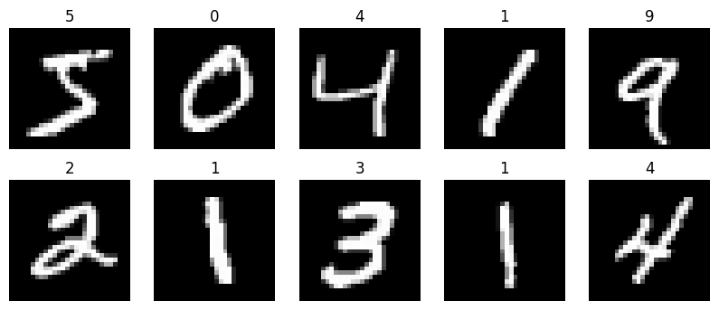
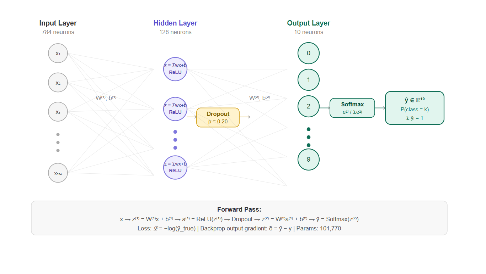
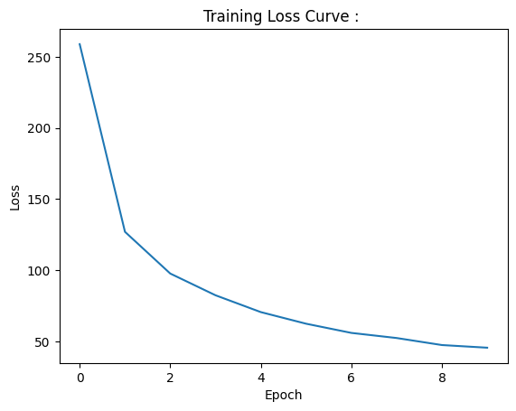
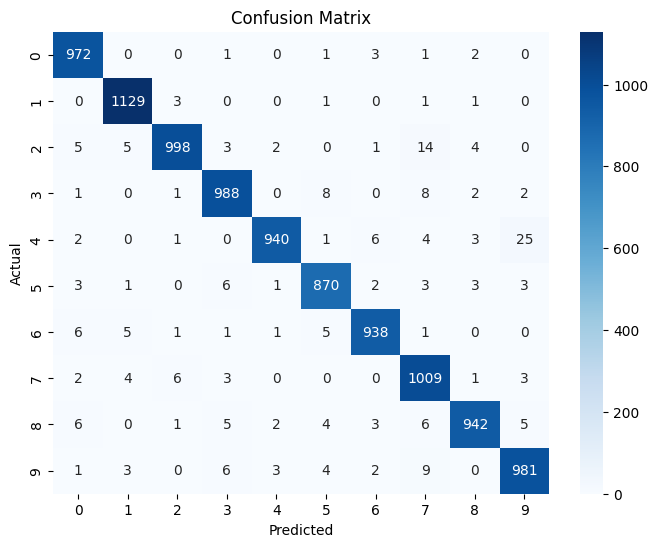
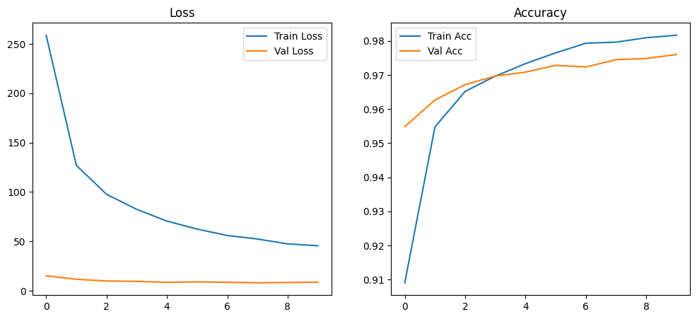

# MNIST Image Classification : 

---

## Problem :

Classify handwritten digit images into one of 10 categories (0 through 9).

**Input :** 28x28 GrayScale Image, flattened to a 784-dimensional vector :

$$x \in \mathbb{R}^{784}$$

**Output :** A probability distribution over 10 classes :

$$\hat{y} \in \mathbb{R}^{10}, \quad \sum_{i=0}^{9} \hat{y}_i = 1$$

This is a supervised Multi-Class Classification problem. Every pixel is a feature, every digit is a class, and the network must learn which pixel activation patterns correspond to which digit identity.

---

## Significance of Neural Network in this Problem : 

**Logistic Regression** and **SVMs** draw linear boundaries ie. they separate classes with a hyperplane. 
In **784-dimensional** pixel space, the boundary between a 3 and an 8 is not a flat plane. It involves combinations of stroke curvature, loop presence, and angular features that are **nonlinear functions of pixel intensities**.

A neural network stacks linear transformations with nonlinear activations. Each layer composes the previous one, building increasingly abstract representations :

- Layer 1 detects low-level patterns : edges, stroke directions.
- Deeper layers detect Complex Combinations : curves, loops, enclosed regions.
- The output layer maps these representations to class scores(logits).

This hierarchical composition is what makes neural networks the natural choice for pattern recognition in pixel data.

---

## Dataset : 

Source: MNIST;  the benchmark for digit recognition.

| Property | Value |
|----------|-------|
| Training images | 60,000 |
| Test images | 10,000 |
| Image size | 28x28 pixels |
| Pixel depth | 8-bit grayscale (0-255) |
| Classes | 10 (digits 0-9) |
| Class balance | Approximately equal across all classes |

### Class Distribution : 

The dataset is well-balanced across all 10 digit classes and each class has approximately 5,900 to 6,700 samples. No resampling or class weighting is needed.

---

## Pipeline : 

1. Load MNIST via torchvision datasets.
2. Normalize pixel values using dataset statistics ($\mu = 0.1307$, $\sigma = 0.3081$).
3. Flatten 28x28 images to 784-dimensional vectors.
4. Define ANN architecture: 784 → 128 (ReLU + Dropout) → 10 (Softmax).
5. Train with CrossEntropyLoss and Adam optimizer for multiple epochs.
6. Track training loss and accuracy per epoch.
7. Evaluate on test set: Accuracy, Precision, Recall, F1.
8. Plot confusion matrix and training curves.

---

## Data Preprocessing : 

**Normalization :**

$$x' = \frac{x - \mu}{\sigma} = \frac{x - 0.1307}{0.3081}$$

The values $\mu = 0.1307$ and $\sigma = 0.3081$ are the precomputed mean and standard deviation of the entire MNIST training set across all pixels. Normalization centers the input distribution around zero with unit variance.
This is important for two reasons :

- Gradient magnitudes become consistent across features, pixels that happen to have large raw values do not dominate weight updates.
- The sigmoid and softmax output functions operate in regions of their input where gradients are not vanishingly small.

---

## Architecture : 

The network is a two-layer fully connected ANN :

$$784 \xrightarrow{\text{ReLU}} 128 \xrightarrow{\text{Dropout}(0.2)} \xrightarrow{\text{Softmax}} 10$$

Each neuron in a hidden layer computes a weighted sum of all inputs from the previous layer, adds a bias, and passes the result through an activation function. This is the fundamental unit:

$$z_j = \sum_{i=1}^{d} w_{ji} x_i + b_j, \qquad a_j = \text{activation}(z_j)$$

Every hidden neuron connects to every input, this is what "fully connected" means. No spatial structure is assumed. Every pixel talks to every neuron equally.

---

## Forward Pass :

**Layer 1 (hidden) :**

$$Z^{(1)} = XW^{(1)} + b^{(1)}, \qquad Z^{(1)} \in \mathbb{R}^{N \times 128}$$

$$A^{(1)} = \text{ReLU}(Z^{(1)}) = \max(0,\; Z^{(1)})$$

**Output layer :**

$$Z^{(2)} = A^{(1)}W^{(2)} + b^{(2)}, \qquad Z^{(2)} \in \mathbb{R}^{N \times 10}$$

$$\hat{Y} = \text{Softmax}(Z^{(2)})$$

---

## Activation Function : 

### ReLU (Hidden Layers) : 

$$\text{ReLU}(z) = \max(0, z)$$

ReLU is the standard choice for hidden layers because:

- It introduces nonlinearity, without it, stacking linear layers collapses to a single linear transformation.
- Gradient is 1 where $z > 0$ and 0 where $z \leq 0$ this avoids the vanishing gradient problem that sigmoid suffers in deep networks.
- Computationally trivial: a single comparison per neuron.
- Produces sparse activations (roughly half of neurons output zero), which tends to produce cleaner, more disentangled representations.

### Softmax (Output Layer) : 

$$\hat{y}_i = \frac{e^{z_i}}{\sum_{j=1}^{10} e^{z_j}}$$

Softmax converts raw output scores (logits) into a valid probability distribution. Every output is positive and all outputs sum to 1.
The exponential function amplifies the largest logit relative to the others ie. the network's most confident prediction dominates. 

Softmax is only used at the output because its output range $[0,1]$ is meaningful as a probability; using it in hidden layers would squash useful gradient signal.

---

## Loss Function: Categorical Cross-Entropy : 

For a single sample with true class label one-hot encoded as $y$ and predicted probabilities $\hat{y}$:

$$\mathcal{L} = -\sum_{i=1}^{10} y_i \log(\hat{y}_i)$$

Since $y$ is one-hot, only the log probability of the correct class contributes:

$$\mathcal{L} = -\log(\hat{y}_{\text{true}})$$

Intuition: if the model assigns 90% probability to the correct class, $\mathcal{L} = -\log(0.9) \approx 0.105$ , low loss. If it assigns 10%, $\mathcal{L} = -\log(0.1) \approx 2.3$ which is a high loss. Cross-entropy heavily penalizes confident wrong predictions. A model that says "I am 99% sure this is a 3" when it is actually a 7 incurs a loss of $-\log(0.01) \approx 4.6$ which is a very strong gradient signal.

Cross-entropy paired with Softmax is the standard for multi-class classification because the gradient of this combination simplifies cleanly to $\hat{Y} - Y$, making backpropagation efficient.

---

## Dropout : 

$$A^{(1)}_{\text{dropout}} = A^{(1)} \odot m, \quad m_j \sim \text{Bernoulli}(1 - p)$$

With $p = 0.2$, each neuron's output is independently zeroed with 20% probability during training. 
This is a **Regularization**, it forces the network to learn redundant representations because it cannot rely on any single neuron being present. At inference time, dropout is disabled and all neurons are active; their outputs are scaled by $(1 - p)$ to compensate for the larger expected activation.

---

## Backpropagation : 

Backpropagation applies the chain rule to compute gradients of the loss with respect to every weight, layer by layer from output to input.

**Output layer error** (Softmax + CrossEntropy gradient simplifies to):

$$\delta^{(2)} = \hat{Y} - Y$$

This elegant result is why Softmax-CrossEntropy is the standard pairing. The gradient is just the prediction error, no complex derivative chain needed.

**Output layer weight gradient :**

$$\nabla_{W^{(2)}} \mathcal{L} = \frac{1}{N} (A^{(1)})^\top \delta^{(2)}$$

**Propagate error to hidden layer :**

$$\delta^{(1)} = (\delta^{(2)} (W^{(2)})^\top) \odot \text{ReLU}'(Z^{(1)})$$

Where $\text{ReLU}'(Z^{(1)}) = \mathbf{1}[Z^{(1)} > 0]$ ; the gradient passes through where the neuron was active and is zeroed where the neuron was inactive. This is the "dead neuron" condition; a neuron that never fires never receives a gradient and its weights never update.

**Hidden layer weight gradient :**

$$\nabla_{W^{(1)}} \mathcal{L} = \frac{1}{N} X^\top \delta^{(1)}$$

**Weight Updation via Adam :**

$$W \leftarrow W - \eta \cdot \text{Adam}(\nabla_W \mathcal{L})$$

---

## Vanishing and Exploding Gradients : 

These are the two **fundamental failure** modes of Deep NN Training, both arising from the chain rule of backpropagation : 

**Vanishing gradients :** As the error signal propagates backward through many layers, it is multiplied by the weight matrices and the activation function derivatives at each step. If activation derivatives are consistently less than 1 (as with sigmoid: $\sigma'(z) = \sigma(z)(1-\sigma(z)) \leq 0.25$), the gradient shrinks exponentially with depth.
By the time it reaches the early layers, it is essentially zero so those layers stop learning. This is why ReLU replaced sigmoid in hidden layers : its derivative is 1 wherever the neuron is active, not a fraction.

**Exploding gradients :** The opposite of van grad, if weight matrices have large eigenvalues, the gradient grows exponentially with depth and weight updates become unstably large. 
The loss function bounces wildly and training diverges. Solutions include gradient clipping (cap gradient norms above a threshold), and batch normalization.

Both problems are primarily an issue in deep networks. A two-layer ANN like this one is shallow enough that neither is typically catastrophic, but understanding them is prerequisite for working with deeper architectures like CNNs and Transformers.

---

## Optimizer : Adam : 

Adam maintains a running estimate of the first moment (mean gradient) and second moment (uncentered variance of gradient) for each parameter :

$$m_t = \beta_1 m_{t-1} + (1 - \beta_1) g_t$$

$$v_t = \beta_2 v_{t-1} + (1 - \beta_2) g_t^2$$

Bias-corrected estimates :

$$\hat{m}_t = \frac{m_t}{1 - \beta_1^t}, \qquad \hat{v}_t = \frac{v_t}{1 - \beta_2^t}$$

Weight update :

$$W \leftarrow W - \frac{\eta}{\sqrt{\hat{v}_t} + \epsilon} \cdot \hat{m}_t$$

Parameters with consistently large gradients get smaller effective learning rates. Parameters with small or noisy gradients get relatively larger steps.
This adaptive scaling makes Adam robust to the heterogeneous gradient magnitudes across 784-input-to-128-hidden-to-10-output layers.

---

## Time, Space, and Inference Complexity : 

Let:
- $N$ = number of training samples (60,000)
- $d$ = input dimension (784)
- $h$ = hidden layer width (128)
- $C$ = number of classes (10)
- $E$ = number of epochs

**Training complexity (forward + backward per epoch) :**

$$O(E \cdot N \cdot (d \cdot h + h \cdot C))$$

Each sample requires one forward pass and one backward pass. The dominant term is the first layer: $d \times h = 784 \times 128 = 100{,}352$ multiply-accumulate operations per sample. Over 60,000 samples and $E$ epochs, this totals approximately $E \times 6 \times 10^9$ operations which is manageable on CPU for small epoch counts, fast on GPU.

**Inference complexity per sample :**

$$O(d \cdot h + h \cdot C) = O(784 \times 128 + 128 \times 10) \approx O(101{,}632)$$

One forward pass per sample. No training overhead. Effectively instant at inference ie. roughly 100K floating point operations on a modern CPU completes in microseconds.

**Space complexity (parameters) :**

$$W^{(1)}: 784 \times 128 = 100{,}352 \text{ params}$$
$$b^{(1)}: 128 \text{ params}$$
$$W^{(2)}: 128 \times 10 = 1{,}280 \text{ params}$$
$$b^{(2)}: 10 \text{ params}$$

$$\text{Total: } 101{,}770 \text{ parameters}$$

Tiny by modern standards, the entire model fits in under ab 400KB of memory. Activation storage during training requires $O(N \cdot h) = O(60{,}000 \times 128)$ floats, approximately 30MB for the full training set (or much less per batch).

---

## Results : 

| Metric | Value |
|--------|-------|
| Test Accuracy | 0.98 |
| Macro Precision | 0.98 |
| Macro Recall | 0.98 |
| Macro F1 Score | 0.98 |
| Training Time | 133.39s |
| Total Inference Time | 1.81s (10,000 samples) |
| Per Sample Latency | 0.000181s |

Per-class breakdown :

| Class | Precision | Recall | F1 |
|-------|-----------|--------|----|
| 0 | 0.97 | 0.99 | 0.98 |
| 1 | 0.98 | 0.99 | 0.99 |
| 2 | 0.99 | 0.97 | 0.98 |
| 3 | 0.98 | 0.98 | 0.98 |
| 4 | 0.99 | 0.96 | 0.97 |
| 5 | 0.97 | 0.98 | 0.97 |
| 6 | 0.98 | 0.98 | 0.98 |
| 7 | 0.96 | 0.98 | 0.97 |
| 8 | 0.98 | 0.97 | 0.98 |
| 9 | 0.96 | 0.97 | 0.97 |

---

## Training Curve Visualization : 

| Epoch | Train Loss | Train Acc | Val Acc |
|-------|------------|-----------|---------|
| 0 | 258.83 | 0.9090 | 0.9548 |
| 1 | 126.997 | 0.9548 | 0.9627 |
| 2 | 97.68 | 0.9652 | 0.9672 |
| 3 | 82.41 | 0.9696 | 0.9697 |
| 4 | 70.59 | 0.9733 | 0.9708 |
| 5 | 62.43 | 0.9765 | 0.9728 |
| 6 | 55.97 | 0.9793 | 0.9723 |
| 7 | 52.38 | 0.9796 | 0.9745 |
| 8 | 47.44 | 0.9809 | 0.9748 |
| 9 | 45.58 | 0.9817 | 0.9760 |

Two things worth noting. Train loss drops sharply from 258 to 127 in the first epoch; the network learns the dominant stroke patterns almost immediately. 
After epoch 3 the curve flattens into diminishing returns. The train/val accuracy gap is very small throughout (final: 0.9817 vs 0.9760), confirming that Dropout is keeping overfitting in check.

---

## Confusion Matrix Visualization : 

 

The confusion matrix reveals which digit pairs the network struggles to distinguish. 

- Class 4 misclassified as 9 in 25 cases as both share a similar upper stroke geometry.
- Class 2 misclassified as 7 in 14 cases, here diagonal strokes in 7 can resemble the curve of 2 in messy handwriting.
- Class 3 misclassified as 5 in 8 cases and 7 in 8 cases due to open-curve digits with overlapping pixel patterns.
- Class 9 misclassified as 7 in 9 cases because the tail of 9 and the diagonal of 7 create similar pixel activations.

These are the same confusions a human makes on messy handwriting, which confirms the network is responding to genuine structural ambiguity, not artifacts.

### Loss and Accuracy Curves : 

---

## Failure Case Analysis : 

**Spatial ignorance :** An ANN flattens the 28x28 image to a 784-element vector. A pixel at position (5,5) has no special relationship to its neighbor at (5,6) in the model's representation; they are just two independent input features. The network cannot recognize that edges, curves, and loops are spatially local structures. It must learn spatial relationships entirely through weight patterns, which is inefficient.

**Vanishing gradients in deeper networks :** With ReLU this is solved at two layers, but extending to 10 or 20 layers without residual connections reintroduces the problem. The dead neuron variant is specific to ReLU; neurons that receive strongly negative pre-activations output zero and pass zero gradient; neurons stop updating and are permanently dead. High learning rates and poor initialization increase dead neuron rate.

**Overfitting on limited data :** With 101,770 parameters and 60,000 training samples, the ratio is manageable. On smaller datasets the same architecture would severely overfit; the model has enough capacity to memorize training examples rather than learning generalizable patterns.

**Sensitivity to pixel shifts and rotations :** A digit "7" shifted two pixels to the right is a completely different input vector to a fully connected network. The model has no translation invariance. If the test set contains slightly differently centered digits than the training set, accuracy degrades.

**Sensitivity to Normalization :** Omitting the $(\mu=0.1307, \sigma=0.3081)$ normalization significantly slows convergence and can prevent it entirely. Raw pixel values in $[0, 255]$ produce gradient magnitudes in the output layer that are 255 times larger than normalized inputs.

---

## Key Takeaways : 

- A fully connected ANN is a **universal function approximator**, given enough neurons it can represent any continuous function. It lacks is structural inductive bias.
- ReLU in hidden layers and Softmax at the output are not interchangeable, each is chosen for a specific reason ReLU avoids gradient vanishing in hidden layers, Softmax produces valid probability distributions at the output.
- Cross-entropy loss paired with Softmax produces a **clean gradient** $\hat{Y}-Y$ ,the prediction error directly. 
- Dropout is a **structural regularizer** it forces the network to distribute representations across neurons rather than memorizing through specific pathways.
- At 101,770 parameters and ~98% test accuracy on MNIST, this ANN is already near the ceiling for what a flat pixel-to-class mapping can achieve without spatial structure. 
