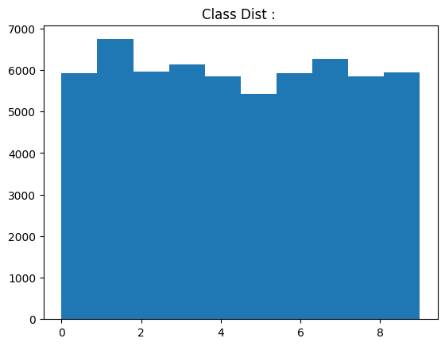
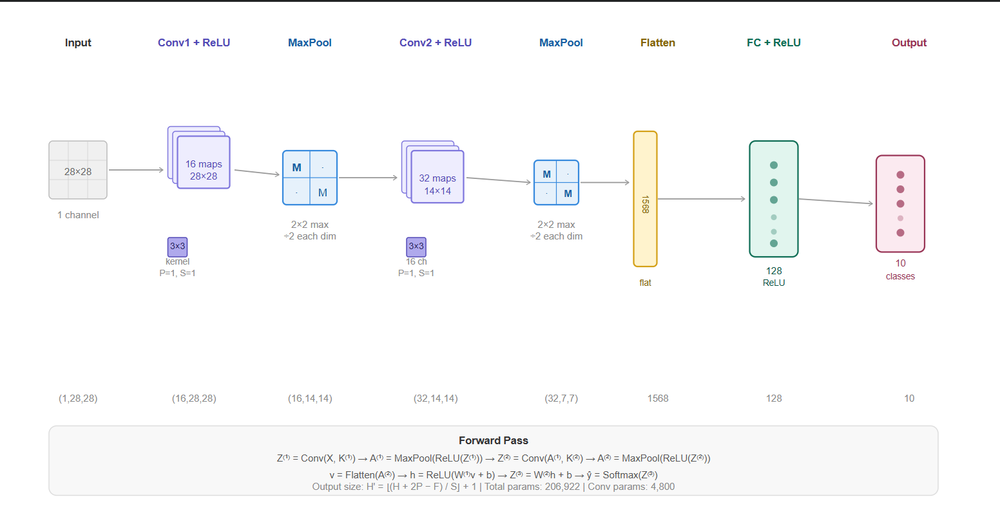
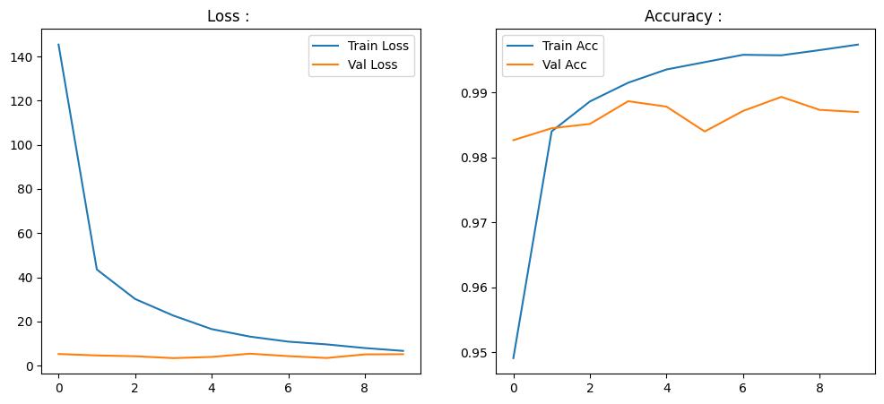
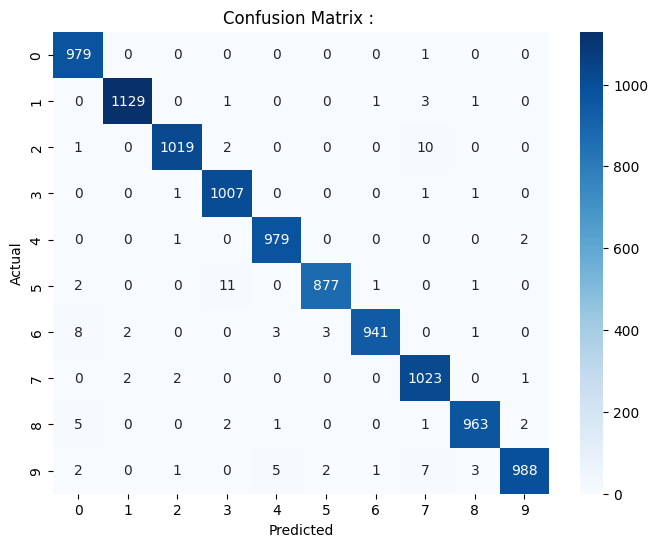

# MNIST Image Classification :

---

## Problem :

Same as Day 16; classify handwritten digit images into one of 10 categories (0 through 9). Same dataset, same evaluation setup. 
**The difference is the model**.

**Input :** 28x28 grayscale image, kept as a 2D spatial tensor:

$$X \in \mathbb{R}^{1 \times 28 \times 28}$$

**Output :** Probability distribution over 10 classes:

$$\hat{y} \in \mathbb{R}^{10}, \quad \sum_{i=0}^{9} \hat{y}_i = 1$$

---

## Significance of CNN Over ANN : 

Day 16 achieved 98% accuracy with a fully connected ANN. CNN achieves 99% with fewer parameters and better generalization. The improvement comes from fixing the three fundamental problems ANN had with image data.

**Problem 1 - Spatial blindness :** ANN flattens the 28x28 image to a 784-element vector. A pixel at position (3,3) has no special relationship to its neighbor at (3,4). The network must learn spatial structure from scratch through weight patterns alone, which is inefficient and fragile.

CNN solution : Convolutional filters look at local neighborhoods. A 3x3 filter sees a 3x3 patch of pixels together, preserving the spatial relationship between neighbors. Edges, curves, and strokes are local.

**Problem 2 - Parameter explosion :** A fully connected layer connecting 784 inputs to 128 hidden neurons requires $784 \times 128 = 100{,}352$ parameters, just for one layer.

CNN solution : Parameter sharing. The same 3x3 filter ($9$ parameters) is applied across every position in the image. A layer with 16 filters needs only $16 \times 9 = 144$ parameters to process the entire image. Same feature detector, applied everywhere.

**Problem 3 - No translation invariance :** An ANN trained on centered digits fails on shifted digits, the pixel at position (5,5) in a shifted image maps to a completely different weight than in the original image.

CNN solution : Since the same filter slides across all positions, a feature detected at position (3,3) activates the same filter weights as the same feature at position (10,10). Pooling further reduces positional sensitivity by summarizing regions.

---

## Dataset : 

Identical to Day 16, MNIST, 60,000 training / 10,000 test images, balanced across 10 digit classes. EDA and preprocessing are unchanged.

---

## EDA : 

### Sample Digits : 


### Class Distribution : 



Perfectly balanced, no resampling or class weighting needed.

---

## Pipeline : 

1. Load MNIST, compute dataset mean ($\mu = 0.1307$) and std ($\sigma = 0.3081$).
2. Normalize: $x' = (x - \mu) / \sigma$.
3. Split training set: 90% train / 10% validation.
4. Build CNN Model; Conv1 → Pool → Conv2 → Pool → Flatten → FC → Output.
5. Train with CrossEntropyLoss + Adam for 10 epochs.
6. Track train/val loss and accuracy per epoch.
7. Evaluate on test set; Accuracy, Precision, Recall, F1, Confusion Matrix.
8. Compare with Day 16 ANN baseline.

---

## Architectural Components :

Before the architecture, here are the components and what they actually do :

**Kernel / Filter :** A small learnable weight matrix (here 3x3) that slides across the input. Each position it stops at, it computes a dot product with the local patch. One filter detects one type of pattern, an edge, a curve, a corner. Multiple filters detect multiple patterns simultaneously.

**Feature Map :** The output of applying one filter across the entire image. If the input is 28x28 and we apply a 3x3 filter with padding = 1, the output will also be 28x28, one value per position, representing how strongly that filter's pattern was detected there; 16 filters produce 16 feature maps.

**Padding :** Adding zeros around the border of the input before convolution. Without padding (P=0), a 3x3 filter on a 28x28 image produces a 26x26 output ie. the border shrinks by 1 on each side. With padding P = 1, the output stays 28x28. This preserves spatial dimensions and ensures border pixels get as much filter coverage as central pixels.

**Stride :** No of Pixels the filter moves between each position. Stride = 1 means the filter moves one pixel at a time ie. maximum overlap, maximum output size. Stride = 2 means the filter jumps two pixels which halves the output size. Used as an alternative to pooling for downsampling.

**ReLU Layer :** Applied elementwise to the feature map after convolution: $\text{ReLU}(z) = \max(0, z)$. Zeros out negative activations. Without this, convolution is a linear operation, stacking linear operations produces a single linear transformation. ReLU introduces nonlinearity so deeper layers can learn nonlinear combinations of features.

**Pooling :** Downsamples the feature map by summarizing local regions. A 2x2 MaxPool takes the maximum value in each 2x2 window and discards the rest, halving spatial dimensions. This reduces computation, provides mild translation invariance and forces the network to focus on the strongest activations.

- Max pooling : Takes the maximum, preserves the strongest feature presence. Standard for classification.
- Average pooling : Takes the mean — smoother, sometimes used in later layers.
- Global average pooling : Collapses each entire feature map to a single number, used in modern architectures to replace the flatten + FC step entirely.

**Flatten :** Converts the 3D feature map tensor $(C \times H \times W)$ into a 1D vector. After two pooling layers, the 28x28 image has been reduced to 7x7 feature maps with 32 channels: $32 \times 7 \times 7 = 1568$ values. This vector is the input to the fully connected layers.

**Fully Connected (FC) Layer :** Standard dense layer identical to ANN. After flattening, the spatial structure has already been extracted by the convolutional layers. The FC layer learns to combine those extracted features into class scores. Here: $1568 \to 128 \to 10$.

---

## Architecture : 

```
Input: (1, 28, 28)
    |
Conv1: 16 filters, 3x3, padding=1   → (16, 28, 28)
ReLU                                 → (16, 28, 28)
MaxPool 2x2                          → (16, 14, 14)
    |
Conv2: 32 filters, 3x3, padding=1   → (32, 14, 14)
ReLU                                 → (32, 14, 14)
MaxPool 2x2                          → (32, 7, 7)
    |
Flatten                              → (1568,)
    |
FC1: 1568 → 128, ReLU               → (128,)
FC2: 128 → 10                        → (10,)
    |
CrossEntropyLoss (Softmax implicit)
```



---

## Spatial Dimension Calculation : 

The output size after a convolution or pooling operation is :

$$H' = \left\lfloor \frac{H + 2P - F}{S} \right\rfloor + 1$$

Where $H$ = input height, $P$ = padding, $F$ = filter size, $S$ = stride. Width follows the same formula.

**After Conv1** ($H=28$, $P=1$, $F=3$, $S=1$):

$$H' = \frac{28 + 2(1) - 3}{1} + 1 = \frac{27}{1} + 1 = 28$$

Output: $(16, 28, 28)$ , 16 feature maps, same spatial size as input.

**After MaxPool1** ($H=28$, $F=2$, $S=2$, $P=0$):

$$H' = \frac{28 + 0 - 2}{2} + 1 = 14$$

Output: $(16, 14, 14)$ , spatial dimensions halved.

**After Conv2** ($H=14$, $P=1$, $F=3$, $S=1$):

$$H' = \frac{14 + 2(1) - 3}{1} + 1 = 14$$

Output: $(32, 14, 14)$ , 32 feature maps, same spatial size.

**After MaxPool2** ($H=14$, $F=2$, $S=2$, $P=0$):

$$H' = \frac{14 + 0 - 2}{2} + 1 = 7$$

Output: $(32, 7, 7)$ , spatial dimensions halved again.

**Flatten:** $32 \times 7 \times 7 = 1568$.

---

## Forward Pass Mathematics : 

**Conv Layer 1** :apply 16 filters $K^{(1)}$ to input $X$:

$$Z^{(1)} = \text{Conv}(X,\; K^{(1)}) + b^{(1)}$$

Each filter $K^{(1)}_f \in \mathbb{R}^{1 \times 3 \times 3}$ slides across the input. The output at position $(i, j)$ for filter $f$:

$$Z^{(1)}_{f,i,j} = \sum_{c=1}^{1} \sum_{m=0}^{2} \sum_{n=0}^{2} X_{c,\; i+m,\; j+n} \cdot K^{(1)}_{f,c,m,n} + b^{(1)}_f$$

**ReLU + Pooling after Layer 1 :**

$$A^{(1)} = \text{MaxPool}\left(\text{ReLU}(Z^{(1)})\right), \quad A^{(1)} \in \mathbb{R}^{16 \times 14 \times 14}$$

**Conv Layer 2** : apply 32 filters $K^{(2)}$ to $A^{(1)}$:

$$Z^{(2)} = \text{Conv}(A^{(1)},\; K^{(2)}) + b^{(2)}$$

Each filter $K^{(2)}_f \in \mathbb{R}^{16 \times 3 \times 3}$, it sees all 16 input channels simultaneously.

**ReLU + Pooling after Layer 2 :**

$$A^{(2)} = \text{MaxPool}\left(\text{ReLU}(Z^{(2)})\right), \quad A^{(2)} \in \mathbb{R}^{32 \times 7 \times 7}$$

**Flatten + FC layers :**

$$v = \text{Flatten}(A^{(2)}) \in \mathbb{R}^{1568}$$

$$h = \text{ReLU}(W^{(1)} v + b^{(1)}_{\text{fc}}) \in \mathbb{R}^{128}$$

**Final output logits :**

$$Z^{(3)} = W^{(2)} h + b^{(2)}_{\text{fc}} \in \mathbb{R}^{10}$$

CrossEntropyLoss applies log-softmax internally. The predicted class is $\arg\max(Z^{(3)})$.

---

## Parameter Count : 

| Layer | Parameters |
|-------|------------|
| Conv1: 16 filters, $1 \times 3 \times 3$ | $16 \times 1 \times 3 \times 3 + 16 = 160$ |
| Conv2: 32 filters, $16 \times 3 \times 3$ | $32 \times 16 \times 3 \times 3 + 32 = 4{,}640$ |
| FC1: $1568 \to 128$ | $1568 \times 128 + 128 = 200{,}832$ |
| FC2: $128 \to 10$ | $128 \times 10 + 10 = 1{,}290$ |
| **Total** | **206,922** |

For comparison, Day 16 ANN had 101,770 parameters but only achieved 98% accuracy. 
CNN has roughly twice the parameters but gains a full percentage point by using them far more efficiently where most of the CNN parameters are in the FC layer, while the convolutional layers (the parts that actually handle images) use only 4,800 parameters total.

---

## Image Invariance : 

**Translation tolerance :** Because the same filter weights scan every position, a "7" stroke detected at position (4,4) uses identical weights as the same stroke at position (12,8). The filter response activates wherever the pattern appears. MaxPool further blurs positional precision ie. if a feature shifts by 1 pixel within a 2x2 pool window, the max value is unchanged.

**Not full invariance :** CNN is translation **tolerant**, not translation **invariant**. A digit shifted by more than a few pixels, or rotated significantly, will produce meaningfully different feature map activations. Data augmentation (random shifts, rotations during training) is the practical solution.

---

## Backpropagation in CNN : 

The chain rule applies identically to CNNs, but gradients must flow through the convolution operation. The gradient of the loss with respect to a filter $K^{(l)}$:

$$\frac{\partial \mathcal{L}}{\partial K^{(l)}} = \delta^{(l)} * A^{(l-1)}$$

Where $*$ denotes the cross-correlation of the error signal $\delta^{(l)}$ with the previous layer's activations. The gradient with respect to the previous layer's activations (to propagate further backward):

$$\frac{\partial \mathcal{L}}{\partial A^{(l-1)}} = \delta^{(l)} \star K^{(l)}$$

Where $\star$ denotes full convolution (flipped kernel). Through the MaxPool layer, gradients only flow back through the positions that were the maximum in their pool window.

---

## Time, Space, and Inference Complexity : 

Variables :
- $N$ = training samples (54,000 after split)
- $F_l$ = number of filters in layer $l$
- $C_l$ = input channels to layer $l$
- $k$ = filter size (3)
- $H'_l, W'_l$ = output spatial dimensions of layer $l$
- $E$ = epochs (10)

**Training complexity (per epoch, convolution dominant) :**

$$O\!\left(N \cdot \sum_l F_l \cdot C_l \cdot k^2 \cdot H'_l \cdot W'_l\right)$$

For our two conv layers :
- Conv1 : $N \times 16 \times 1 \times 9 \times 28 \times 28 \approx N \times 112{,}896$
- Conv2 : $N \times 32 \times 16 \times 9 \times 14 \times 14 \approx N \times 903{,}168$

Plus the FC layers : $N \times (1568 \times 128 + 128 \times 10) \approx N \times 201{,}984$

Conv2 dominates; this is typical. Deeper feature maps with more channels are the computational bottleneck in CNNs, which is why modern architectures use depthwise separable convolutions to reduce this.

**Inference complexity per sample :**

$$O\!\left(\sum_l F_l \cdot C_l \cdot k^2 \cdot H'_l \cdot W'_l + d_{\text{fc}} \cdot h\right)$$

All the same operations as training, but for one sample with no gradient computation. Constant in $N$.

**Space complexity (parameters) :**

$$O\!\left(\sum_l F_l \cdot C_l \cdot k^2 + d_{\text{fc}} \cdot h\right) = O(206{,}922 \text{ params})$$

The convolution layers are extremely parameter-efficient, $4{,}800$ parameters handle all spatial feature extraction across the entire image. The FC layer accounts for 97% of parameter storage. This is why modern vision architectures minimize or eliminate FC layers.

**Activation memory during training :**

$$O\!\left(N \cdot \sum_l F_l \cdot H'_l \cdot W'_l\right)$$

Feature maps must be stored for backpropagation. For batch size 64; $64 \times (16 \times 28 \times 28 + 32 \times 14 \times 14) \approx 64 \times 19{,}264 \approx 1.2M$ floats per batch.

---

## Results : 

| Metric | Value |
|--------|-------|
| Test Accuracy | 0.99 |
| Macro Precision | 0.99 |
| Macro Recall | 0.99 |
| Macro F1 Score | 0.99 |
| Training Time | 386.28s |
| Total Inference Time | 4.08s (10,000 samples) |
| Per Sample Latency | 0.000408s |

Classs-Wise Breakdown :

| Class | Precision | Recall | F1 |
|-------|-----------|--------|----|
| 0 | 0.98 | 1.00 | 0.99 |
| 1 | 1.00 | 0.99 | 1.00 |
| 2 | 1.00 | 0.99 | 0.99 |
| 3 | 0.98 | 1.00 | 0.99 |
| 4 | 0.99 | 1.00 | 0.99 |
| 5 | 0.99 | 0.98 | 0.99 |
| 6 | 1.00 | 0.98 | 0.99 |
| 7 | 0.98 | 1.00 | 0.99 |
| 8 | 0.99 | 0.99 | 0.99 |
| 9 | 0.99 | 0.98 | 0.99 |

---

## Epochwise Training : 

| Epoch | Train Loss | Train Acc | Val Acc |
|-------|------------|-----------|---------|
| 0 | 145.34 | 0.9491 | 0.9827 |
| 1 | 43.53 | 0.9840 | 0.9845 |
| 2 | 30.19 | 0.9886 | 0.9852 |
| 3 | 22.67 | 0.9915 | 0.9887 |
| 4 | 16.55 | 0.9936 | 0.9878 |
| 5 | 13.16 | 0.9947 | 0.9840 |
| 6 | 10.88 | 0.9958 | 0.9872 |
| 7 | 9.64 | 0.9957 | 0.9893 |
| 8 | 7.98 | 0.9965 | 0.9873 |
| 9 | 6.70 | 0.9974 | 0.9870 |

CNN converges faster than ANN, by epoch 1, val accuracy is already 98.45%, matching ANN's final performance. The val accuracy oscillates slightly between 98.4% and 98.9% in later epochs while train accuracy keeps climbing, a mild overfitting signal, but the gap is small and performance is strong.

**Comparison with ANN :**

| | ANN | CNN |
|--|-----|-----|
| Test Accuracy | 0.98 | 0.99 |
| Parameters | 101,770 | 206,922 |
| Conv params | 0 | 4,800 |
| Training Time | 133.4s | 386.3s |
| Per Sample Latency | 0.000181s | 0.000408s |

CNN is slower to train and slower at inference due to the convolution operations. The accuracy gain of 1% comes from the structural advantage, not more parameters, but better-structured parameters.

---

## Training Curves and Confusion Matrix : 





From the confusion matrix, the tightest remaining errors are :

- Class 5 misclassified as 3 in 11 cases due to open lower curves look similar.
- Class 6 misclassified as 0 in 8 cases because the loop of 6 resembles 0 when the top hook is faint.
- Class 9 misclassified as 7 in 7 cases as the tail of 9 creates a diagonal similar to 7.
- Class 2 misclassified as 7 in 10 cases due to diagonal stroke overlap.

These are fewer and less severe than Day 16's confusions, confirming that **spatial feature extraction** is genuinely helping.

---

## Failure Case Analysis : 

**Rotation sensitivity :** CNN has no explicit mechanism for rotation invariance. A "6" rotated 90 degrees looks like a completely different pattern to every filter.

**Scale sensitivity :** A digit written very large or very small produces feature maps with differently sized activations. The fixed 3x3 filter only captures patterns at one scale. 

**Adversarial vulnerability :** Adding carefully crafted pixel-level noise, invisible to the human eye can flip the model's prediction with high confidence. CNNs are not robust to adversarial perturbations by default.

**Translation not fully invariant :** MaxPool provides tolerance within a 2x2 window (1-pixel shifts are absorbed). Larger shifts change which pool windows activate and alter the feature map meaningfully. A digit shifted by 4+ pixels can degrade accuracy.

**Overfitting with deeper networks :** This shallow 2-layer CNN shows mild overfitting (train acc 99.7% vs val acc 98.7% by epoch 9). Deeper networks with more filters are far more prone. **Dropout** in convolutional layers, **batch normalization**, and **data augmentation** are the standard defenses.

**Computational cost at scale :** The $O(N \cdot F \cdot C \cdot k^2 \cdot H' \cdot W')$ training complexity means doubling filters or input resolution is expensive. A 224x224 ImageNet image at the same architecture would be $8\times$ more expensive per layer than 28x28 MNIST, GPU acceleration is not optional for real vision tasks.

---

## Key Takeaways : 

- CNN fixes the three core ANN failures for image data : spatial blindness, parameter explosion, and translation sensitivity, all via the single mechanism of learned local filters applied with shared weights.
- Convolutional layers are extremely parameter-efficient : 4,800 parameters handle all **spatial feature extraction**. FC layers are parameter-heavy, 202,000 parameters for simple classification. Modern architectures minimize FC layers for this reason.
- MaxPool is not just dimensionality reduction, it provides mild translation tolerance and forces the network to commit to the strongest feature activations in each region.
- The 1% accuracy gain over ANN (98% to 99%) comes from structural inductive bias, not raw parameter count.
- CNN is the correct architecture for any task where local spatial patterns matter. For sequence data, we use recurrent networks or Transformers.
