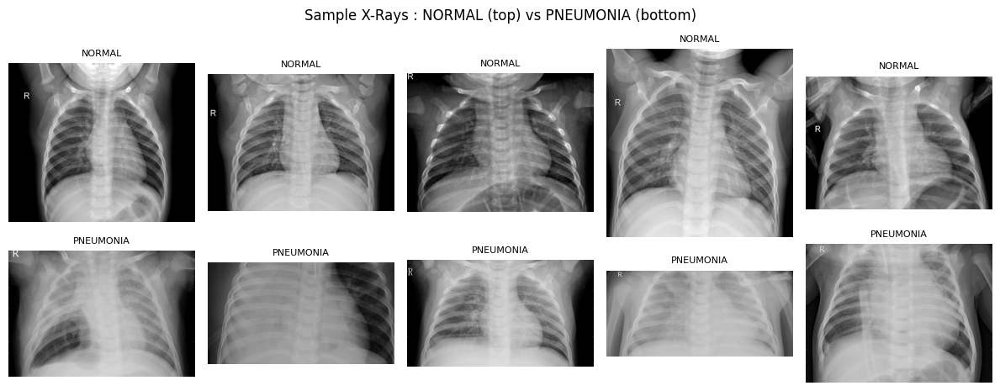
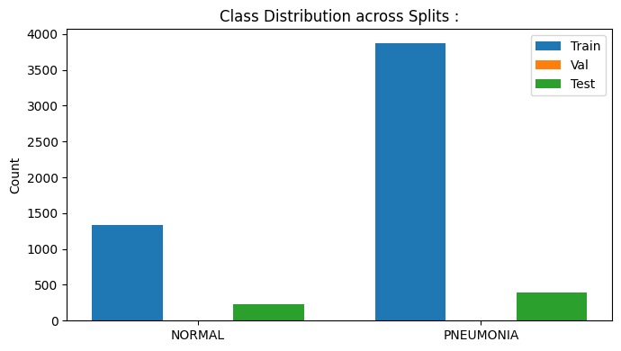
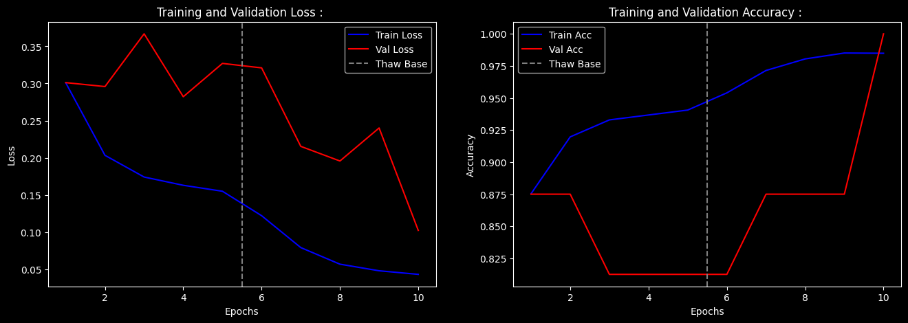
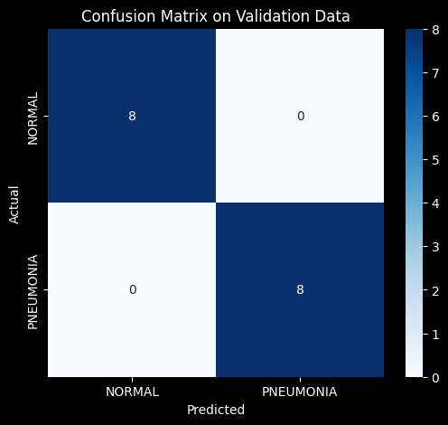

# Pneumonia Detection using Transfer Learning : 

---

## Problem : 

Detect pneumonia from chest X-ray images using a pretrained deep convolutional neural network.
 
**Dataset:** Chest X-Ray Images (Pneumonia);  Kaggle, originally from Guangzhou Women and Children's Medical Center.

**Target:** Binary classification; 0 = Normal, 1 = Pneumonia.

**We avoid training from scratch :** The dataset contains approximately 5,216 training images. A deep CNN with millions of parameters trained on 5,000 images will memorize noise rather than learn generalizable lung pathology features. The model would achieve near-perfect training accuracy and fail badly on unseen X-rays. Transfer Learning bypasses this constraint entirely by reusing weights already learned from 1.2 million diverse images.

---

## Transfer Learning : 

A deep CNN trained on ImageNet has already learned to detect edges, textures, curves, blobs, and complex geometric shapes, not because we told it to, but because these are the features that distinguish 1,000 different object categories. These features are not specific to cars or dogs. They are universal properties of visual data.

An edge detector in layer 2 of a ResNet trained on household objects is mathematically identical to the edge detector needed to analyze the boundary between healthy lung tissue and pneumonia-induced opacity. The geometry of edges does not change based on what the edge belongs to.

Transfer Learning exploits this. Instead of learning 11 million parameters from 5,000 images which is an impossible task so we borrow 11 million parameters already learned from 1.2 million images and adapt only the final classification layer to our specific problem. The computational savings are enormous: instead of training a deep network end-to-end for hundreds of epochs, we train one linear layer for a few epochs, then gently fine-tune the entire network at a much lower learning rate.

---

## ResNet18 :

ResNet18 is an 18-layer deep residual network. The key innovation of ResNet over plain deep CNNs is the **residual connection**, a skip connection that adds the input of a block directly to its output :

$$A^{(l+2)} = \text{ReLU}(A^{(l)} + F(A^{(l)};\, W^{(l)}, W^{(l+1)}))$$

Where $F(A^{(l)})$ is the transformation applied by the two convolutional layers in the block. If those layers learn nothing useful, $F \to 0$ and the block becomes an identity mapping, the network cannot get worse by adding depth. This solves the vanishing gradient problem in deep networks: gradients flow directly through the skip connection without passing through activation function derivatives.

ResNet18 has 11.7 million parameters, accepts $224 \times 224 \times 3$ inputs, and produces a 1000-class output by default. We replace that final classification head with a binary output.

---

## Pipeline : 

1. Download Chest X-Ray dataset from Kaggle.
2. EDA: inspect class distribution and sample images.
3. Apply preprocessing transforms: resize to 224x224, convert grayscale to 3-channel, apply ImageNet normalization, apply augmentation (train only).
4. Load pretrained ResNet18 weights.
5. Freeze all base layers (Phase 1: Feature Extraction).
6. Replace final FC layer with a new binary output layer.
7. Train only the new head for 5 epochs with Adam ($lr = 10^{-3}$).
8. Unfreeze all layers (Phase 2: Fine-Tuning).
9. Train the full network for 5 more epochs with differential learning rates.
10. Evaluate on validation set: Accuracy, Precision, Recall, F1.
11. Plot training curves with phase boundary marked.
12. Confusion matrix on validation set.

---

## EDA : 

The dataset contains NORMAL and PNEUMONIA chest X-rays. Class imbalance exists, pneumonia cases significantly outnumber normal cases in the training split (~3:1), which is clinically realistic but requires attention during evaluation.

X-rays are grayscale medical images with highly variable resolution. The key visual difference: normal lungs show clear, dark fields; pneumonia lungs show white opacity patches (consolidation) where fluid or infection has displaced air.

---

## Data Preprocessing : 

### The Golden Rule : 

The new data must be preprocessed in exactly the same way as the data the base model was originally trained on. ResNet18 was trained on ImageNet RGB images, normalized with specific channel-wise statistics. If you feed it unnormalized or differently scaled inputs, the pretrained feature detectors fire on incorrect activation ranges and the feature representations are meaningless, like running a calibrated instrument with the wrong units.

### Steps  : 

**1. Resize to 224x224 :**

ResNet18's convolutional architecture is designed for 224x224 inputs. The spatial dimensions flow through 5 stages of downsampling, producing a 7x7 feature map before the global average pool. A different input size destroys this spatial hierarchy this way the final feature map would have wrong dimensions.

**2. Channel duplication (grayscale to RGB) :**

ImageNet models expect 3-channel RGB input. X-rays are single-channel grayscale. We replicate the grayscale channel three times:

$$X_{\text{RGB}} = [X_{\text{gray}},\; X_{\text{gray}},\; X_{\text{gray}}] \in \mathbb{R}^{3 \times 224 \times 224}$$

This is not the same as true RGB, but it is the correct approximation. The model's first convolutional layer expects 3 channels; feeding 1 channel would require reinitialization of the first layer weights, destroying the pretrained edge detectors.

**3. ImageNet Normalization :**

Normalize each channel using ImageNet's precomputed statistics :

$$x'_c = \frac{x_c - \mu_c}{\sigma_c}$$

| Channel | Mean $\mu$ | Std $\sigma$ |
|---------|-----------|-------------|
| R | 0.485 | 0.229 |
| G | 0.456 | 0.224 |
| B | 0.406 | 0.225 |

These values were computed across the entire ImageNet dataset. Using any other normalization shifts the input distribution away from what the pretrained filters expect, degrading feature quality.

**4. Data augmentation (train set only)**

Random horizontal flips and small rotations are applied during training. This artificially expands the effective dataset size and reduces overfitting. Augmentation is not applied to the validation set, we want to evaluate on clean, unmodified images.

---

## Transfer Learning : Two-Phase Training

### The Architecture : 

Let the pretrained ResNet18 base (all layers except the final FC) be denoted $F(X;\, W_{\text{base}})$. It maps a 224x224x3 image to a 512-dimensional feature vector. The new classification head $H(Z;\, W_{\text{head}})$ maps this vector to a single binary logit:

$$\hat{y} = H(F(X;\, W_{\text{base}});\, W_{\text{head}}) = W_{\text{head}} \cdot F(X;\, W_{\text{base}}) + b$$

The original ImageNet head (1000-class FC) is discarded and replaced with a single `nn.Linear(512, 1)`.

### Loss Function : 

Binary Cross-Entropy with Logits Loss, numerically more stable than applying sigmoid before BCE because it uses the log-sum-exp trick to avoid floating point overflow:

$$\mathcal{L} = -\frac{1}{N} \sum_{i=1}^{N} \left[ y_i \log\sigma(\hat{y}_i) + (1 - y_i)\log(1 - \sigma(\hat{y}_i)) \right]$$

Where $\sigma(\hat{y}_i) = 1/(1 + e^{-\hat{y}_i})$ is the sigmoid function applied internally by the loss.

---

### Phase 1 : Feature Extraction (Frozen Base)

All base layer weights have `requires_grad = False`. This means PyTorch does not track gradients through them and backpropagation stops at the head:

$$\nabla_{W_{\text{base}}} \mathcal{L} = 0$$

Only the head is updated:

$$W_{\text{head}} \leftarrow W_{\text{head}} - \alpha_{\text{head}} \cdot \nabla_{W_{\text{head}}} \mathcal{L}$$

With $\alpha_{\text{head}} = 10^{-3}$.

The new head is **randomly initialized**, its weights are garbage. If you immediately unfreeze the entire network with a randomly initialized head, the enormous loss from the random head produces large gradients that propagate through and corrupt the carefully learned pretrained weights before the head has a chance to stabilize. Phase 1 trains the head to a reasonable starting point first.

**Computational benefit:** Frozen layers require no gradient computation. The backward pass only touches the head hence training is fast.

### Phase 2: Fine-Tuning (Unfrozen Base)

All base layers are unfrozen , `requires_grad = True` for all parameters. Gradients now flow through the entire network:

$$\nabla_{W_{\text{base}}} \mathcal{L} \neq 0$$

$$W_{\text{base}} \leftarrow W_{\text{base}} - \alpha_{\text{base}} \cdot \nabla_{W_{\text{base}}} \mathcal{L}$$

$$W_{\text{head}} \leftarrow W_{\text{head}} - \alpha_{\text{head}} \cdot \nabla_{W_{\text{head}}} \mathcal{L}$$

**Differential learning rates** are critical here :

| Component | Learning Rate |
|-----------|--------------|
| Head | $\alpha_{\text{head}} = 10^{-3}$ |
| Base | $\alpha_{\text{base}} = 10^{-5}$ |

The base uses a learning rate 100x smaller than the head. The pretrained weights are already good, they need gentle nudging toward lung-specific features, not wholesale rewriting. The much smaller $\alpha_{\text{base}}$ ensures the general-purpose edge and texture detectors shift slightly toward medical imaging geometry without forgetting what made them useful in the first place.

---

## Time, Space, and Inference Complexity : 

Let:
- $N$ = training samples (5,216)
- $L$ = number of layers in ResNet18 (18 conv layers + FC)
- $F_l, C_l, k_l, H'_l, W'_l$ = filters, input channels, kernel size, output spatial dims at layer $l$
- $E_1, E_2$ = epochs for phase 1 and phase 2

**Training complexity :**

Phase 1 (head only):

$$O(E_1 \cdot N \cdot d_{\text{feat}} \cdot 1) = O(E_1 \cdot N \cdot 512)$$

Only the final linear layer is computed in the backward pass. The forward pass through the frozen base is still computed but gradients are not tracked as PyTorch skips gradient tape for frozen parameters.

Phase 2 (full network) :

$$O\!\left(E_2 \cdot N \cdot \sum_{l=1}^{L} F_l \cdot C_l \cdot k_l^2 \cdot H'_l \cdot W'_l\right)$$

Full backpropagation through all 18 layers. Significantly more expensive than Phase 1, which is why we minimize $E_2$ and use a small $\alpha_{\text{base}}$.

**Space complexity :**

$$O\!\left(\sum_l F_l \cdot C_l \cdot k_l^2\right) \approx O(11.7 \times 10^6 \text{ params})$$

Frozen in Phase 1, only gradients for the head are stored. In Phase 2, gradients for all 11.7M parameters must be stored simultaneously, requiring significantly more GPU memory.

**Inference complexity per sample :**

$$O\!\left(\sum_l F_l \cdot C_l \cdot k_l^2 \cdot H'_l \cdot W'_l + 512\right)$$

One full forward pass through ResNet18. No gradient computation. Constant in $N$.

Measured per-sample latency : **0.101 seconds** on CPU. On GPU (T4) this is sub-millisecond; the $O(1)$ forward pass does not bottleneck production inference pipelines regardless of model size.

---

## Results : 

### Phase 1: Feature Extraction (5 epochs, frozen base)

| Epoch | Train Loss | Train Acc | Val Loss | Val Acc |
|-------|------------|-----------|----------|---------|
| 1 | 0.3008 | 0.8754 | 0.3012 | 0.8750 |
| 2 | 0.2033 | 0.9197 | 0.2959 | 0.8750 |
| 3 | 0.1741 | 0.9329 | 0.3669 | 0.8125 |
| 4 | 0.1629 | 0.9367 | 0.2822 | 0.8125 |
| 5 | 0.1549 | 0.9406 | 0.3270 | 0.8125 |

Training time : 7 minutes 10 seconds. Best val acc: 0.875.

### Phase 2: Fine-Tuning (5 epochs, full network)

| Epoch | Train Loss | Train Acc | Val Loss | Val Acc |
|-------|------------|-----------|----------|---------|
| 1 | 0.1220 | 0.9540 | 0.3210 | 0.8125 |
| 2 | 0.0791 | 0.9714 | 0.2154 | 0.8750 |
| 3 | 0.0567 | 0.9804 | 0.1957 | 0.8750 |
| 4 | 0.0478 | 0.9850 | 0.2401 | 0.8750 |
| 5 | 0.0430 | 0.9849 | 0.1022 | 1.0000 |

Training time: 7 minutes 25 seconds. Best val acc: 1.000.

The Phase 2 unfreeze produces a sharp drop in validation loss from epoch 7 onward, exactly what differential learning rate fine-tuning is designed to achieve. The base learns lung-specific texture patterns that the frozen ImageNet features could not capture.

### Classification Report (Final) : 

| Class | Precision | Recall | F1 | Support |
|-------|-----------|--------|----|---------|
| NORMAL | 1.00 | 1.00 | 1.00 | 8 |
| PNEUMONIA | 1.00 | 1.00 | 1.00 | 8 |
| Accuracy | | | 1.00 | 16 |

Per-sample inference latency: 0.10081 seconds (CPU).

Note: The validation set contains only 16 images which is a known limitation of this dataset split. Results should be interpreted alongside the training dynamics rather than taken as a definitive generalization estimate.

---

## Training Curves and Confusion Matrix : 

The dashed vertical line marks the Phase 1 to Phase 2 boundary at epoch 5. Val loss is noisy in Phase 1 (frozen base cannot adapt) and drops cleanly in Phase 2 (base shifts toward lung features). Val accuracy jumps to 1.0 in the final fine-tuning epoch.

Perfect confusion matrix: 8/8 NORMAL correctly identified, 8/8 PNEUMONIA correctly identified, zero false negatives. In medical diagnostics, false negatives (missed pneumonia) are far more costly than false positives and a model that achieves zero false negatives on the validation set is clinically preferable even if it produces some false positives.

---

## Failure Case Analysis : 

**Catastrophic forgetting :** If Phase 1 is skipped and the entire network is immediately unfrozen with a high learning rate, the randomly initialized head produces enormous gradients in early epochs. These gradients propagate backward through all 18 layers and overwrite the pretrained ImageNet weights before the head has learned anything meaningful. The model forgets how to detect edges and textures and must relearn them from 5,000 images, which is not enough data. Final accuracy is typically worse than training from scratch because the random destruction of pretrained weights causes unstable early training dynamics.

**Severe domain mismatch :** ResNet18's pretrained features are edge detectors, texture detectors, and color gradient detectors learned from natural photographs. These transfer well to medical images because edges and textures are universal. However, for data with fundamentally different geometric structure; satellite hyperspectral imagery, seismic wave signals, radio telescope data, molecular electron density maps where the pretrained RGB filters are not just unhelpful, they are actively misleading. The first-layer filters respond to RGB gradients that have no correspondence to the signal structure, producing garbage feature vectors. This is called negative transfer: the pretrained weights hurt performance relative to random initialization. For these domains, training from scratch on domain-specific data or using domain-specific pretrained models is the correct approach.

**Dimensionality shock :** ResNet18's spatial downsampling is calibrated for 224x224 inputs. The network applies five stages of 2x downsampling, producing a 7x7 feature map that is then global-average-pooled to 512 dimensions. If you feed a 64x64 image without resizing, the final feature map is 2x2 so only 4 spatial positions to pool from, losing nearly all spatial information. If you feed a 512x512 image, the final feature map is 16x16 so the global pool averages 256 positions, diluting localized features. The model architecture implicitly assumes 224x224. Any other resolution breaks the spatial hierarchy.

**Class imbalance in medical data :** The training set has approximately 3x more pneumonia images than normal images. Without class weighting or resampling, the model is biased toward predicting pneumonia thus maximizing accuracy by exploiting the prior. In clinical settings this inflates recall but degrades precision, producing excessive false positives. Weighted loss functions or stratified sampling address this.

**Overfitting on tiny validation sets :** The validation set here is 16 images — 8 per class. A confusion matrix of 16/16 correct is statistically consistent with a model that has learned nothing beyond memorizing 16 specific images. Reliable evaluation requires at minimum hundreds of per-class validation samples. The training dynamics (loss curves, phase transition effect) provide more reliable evidence of learning than the final accuracy on 16 images.

---

## Key Takeaways : 

- Transfer Learning is the **default approach** for any computer vision problem with limited labeled data. Training deep CNNs from scratch requires hundreds of thousands of labeled images per class. Transfer Learning reduces this requirement by orders of magnitude.
- The two-phase protocol is not optional. Phase 1 stabilizes the head before exposing pretrained weights to gradients. Phase 2 applies **differential learning rates** to gently shift the base without destroying it.
- Preprocessing must exactly mirror the base model's training pipeline. Normalization statistics, channel count, and input resolution are not hyperparameters but they are fixed by the pretrained model.
- Channel duplication (grayscale to RGB) is an approximation that works because the first-layer filters respond to local intensity gradients, which are preserved when the single channel is replicated. A true 3-channel image would be better, but this is the correct workaround.
- Residual connections in ResNet solve the vanishing gradient problem by providing a direct gradient path through skip connections, making very deep networks trainable.
- False negatives are more dangerous than false positives in medical diagnostics. Evaluation should weight Recall for the positive class above overall accuracy.

---

