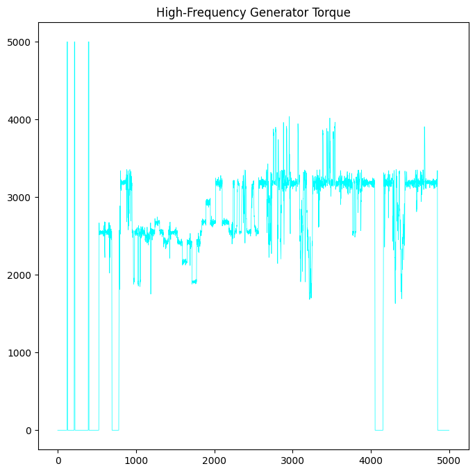
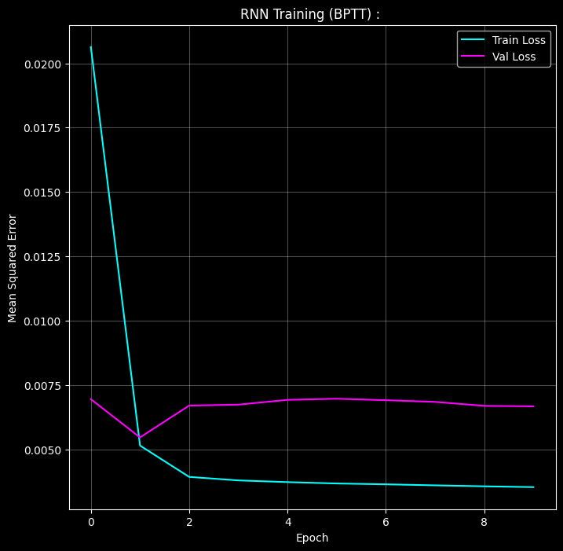

# Wind Turbine Sensor Forecasting : 

---

## Problem :

Forecast the next state of a wind turbine gearbox using high-frequency SCADA telemetry; three continuous sensor signals recorded over time.

**Dataset :** Real industrial SCADA data from a wind turbine gearbox (`B1_CL4_20.csv`).

Three features selected:

| Feature | Description |
|---------|-------------|
| `GenTorqSP` | Generator Torque Setpoint |
| `DCC` | DC Current |
| `DCV` | DC Voltage |

**Task:** Multivariate time-series forecasting, given the last 50 timesteps, we have to predict the sensor values at $T+1$.

**Final shape after chunked loading and downsampling :** $(261{,}551 \times 3)$

---

## Significance of RNN : 

ANN and CNN assume that inputs are independent of each other. Shuffle the rows of an image dataset and accuracy is unchanged ie. the model has no concept of order. For time-series data this assumption is plain wrong.

**ANN failure :** An ANN maps a fixed-size input vector to an output. It has no memory. Feed it $[x_1, x_2, \ldots, x_{50}]$ and it treats these 50 values as 150 independent numbers with no temporal ordering. It cannot learn that $x_{49}$ caused $x_{50}$. It cannot learn periodicity, trends, or momentum.

**CNN failure :** A 1D CNN applies local filters over a fixed window and can detect local patterns like a spike, a plateau. But CNN filters are stationary. The same filter applied at position 5 and position 45 produces the same response regardless of what happened between them. CNN has no persistent state so it cannot propagate information from early in the sequence to influence predictions.

**RNN solution:** At every timestep $t$, the RNN updates a hidden state $h_t$ that carries a compressed summary of everything seen so far. The prediction at $t=50$ is conditioned on all previous 49 steps and not just the local window.
This temporal memory is the fundamental capability that makes RNNs the correct architecture for sequential data.

---

## Pipeline : 

1. Load dataset in chunks of 100,000 rows (OOM-safe).
2. Downsample by factor of 20 to reduce redundancy.
3. Forward-fill missing values, drop any remaining NaN.
4. EDA : statistical summary, missing value check, raw signal visualization.
5. Scale all features to $[-1, 1]$ with MinMaxScaler (mandatory for tanh).
6. Sequential train/test split: 80% train, 20% test (no shuffling).
7. Build sliding window dataset: $(N, 50, 3)$ tensors generated on-the-fly.
8. Train RNN with BPTT and gradient clipping for 10 epochs.
9. Track train and val MSE per epoch.
10. Measure inference latency on a single dummy sequence.
11. Plot Loss curves.

---

## EDA : 

### Data Shape and Statistics : 

261,551 timesteps, 3 features, zero missing values after forward-fill.



| Stat | GenTorqSP | DCC | DCV |
|------|-----------|-----|-----|
| Mean | 1247.85 | 26.70 | 293.86 |
| Std | 1230.25 | 24.15 | 146.45 |
| Min | 0.00 | -0.19 | -2.18 |
| Max | 5000.00 | 87.94 | 579.88 |

`GenTorqSP` has a standard deviation nearly equal to its mean, extreme spread, indicating the turbine cycles between near-zero and full load frequently.

### Raw Signal: Generator Torque : 


The raw torque signal is non-stationary and highly volatile. Sharp transients (drops to zero) correspond to turbine shutdowns or grid disconnections. The signal cannot be modeled with any stationary assumption that an RNN that maintains state across time is the correct tool.

### Feature Distribution : 

`DCC` (vibration proxy) follows a **Weibull distribution**, right-skewed with a heavy tail. The Weibull distribution is the standard model for mechanical wear and failure time in reliability engineering. 
Its shape parameter $k$ controls the skew: $k < 1$ means decreasing failure rate (infant mortality), $k = 1$ is exponential (random failure), $k > 1$ means increasing failure rate (wear-out). 
A Weibull-distributed vibration signal tells us the system is accumulating wear where the long right tail represents rare but large vibration spikes that precede mechanical failure. This is exactly the signal pattern an RNN needs to learn to predict.

---

## Data Preprocessing : 

### Importance of Scaling :

The RNN uses tanh as its activation function. tanh maps any input to $(-1, 1)$. If you feed raw `GenTorqSP` values of 2500 into tanh, the output saturates at $\approx 1.0$ regardless of whether the input is 2000 or 4000.
The gradient of tanh in this region is :

$$\text{tanh}'(z) = 1 - \text{tanh}^2(z) \approx 0 \quad \text{for large } |z|$$

Saturated tanh means zero gradient so the network stops learning entirely. MinMaxScaler maps all values to $[-1, 1]$, keeping inputs in the linear region of tanh where gradients are healthy.

$$x'_i = \frac{x_i - x_{\min}}{x_{\max} - x_{\min}} \cdot 2 - 1$$

### Sequential Split (No Shuffling) :

Time series must be split sequentially. The first 80% of timesteps are training data; the last 20% are test data. Shuffling would cause the model to train on $t=80{,}000$ and validate on $t=10{,}000$ thus leaking future information into training. The temporal ordering is the data.

### OOM-Safe Data Loading : 

The raw CSV is large. Loading it entirely into RAM risks an out-of-memory crash. The pipeline reads it in chunks of 100,000 rows and downsamples each chunk by factor 20 before concatenating:

```
Total rows → chunked read → downsample 20x → concat → 261,551 rows
```

This compresses a potentially multi-million-row file into a RAM-safe size while preserving the signal structure.

---

## The Sliding Window(2D to 3D) : 

Raw SCADA data is a 2D matrix: $(N_{\text{timesteps}}, 3)$.

An RNN expects a 3D tensor: $(\text{Batch},\; \text{Seq\_Len},\; \text{Features})$.

The sliding window creates training samples by stepping a window of length $L=50$ across the time axis:

- Sample $i$: $X_i = \text{data}[i : i+50]$, shape $(50, 3)$
- Target $i$: $y_i = \text{data}[i+50]$, shape $(3,)$

This is done on-the-fly in the PyTorch `Dataset.__getitem__` method as windows are never all stored in RAM simultaneously. For 261,551 timesteps with $L=50$, this produces $261{,}551 - 50 - 1 + 1 = 261{,}501$ training samples without ever holding all of them in memory at once.

The DataLoader then stacks these into batches: $(\text{256}, 50, 3)$ per batch. **Shuffle must be False**, shuffling a time series dataset randomizes temporal order and destroys the causal structure the model is trying to learn.

---

## RNN Architecture : 

### The Hidden State : 

At every timestep $t$, the RNN receives the current input $x_t \in \mathbb{R}^3$ and the previous hidden state $h_{t-1} \in \mathbb{R}^{64}$. 
It combines them :

$$h_t = \tanh(W_{hx}\, x_t + W_{hh}\, h_{t-1} + b_h)$$

Where:
- $W_{hx} \in \mathbb{R}^{64 \times 3}$ maps the current input into hidden space.
- $W_{hh} \in \mathbb{R}^{64 \times 64}$ maps the previous state into hidden space.
- $b_h \in \mathbb{R}^{64}$ is the bias.

The hidden state $h_t$ is a 64-dimensional compressed summary of the entire sequence up to time $t$. After processing all 50 timesteps, $h_{50}$ is passed to the output layer :

$$\hat{y} = W_{\text{fc}}\, h_{50} + b_{\text{fc}}$$

Producing a 3-dimensional prediction for the next timestep.

### Architecture Summary :  

| Component | Shape |
|-----------|-------|
| Input per timestep | $(3,)$ |
| Input sequence | $(50, 3)$ |
| Hidden state $h_t$ | $(64,)$ |
| $W_{hx}$ | $(64 \times 3)$ |
| $W_{hh}$ | $(64 \times 64)$ |
| Output FC | $(64 \to 3)$ |
| Prediction | $(3,)$ |

**Total parameters :** $64 \times 3 + 64 \times 64 + 64 + 64 \times 3 + 3 = 192 + 4096 + 64 + 192 + 3 = 4{,}547$.

---

## Backpropagation Through Time (BPTT) : 

RNN was the first architecture to introduce BPTT,  a method for computing gradients across a temporal sequence by unrolling the network through time and applying the standard chain rule.

### Standard Backprop Fails for Sequential Data : 

In a feedforward network, each layer is distinct. Gradients flow backward layer by layer once. In an RNN, the same weight matrices $W_{hx}$ and $W_{hh}$ are reused at every timestep. A single gradient update for $W_{hh}$ must account for its effect at $t=1$, $t=2$, through $t=50$ simultaneously. 
Standard backprop has no mechanism for this, BPTT does.

### BPTT Working : 

Unrolling RNN : We treat each timestep as a separate layer, producing a 50-layer feedforward network where all layers share the same weights. Then apply backpropagation on this unrolled graph.

The gradient of the loss with respect to the hidden state flows backward through time. The key derivative is how $h_t$ changes with respect to $h_{t-1}$:

$$\frac{\partial h_t}{\partial h_{t-1}} = \text{diag}(1 - \tanh^2(Z)) \cdot W_{hh}$$

Where $Z = W_{hx} x_t + W_{hh} h_{t-1} + b_h$.

**$W_{hx}$ disappears :** Taking the partial derivative of $h_t$ with respect to $h_{t-1}$ treats $x_t$ as a constant, it does not depend on $h_{t-1}$. So $W_{hx} x_t$ vanishes.

Only the term containing $h_{t-1}$ survives, leaving $W_{hh}$.

To propagate the gradient from $h_T$ all the way back to $h_{T-N}$, the chain rule multiplies $N$ of these Jacobians :

$$\frac{\partial h_T}{\partial h_{T-N}} = \prod_{k=T-N+1}^{T} \frac{\partial h_k}{\partial h_{k-1}} \approx \left(W_{hh}\right)^N$$

The gradient depends on $W_{hh}$ raised to the power $N$. This is the root cause of the **two fundamental failures of vanilla RNNs.**

### Vanishing Gradient : 

If the eigenvalues of $W_{hh}$ are less than 1, then $W_{hh}^N \to 0$ exponentially as $N$ grows. The gradient signal from early timesteps vanishes before reaching the weights. The network cannot learn dependencies longer than a few steps. Torque at $t=1$ has zero influence on predictions at $t=50$. 
This is why the val loss plateaus quickly as the model is effectively only using the last few timesteps.

### Exploding Gradient : 

If the eigenvalues of $W_{hh}$ are greater than 1, then $W_{hh}^N \to \infty$ exponentially. Gradients overflow, weights update by huge amounts, training diverges.

**Temporary Solution : Gradient Clipping :**

```python
torch.nn.utils.clip_grad_norm_(model.parameters(), max_norm = 1.0)
```

Before each optimizer step, the global gradient norm is computed. If it exceeds `max_norm = 1.0`, all gradients are rescaled proportionally so the norm equals 1.0. 
**This prevents explosion without affecting gradient direction.**

### Loss Function : 

Mean Squared Error over all 3 predicted features:

$$\mathcal{L} = \frac{1}{N} \sum_{i=1}^{N} \|\hat{y}_i - y_i\|^2$$

---

## Time, Space, and Inference Complexity : 

Let $T$ = sequence length (50), $H$ = hidden dim (64), $I$ = input features (3), $N$ = samples, $E$ = epochs.

**Training complexity :**

$$O\!\left(E \cdot N \cdot T \cdot (I \cdot H + H^2)\right)$$

Per sample per timestep: $W_{hx} x_t$ costs $O(I \cdot H)$ and $W_{hh} h_{t-1}$ costs $O(H^2)$. The $H^2$ term dominates for large hidden dims. Crucially, the $T$ timesteps are **strictly sequential** thus the hidden state at $t$ depends on $t-1$, so BPTT cannot be parallelized across the time dimension.
This is vanilla RNN's main computational disadvantage over Transformers.

**Space complexity (BPTT) :**

$$O(T \cdot H)$$

Every hidden state $h_1, h_2, \ldots, h_T$ must be **cached in memory** during the forward pass to compute gradients during backpropagation. For $T=50$, $H=64$: $50 \times 64 = 3{,}200$ floats per sample in the batch, negligible, but this grows linearly with sequence length.

**Inference complexity per sample :**

$$O(T \cdot (I \cdot H + H^2))$$

One forward pass through $T$ timesteps with no gradient computation. Per-sample latency : **0.024 seconds**.

---

## Results : 

| Epoch | Train MSE | Val MSE |
|-------|-----------|---------|
| 1 | 0.02064 | 0.00695 |
| 2 | 0.00515 | 0.00546 |
| 3 | 0.00393 | 0.00670 |
| 4 | 0.00379 | 0.00674 |
| 5 | 0.00373 | 0.00692 |
| 6 | 0.00368 | 0.00697 |
| 7 | 0.00364 | 0.00691 |
| 8 | 0.00360 | 0.00685 |
| 9 | 0.00356 | 0.00669 |
| 10 | 0.00353 | 0.00667 |

Training time : **39.19 seconds**.

Per-sample inference latency : **0.02442 seconds**.

Train loss drops sharply from epoch 1 to 2 as the model learns dominant torque patterns. After epoch 2, train loss continues to slowly decrease but val loss plateaus, this is the vanishing gradient ceiling.
The model has learned short-term dependencies well but cannot propagate signal from early in the 50-step window. This performance ceiling is structural, not a hyperparameter problem.



---

## Failure Case Analysis : 

**Vanishing gradient :** As shown in the math, gradients from early timesteps decay to zero exponentially. The model effectively uses only the last 5-10 steps of the 50-step window despite seeing all 50. Long-range dependencies in the turbine signal (e.g., a torque buildup over 30 steps preceding a fault) are invisible to vanilla RNN. This is not fixable by tuning.

**Exploding gradient :** Gradient clipping prevents divergence but it does not fix the underlying instability of $W_{hh}^N$. Clipping rescales gradients proportionally, so the direction of the update is preserved but the magnitude is bounded. The model can still learn, but slowly and with reduced signal quality.

**No parallelization across time :** The hidden state at step $t$ requires the hidden state at step $t-1$. This is a hard sequential dependency, the $T$ timesteps cannot be computed in parallel. On GPU, this means the RNN cannot leverage the full parallelism of the hardware the way a CNN (where all spatial positions are independent) or Transformer (where all tokens are processed in parallel) can.

**Short-term memory bias :** Even with gradient clipping, vanilla RNN de facto weights recent inputs far more than distant ones because the gradient signal from distant steps is near zero. For the gearbox health application, a fault signature that develops over 100+ steps is systematically underweighted.

**Non-stationarity :** The raw SCADA signal is non-stationary, its mean and variance shift over time as turbine operating conditions change. The model trained on one regime (low-wind startup) may generalize poorly to another (high-wind full-load). MinMaxScaler is fit on training data only; the test set may contain values outside the training range, causing the scaler to produce out-of-$[-1,1]$ inputs and saturation on unseen conditions.

---

## Key Takeaways : 

- RNN is the correct architecture for sequential data precisely because it maintains a hidden state that carries temporal context across timesteps.
- BPTT was the first algorithm to enable **gradient-based learning in recurrent networks**. It works by unrolling the network through time and applying the chain rule across the unrolled graph.
- The partial derivative $\partial h_t / \partial h_{t-1} = \text{diag}(1 - \tanh^2(Z)) \cdot W_{hh}$ shows why $W_{hh}$ dominates BPTT; input terms vanish in the partial derivative.
- Vanishing and exploding gradients are mathematical consequences of this repeated multiplication. **Gradient clipping addresses explosion**; vanishing is only properly solved by gated architectures (LSTM, GRU).
- The sliding window pattern, on-the-fly 3D tensor generation via a custom Dataset is the standard approach for large time-series datasets. Storing all windows in RAM is **infeasible.**
