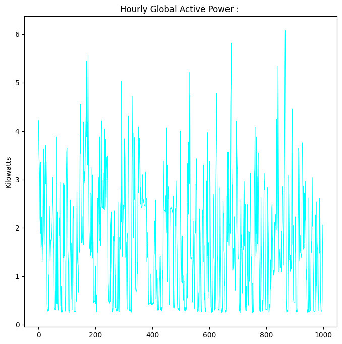
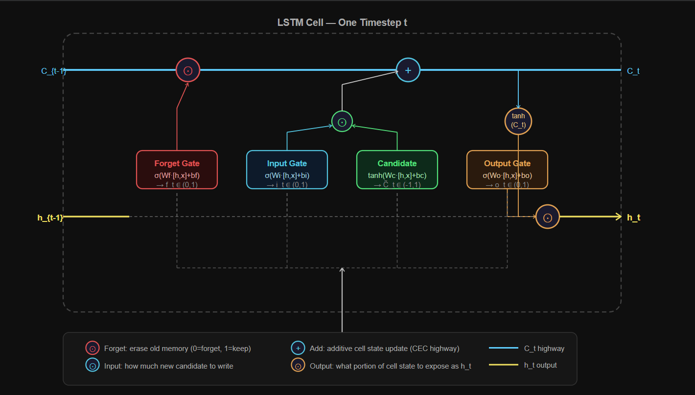
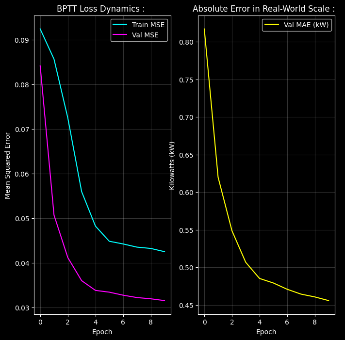

# Electric Power Demand Forecasting : 

---

## Problem :

Forecasting household electric power consumption one hour ahead using a **Long Short-Term** Memory network trained on real residential grid data.

**Dataset :** UCI Individual Household Electric Power Consumption with 1-minute resolution power readings from a single French household over 4 years, downsampled to hourly.

**Feature :** `Global_active_power`; total active power drawn from the grid in kilowatts.

**Task :** Univariate time-series regression where we have the last 24 hours of power consumption, predict the next hour.

**Advantage over Vanilla RNN** :  Day 19 showed the structural ceiling of vanilla RNNs; gradient signal from early timesteps decays to near-zero exponentially.
A 24-hour window requires remembering that the 6am coffee machine spike at step 1 influences the 11pm baseline at step 24. LSTM was specifically engineered to fix this.

---

## Pipeline :

1. Load raw 1-minute CSV, parse datetime index.
2. Sort chronologically, set datetime as index.
3. Forward-fill missing sensor readings.
4. Resample from 1-minute to hourly by averaging.
5. Drop any remaining NaN rows.
6. EDA : visualize hourly power signal.
7. Scale to $[-1, 1]$ with MinMaxScaler.
8. Sequential 80/20 train/test split.
9. Build sliding window dataset: $(N, 24, 1)$ tensors on-the-fly.
10. Train 2-layer stacked LSTM for 10 epochs with BPTT + gradient clipping.
11. Track Train MSE, Val MSE, Val MAE (in real kilowatts via inverse transform).
12. Measure inference latency on a single sequence.
13. Plot loss dynamics and real-world error curves.

---

## Significance of LSTM : 

In a vanilla RNN, the gradient of the loss with respect to a hidden state $N$ steps back involves multiplying $W_{hh}$ by itself $N$ times: $W_{hh}^N$. 
If the eigenvalues of $W_{hh}$ are less than 1; which is likely after weight initialization and updates the product shrinks to zero exponentially. By step 10, the gradient is negligible. With later steps, it is effectively dead.

LSTM replaces the multiplicative hidden state update with an **Additive cell state update**. The gradient through the cell state involves addition, not multiplication. 
This is the **Constant Error Carousel**(CEC); the name given by the original LSTM authors (Hochreiter and Schmidhuber, 1997) to describe a gradient pathway that does not decay through time.

---

## EDA : 

### Raw Hourly Power Signal : 

The first 1,000 hourly records show a non-stationary, volatile signal, daily peaks around morning and evening, overnight lows near zero, and sharp spikes from high-draw appliances. 
The signal has clear periodicity (24-hour daily cycle) nested inside longer-term trends (seasonal variation). This is exactly the type of multi-scale temporal pattern that LSTM's gated memory is designed to model.

---

## Data Preprocessing : 

### Forward Fill : `df.ffill()`

Sensors go offline. A power meter that drops out for 3 minutes leaves gaps in the CSV. We cannot fill these with zero, the power did not turn off, the sensor just failed. Forward fill copies the last valid reading forward into the dead space. 
It assumes the physical state of the grid did not change wildly during a short sensor outage, which is a reasonable assumption for 1-3 minute gaps in a residential power circuit.

### Hourly Resampling : `df.resample('h').mean()`

The raw dataset records every minute. A 24-hour lookback window at 1-minute resolution requires a sequence of $24 \times 60 = 1{,}440$ timesteps. 
Feeding an LSTM 1,440 steps triggers the information bottleneck even in gated architectures this way cell state vector simply runs out of capacity to carry 1,440 distinct signals simultaneously.

`resample('h').mean()` averages 60 consecutive 1-minute rows into a single hourly row. This compresses the 1,440-step sequence down to 24 steps, preserving the daily trend while discarding minute-to-minute noise. The result is a signal the LSTM can actually learn from.

### MinMaxScaler to $[-1, 1]$ : 

LSTM uses tanh to produce hidden states and cell state candidates. tanh saturates outside $[-3, 3]$ and its gradient approaches zero in saturated regions. Raw power values of 0-6kW fed into tanh produce saturation and dead gradients. 
Scaling to $[-1, 1]$ keeps all inputs in the active gradient region of tanh.

### 2D CSV to 3D Tensor : 

Raw data after preprocessing is a 2D matrix of shape $(N_t, 1)$; one power reading per hourly timestep. An LSTM expects 3D input: $(\text{Batch},\; T,\; F)$ where $T$ is sequence length and $F$ is features.

The `TimeSeriesData` Dataset converts this on-the-fly. For window index $i$ with `seq_len=24`:

$$X_i = \text{data}[i : i+24], \quad \text{shape } (24, 1)$$

$$y_i = \text{data}[i + 24], \quad \text{shape } (1,)$$

The DataLoader stacks these into batches of 256: shape $(256, 24, 1)$. Windows are never all materialized in RAM at once,  `__getitem__` slices them dynamically.

---

## Hyperparameters  : 

| Parameter | Value | Reason |
|-----------|-------|-----|
| `seq_len` | 24 | One full daily cycle which is the minimum context needed to capture morning/evening demand patterns |
| `features` | 1 | Univariate, only `Global_active_power` |
| `hidden_dim` | 64 | 64-dimensional memory vector. Large enough to encode daily patterns, small enough to avoid overfitting on ~35,000 hourly samples |
| `num_layers` | 2 | Stacked LSTMs as layer 1 extracts low-level temporal patterns, layer 2 combines them into higher-level trends. Dropout applied between layers |
| `batch_size` | 256 | Standard minibatch size, it balances gradient quality and training speed |

---

## LSTM Architecture and Gate Math : 

At every timestep $t$, the LSTM cell receives the current input $x_t \in \mathbb{R}^1$ and two carry vectors from the previous step: hidden state $h_{t-1} \in \mathbb{R}^{64}$ and cell state $C_{t-1} \in \mathbb{R}^{64}$.
It runs **four** parallel computations : 

### Forget Gate $f_t$ : 

$$f_t = \sigma(W_f \cdot [h_{t-1},\, x_t] + b_f)$$

$\sigma$ is sigmoid, outputting values in $(0, 1)$ for every dimension of the cell state. A value of $0$ means "erase this memory completely." A value of $1$ means "keep this memory perfectly." The gate learns which dimensions of $C_{t-1}$ are still relevant given what just happened at $x_t$.

eg : if $x_t$ is a near-zero power reading (3am, household asleep), the forget gate may strongly suppress the memory of yesterday's afternoon peak as that pattern is not relevant to the current sleeping-household context.

### Input Gate $i_t$ and Candidate $\tilde{C}_t$ : 

$$i_t = \sigma(W_i \cdot [h_{t-1},\, x_t] + b_i)$$

$$\tilde{C}_t = \tanh(W_C \cdot [h_{t-1},\, x_t] + b_C)$$

$i_t$ decides how much of the new candidate memory to write. $\tilde{C}_t$ is the candidate ie. new information this timestep proposes to add. The final write is their elementwise product; only the dimensions $i_t$ selects get updated with the values $\tilde{C}_t$ proposes.

### Cell State Update(The Additive Highway) : 

$$C_t = f_t \odot C_{t-1} + i_t \odot \tilde{C}_t$$

This is the key equation. The cell state is updated by **addition**, not matrix multiplication. Old memory is scaled (forget gate) and new memory is added (input gate). This additive structure is what **protects gradients during backpropagation**.

### Output Gate $o_t$ and Hidden State : 

$$o_t = \sigma(W_o \cdot [h_{t-1},\, x_t] + b_o)$$

$$h_t = o_t \odot \tanh(C_t)$$

$o_t$ controls what portion of the cell state is exposed as the hidden state $h_t$. The cell state $C_t$ is the full internal memory where $h_t$ is the curated output. Only what is relevant for the current prediction is revealed.

---

## The Constant Error Carousel (Vanishing Gradient Resolved) : 

The gradient of the loss flowing back through the cell state from step $t$ to step $t-1$ :

$$\frac{\partial C_t}{\partial C_{t-1}} = f_t$$

That is it. Just the forget gate value. Comparing this to Vanilla RNN where the equivalent derivative was:

$$\frac{\partial h_t}{\partial h_{t-1}} = \text{diag}(1 - \tanh^2(Z)) \cdot W_{hh}$$

In Vanilla RNN, gradient decay comes from two sources; the tanh derivative (always $\leq 1$) and the weight matrix (repeated multiplication). 

In LSTM, the gradient through the cell state is just $f_t$ a scalar between 0 and 1 set by the forget gate.

**Backpropagation :**

$$\frac{\partial \mathcal{L}}{\partial C_{t-1}} = \frac{\partial \mathcal{L}}{\partial C_t} \cdot f_t$$

$$\frac{\partial \mathcal{L}}{\partial C_{t-2}} = \frac{\partial \mathcal{L}}{\partial C_t} \cdot f_t \cdot f_{t-1}$$

When the forget gate learns to stay near 1, which happens when the model decides long-term memory is important then the gradient product $f_t \cdot f_{t-1} \cdots \approx 1$. The gradient does not vanish. 
The model learns to keep the gradient pathway open by keeping the forget gate open. This is the Constant Error Carousel; the error signal rides the additive cell state highway backward through time without exponential decay.

---

## Time and Space Complexity : 

Let $T$ = sequence length (24), $H$ = hidden dim (64), $I$ = input features (1), $L$ = layers (2), $N$ = samples, $E$ = epochs.

**Training complexity :**

$$O\!\left(E \cdot N \cdot T \cdot L \cdot 4(H^2 + I \cdot H)\right)$$

The factor of 4 comes from the four gate computations (forget, input, output, candidate) as each require one $H \times H$ and one $H \times I$ matrix multiply. Stacked layers multiply this by $L$.
Like vanilla RNN, the $T$ timesteps are strictly sequential, step $t$ requires $h_{t-1}$ and $C_{t-1}$, so no parallelism across time.

**Space complexity :**

$$O(T \cdot L \cdot H)$$

BPTT requires caching both the hidden state $h_t$ and cell state $C_t$ for every timestep in every layer, plus all four gate activation vectors.
This is 6 vectors of size $H$ per timestep per layer. For our config: $24 \times 2 \times 6 \times 64 = 18{,}432$ floats per sample which is small, but scales linearly with sequence length and becomes the GPU memory bottleneck for long sequences.

---

## Results : 

| Epoch | Train MSE | Val MSE | Val MAE (kW) |
|-------|-----------|---------|--------------|
| 1 | 0.0924 | 0.0841 | 0.8172 |
| 2 | 0.0857 | 0.0507 | 0.6199 |
| 3 | 0.0725 | 0.0411 | 0.5488 |
| 4 | 0.0559 | 0.0360 | 0.5066 |
| 5 | 0.0482 | 0.0338 | 0.4852 |
| 6 | 0.0448 | 0.0334 | 0.4791 |
| 7 | 0.0442 | 0.0327 | 0.4708 |
| 8 | 0.0435 | 0.0322 | 0.4644 |
| 9 | 0.0432 | 0.0319 | 0.4606 |
| 10 | 0.0425 | 0.0315 | 0.4558 |

Training time : **6.29 seconds**. 

Inference latency (single 24-step sequence) : **0.00081 seconds**.

Val MSE drops from 0.084 to 0.031; a 63% reduction. Val MAE reaches 0.456 kW, meaning the model's real-world hour-ahead prediction is off by less than half a kilowatt on average. 
Unlike Day 19's vanilla RNN which plateaued at epoch 2, LSTM continues improving through all 10 epochs as the gate mechanism actively prevents the gradient from dying.

---

## Failure Case Analysis : 

**The 1,000-step memory wall :** The CEC fixes vanishing gradients for sequences of tens to hundreds of steps. For sequences of thousands of steps, the cell state vector simply cannot store 1,000 independent signals simultaneously. Earlier memories get overwritten by more recent ones regardless of gate settings. The architecture has a hard capacity limit set by `hidden_dim`.

**Sequential compute is non-negotiable :** Step $t$ needs $C_{t-1}$ and $h_{t-1}$. There is no way to compute step 10 before step 9 completes. On GPU, where parallelism is the primary speed advantage, this means a 1,000 step LSTM runs 1,000 sequential kernel launches.

**Concept drift :** The LSTM memorizes the statistical patterns of power consumption in its training data. If the household installs an EV charger, a heat pump, or solar panels after the training window, the demand pattern shifts structurally. The static weights have no mechanism to detect or adapt to this shift. 

**Four gates, four times the parameters :** A single LSTM layer with hidden dim $H$ and input dim $I$ has $4(H^2 + IH + H)$ parameters thus four times the equivalent vanilla RNN. For $H = 64$, $I = 1$: approximately 16,640 parameters per layer. This makes LSTMs slower to train and more prone to overfitting on very small datasets.

**Sensitivity to sequence length choice :** `seq_len = 24` was chosen to match the known 24-hour periodicity of power consumption. If the true relevant dependency is at a different timescale, weekly patterns, seasonal drift etc, a 24-hour window cannot capture it. The model has no mechanism to look beyond its window.

---

## Key Takeaways : 

- LSTM **solves vanilla RNN's vanishing gradient** through a single change; replacing the multiplicative hidden state update with an additive cell state update. The gradient through the cell state is just $f_t$, a learned gate, not a repeated matrix product.
- Hourly Resampling is not just a data compression trick but rather a deliberate choice to match the sequence length to the known periodicity of the target signal. 
- Val MAE of 0.456 kW means the model is, on average, predicting within half a kilowatt of actual consumption one hour ahead which is quite useful for smart grid load balancing applications.
- LSTM is the correct architecture when sequences have long-range dependencies, moderate length (up to a few hundred steps), and structured periodicity.
