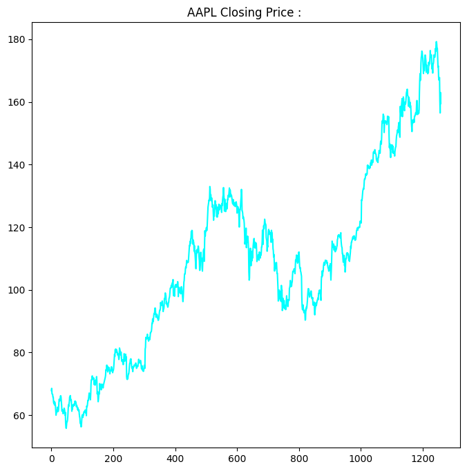
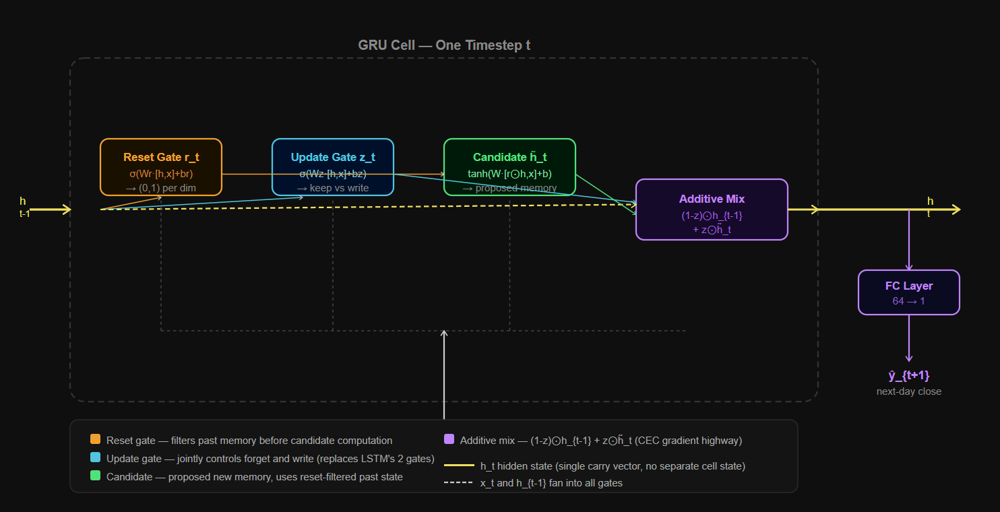
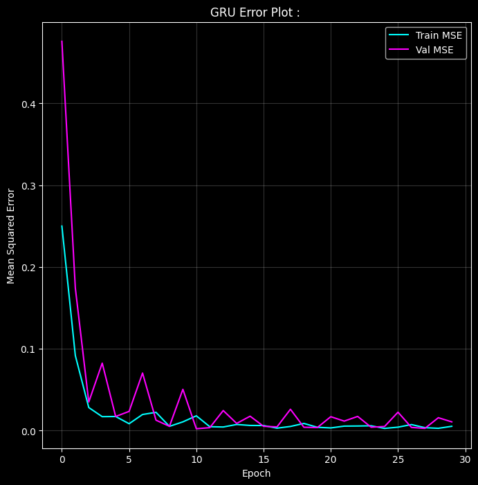

# Bivariate Market Volatility Modeling : 

---
## Problem : 

Forecast the next-day closing price of Apple Inc. (AAPL) stock using historical price and volume data modeled as a sequential regression problem.

**Dataset :** S&P 500 stock data (5-year OHLCV history). Single asset extracted: AAPL, 1,259 trading days.

**Features used :** `close` (closing price) and `volume` (shares traded).

**Target :** Next-day closing price; univariate regression on a multivariate input sequence.

**GRU over LSTM :** LSTM uses 4 gate computations per timestep. GRU uses 2 as it merges the forget and input gates into a single update gate and eliminates the separate cell state.
Fewer parameters, fewer matrix multiplications, faster training, and **empirically comparable performance** on shorter sequences like a 20-day trading window. 
GRU is the right choice when you want **LSTM-quality memory** without LSTM-level computational overhead.

---

## GRU vs LSTM :

LSTM maintains two separate carry vectors; The **Hidden State** $h_t$ (short-term memory) and the **Cell State** $C_t$ (long-term memory). Two vectors and four gates, substantial overhead.

GRU collapses this into **one hidden state** and **two gates**:

- No separate cell state.
- Forget and input decisions made jointly by a single update gate.
- Reset gate controls how much past memory influences the new candidate.

This is not just an engineering shortcut. it is a deliberate simplification that works because stock price sequences have moderate-length dependencies (days to weeks), not the very long-range dependencies that justify LSTM's full machinery.

---

## Pipeline : 

1. Load full S&P 500 CSV, filter to AAPL rows, sort by date.
2. EDA: plot closing price over all trading days.
3. Extract `close` and `volume` as the feature matrix.
4. Scale both features to $[-1, 1]$ with MinMaxScaler.
5. Sequential 80/20 train/test split, no shuffling.
6. Build sliding window dataset: $(N, 20, 2)$ tensors on-the-fly.
7. Train 2-layer stacked GRU for 30 epochs with BPTT and gradient clipping.
8. Log Train MSE and Val MSE every 5 epochs.
9. Measure inference latency on a single dummy sequence.
10. Plot loss dynamics over 30 epochs.

---

## EDA : 

### AAPL Closing Price : 



1,259 trading days from 2013 to 2018. The stock shows a clear **long-term upward trend** with multiple correction periods, particularly the sharp drawdown around trading day 800 (2016 correction).
The signal is **non-stationary**; variance grows with price level, and the mean shifts continuously. MinMaxScaler is mandatory as raw prices of \$60 to \$180 fed into tanh saturate immediately.

---

## Data Preprocessing : 

### Isolating a Single Asset : 

The full dataset contains multiple tickers. Filtering to AAPL and sorting by date produces a clean, strictly chronological 1,259-row time series. 
Mixing multiple tickers would introduce discontinuities which will make the GRU would see a AAPL price followed by an AMZN price and try to model the "transition," which is meaningless.

### MinMaxScaler to $[-1, 1]$ : 

Applied to both `close` and `volume` jointly on the training set. The scaler is **fit on training data only** and applied to test data using the same parameters.
Fitting on the full dataset would leak future price statistics into the training window, creating lookahead bias. In financial modeling this is a critical correctness requirement, not just a convention.

### 2D CSV to 3D Tensor : 

Raw data after scaling is shape $(N_t, 2)$; one row per trading day, two features. The GRU requires $(B, T, F)$ -> batch, sequence, features.

For window index $i$ with `seq_len=20`:

$$X_i = \text{data}[i : i+20,\; :], \quad \text{shape } (20, 2)$$

$$y_i = \text{data}[i + 20,\; 0], \quad \text{shape } (1,) \quad \text{(close price only)}$$

The target is the closing price at the next timestep which is only the first column, not both features. Volume is an input signal, not a prediction target. 
The DataLoader batches these into $(64, 20, 2)$. **Shuffle must be False** ie. shuffling would let the model train on day 800 and validate on day 200, which is future leakage.

---

## Hyperparameters : 

| Parameter | Value | Significance |
|-----------|-------|-----|
| `seq_len` | 20 | One trading month. 20 trading days = ~4 calendar weeks. Captures intra-month momentum and mean-reversion patterns without the noise of shorter windows |
| `features` | 2 | Close price + volume. Volume is a leading indicator as unusual volume precedes price moves |
| `hidden_dim` | 64 | 64-dimensional hidden state. Sufficient to encode a month of price-volume dynamics without overfitting on 1,000 training samples |
| `num_layers` | 2 | Stacked GRU: layer 1 extracts short-term price patterns, layer 2 captures how those patterns evolve over time |
| `batch_size` | 64 | Smaller than Day 20's 256 as the dataset is much smaller (~1,000 training windows vs ~35,000). Larger batches would underutilize the gradient signal |
| `epochs` | 30 | Longer than previous models because the dataset is smaller thus more passes are needed for convergence |

---

## GRU Architecture and Gate Math: 

At every timestep $t$, the GRU receives input $x_t \in \mathbb{R}^2$ and previous hidden state $h_{t-1} \in \mathbb{R}^{64}$.

### Reset Gate $r_t$ : 

$$r_t = \sigma(W_r \cdot [h_{t-1},\, x_t] + b_r)$$

It controls how much of the past hidden state influences the candidate computation. When $r_t \approx 0$, the gate resets memory, the candidate is computed almost entirely from the current input, ignoring past context. When $r_t \approx 1$, full past context is used.

In stock terms : if today's price movement is an extreme outlier (earnings surprise, market crash), the reset gate can learn to ignore the previous month's smooth trend and compute a fresh candidate from today's data alone.

### Update Gate $z_t$ : 

$$z_t = \sigma(W_z \cdot [h_{t-1},\, x_t] + b_z)$$

This is **GRU's master control**.

It simultaneously decides:
- Amount of the old memory to keep: $(1 - z_t) \odot h_{t-1}$
- Amount of the new candidate to write: $z_t \odot \tilde{h}_t$

When $z_t \approx 0$: Keep old memory, ignore new input. When $z_t \approx 1$: replace memory with the new candidate. This single gate replaces LSTM's separate forget gate ($f_t$) and input gate ($i_t$) here they are coupled by the constraint $f_t + i_t = 1$.

### Candidate Hidden State $\tilde{h}_t$ : 

$$\tilde{h}_t = \tanh(W \cdot [r_t \odot h_{t-1},\, x_t] + b)$$

The proposed new memory. Past hidden state is first filtered by the reset gate before entering this computation.
The candidate only sees the portion of past context that the reset gate deems relevant.

### Final Update : 

$$h_t = (1 - z_t) \odot h_{t-1} + z_t \odot \tilde{h}_t$$

This is the additive update, the same mechanism that protects LSTM's cell state from vanishing gradients. 
The hidden state is a **weighted interpolation** between old memory and new candidate, controlled entirely by $z_t$.

### Output : 

After processing all 20 timesteps, the final hidden state $h_{20} \in \mathbb{R}^{64}$ is passed to the FC layer:

$$\hat{y} = W_{\text{fc}}\, h_{20} + b_{\text{fc}} \in \mathbb{R}^1$$

A single scalar is the predicted next-day closing price in scaled space. 
Inverse-transforming gives the actual **dollar prediction**.

---

## BPTT : 

The gradient of the loss flowing back through $h_t$ to $h_{t-1}$:

$$\frac{\partial h_t}{\partial h_{t-1}} = (1 - z_t) + z_t \cdot \frac{\partial \tilde{h}_t}{\partial h_{t-1}}$$

The $(1 - z_t)$ term is a direct additive gradient path which is identical to LSTM's CEC. When the update gate keeps memory mostly unchanged ($(1-z_t) \approx 1$), the gradient flows back nearly unchanged:

**Step 1 :**

$$\frac{\partial \mathcal{L}}{\partial h_{t-1}} \approx \frac{\partial \mathcal{L}}{\partial h_t} \cdot (1 - z_t)$$

**Step 2 :**

$$\frac{\partial \mathcal{L}}{\partial h_{t-2}} \approx \frac{\partial \mathcal{L}}{\partial h_t} \cdot (1-z_t)(1-z_{t-1})$$

When the update gate learns to remain open (near 1) for important historical signals, the product stays near 1 thus gradient does not vanish. 
This is GRU's version of the Constant Error Carousel: the additive hidden state update replaces LSTM's additive cell state update, serving the same purpose with fewer parameters.

Gradient clipping (`max_norm=1.0`) handles the opposite case ie. when gate values push gradients above 1, clipping prevents explosion.

---

## Architecture : 

```
Input sequence: (Batch, 20, 2)
    |
GRU Layer 1: hidden_dim=64, tanh         → (Batch, 20, 64)
Dropout: 0.1
GRU Layer 2: hidden_dim=64, tanh         → (Batch, 20, 64)
    |
Take final timestep: out[:, -1, :]       → (Batch, 64)
    |
FC Layer: 64 → 1                         → (Batch, 1)
    |
Prediction: next-day close price (scaled)
```



---

## Time, Space, and Inference Complexity : 

Let $T$ = sequence length (20), $H$ = hidden dim (64), $I$ = input features (2), $L$ = layers (2), $N$ = samples, $E$ = epochs.

**Training complexity :**

$$O\!\left(E \cdot N \cdot T \cdot L \cdot 3(H^2 + I \cdot H)\right)$$

Factor of 3 from the three gate/candidate computations; compared to LSTM's factor of 4. Each involves one $H \times H$ and one $H \times I$ matrix multiply. Strictly sequential across $T$, step $t$ requires $h_{t-1}$.

**Space complexity :**

$$O(T \cdot L \cdot H)$$

GRU caches only $h_t$ per timestep per layer for BPTT, no cell state to store. LSTM caches both $h_t$ and $C_t$ plus 4 gate vectors. GRU requires roughly half the activation memory of LSTM at the same hidden dimension.

**Inference per sample :**

$$O(T \cdot L \cdot 3(H^2 + I \cdot H))$$

One forward pass, no gradient computation. Measured latency : 0.0081s

---

## Results

Training logged every 5 epochs:

| Epoch | Train MSE | Val MSE |
|-------|-----------|---------|
| 5 | 0.09723 | 0.01730 |
| 10 | 0.01070 | 0.05047 |
| 15 | 0.00631 | 0.01761 |
| 20 | 0.00408 | 0.00375 |
| 25 | 0.00269 | 0.00503 |
| 30 | 0.00528 | 0.01071 |

Training time : 6.29s.
Inference Latency : 0.0081s.

The loss curve shows the characteristic GRU convergence pattern where we see a sharp drop in the first 3-5 epochs as the gates learn the dominant price trend, followed by oscillating val loss as the model navigates the tension between memorizing the training price regime and generalizing to the test window.



---

## Failure Case Analysis : 

**Regime non-stationarity :** The model learns the statistical properties of AAPL prices from 2013-2017. When the test window enters a different volatility regime, higher variance, different correlation between volume and price thn the fixed weights underperform. There is no online adaptation mechanism. A model that learned the 2013 bull market has no idea it is now in a 2018 correction.

**Persistence trap :** The easiest way to minimize MSE on a price series is to predict $\hat{y}_{t+1} = y_t$ — the persistence strategy. If the model is **undertrained or the learning rate is poorly set**, it converges to this trivial solution. MSE alone cannot detect this. Directional accuracy is the diagnostic metric.

**Lookahead bias from Scaling :** If MinMaxScaler is fit on the full dataset before splitting, the scaler uses the test set's price range to normalize training data. The model implicitly "knows" that prices will eventually reach their test-set highs. This **inflates performance** while being completely invalid for real deployment.

**No Exogenous signals :** The model only sees price and volume. Real market movements are driven by earnings releases, Fed announcements, sector rotation, geopolitical events. A GRU trained on price alone cannot model what it cannot see. Multivariate models incorporating macro signals, sentiment data, or order book depth consistently outperform price-only models.

**Coupled gates limit flexibility :** LSTM's separate forget and input gates allow the model to simultaneously keep old memory strongly while writing a lot of new information, or vice versa; all four combinations. GRU's update gate enforces that keeping more old memory means writing less new information ($f + i = 1$). Financial data with sudden regime changes where we need to replace old memory with new signals instantly, this coupling is a structural constraint.

**Short sequence length for long-range patterns :** `seq_len = 20` captures one trading month. Weekly seasonality and quarterly earnings cycles operate at longer timescales. The model cannot detect that April tends to be a strong month for AAPL if it only ever sees 20 days at a time.

---

## Key Takeaways : 

- GRU achieves LSTM-comparable performance on **moderate-length** sequences with roughly 25% fewer parameters and faster per-epoch training due to three gate computations instead of four.
- The update gate is GRU's core innovation, it couples the forget and input decisions into a single control signal, eliminating the need for a separate cell state while preserving the additive gradient highway.
- The additive hidden state update $(1-z_t) \odot h_{t-1} + z_t \odot \tilde{h}_t$ provides the same vanishing gradient protection as LSTM's CEC as gradients ride the $(1-z_t)$ term backward without exponential decay.
- Volume as a feature is not cosmetic, it carries real predictive signal for next-day price because unusual volume precedes institutional buying and selling. The model implicitly learns this correlation through the hidden state.
- MSE is a necessary but not sufficient evaluation metric for financial forecasting. A model with low MSE that always predicts yesterday's price is useless. Directional accuracy, Sharpe ratio of strategy returns, and maximum drawdown are the metrics that matter in production.
