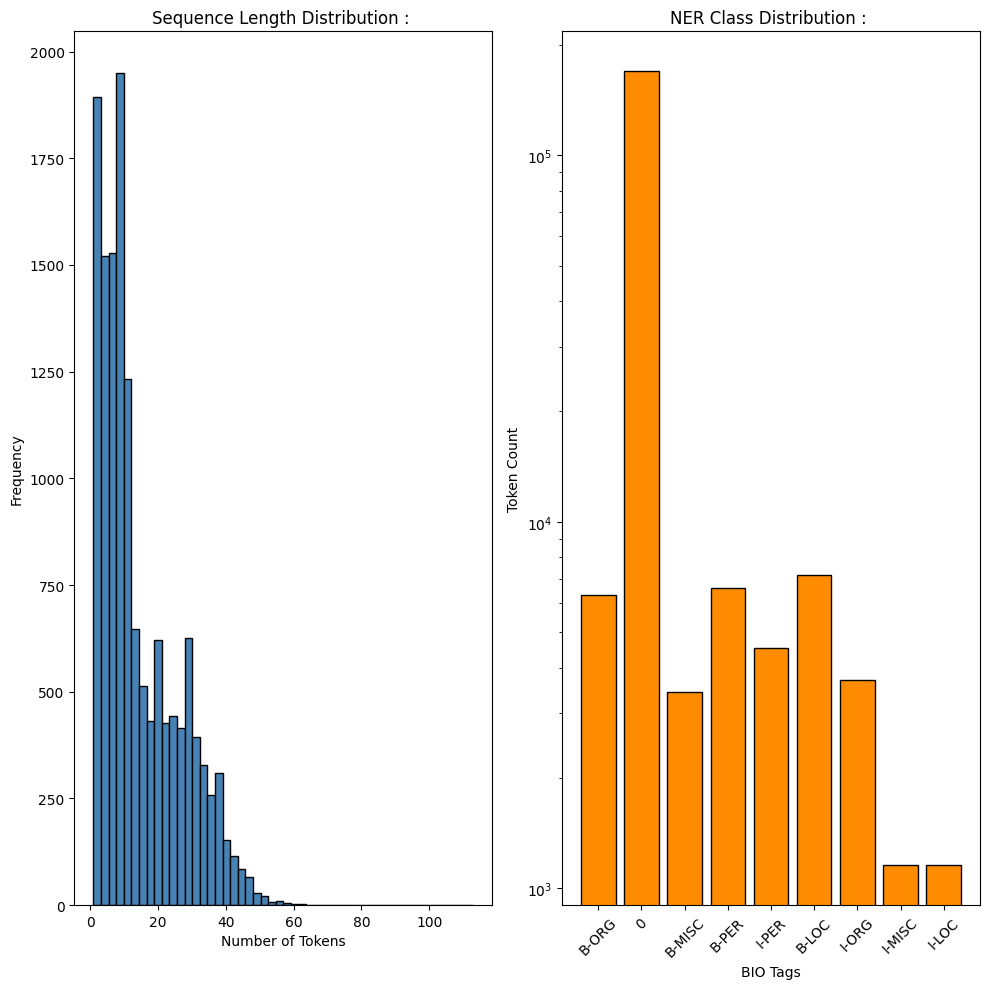
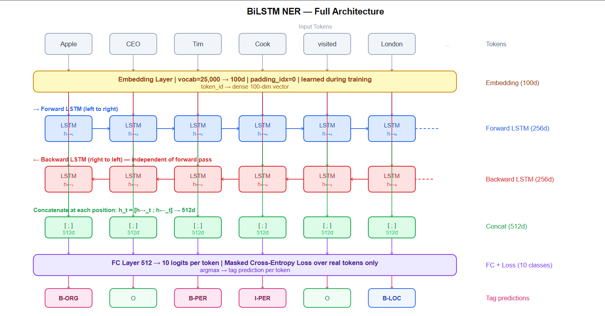
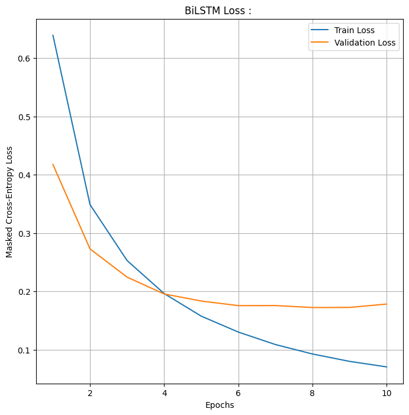

# Named Entity Recognition : 

---

## Problem : 

Tag every token in a sentence with its named entity category, Person, Organization, Location, Miscellaneous, or Outside (not an entity).

**Dataset :** CoNLL-2003, the standard NER benchmark, sourced via Hugging Face `datasets`. English newswire text from Reuters.

**Task :** Sequence labeling we are given a sentence of $N$ tokens, produce $N$ tag predictions, one per token.

**Significance of BiLSTM over Vanilla LSTM :** A standard LSTM reads left to right. When it reaches the word "bank" in "Akshat reached the bank of river Ganga", it has context about everything before it but nothing after. The word "river" after "bank" is strong evidence that "bank" is the river bank, not the financial bank.
A BiLSTM runs two LSTMs simultaneously; one forward, one backward and then concatenates their hidden states at every position. The classification layer sees full sentence context on both sides before making any prediction.

---

## The BIO Tagging Scheme : 

Every token receives exactly one tag. The tagging scheme is BIO : 

- **B-TYPE** : Beginning of a named entity of that type.
- **I-TYPE** : Inside (continuation) of a named entity.
- **O** : Outside, not part of any named entity.

Example : `"Akshat Mishra visited Prague"`

| Token | Tag |
|-------|-----|
| Akshat | B-PER |
| Mishra | I-PER |
| visited | O |
| Prague | B-LOC |

The full tag set used here (9 tags + 1 padding tag) :

| Index | Tag | Meaning |
|-------|-----|---------|
| 0 | O | Not an entity |
| 1 | B-PER | Begin Person |
| 2 | I-PER | Inside Person |
| 3 | B-ORG | Begin Organization |
| 4 | I-ORG | Inside Organization |
| 5 | B-LOC | Begin Location |
| 6 | I-LOC | Inside Location |
| 7 | B-MISC | Begin Miscellaneous |
| 8 | I-MISC | Inside Miscellaneous |
| 9 | PAD | Padding, ignored in loss |

---

## Pipeline : 

1. Load CoNLL-2003 via Hugging Face `datasets`.
2. EDA: sequence length distribution, NER class distribution.
3. Build vocabulary from training tokens, top 25,000 words, `<PAD>` and `<UNK>` reserved.
4. Build `CoNLLData` Dataset: convert tokens to integer IDs, NER tags to integer labels.
5. Build `pad_collate` function for dynamic batch padding.
6. Train 2-layer bidirectional LSTM for 10 epochs with masked cross-entropy loss.
7. Apply AMP (Automatic Mixed Precision) for GPU memory efficiency.
8. Track train and val loss per epoch.
9. Plot loss curves.

---

## EDA : 

### Dataset Statistics : 

- Total training sequences : 14,041.
- Maximum sequence length : 113 tokens.
- Average sequence length : 14.50 tokens.

### Class Imbalance : 

| Tag | Count |
|-----|-------|
| O | 169,578 |
| B-LOC | 7,140 |
| B-PER | 6,600 |
| B-ORG | 6,321 |
| I-PER | 4,528 |
| I-ORG | 3,704 |
| B-MISC | 3,438 |
| I-LOC | 1,157 |
| I-MISC | 1,155 |

The O tag appears 169,578 times which is roughly 25x more than any entity tag. This is the fundamental challenge of NER; the model could achieve ~85% token accuracy by predicting O for everything.
The masked loss and evaluation on entity F1 (not overall accuracy) are the solutions.



---

## Data Preprocessing : 

### Vocabulary Construction : 

The vocabulary is built from the top 25,000 most frequent lowercase tokens in the training set.

Two special tokens are reserved:

- `<PAD>` (index 0): placeholder for padding positions.
- `<UNK>` (index 1): any token not in the top 25,000.

The vocabulary is fit on training data only. Test tokens outside this vocabulary map to `<UNK>` , this is the OOV problem.

### Dynamic Padding and `pad_collate` : 

Sentences in CoNLL-2003 have variable lengths (2 to 113 tokens). PyTorch DataLoaders require **fixed-size tensors** in a batch. Naively padding all sequences to the global maximum (113) wastes ~85% of GPU computation on padding zeros for the average sequence of length 14.

`pad_collate` solves this by padding only to the maximum length within the current batch. A batch of short sentences gets a small tensor; a batch with one long sentence gets a larger one. This is dynamic padding where the tensor shape varies per batch.

Three tensors are produced per batch :
- `x_padded`: token IDs, padded with 0 (`<PAD>`)
- `y_padded`: tag IDs, padded with 9 (the PAD tag index)
- `mask`: boolean tensor which is True for real tokens, False for padding positions

### Masked Cross-Entropy Loss : 

Standard cross-entropy averages loss across all positions in the batch, including padding positions. Padding positions have no correct tag so their label (9) is arbitrary.
Including them in the loss calculation introduces *false gradients* that push the model to correctly predict "padding", which is meaningless and corrupts training.

The mask tensor $M \in \{0, 1\}^{B \times T}$ identifies real token positions. The masked loss computes cross-entropy without reduction, then applies the mask:

$$\mathcal{L} = \frac{\sum_{i,t} \ell_{i,t} \cdot M_{i,t}}{\sum_{i,t} M_{i,t}}$$

Where $\ell_{i,t}$ is the per-token cross-entropy for sample $i$ at position $t$. The denominator normalizes by the number of real tokens, not the padded batch size.
This ensures the loss is not artificially diluted by padding.

---

## Word Embeddings

Each token ID is mapped to a 100-dimensional dense vector via `nn.Embedding(vocab_size = 25000, embed_dim = 100)`. These embeddings are initialized randomly and learned during training as the model figures out that "London" and "Paris" should have similar representations because they appear in similar contexts.

The embedding layer maps discrete token IDs to continuous vector space where semantic relationships emerge geometrically. Words used in similar syntactic contexts end up close together. 
The BiLSTM then operates on these dense vectors, not the raw integer IDs.

The `padding_idx = 0` argument tells PyTorch to always keep the embedding for index 0 as a zero vector and never update it, padding positions contribute zero signal to the LSTM.

---

## BiLSTM Architecture : 

### Forward and Backward Passes : 

Two independent LSTM instances run in parallel on the same sequence:

**Forward LSTM** reads left to right :

$$\overrightarrow{h}_t = \text{LSTM}_{fwd}(x_t,\; \overrightarrow{h}_{t-1})$$

At position $t$, the forward hidden state encodes all context from tokens $1$ to $t$.

**Backward LSTM** reads right to left :

$$\overleftarrow{h}_t = \text{LSTM}_{bwd}(x_t,\; \overleftarrow{h}_{t+1})$$

At position $t$, the backward hidden state encodes all context from tokens $T$ down to $t$. 
The two passes are completely independent of each other, no information flow between them. Each runs its own full BPTT computation.

Only after both complete are their outputs concatenated:

$$h_t = [\overrightarrow{h}_t;\; \overleftarrow{h}_t] \in \mathbb{R}^{512}$$

With hidden dim 256 per direction, the concatenated state is 512-dimensional. Every token's representation now encodes what came before it and what comes after it simultaneously. 
This is what a vanilla LSTM cannot do as it is permanently blind to future context.

### Architecture : 

```
Input tokens: (Batch, T)
     |
Embedding: 25000 → 100d            → (Batch, T, 100)
Dropout 0.3
     |
BiLSTM Layer 1: 100 → 256 × 2     → (Batch, T, 512)
Dropout 0.3
BiLSTM Layer 2: 512 → 256 × 2     → (Batch, T, 512)
     |
FC Layer: 512 → 10                 → (Batch, T, 10)
     |
Per-token logits → masked softmax → tag prediction
```



### Output : 

The FC layer projects the 512-dimensional concatenated state at every position to 10 logit scores ie. one per tag. 

The predicted tag for token $t$ is:

$$\hat{y}_t = \arg\max\; \text{FC}(h_t)$$

Loss is computed only over masked (real token) positions.

---

## Parameters : 

| Layer | Parameters |
|-------|------------|
| Embedding: $25000 \times 100$ | 2,500,000 |
| BiLSTM L1: $4 \times (100 \times 256 + 256 \times 256 + 256) \times 2$ | 722,944 |
| BiLSTM L2: $4 \times (512 \times 256 + 256 \times 256 + 256) \times 2$ | 1,836,032 |
| FC: $512 \times 10 + 10$ | 5,130 |
| **Total** | **~5,064,106** |

---

## Compute Management : `torch.amp` (Automatic Mixed Precision)

Training BiLSTMs on GPU with full FP32 precision is memory-intensive as a 512-dim hidden state over 14,000 sequences requires **substantial VRAM**. Automatic Mixed Precision (AMP) addresses this.

AMP runs matrix multiplications in FP16 (16-bit float) but keeps master weights and loss accumulation in FP32. FP16 tensors use **half the memory** and process faster on modern GPUs with Tensor Cores.
The `GradScaler` compensates for FP16's smaller numeric range as it scales the loss upward before backward, then scales gradients back down before the optimizer step, preventing underflow in small gradients.

```python
with torch.amp.autocast('cuda'):
    loss = masked_loss(model(x), y, mask)  # runs in FP16
scaler.scale(loss).backward()             # scaled backward
scaler.step(optimizer)                    # unscaled update
scaler.update()                           # adjust scale factor
```

The result: roughly *2x faster training and ~40% less VRAM* with negligible accuracy degradation. On CPU the scaler is None and standard FP32 runs.

---

## Time, Space, and Inference Complexity : 

Let $T$ = sequence length, $H$ = hidden dim per direction (256), $I$ = input dim (100 after embedding), $L$ = layers (2), $N$ = sequences, $E$ = epochs.

**Training complexity :**

$$O\!\left(E \cdot N \cdot T \cdot L \cdot 2 \cdot 4(H^2 + I \cdot H)\right)$$

Factor of 2 for the two directions. Factor of 4 for LSTM's four gates. Forward and backward passes are independent so they can run in parallel on GPU so the "2x" cost of BiLSTM vs unidirectional LSTM is partially absorbed by GPU parallelism, though not fully on a single device.

**Space complexity :**

$$O(T \cdot L \cdot 2 \cdot H)$$

Both forward and backward hidden states must be cached per layer per timestep for BPTT. Dynamic padding helps significantly where batches of short sequences use proportionally less VRAM.

**Inference per sequence :**

$$O(T \cdot L \cdot 2 \cdot 4(H^2 + I \cdot H))$$

Both directions must complete before the FC layer can produce any output as the backward LSTM requires the full sequence before it can produce $\overleftarrow{h}_1$. This means BiLSTM cannot stream predictions token by token. The full sequence must be seen first.
For real-time applications this is acceptable; for online streaming NER it is a hard constraint.

---

## Results : 

| Epoch | Train Loss | Val Loss | Time |
|-------|------------|----------|------|
| 1 | 0.6391 | 0.4176 | 9.97s |
| 2 | 0.3488 | 0.2728 | 8.46s |
| 3 | 0.2528 | 0.2244 | 9.20s |
| 4 | 0.1962 | 0.1955 | 11.31s |
| 5 | 0.1575 | 0.1834 | 10.04s |
| 6 | 0.1302 | 0.1755 | 8.40s |
| 7 | 0.1088 | 0.1756 | 10.82s |
| 8 | 0.0926 | 0.1722 | 9.17s |
| 9 | 0.0799 | 0.1724 | 9.50s |
| 10 | 0.0704 | 0.1782 | 8.54s |

Val loss drops sharply from 0.4176 to 0.1755 by epoch 6 then flatlines this is because the model has learned the dominant entity patterns and further training only improves training loss. 
The slight uptick at epoch 10 (0.1782) is the early sign of overfitting. 

**Average epoch time is ~9.5s.**



---

## Failure Case Analysis : 

**O-class dominance destroys recall :** With 169,578 O tokens vs ~6,000 of any entity class, a model predicting O for every token gets ~85% token accuracy. The masked loss prevents this from corrupting training gradients, but the model still has a strong prior toward O. Rare entity types (I-MISC: 1,155 instances) are systematically under-predicted. 

**OOV brittleness :** Tokens outside the 25,000-word vocabulary map to a single `<UNK>` vector. "Thunberg", "Pfizer", "Kyiv" ,all become the same input regardless of capitalization, position, or surrounding context. Character-level embeddings (a secondary CNN/LSTM over character sequences) solve this by encoding signals like capitalization and suffix that are strong NER cues.

**BIO constraint violations :** The model predicts each token independently so there is no mechanism preventing it from producing invalid sequences like I-PER without a preceding B-PER. A Conditional Random Field (CRF) layer on top of the BiLSTM enforces valid BIO transitions by jointly scoring the entire tag sequence rather than classifying tokens independently. 

**Nested entities :** BIO assumes mutual exclusivity ie. one tag per token. "Delhi University, Delhi" where "Delhi" is simultaneously inside the organization and a location cannot be represented. The model will pick one and ignore the other.

**Context horizon in long documents :** BiLSTM hidden states degrade for very long sequences. An entity mentioned in sentence 1 and referenced by pronoun in sentence 30 cannot be resolved as the LSTM state from sentence 1 is gone by sentence 30. Document-level NER requires attention-based architectures or sliding window approaches.

**No capitalization signal in embeddings :** Lowercasing all tokens before vocabulary lookup destroys one of the strongest NER cues in English, capitalization. "apple" (fruit) and "Apple" (company) map to the same embedding. Cased embeddings or a separate capitalization feature would recover this signal.

---

## Key Takeaways : 

- BiLSTM solves vanilla LSTM's fundamental limitation for sequence labeling: forward-only context. The concatenated state $[\overrightarrow{h}_t; \overleftarrow{h}_t]$ gives the classifier full sentence context at every position.
- Masked cross-entropy is not optional, including padding positions in the loss introduces meaningless gradients that actively corrupt NER learning.
- Dynamic padding via `pad_collate` is a practical engineering choice that significantly reduces wasted computation for datasets with variable-length sequences.
- AMP halves VRAM and accelerates training with negligible accuracy cost and it should be the default for any GPU training run.
- The O-class dominance problem means token accuracy is a misleading metric for NER. Entity-level precision, recall, and F1 per class are the relevant evaluation metrics.
- BiLSTM-CRF is the standard NLP production architecture for NER because the CRF layer enforces valid BIO transitions that the BiLSTM alone cannot guarantee. This model is the BiLSTM half of that pipeline.
