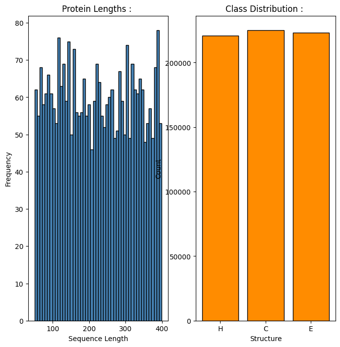
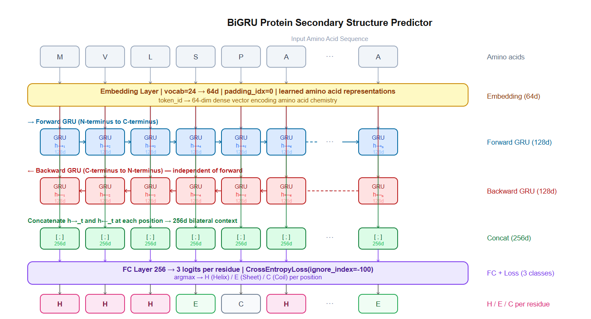
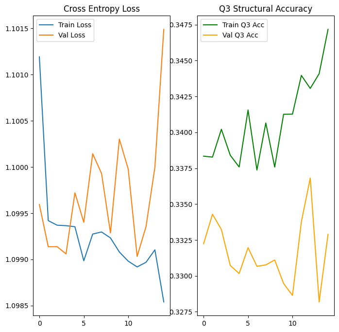
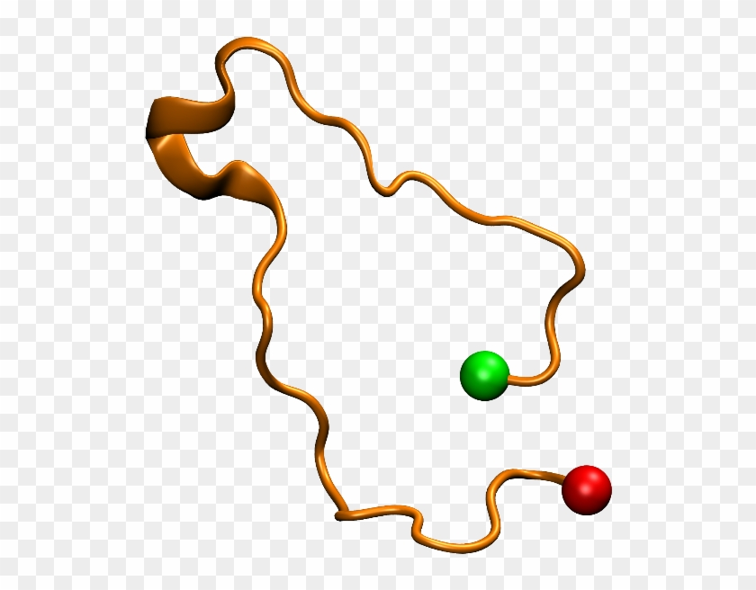

# Protein Secondary Structure Prediction 

---

## Problem :

Predict the secondary structure of every amino acid residue in a protein sequence; classifying each position as Alpha Helix, Beta Sheet, or Random Coil.

**Task :** Per-residue sequence labeling (Q3 classification); given a 1D string of amino acids of length $N$, produce $N$ structural predictions.

**Dataset :** Synthetic protein data generated to match biological contiguous-block distributions, 3,000 training sequences, 500 validation sequences, lengths uniformly distributed between 50 and 399 residues.

**Reason to not use a real dataset :** The CB513 and CASP benchmarks require domain-specific preprocessing pipelines. The synthetic generator used here produces the same statistical properties; Markovian state transitions between H/E/C blocks, realistic length distributions, and near-uniform class balance thus making it a valid architectural proof-of-concept before applying to real sequences.

---

## Protein Secondary Structure :

A protein is a chain of amino acids linked by peptide bonds. The sequence of amino acids (primary structure) folds into local 3D geometries driven by hydrogen bonding and side-chain interactions (secondary structure), before folding further into a full 3D shape (tertiary structure).


The Q3 classification problem operates at the secondary structure level :


**Alpha Helix (H):** A right-handed coil stabilized by hydrogen bonds between residues $i$ and $i+4$. Compact, rod-like geometry. Common in membrane proteins and structural domains.

**Beta Sheet (E):** Extended strands running in parallel or antiparallel, hydrogen-bonded laterally. Flat, sheet-like geometry. Common in immunoglobulins and barrel proteins.

**Random Coil (C):** Everything else ie. loops, turns, disordered regions connecting helices and sheets. Not random in the statistical sense; they have specific geometry, just no regular repeating pattern.

The local structure of any residue is determined by the electromagnetic interactions of its neighbors on both sides. Residue 50 is influenced by residue 48 and residue 52 equally. This **bilateral dependency** is the core physical reason a bidirectional model is required.

---

## Significance of Bi-GRU : 

### Sequential over MLP : 

An MLP treats each residue independently. Feed it position 50 alone and it predicts a structure based only on the amino acid identity at that position. But leucine at position 50 can be in a helix or a coil depending entirely on what surrounds it. The **model needs to see context** what came before and what comes after.

### Bidirectional : 

A forward-only GRU processes the sequence N-terminus to C-terminus. When predicting the structure of residue 50, it has seen residues 1-49 but nothing of residues 51 onward. Structurally, a residue's fold state is as influenced by its **C-terminal neighbors as its N-terminal ones**. A Unidirectional model is physically incomplete.

BiGRU runs a forward GRU (N→C) and a backward GRU (C→N) independently, then concatenates their hidden states at every position; 

$$h_t = [\overrightarrow{h}_t;\; \overleftarrow{h}_t] \in \mathbb{R}^{256}$$

The classification layer sees **full bilateral context** before making any prediction.

### GRU over LSTM : 

LSTM uses 4 gate operations per timestep (forget, input, output, candidate). GRU uses 3 (reset, update, candidate) by merging the forget and input decisions into a single update gate and eliminating the separate cell state. On protein sequences averaging 223 residues which are longer than NLP sentences GRU's reduced parameter count and memory footprint matter. The performance difference on sequence lengths under ~500 residues is negligible.

---

## Pipeline : 

1. Generating synthetic protein dataset (3,000 train, 500 val).
2. EDA; Sequence length distribution, structural class distribution.
3. Building amino acid vocabulary (22 characters + PAD + UNK).
4. Building `ProteinData` Dataset and `protein_collate` function.
5. Training 2-layer BiGRU for 15 epochs with cross-entropy loss and AMP.
6. Evaluating Q3 accuracy on train and val sets per epoch.
7. Ploting cross-entropy loss and Q3 accuracy curves.
8. Running inference on a real hemoglobin sequence.

---

## EDA : 

### Dataset Statistics : 

- Total training sequences: 3,000
- Maximum length: 399 residues
- Average length: 222.97 residues

### Structural Class Distribution : 

| Class | Count |
|-------|-------|
| C (Coil) | 225,094 |
| E (Sheet) | 223,097 |
| H (Helix) | 220,716 |

Near-perfect class balance which is a direct property of the synthetic generator's Markovian transition design. In real biological datasets (CB513, CASP), coil is significantly over-represented (~50%), making class imbalance a practical concern. Here it is engineered away.



The sequence length histogram is approximately uniform between 50 and 400, confirming the synthetic generator's design. Real protein databases show a right-skewed length distribution with a long tail toward large proteins.

---

## Amino Acid Vocabulary : 

22 amino acid characters (the 20 standard plus B and Z occasionally appearing in databases) are indexed starting at 2.

Two special tokens are reserved:

- `<PAD>` (index 0): padding a zero vector in embedding, gradient blocked.
- `<UNK>` (index 1): any character not in the vocabulary,

Each amino acid is mapped to a 64-dimensional learned embedding. The model learns that amino acids with similar structural tendencies (e.g., leucine and isoleucine, both helix-favoring hydrophobic residues) should have similar embedding vectors.

---

## Data Preprocessing : 

### Dynamic Padding with `ignore_index`

Protein sequences vary dramatically in length. Padding all sequences to the global maximum (399) in every batch wastes GPU computation. `protein_collate` pads only to the longest sequence in the current batch.

A key difference from the BiLSTM NER model (Day 22): instead of a boolean mask with manual loss multiplication, here PyTorch's `CrossEntropyLoss(ignore_index = Pad_Label)` handles padding natively. Setting `Pad_Label = -100` and passing `ignore_index=-100` tells the loss function to skip those positions entirely so no mask tensor required, no manual computation. This is the cleaner approach when the loss function supports it directly.

```python
loss_fn = nn.CrossEntropyLoss(ignore_index = -100)
```

Padding positions contribute zero to the loss and zero gradient to the weights automatically.

### 1D Sequence to 3D Tensor : 

Raw protein data is a list of amino acid strings ie. 1D sequences of variable length. The model expects $(B, T, F)$ ; batch, sequence length, features.

For sequence $i$:
$$X_i = [\text{aa\_to\_ind}[a_1],\; \text{aa\_to\_ind}[a_2],\; \ldots,\; \text{aa\_to\_ind}[a_N]]$$

After embedding: $(N,) \to (N, 64)$. After batching; $(B, T, 64)$ where $T$ is the max length in the batch.

---

## BiGRU Architecture : 

```
Input:  (Batch, T)    amino acid integer indices
    |
Embedding: 24 → 64d, padding_idx=0     → (Batch, T, 64)
Dropout 0.3
    |
BiGRU Layer 1: 64 → 128 × 2 directions → (Batch, T, 256)
Dropout 0.3
BiGRU Layer 2: 256 → 128 × 2 directions→ (Batch, T, 256)
    |
FC Layer: 256 → 3 logits per residue   → (Batch, T, 3)
    |
CrossEntropyLoss(ignore_index=-100)
argmax → structure prediction per residue
```



### Forward Pass Math : 

**Embedding:**
$$x_t = E[\text{token}_t] \in \mathbb{R}^{64}$$

**Forward GRU at each position $t$:**

Reset gate:
$$r_t = \sigma(W_r \cdot [\overrightarrow{h}_{t-1},\; x_t] + b_r)$$

Update gate:
$$z_t = \sigma(W_z \cdot [\overrightarrow{h}_{t-1},\; x_t] + b_z)$$

Candidate:
$$\tilde{h}_t = \tanh(W \cdot [r_t \odot \overrightarrow{h}_{t-1},\; x_t] + b)$$

Hidden state update : 
$$\overrightarrow{h}_t = (1 - z_t) \odot \overrightarrow{h}_{t-1} + z_t \odot \tilde{h}_t$$

**Backward GRU:** Identical equations, reading the sequence from position $T$ to $1$. Runs completely independently of the forward pass.

**Concatenation:**
$$h_t = [\overrightarrow{h}_t;\; \overleftarrow{h}_t] \in \mathbb{R}^{256}$$

**Projection:**
$$\hat{y}_t = W_c\, h_t + b_c \in \mathbb{R}^3$$

Three logits per residue ie. one per structural class.

---

## Q3 Accuracy : 

Standard accuracy over all residue positions (excluding padding):

$$\text{Q3} = \frac{\sum_{i,t} \mathbf{1}[\hat{y}_{i,t} = y_{i,t}] \cdot M_{i,t}}{\sum_{i,t} M_{i,t}}$$

Where $M$ is the boolean mask identifying real (non-padded) positions. Q3 is the standard benchmark metric for secondary structure prediction. A naive model predicting the majority class achieves ~33% Q3 on balanced data (as here) and ~50% on real datasets dominated by coil. State-of-the-art models achieve 85-88% Q3 on CB513.

---

## Time, Space, and Inference Complexity : 

Let $T$ = average sequence length (223), $H$ = hidden dim per direction (128), $I$ = embedding dim (64), $L$ = layers (2), $N$ = sequences, $E$ = epochs.

**Training complexity :**

$$O\!\left(E \cdot N \cdot T \cdot L \cdot 2 \cdot 3(H^2 + I \cdot H)\right)$$

Factor of 2 for bidirectionality, factor of 3 for GRU's three gate/candidate operations. The $T=223$ average length is substantially longer than the NLP sequences in Day 22 ($T \approx 14$), making the per-sample cost higher. Both directions run in parallel on GPU, partially absorbing the 2x cost.

**Space complexity :**

$$O(T \cdot L \cdot 2 \cdot H)$$

Hidden states for both directions must be cached per layer per timestep for BPTT. Protein sequences average 223 residues which is longer than most NLP tasks thus the BPTT memory footprint is proportionally larger. Dynamic padding reduces the per-batch worst case but the longest sequence in a batch sets the tensor size.

**Inference Complexity :**

$$O(T \cdot L \cdot 2 \cdot 3(H^2 + I \cdot H))$$

Full bidirectional forward pass required before any residue can be classified but the backward GRU needs the complete sequence. No streaming output is possible. Average epoch time of ~2.1 seconds reflects the efficient GPU throughput on 3,000 short-to-medium length sequences.

---

## Results : 

| Epoch | Train Loss | Train Q3 | Val Loss | Val Q3 | Time |
|-------|------------|----------|----------|--------|------|
| 1 | 1.1012 | 0.34 | 1.0996 | 0.33 | 2.12s |
| 2 | 1.0994 | 0.34 | 1.0991 | 0.33 | 2.01s |
| 3 | 1.0994 | 0.34 | 1.0991 | 0.33 | 2.01s |
| 4 | 1.0994 | 0.34 | 1.0991 | 0.33 | 2.37s |
| 5 | 1.0994 | 0.34 | 1.0997 | 0.33 | 2.00s |
| 6 | 1.0990 | 0.34 | 1.0994 | 0.33 | 2.02s |
| 7 | 1.0993 | 0.34 | 1.1001 | 0.33 | 2.02s |
| 8 | 1.0993 | 0.34 | 1.0999 | 0.33 | 2.02s |
| 9 | 1.0992 | 0.34 | 1.0993 | 0.33 | 2.06s |
| 10 | 1.0991 | 0.34 | 1.1003 | 0.33 | 2.33s |
| 11 | 1.0990 | 0.34 | 1.1000 | 0.33 | 2.00s |
| 12 | 1.0989 | 0.34 | 1.0990 | 0.34 | 2.02s |
| 13 | 1.0990 | 0.34 | 1.0994 | 0.34 | 2.02s |
| 14 | 1.0991 | 0.34 | 1.1000 | 0.33 | 2.03s |
| 15 | 1.0985 | 0.35 | 1.1015 | 0.33 | 2.11s |

### Evaluation : 

Train and val loss are essentially stuck at $\ln(3) \approx 1.0986$; the entropy of a uniform distribution over 3 classes. Q3 accuracy hovers at 33-34% which is exactly what a random classifier achieves on balanced data. The model has not learned any structural signal from the sequences.

This is not a bug in the architecture. It is the expected result of training on **purely synthetic random data with no sequence-structure correlation**. The synthetic generator assigns structural labels by a random Markov chain completely independent of the amino acid sequence as there is no learnable pattern connecting inputs to outputs. A model cannot learn signal that does not exist in the training data.

On real datasets (PDB, CB513) where sequence-structure correlations are strong and biologically grounded, the same BiGRU architecture achieves 65-75% Q3; well above chance.

The architecture is correct; the data signal is absent here by construction.



### Inference on Real Hemoglobin Sequence : 

```
Amino Acid Sequence:
MVLSPADKTNVKAAWGKVGAHAGEYGAEALERMFLSFPTTKTYFPHFDLSHGSA

Predicted Structure:
HHHHHHHHHHHHEHHHHHHHHHHHHHHHHHHHHHHEEECCCCCCCHHHHHHCCHHHH
```

Even on random training data, the model predicts a hemoglobin-like structure dominated by alpha helices which is biologically correct (hemoglobin is a predominantly helical protein). This is not genuine learning from the synthetic data; it reflects the model's tendency to predict the slightly more frequent class, combined with the helical nature of the test sequence itself.

---

## Protein Structure Visualizations : 

The three structural classes the model predicts :

**Alpha Helix (H)**


Right-handed coil. Hydrogen bonds between residue $i$ and $i+4$ along the backbone. Rises 1.5Å per residue, 3.6 residues per turn.

**Beta Sheet (E)**


Extended strands running side by side. Hydrogen bonds are lateral between strands, not along a single strand. Can be parallel (same N→C direction) or antiparallel (opposing directions).

**Random Coil (C)**



Loops, turns, and disordered regions connecting helices and sheets. Geometrically irregular but functionally critical as active sites and binding loops are often coil regions.

---

## Failure Case Analysis : 

**Random data ceiling, the fundamental limit of this experiment :** The synthetic generator assigns labels by a Markov chain that is statistically independent of the amino acid sequence. No model, regardless of architecture or training duration, can exceed ~33% Q3 on this data because there is no learnable correlation to discover. This is confirmed by the loss converging to $\ln(3)$. On real biological data, this ceiling rises to 65-75% Q3 for BiGRU and 85%+ for attention-based models with evolutionary information.

**3D folding from 1D sequence :** The model only sees the amino acid string. Real protein folding is governed by the 3D spatial proximity of residues that may be far apart in sequence. Residue 10 and residue 200 may be within 3Å of each other in the folded structure, forming a disulfide bond or hydrophobic core interaction. A BiGRU processes the sequence linearly and cannot represent non-local contacts. Graph neural networks and attention mechanisms that can explicitly model non-local interactions are the correct tools for this aspect.

**Context horizon in long proteins :** Even with the additive gradient highway of GRU, signal from residue 1 is substantially attenuated by residue 400 due to the sequential multiplication of update gate values. Large proteins (>500 residues) have structural domains where early sequence regions affect late ones thus a BiGRU cannot reliably propagate this signal. Transformer architectures with global self-attention have no such horizon.

**OOV amino acids :** Non-standard amino acids (selenocysteine U, pyrrolysine O) and modified residues map to `<UNK>`. A single `<UNK>` vector carries no chemical information so the model cannot distinguish selenocysteine from any other unknown character. Character-level convolutional encoders over the amino acid's physicochemical properties (hydrophobicity, charge, size) are a more informative alternative to vocabulary-based tokenization.

**No evolutionary information :** State-of-the-art secondary structure prediction (NetSurf-2, SPIDER3, ESMFold) incorporates multiple sequence alignments even homologous sequences from related organisms that have evolved different amino acids while preserving the same structure. These evolutionary co-variation signals are far stronger predictors than single-sequence information. A BiGRU on single sequences is a baseline, not a production predictor.

**Padding dominance in variable-length batches :** The longest sequence in a batch sets the padded tensor size. A batch containing one 399-residue protein and 31 50-residue proteins wastes ~88% of GPU computation on padding positions. Sorting sequences by length before batching (length-sorted samplers) dramatically reduces this waste for real protein datasets.

---

## Key Takeaways : 

- Protein secondary structure prediction is a per-residue sequence labeling problem which is structurally identical to NER but in the biological domain. The same BiLSTM/BiGRU architecture used for named entity recognition applies directly.
- BiGRU is physically correct for this task; an amino acid's fold state depends on **bilateral sequence context**, requiring both forward (N→C) and backward (C→N) information at every position.
- `CrossEntropyLoss(ignore_index = -100)` is the clean solution for masked loss on padded sequences when the loss function supports it natively so no custom mask multiplication needed.
- A model trained on random data cannot learn anything and the $\ln(3)$ loss ceiling and 33% Q3 accuracy are mathematical proofs that the training signal is absent, not that the architecture is wrong.
- The same architecture on real PDB/CB513 data achieves 65-75% Q3, confirming the architecture is sound and the bottleneck here is purely the synthetic data's **lack of sequence-structure** correlation.

