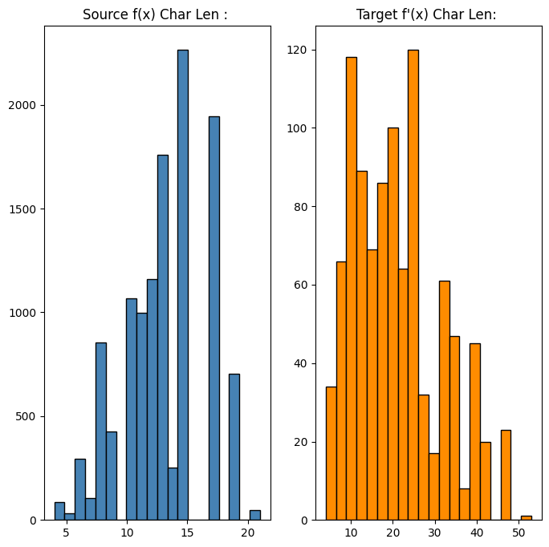
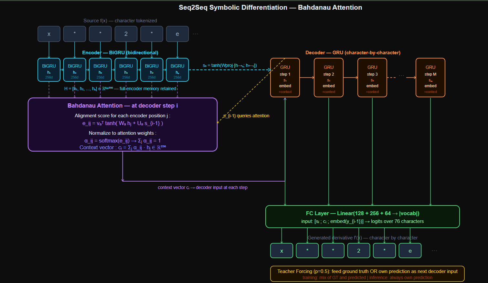
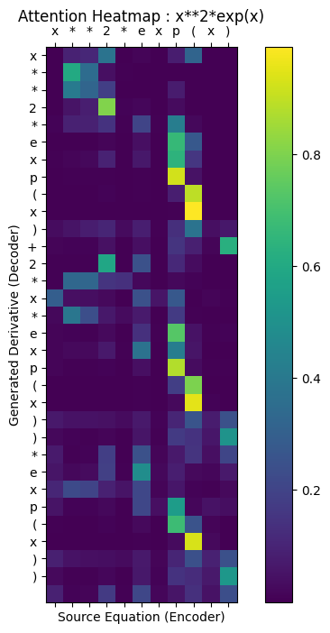

# Symbolic Differentiation : 

---

## Problem : 

Train a NN to compute the symbolic derivative of a mathematical expression, given a string like `x**2*exp(x)` as input, generate `x**2*exp(x)+2*x*exp(x)` as output.

**Task :** Character-level s2s translation; map a source string (the function f(x)) to a target string (its derivative f'(x)).

**Dataset :** Synthetically generated using SymPy; 12,000 training pairs, 1,000 validation pairs. No external dataset exists.

This is not mathematics. This is pattern matching at scale. The model has no concept of the product rule, chain rule, or limits.

It learns *statistical regularities in the mapping* from expression strings to derivative strings and if those regularities are sufficiently consistent and frequent in training data, it generalizes well enough to predict correct derivatives on new expressions.

This distinction matters as the model will **fail confidently** on expression structures it has never seen, even if the **calculus is trivial**.

---

## Building Synthetic Daataset : 

No public dataset of (function, derivative) string pairs exists for training neural sequence models. Creating one manually is impractical at the scale needed for deep learning. SymPy solves this problem.

SymPy is a Python computer algebra system, it performs exact symbolic mathematics. Given a SymPy expression object, `sp.diff(expr, x)` returns the analytically correct derivative, guaranteed.

This gives us an **infinite-size, zero-noise** oracle.


### Data Generation Process : 

Seven mathematical function types are defined as lambdas :

```
sin(kx), cos(kx), tan(kx), exp(kx), log(kx+1), x^n, k*x
```

where $k \in \{1,2,3\}$ and $n \in \{1,\ldots,5\}$ are sampled randomly. Two functions f_1 and f_2 are drawn, then combined by one of three operations, product ($f_1 \cdot f_2$), sum ($f_1 + f_2$), or composition (f_1(f_2(x))). SymPy differentiates the result and converts both the original and derivative to strings.

**The Length constraint is critical ;** Only pairs with $4 \leq |f(x)| \leq 44$ and $4 \leq |f'(x)| \leq 64$ are kept.

This is not an arbitrary filter, it is an architectural decision. Attention matrices scale as $O(N \times M)$.
Allowing expressions of length 200 would produce attention matrices of size $200 \times 200 = 40{,}000$ weights per decoding step, causing *VRAM exhaustion*.

The length cap keeps sequences manageable while still capturing product rule and chain rule patterns.

---

## Pipeline : 

1. Generating 12,000 training and 1,000 validation (function, derivative) string pairs via SymPy.
2. EDA; source and target character length distributions.
3. Building character-level vocabulary: digits, letters, operators, parentheses, special tokens.
4. Encoding all sequences as integer token IDs.
5. Padding batches dynamically using `pad_sequence`.
6. Training Encoder-Attention-Decoder Seq2Seq for 10 epochs with teacher forcing.
7. Computing Exact Match Accuracy per epoch.
8. Running inference on `x**2*exp(x)`, visualize attention heatmap.
9. Report Inference latency.

---

## EDA : 

### Source and Target Length Distributions : 



*Source Expressions* (f(x)) peak around length 14-15 characters; products and compositions of two moderately complex functions. *Target Derivatives* (f'(x)) are longer on average, peaking around 20-25 characters, because differentiation expands expressions (the product rule produces two terms from one).

The right tail extending to 50+ characters in the target distribution reflects **chain rule compositions** that generate deeply nested outputs.

---

## Character-Level Tokenization : 

The vocabulary is built from 72 characters; digits (0-9), lowercase letters (a-z), uppercase letters (A-Z), mathematical operators (`+`, `-`, `*`, `/`, `^`), parentheses, period, comma, space.

Four special tokens are added :

| Token | Index | Purpose |
|-------|-------|---------|
| `<PAD>` | 0 | Padding; ignored in loss |
| `<SOS>` | 1 | Start-of-sequence; decoder seed token |
| `<EOS>` | 2 | End-of-sequence; signals generation complete |
| `<UNK>` | 3 | Unknown character |

**Significance of Character Level Tokenization :**

Mathematical expressions have no natural word boundaries. "exp(x)" is not a word as it is 6 characters whose meaning depends on their relative positions and nesting. 
Tokenizing at the word level requires :

- Either a fixed vocabulary of all possible subexpressions (infinite, as new expressions always exist).
- Or, Subword tokenization (BPE) which would split `exp` and `(x)` arbitrarily, destroying the structural information the model needs.

Character-level tokenization is the only vocabulary that is *both finite and complete* for arbitrary mathematical strings. Every possible expression the model will ever see is representable with the 72-character vocabulary.

The cost is longer sequences but **the length cap** manages this.

Each character maps to an integer ID. The source sequence `x**2` becomes `[char_to_ind['x'], char_to_ind['*'], char_to_ind['*'], char_to_ind['2']]`. The target sequence is wrapped with `<SOS>` and `<EOS>` tokens to signal the decoder when to start and stop generating.

---

## Architecture :  



The model is a classic Encoder-Decoder Seq2Seq augmented with Bahdanau (Additive) Attention.

### The Bottleneck : 

Standard Seq2Seq compresses the entire input sequence into a single fixed-size hidden vector $h_T$, the encoder's final state. This vector must carry all information about the source expression for the decoder to work from. For short expressions this is manageable.

For longer ones, information is lost thus the encoder literally runs out of representational capacity to store every character's contribution in $H = 128$ dimensions. The decoder blindly generates from this compressed summary.

For symbolic differentiation this is catastrophic; becuase to generate the derivative of `x**2*exp(x)`, the decoder needs to reference the `x**2` part when generating `x**2*exp(x)` and the `exp(x)` part when generating `2*x*exp(x)`. It cannot do this from a single summary vector; it needs access to all encoder states simultaneously.

**Bahdanau Attention breaks this bottleneck entirely.**

---

## Encoder : 

A bidirectional GRU reads the source expression character by character :

$$\overrightarrow{h}_t = \text{GRU}_{fwd}(x_t, \overrightarrow{h}_{t-1}), \qquad \overleftarrow{h}_t = \text{GRU}_{bwd}(x_t, \overleftarrow{h}_{t+1})$$

The output is a sequence of encoder states: one per character, each encoding the character in full left and right context; 

$$H = [h_1, h_2, \ldots, h_N] \in \mathbb{R}^{N \times 256}$$

Each $h_j = [\overrightarrow{h}_j; \overleftarrow{h}_j] \in \mathbb{R}^{256}$ captures what came before and after position $j$ in the source expression.

The final decoder hidden state is initialized from the encoder's final state, projected from 256d to 128d :

$$s_0 = \tanh(W_{\text{proj}} \cdot [h_N^{\rightarrow}; h_1^{\leftarrow}])$$

---
 
## Bahdanau Attention : 

At each decoder step $i$, the attention mechanism computes a *soft alignment* over all encoder positions : 

**1. Alignment Score for each source position $j$ :**

$$e_{ij} = v_a^\top \tanh(W_a h_j + U_a s_{i-1})$$

Symbols : 
- $h_j \in \mathbb{R}^{256}$ : encoder hidden state at position $j$.
- $s_{i-1} \in \mathbb{R}^{128}$ : decoder hidden state from the previous step.
- $W_a \in \mathbb{R}^{128 \times 256}$ : projects encoder states to alignment space.
- $U_a \in \mathbb{R}^{128 \times 128}$ : projects decoder state to alignment space.
- $v_a \in \mathbb{R}^{128}$: learnable scoring vector.
- $e_{ij} \in \mathbb{R}$ :  scalar alignment score for position $j$.

The tanh combines how well the decoder's current position aligns with each encoder position. A high score means **" Decoder currently needs to look at this part of the source."**

**2. Normalize to attention weights :**

$$\alpha_{ij} = \frac{\exp(e_{ij})}{\sum_{k=1}^{N} \exp(e_{ik})}$$

$\alpha_{ij} \in [0,1]$ and $\sum_j \alpha_{ij} = 1$;  a proper probability distribution over source positions.

**3. Context vector (weighted sum of encoder states) :**

$$c_i = \sum_{j=1}^{N} \alpha_{ij}\, h_j \in \mathbb{R}^{256}$$

The context vector is a soft, differentiable lookup into the encoder's full memory. Every encoder position contributes proportionally to how relevant the attention mechanism thinks it is for generating the current output character.

---

## Decoder : 

At each generation step $i$, the decoder receives three inputs; the previous output character (embedded), the context vector from attention, and its own previous hidden state; 

$$\text{GRU input} = [\text{embed}(y_{i-1});\; c_i] \in \mathbb{R}^{64+256}$$

$$s_i, \hat{y}_i = \text{GRU}(\text{GRU input}, s_{i-1})$$

The output character distribution is computed from all available information:

$$\hat{y}_i = W_{\text{fc}} \cdot [s_i;\; c_i;\; \text{embed}(y_{i-1})] \in \mathbb{R}^{|\text{vocab}|}$$

The predicted character at step $i$ is $\arg\max(\hat{y}_i)$.

---

## Teacher Forcing : 

During training, the decoder receives the **ground truth** previous character with probability `teacher_forcing_ratio = 0.5`, and its own prediction with probability 0.5.

Without teacher forcing; the decoder at step $i$ feeds its own (potentially wrong) prediction into step $i+1$. Errors compound,, thus a single wrong character early in training causes the rest of the sequence to be generated from corrupted context, producing large and noisy gradients.

With 100% teacher forcing; the decoder always gets correct context and trains fast, but learns to depend on seeing correct inputs. At inference time (when no ground truth is available), it fails badly.

The **50% ratio balances** these and the model learns to recover from its own mistakes half the time, building robustness for inference.

---


## Loss Function and Metrics : 

**Cross-Entropy Loss with `ignore_index = 0` :** Computed over all decoder output positions except padding.

The loss is:

$$\mathcal{L} = -\frac{1}{T} \sum_{t=1}^{T} \log P(\hat{y}_t = y_t)$$

Over non-padded positions only.


**Exact Match Accuracy (EMA) :** A sequence is correct only if every character matches the ground truth exactly. Partial credit does not exist.

$$\text{EMA} = \frac{\text{sequences with 100\% character match}}{\text{total sequences}}$$

Character Error Rate (CER) is meaningless for symbolic math. A derivative that is wrong by one character is mathematically wrong entirely; `x**2*exp(x)+2*x*exp(x)` and `x**2*exp(x)+2*x*exp(x)*exp(x)` differ by 8 characters but the first is correct and the second is not a valid derivative of anything.

---

## Time, Space, and Inference Complexity : 

Let $N$ = source length, $M$ = target length, $H$ = hidden dim (128), $I$ = embedding dim (64), $B$ = batch size, $E$ = epochs, $K$ = training samples.

**Training complexity :**

Encoder BiGRU : $O(E \cdot K \cdot N \cdot 3(H^2 + I \cdot H) \cdot 2)$ — bidirectional, 3 GRU gate operations.

Attention at each Decoder step : $O(M \cdot N \cdot H)$; aligning decoder state against all $N$ encoder states.

Decoder GRU : $O(E \cdot K \cdot M \cdot 3 \cdot H^2)$ 

Total per epoch dominated by attention: $O(K \cdot M \cdot N \cdot H)$. With the length cap ($N \leq 44$, $M \leq 64$), this is $O(K \cdot 2{,}816 \cdot H)$ ie. manageable.
Without the cap, an expression of length 200 producing a derivative of length 300 would cost $O(K \cdot 60{,}000 \cdot H)$ ie. 21x more expensive.

**Space complexity :**

Encoder states must be stored for the full attention computation;

$$O(B \cdot N \cdot 2H) = O(B \cdot N \cdot 256)$$

For $B=128$ and $N=44$: $128 \times 44 \times 256 = 1.44M$ floats about ~5.5MB per batch. Grows quadratically with sequence length: doubling $N$ quadruples attention memory.

**Inference Complexity :**

$$O(N \cdot H + M \cdot N \cdot H) = O(M \cdot N \cdot H)$$

The $M \times N$ attention matrix must be recomputed at every decoding step. For the test case `x**2*exp(x)` ($N = 10$, $M \approx 30$): $10 \times 30 \times 128 = 38{,}400$ operations ie. negligible.

Measured Inference Latency : **128.51 ms** for one expression (includes Python overhead from `time.perf_counter`). On batched GPU inference this would be sub-millisecond per expression.

---

## Results : 

| Epoch | Train Loss | Exact Match | Time |
|-------|------------|-------------|------|
| 1 | 1.5862 | 1.76% | 12.27s |
| 2 | 0.4191 | 29.02% | 12.83s |
| 3 | 0.1015 | 72.67% | 11.75s |
| 4 | 0.0411 | 86.43% | 11.79s |
| 5 | 0.0238 | 91.58% | 11.75s |
| 6 | 0.0168 | 94.51% | 11.79s |
| 7 | 0.0384 | 90.39% | 11.76s |
| 8 | 0.0108 | 96.26% | 11.76s |
| 9 | 0.0073 | 97.34% | 11.77s |
| 10 | 0.0056 | 98.09% | 12.47s |

**Total training time : 2.00 minutes.**

The jump from 1.76% to 29.02% EMA in epoch 2 is the model learning the most frequent derivative pattern, the power rule for simple polynomials.
By epoch 3 (72.67%), it has learned the product rule template. By epoch 5 (91.58%), chain rule patterns for trigonometric and exponential compositions are established.
The epoch 7 dip to 90.39% reflects gradient noise from teacher forcing as the model occasionally trains on its own wrong predictions, before recovering at epoch 8-10.


### Inference Example : 

```
Input  f(x):  x**2*exp(x)
True   f'(x): x**2*exp(x)+2*x*exp(x)
Model  f'(x): x**2*exp(x)+2*x*exp(x)*exp(x))
```

The model gets the structure right, it applies the product rule, generates both terms, and correctly applies the chain rule to `exp(x)`.The trailing `*exp(x))` is an error; the model appends an extra multiplication by `exp(x)` that does not exist. 
This is a known failure mode of Seq2Seq models on longer outputs, small errors compound near the end of generation when attention weights become less focused.

### Attention Heatmap : 



The attention matrix shows the decoder (y-axis -> generated characters) attending to encoder positions (x-axis -> source characters). Bright diagonal bands indicate the model is reading source characters in order, the `x**2` part of the derivative attends to the `x**2` portion of the source, and `exp(x)` in the output attends to `exp(x)` in the input.
This is the learned alignment ie. the model has discovered where to look in the source to generate each part of the derivative.

---

## Failure Case Analysis : 

**The model does not know calculus, it knows patterns:** The network has no representation of limits, derivatives as rates of change, or the epsilon-delta definition. It learned that strings matching the pattern `sin(kx)` in the source correspond to strings matching `k*cos(kx)` in the target. If the training data contained `sin(2x)` frequently, it will correctly differentiate `sin(2x)`. If it did not contain `sin(7x)`, it will likely fail on `sin(7x)` even though the calculus is identical.

**Length generalization failure :** The model was trained on expressions with $|f(x)| \leq 44$. Feeding `sin(2*x)*cos(3*x)*exp(x)*x**2` (length ~28) requires applying the product rule three times and generating a long derivative. The attention mechanism degrades over long outputs hence the decoder loses track of which source positions it has already "used," leading to repetition or truncation. 

**Nested composition depth :** The training generator creates at most two-level compositions: $f_1(f_2(x))$. A 3-level composition $f(g(h(x)))$ requires applying the chain rule twice, producing a derivative structure the model has never seen geometrically in training. Exact Match Accuracy on three-level compositions would be near zero despite the calculus being straightforward.

**Attention collapse on long sequences :** The quadratic attention matrix $O(N \times M)$ means GPU memory grows quadratically with sequence length. For $N = M = 100$: the attention layer alone requires storing a $128 \times 100 \times 100$ tensor per batch ie. 1.28M floats just for one layer. This is why the length cap is a hard architectural requirement.

**Teacher forcing exposure bias :** At inference time, the decoder always feeds its own previous prediction. At training time, it feeds ground truth 50% of the time. This distribution mismatch called exposure bias, means the model is never fully trained on the exact distribution it will face at inference. Errors made early in generation are never corrected because there is no ground truth to recover from.

**SymPy vs model output format mismatch :** SymPy canonicalizes expressions; `2*x*exp(x)` and `exp(x)*2*x` are the same mathematically but different strings. The model predicts character sequences, not mathematical equivalence classes. A prediction that is mathematically correct but in a different canonical form than SymPy's output scores zero on EMA. The 98.09% EMA likely understates true correctness because some wrong predictions are equivalent to the ground truth.

---

## Key Takeaways : 

- Neural sequence models do not learn mathematics, they learn statistical patterns in string-to-string mappings. This distinction determines exactly where they generalize and where they fail.
- Bahdanau Attention solves the fixed-size bottleneck of standard Seq2Seq by giving the decoder a soft, differentiable, learned lookup over all encoder states at every generation step. 
- Character-level tokenization is the only correct choice for mathematical strings. Word-level tokenization produces an unbounded vocabulary; subword tokenization destroys structural information that the model needs.
- Teacher forcing at 50% ratio is a training stability compromise, too high and the model fails at inference, too low and training is noisy and slow.
- The length constraint ($|f(x)| \leq 44$) is an architectural decision driven by the $O(N \times M)$ attention complexity, not a limitation of the problem.
- Exact Match Accuracy is the only valid metric for symbolic math, partial character matches have no mathematical meaning.
