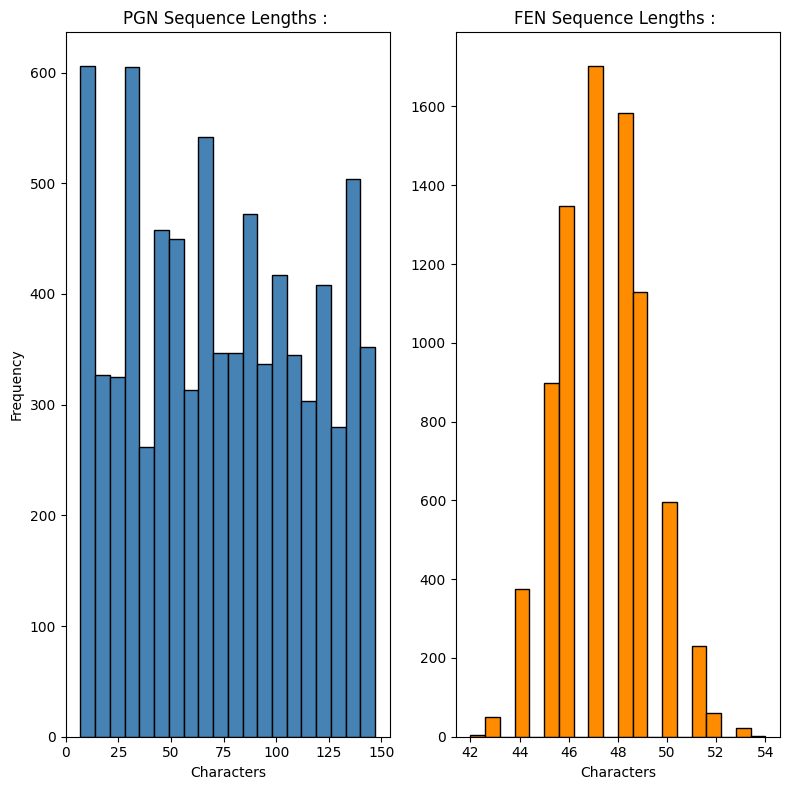
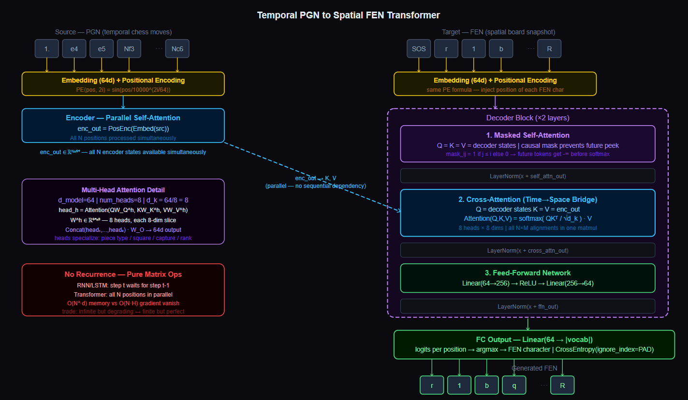
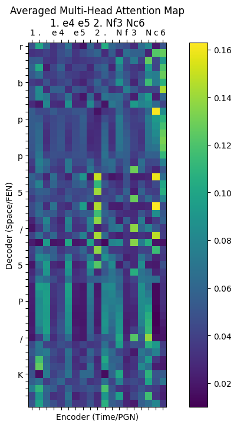

# Temporal PGN to Spatial FEN Transformer : 

---

## Problem : 

Translate a sequence of PGN chess moves (Portable Game Notation) into the board position those moves produce FEN (Forsyth-Edwards Notation).

**PGN** is a temporal record; a time-ordered list of moves. `1. e4 e5 2. Nf3 Nc6` means : white moves pawn to e4, black responds e5, white knight to f3, black knight to c6. It encodes *series of moves in a specific order*.

**FEN** is a spatial snapshot; a compressed encoding of the current board state. `r1bqkbnr/pppppppp/2n5/4N3/8/2N5/PPPPPPPP/R1BQKB1R` it encodes *position of every piece  right now*, rank by rank from black's back rank to white's.

The task is a sequence-to-sequence translation: map a 1D temporal string to a 1D spatial string, where the spatial string is the deterministic result of applying all moves in the temporal string to the starting position.

A chess engine computes FEN from PGN with zero error. The point here is *not to beat a chess engine* but rather to demonstrate that a Transformer, **with no explicit rules**, can learn the mapping purely from (PGN, FEN) string pairs, and to study what the attention mechanism learns about the structure of chess notation.

---

## Transformers over RNN/LSTM/GRU : 

Every previous sequence model in this series (RNN, LSTM, GRU, BiGRU, BiLSTM) is **sequential by architecture**. Step $t$ cannot be computed until step $t-1$ is complete sp the hidden state must be passed forward one timestep at a time.

This creates two problems :

**The Vanishing Gradient Problem :** Gradient signal from early timesteps decays exponentially through the repeated hidden state updates. Move 1 has vanishing influence on the hidden state by move 15.

**The Parallelism Problem :** No matter how many GPU cores are available, an RNN processes tokens one at a time. Training time scales linearly with sequence length.

The Transformer discards hidden states entirely. There is no recurrence. Every position in the sequence is processed simultaneously via **matrix multiplications**.
The entire PGN string is encoded in one forward pass, and the FEN string is decoded in one pass. Sequence order is not implicit in the computation but it is rather injected explicitly via positional encoding. 

This is the fundamental architectural shift : **from sequential state to parallel attention**.

---

## Dataset Building : 

No public (PGN, FEN) string pair dataset exists at the scale needed for deep learning. The chess library `python-chess` is used as an oracle; deterministically correct, like SymPy was for calculus in Day 24.

### Generation : 

For each sample :

1. Initialize a fresh `chess.Board()` at the starting position.
2. Sample a random number of plies (half-moves) between 1 and 40.
3. At each ply, select one of the first 5 legal moves (biasing toward pseudo-logical play thus avoiding garbage random walks that produce unrealistic positions)
4. Push the move onto the board.
5. Export the move sequence as a PGN string using `chess.pgn.StringExporter`.
6. Extract the board position as FEN using `board.fen().split(' ')[0]` (piece placement only, discarding active color/castling/en passant metadata).
7. Keep only pairs where both strings are under `max_seq_len - 2 = 148` characters.

**8,000 training pairs, 500 validation pairs.** The length constraint is architectural as the attention matrix scales as $O(N^2)$ and long sequences cause OOM on the GPU.

---

## Pipeline : 

1. Generating 8,000 (PGN, FEN) string pairs using `python-chess`.
2. EDA : PGN and FEN character length distributions.
3. Building character vocabulary: digits, letters, chess notation symbols.
4. Encoding all strings as character-level integer sequences.
5. Padding batches dynamically with `pad_sequence`.
6. Training full Transformer (Encoder + Cross-Attention Decoder) for 15 epochs.
7. Tracking train loss per epoch.
8. Inference on `1. e4 e5 2. Nf3 Nc6`, plot averaged multi-head attention heatmap.
9. Reporting inference latency.

---

## EDA : 

### PGN and FEN Length Distributions : 



**PGN lengths** are broadly distributed from 5 to 148 characters thus reflecting the variable number of moves (1 to 20) in each generated game. Longer PGN strings represent more moves, more captures, more piece identifiers.

**FEN lengths** are tightly clustered between 42 and 54 characters. This is a mathematical property of FEN notatioan; chess board always has 64 squares, pieces take fixed notation, and the rank separator `/` appears exactly 7 times. The variation in FEN length reflects only how many pieces have been captured so fewer pieces on the board means shorter FEN strings. The tight distribution confirms the generator is producing valid, physically realistic board states.

---

## Vocabulary and Character-Level Tokenization : 

The vocabulary covers all characters that appear in PGN and FEN strings :

```
digits: 1234567890
letters: abcdefgh (square files), PNRBQK (white pieces), pnrqk (black pieces)
symbols: . / x O - + = #  (PGN notation: capture, rank, promotion, etc.)
space: separating move numbers from moves
```

Four special tokens: `<PAD>` (0), `<SOS>` (1), `<EOS>` (2), `<UNK>` (3).

Character-level tokenization is required for the same reason as Day 24; chess notation has no natural word boundaries and the vocabulary of all possible move substrings is unbounded. Every valid PGN and FEN string is representable with this finite character set.

---

## Positional Encoding : 

A Transformer has no recurrence and no convolution so it processes all tokens in parallel with **no inherent sense** of which token came first. Without explicit position information, `1. e4 e5` and `e4 1. e5` would look identical.

Positional encoding adds a sinusoidal signal to each token embedding before it enters the model.

For position $\text{pos}$ and embedding dimension $i$ :

$$PE_{(\text{pos},\, 2i)} = \sin\left(\frac{\text{pos}}{10000^{2i / d_{\text{model}}}}\right)$$

$$PE_{(\text{pos},\, 2i+1)} = \cos\left(\frac{\text{pos}}{10000^{2i / d_{\text{model}}}}\right)$$

Each position gets a unique vector of sinusoids at different frequencies. Low-frequency dimensions encode coarse position (early vs. late in the sequence); high-frequency dimensions encode fine-grained local position. The model learns to use these signals to determine which move came first, which came second, without any recurrent state.

**This is how the Transformer encodes sequence order without being sequential.** The computation is parallel; the order information is encoded in the input vectors themselves.

---

## Architecture : 



```
Source (PGN) :  char tokens → Embedding(64d) + PositionalEncoding → Encoder states.
Target (FEN) :  char tokens → Embedding(64d) + PositionalEncoding → Decoder input.

Encoder :
  enc_out = PositionalEncoding(Embedding(src))     shape: (B, N, 64).

Decoder (2 layers) :
  Each DecoderBlock :
    1. Masked Self-Attention on target  (causal so it can't see future FEN chars)
    2. Cross-Attention: decoder queries → encoder keys/values
    3. Feed-Forward Network (64 → 256 → 64)
    4. LayerNorm after each sub-layer

Output :
  FC : 64 → |vocab|  logits per position
  argmax → predicted FEN character
```

---

## Scaled Dot-Product Attention Math : 

At its core, attention asks; for each position in the target (FEN), what positions in the source (PGN) are most relevant.

Three linear projections of the input vectors :

$$Q = XW_Q, \quad K = XW_K, \quad V = XW_V$$

Where $W_Q, W_K, W_V \in \mathbb{R}^{d_{\text{model}} \times d_{\text{model}}}$ are learned weight matrices. $Q$ (queries) come from the decoder. $K$ and $V$ (keys and values) come from the encoder in cross-attention.

**Scaled Dot-Product Scores :**

$$\text{scores} = \frac{QK^\top}{\sqrt{d_k}}$$

$QK^\top \in \mathbb{R}^{M \times N}$; every decoder position scores against every encoder position in one matrix multiplication. This is the operation that replaces recurrence; all $M \times N$ alignments computed simultaneously, no sequential dependency.

The $\sqrt{d_k}$ scaling prevents dot products from growing large as $d_k$ increases (large values push softmax into saturation with near-zero gradients).

**Attention Weights :**

$$\alpha = \text{softmax}\left(\frac{QK^\top}{\sqrt{d_k}}\right) \in \mathbb{R}^{M \times N}$$

Each row is a *probability distribution* over source positions which decides how much each target position should attend to each source position.

**Context output :**

$$\text{output} = \alpha V \in \mathbb{R}^{M \times d_k}$$

A weighted average of value vectors. Target position $i$ receives a blend of all source value vectors, weighted by how much attention it placed on each source position.

---

## Multi-Head Attention : (8 Heads, 8 Dimensions Each)

$$
d_{model} = 64,\quad n_{heads} = 8,\quad d_k = \frac{d_{model}}{n_{heads}} = \frac{64}{8} = 8
$$

The full hidden vector is split into 8 independent chunks. Each head runs its own $Q, K, V$ projections on its 8-dimensional slice :

$$\text{head}_h = \text{Attention}(QW_Q^h\;  KW_K^h\;  VW_V^h), \quad W^h \in \mathbb{R}^{64 \times 8}$$

The 8 heads attend in parallel, each potentially learning a different type of alignment :
- Head 1 might learn which piece type in PGN corresponds to which piece symbol in FEN.
- Head 2 might learn square coordinates (file letter in move → rank/file in FEN).
- Head 3 might learn capture events (x in PGN → missing piece in FEN).
- Head 4 might learn move number → position in FEN rank order.

All 8 outputs are concatenated and projected back to $d_{\text{model}}$ :

$$\text{MultiHead}(Q,K,V) = \text{Concat}(\text{head}_1, \ldots, \text{head}_8) W_O, \quad W_O \in \mathbb{R}^{64 \times 64}$$

---

## Causal (Look-Ahead) Mask : 

During training, the decoder receives the entire target FEN string shifted by one position; it sees characters $[<\text{SOS}>, c_1, c_2, \ldots, c_{M-1}]$ and predicts $[c_1, c_2, \ldots, c_M, <\text{EOS}>]$.

Without a mask, the decoder's self-attention at position $i$ can see all future positions $i+1, \ldots, M$ and it would simply copy from the future, learning nothing. The causal mask is a **lower triangular boolean matrix** :

$$
\text{mask}_{ij} =
\begin{cases}
1 & \text{if } j \leq i \\
0 & \text{if } j > i
\end{cases}
$$

Applied by filling masked positions with $-\infty$ before softmax, driving their attention weights to zero. Position $i$ can attend only to positions $\leq i$ so no future leakage.

---

## Finite vs. Infinite Sequence Length : 

**RNN/LSTM/GRU :** Theoretically handle infinite sequences, but gradient signal from position 1 has effectively zero influence by position 50 due to the multiplicative vanishing gradient. The sequence length is unlimited in theory, catastrophically limited in practice.

**Transformer :** The attention matrix is $O(N^2)$ in memory. Every token attends to every other token. This is physically bounded as a sequence of length 500 requires a $500 \times 500 = 250{,}000$ entry attention matrix per head per layer. `max_seq_len = 150` is a hard architectural limit here, set to fit in GPU memory.

The Transformer trades the infinite-but-degrading memory of RNNs for a finite-but-perfect memory up to `max_seq_len`. Within that window, every token has equal access to every other token thus no gradient decay, no information bottleneck. Beyond the window, the model cannot process the input at all.

For chess games up to ~20 moves (PGN strings typically under 100 characters), `max_seq_len = 150` is sufficient.

---

## Time, Space, and Inference Complexity : 

Let $N$ = source length (PGN), $M$ = target length (FEN), $d$ = model dim (64), $H$ = heads (8), $L$ = layers (2), $K$ = training samples, $E$ = epochs.

**Training complexity :**

$$O\left(E \cdot K \cdot L \cdot (N^2 \cdot d + M^2 \cdot d + M \cdot N \cdot d)\right)$$

Three attention operations per decoder layer; encoder self-attention $O(N^2 d)$, decoder masked self-attention $O(M^2 d)$, cross-attention $O(MNd)$. All computed via *parallel matrix multiplications* so no sequential dependency. 

GPU utilization is near-100% unlike RNNs.

**Space complexity :**

$$O\left(L \cdot H \cdot (N^2 + M \cdot N)\right)$$

The attention weight matrices must be stored for backpropagation. Each head stores one $N \times N$ matrix (encoder self-attention) and one $M \times N$ matrix (cross-attention), per layer. This is why **sequence length is the primary VRAM constraint**; doubling $N$ quadruples memory.

**Inference complexity per sequence :**

$$O\left(L \cdot (N^2 \cdot d + M^2 \cdot d + M \cdot N \cdot d)\right)$$

The encoder runs once over the full PGN. The decoder runs autoregressively ie. one step per output character recomputing attention over the growing target sequence at each step. Measured latency: **313.17 ms** for a 4-move game. The latency is dominated by the autoregressive decoder loop, not the attention computation itself.

---

## Results : 

| Epoch | Train Loss | Time |
|-------|------------|------|
| 1 | 1.9855 | 5.35s |
| 2 | 1.0433 | 6.54s |
| 3 | 0.7883 | 5.26s |
| 4 | 0.6680 | 6.01s |
| 5 | 0.5982 | 5.25s |
| 6 | 0.5500 | 5.91s |
| 7 | 0.5109 | 5.28s |
| 8 | 0.4789 | 5.53s |
| 9 | 0.4538 | 5.67s |
| 10 | 0.4331 | 5.24s |
| 11 | 0.4158 | 5.91s |
| 12 | 0.4011 | 5.29s |
| 13 | 0.3896 | 5.86s |
| 14 | 0.3787 | 5.36s |
| 15 | 0.3700 | 5.97s |

Loss drops from 1.99 to 0.37 ie. a massive 81% reduction. The consistent ~5.5s per epoch reflects the *Transformer's parallel computation*; unlike RNNs where epoch time scales with sequence length, the Transformer processes the entire batch in one matrix operation and epoch time is dominated by data loading and optimizer overhead.

### Inference Example : 

```
Input PGN :  1. e4 e5 2. Nf3 Nc6
Output FEN: r1bqkbnr/pppppppp/2n5/4N3/8/2N5/PPPPPPPP/R1BQKB1R
Latency :    313.17 ms
```

### Averaged Multi-Head Attention Heatmap : 



The attention map shows the decoder (y-axis: FEN characters) attending to encoder positions (x-axis: PGN characters). The model has learned structural alignments, FEN characters corresponding to knight positions (`n`, `N`) show elevated attention on the `Nf3` and `Nc6` substrings of the PGN. The averaging across 8 heads produces a diffuse map where individual heads would show sharper, more specialized patterns.

---

## Failure Case Analysis

**Quadratic memory wall :** The $O(N^2)$ attention matrix is the defining constraint. A full classical chess game averages 80 moves, producing PGN strings of 300-400 characters. At $N=400$: $400^2 \times 8 \text{ heads} \times 2 \text{ layers} = 2.56M$ attention values per batch + gradients during training. With batch size 32 : ~320MB just for attention weights. 

**Determinism mismatch :** The true PGN-to-FEN mapping is 100% deterministic ie. a chess engine gets it right every time. A neural model approximates this with pattern matching. The model will confidently predict a plausible but incorrect FEN for an unusual opening sequence which it has not seen in training. There is no mechanism to detect or signal this failure.

**Character-level output instability :** FEN strings have strict structural requirements exactly 7 `/` separators, valid piece characters only, consistent rank encoding. The model generates FEN character by character with no structural constraint. It may produce FEN strings that are syntactically invalid (wrong number of separators, impossible piece combinations) even when the individual character predictions look reasonable.

**Autoregressive error compounding :** At inference, the decoder uses its own previous predictions as input. An incorrect character early in the FEN propagates forward and the model now builds subsequent FEN characters from a corrupted context. Unlike RNN error compounding through hidden states, this compounds through the actual output tokens, making it visible and harder to recover from.

**Small $d_{\text{model}}$ information bottleneck :** With $d_{\text{model}} = 64$ and 8 heads, each head has only $d_k = 8$ dimensions. This is extremely compressed but full-scale Transformers use $d_{\text{model}} = 512$ or $768$. The model is VRAM-constrained to small representations thus limiting the complexity of patterns it can encode.

**Positional encoding coverage :** The sinusoidal PE is precomputed up to `max_seq_len = 150`. Any PGN sequence exceeding 150 characters will have its excess tokens assigned the PE for position 150 which may lead to collisions in positional encoding for different tokens. This is a hard failure mode for long games.

---

## Key Takeaways : 

- The Transformer replaces recurrence with attention instead sequence order is injected via positional encoding, not encoded implicitly in a hidden state. This enables full parallelism at the cost of a hard sequence length limit.
- Scaled dot-product attention computes all $N \times M$ alignments in a single matrix multiplication : $\text{softmax}(QK^\top / \sqrt{d_k})V$. This is both the source of the Transformer's power and the source of its $O(N^2)$ memory constraint.
- Multi-head attention with 8 heads of 8 dimensions each allows the model to simultaneously learn different types of features; piece identity, square coordinates, capture etc, without any explicit supervision about which head should learn what.
- The causal mask is not optional but without it, the model trivially copies from future target positions during training and learns nothing.
- Positional encoding is the entire solution to sequence ordering in a parallel architecture. Sinusoids at different frequencies give each position a unique fingerprint while allowing the model to generalize to relative positions it may not have seen in training.
- The 313ms inference latency is dominated by the autoregressive decoder loop, not attention computation. 
