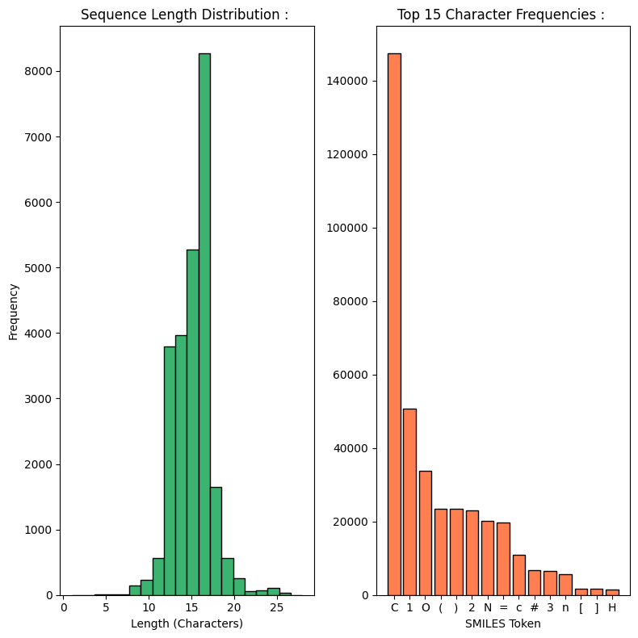
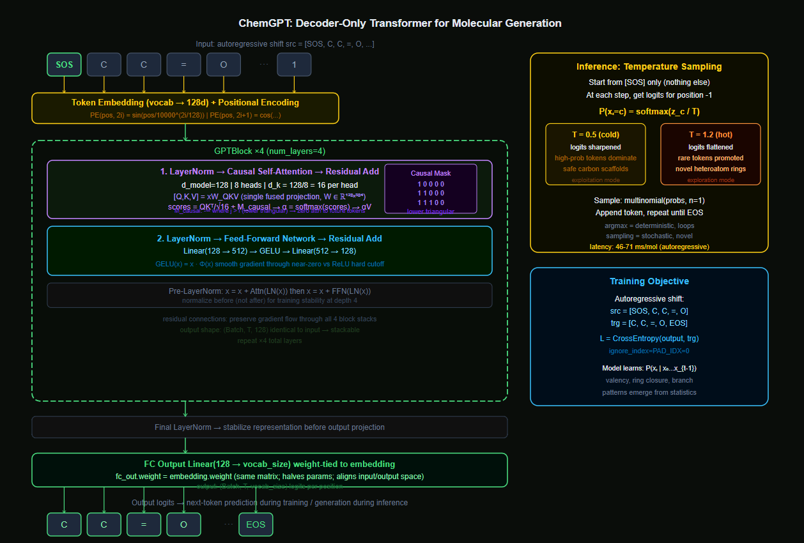
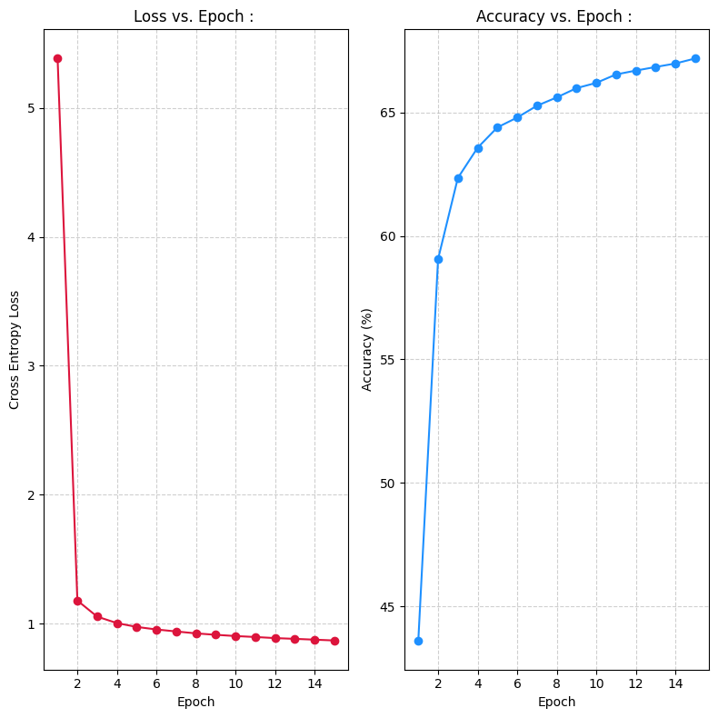

# ChemGPT : Molecular Generation Engine : 

---

## Problem : 

Generate novel, chemically valid organic molecules from scratch using a decoder-only Transformer trained on real molecular data.

**Input :** A `<SOS>` token (nothing else). The model generates entirely from learned priors.

**Output :** A SMILES string representing a new molecule the model has never seen before.


**SMILES** (Simplified Molecular-Input Line-Entry System) is a 1D text encoding of 3D molecular topology. `CC1CC2CC1C2=O` is not a random string; it encodes atom types, bond orders, ring openings, ring closures, and branch points in a precise grammar. `C` is a carbon, `=` is a double bond, `1` opens and closes a ring, `(` opens a branch. A neural model that learns to generate valid SMILES has implicitly learned valency rules, ring closure constraints, and chemical grammar from data alone.

**Generating Molecules :** Drug discovery requires exploring chemical space for molecules with desired properties. Chemical space contains an estimated $10^{60}$ valid drug-like molecules. Enumerating it by hand is impossible. A generative model that has learned the grammar of valid chemistry can sample novel regions of this space at inference-time cost.

---

## Decoder over S2S : 

Day 24 and Day 25 used Encoder-Decoder architectures where a source sequence is encoded, and the decoder translates it into a target sequence. There is always a conditioning input.

A decoder-only model has no encoder. It is a *pure language model*. Given a sequence of tokens so far, predict the next one.
At inference time, the only input is `<SOS>`, and the model generates the entire molecule *autoregressively* from that single seed.

There is nothing to translate; there is only something to create.

This is the GPT architecture: a stack of causal self-attention blocks with no cross-attention, trained to model the probability distribution $P(x_t \mid x_1, x_2, \ldots, x_{t-1})$ over all positions simultaneously.

---

## Dataset : (QM9)

QM9 is a quantum chemistry dataset containing 133,885 small organic molecules with up to 9 heavy atoms (C, N, O, F). Every molecule is DFT-verified; they are real, stable, synthetically accessible compounds. The SMILES strings in QM9 represent the ground truth distribution of valid small-molecule chemistry.

The molecules are small (max ~27 characters in SMILES), making them tractable for a `max_seq_len = 60` model. They are chemically diverse, covering a wide range of functional groups. And they are all valid; training on QM9 teaches the model what valid chemistry looks like, not just what strings look like.

The dataset is fetched directly from a public S3 URL via `urllib.request`. The SMILES column is extracted, filtered to sequences under `max_seq_len - 2 = 58` characters, shuffled, and 25,000 samples are drawn for training.

---

## Pipeline : 

1. Fetched QM9 CSV from public URL, extract SMILES column.
2. Filtered to sequences under 58 characters, shuffle, take 25,000 samples.
3. Build character vocabulary from all unique characters in the training set.
4. EDA : sequence length distribution, top-15 character frequencies.
5. Encoded sequences with autoregressive shift : `src = [SOS] + encoded`, `trg = encoded + [EOS]`.
6. Trained ChemGPT (4 GPTBlocks, 8 heads, 128d) for 15 epochs.
7. Tracked cross-entropy loss and next-token accuracy per epoch.
8. Generated molecules at temperature 0.5 (conservative) and 1.2 (exploratory).
9. Reported inference latency per molecule.

---

## EDA : 

### Sequence Length Distribution : 



SMILES lengths are tightly concentrated between 10 and 25 characters, peaking around 16-17. This reflects QM9's constraint of at most 9 heavy atoms; small molecules produce short SMILES strings. The tight distribution means padding overhead is minimal; most sequences in a batch are similar length.

### Character Frequency : 

`C` (carbon) dominates massively with ~150,000 occurrences, reflecting that organic chemistry is carbon-centric. `1` and `O` follow, representing ring closure digits and oxygen atoms. `(`, `)` appear frequently as branch delimiters. The presence of `#` (triple bond) and `[`, `]` (bracketed atoms) at the tail confirms the dataset contains diverse functional groups beyond simple alkanes.

This distribution tells the model what a typical molecule looks like statistically. The model will learn that `C` is the most probable next token in most contexts, but that `(`, `=`, `O`, and ring digits follow in contextually appropriate positions.

---

## Hyperparameters : 

| Parameter | Value | Significance |
|-----------|-------|-----|
| `d_model` | 128 | Sufficient representational capacity for the ~40-character SMILES vocabulary and short sequences; keeps VRAM manageable |
| `num_heads` | 8 | 8 heads of 16 dimensions each; heads can specialize on atom type, bond order, ring state, branch depth simultaneously |
| `num_layers` | 4 | 4 GPTBlocks provide enough depth to learn nested dependencies (ring closures span multiple positions); more layers would require more VRAM |
| `ffnn_dim` | 512 | FFNN expands 128d to 512d for nonlinear feature mixing; 4x ratio follows GPT convention |
| `max_seq_len` | 60 | Covers the longest QM9 SMILES plus SOS/EOS tokens with margin; hard cap needed for positional encoding pre-allocation |
| `batch_size` | 128 | Maximizes GPU utilization without OOM; larger batches give more stable gradient estimates for the small vocabulary |
| `lr` | 3e-4 | Standard AdamW learning rate for Transformer training; higher causes instability, lower causes slow convergence |
| `epochs` | 15 | Loss and accuracy plateau by epoch 12; additional epochs yield diminishing returns |

---

## Data Preprocessing : 

### Character-Level Tokenization : 

SMILES is tokenized at the character level; each character maps to a single integer.

The alternatives fail; 

Word-level tokenization would require pre-defining a vocabulary of all possible SMILES substrings; this vocabulary is unbounded (new ring closure combinations, new branch patterns). Subword tokenization (BPE) would split `[NH]` into `[`, `N`, `H`, `]`; it loses the semantic unit. Character-level preserves the atomic grammar: `C`, `=`, `(`, `1`, `N` are each distinct, meaningful primitives.

### Special Tokens : 

| Token | Index | Function |
|-------|-------|----------|
| `<PAD>` | 0 | Padding shorter sequences to batch length; ignored in loss via `ignore_index = 0` |
| `<SOS>` | 1 | Inference seed; tells the model "begin a new molecule from nothing" |
| `<EOS>` | 2 | Teaches the model when a molecule is complete; stops autoregressive generation |
| `<UNK>` | 3 | Any character not in the training vocabulary |

### Autoregressive Shift : 

The key preprocessing decision is how to frame the training objective. For a SMILES string `CC=O`:

```
src = [SOS, C, C, =, O]        (what the model sees)
trg = [C, C, =, O, EOS]      (what it must predict)
```

At every position $t$, the model sees tokens $0$ through $t$ and must predict token $t+1$. The source is shifted one position ahead of the target. This is the language modeling objective: predict the next character given all previous characters. Training on this objective over 25,000 molecules teaches the model the conditional probability distribution of valid SMILES continuations.

---

## Architecture :

### Overview

```
Input: [SOS, C, C, =, O, ...]     shape: (Batch, T)
    |
Token Embedding: vocab_size → 128d
    + Positional Encoding (sinusoidal, max_len = 60)    → (Batch, T, 128)
    |
GPTBlock × 4:
    LayerNorm → Causal Self-Attention → residual add
    LayerNorm → FFN (128 → 512 → 128, GELU) → residual add    → (Batch, T, 128)
    |
Final LayerNorm
    |
FC Output: 128 → vocab_size     (weight-tied to embedding)    → (Batch, T, vocab_size)
    |
Loss: CrossEntropyLoss(ignore_index = PAD) on shifted target
```



---

## Entire Decoder Math : 

### Positional Encoding : 

The Transformer processes all positions in parallel; without position information, `CC=O` and `=OCC` would be identical inputs. 
Sinusoidal positional encoding injects a unique coordinate vector at each position :

$$PE_{(\text{pos},\, 2i)} = \sin\left(\frac{\text{pos}}{10000^{2i/d_{\text{model}}}}\right)$$

$$PE_{(\text{pos},\, 2i+1)} = \cos\left(\frac{\text{pos}}{10000^{2i/d_{\text{model}}}}\right)$$

Added elementwise to the token embedding. Position 0 (SOS) gets a different encoding from position 5 (a ring closure digit), allowing the model to reason about where in the molecule it currently is.

### Causal Self-Attention : 

All three Q, K, V matrices are projected from the same input sequence (self-attention). With $d_{\text{model}} = 128$ and 8 heads, $d_k = 128 / 8 = 16$.

A single fused projection computes Q, K, V simultaneously :

$$[Q, K, V] = xW_{QKV}, \quad W_{QKV} \in \mathbb{R}^{128 \times 384}$$

Reshaped into 8 heads of 16 dimensions each. Scaled dot-product attention per head:

$$\text{scores} = \frac{QK^\top}{\sqrt{d_k}} + M_{\text{causal}}$$

Where $M_{\text{causal}}$ is a lower-triangular mask; positions where $j > i$ receive $-\infty$, which becomes 0 after softmax. Position $i$ can attend only to positions $\leq i$; future tokens are invisible.

$$\alpha = \text{softmax}\left(\frac{QK^\top}{\sqrt{d_k}} + M_{\text{causal}}\right), \quad \text{output} = \alpha V$$

All 8 head outputs are concatenated and projected: $\text{Concat}(\text{head}_1, \ldots, \text{head}_8)W_O$.

### GPT Block : 

Each of the 4 GPTBlocks applies Pre-LayerNorm (normalize before, not after), which stabilizes training;

$$x = x + \text{Attention}(\text{LayerNorm}(x))$$

$$x = x + \text{FFN}(\text{LayerNorm}(x))$$

The FFN uses GELU instead of ReLU :

$$\text{GELU}(x) = x \cdot \Phi(x)$$

Where $\Phi$ is the standard normal CDF. GELU provides smooth gradients through near-zero values, empirically improving training stability for language models compared to ReLU's hard zero cutoff.

### Weight Tying : 

The output FC layer's weights are tied to the token embedding matrix:

```python
self.fc_out.weight = self.embedding.weight
```

This halves the effective parameter count for the embedding/output layers, regularizes the model by forcing the input and output representations of each token to align, and is standard in GPT-style models. A token's embedding vector and its output logit vector are constrained to be the same matrix; the model learns a representation that is simultaneously good for input encoding and output prediction.

---

## Training: Phase 1 (Learning Chemical Grammar) : 

The model trains by minimizing the cross-entropy loss on next-token prediction over all non-padding positions. This is the chemical grammar learning phase. The model sees partial SMILES strings and must predict the next character.

What is actually being learned :
- After `C`, the most likely next tokens are `C`, `(`, `=`, `1`, `N`, `O`; not random characters.
- After `1` (opening a ring), the model must eventually predict `1` again (closing it); learning ring closure dependencies across 5-15 character distances.
- After `(`, a branch must eventually close with `)`, at any arbitrary depth.
- Valency constraints: carbon appears 4 times in bonds before a branch closes; nitrogen 3 times; oxygen 2 times.

By epoch 2, loss drops from 5.38 to 1.18; the model has learned the most frequent patterns (carbon chains, simple oxygen attachments). By epoch 15, loss is 0.87 and accuracy is 67.18%; the model reliably predicts the next character in most molecular contexts.

### Training Phase 2 (Generation) : 

After training, the decoder runs in pure generative mode. Starting from `[SOS]`, at each step :

1. Run the full forward pass on the current sequence.
2. Extract logits from the last position.
3. Apply temperature scaling.
4. Sample from the resulting distribution.
5. Append the sampled token and repeat until `<EOS>` or `max_seq_len` is reached.

This is the molecule hallucination phase. The model applies the chemical grammar it learned in training to generate novel structures it has never seen before.

---

## Temperature Sampling : 

Temperature $T$ scales the logit distribution before softmax :

$$P(x_t = c) = \frac{\exp(z_c / T)}{\sum_{c'} \exp(z_{c'} / T)}$$

At $T = 1.0$: unmodified distribution; the model samples proportionally to what it learned.

At $T < 1.0$ (e.g., 0.5): logits are sharpened; the highest-probability tokens become even more dominant. The model generates conservative, highly probable structures. Output tends toward common carbon scaffolds already well-represented in QM9.

At $T > 1.0$ (e.g., 1.2): logits are flattened; low-probability tokens get promoted. The model explores less-visited regions of chemical space. Output tends toward novel ring systems, unusual heteroatom placements, and structural patterns at the edge of the training distribution.

Neither regime is "better"; they serve different purposes. Low temperature for reliable, valid structures. High temperature for novel exploration with higher invalidity risk.

---

## Metrics : 

**Next-token accuracy :** The fraction of correctly predicted next tokens over all non-padded positions. Reaches 67.18% by epoch 15. This measures how well the model has learned the SMILES grammar but does not directly measure generation quality.

**Validity :** The fraction of generated SMILES that can be parsed by RDKit (a cheminformatics library) into a valid molecular graph. A model that has learned valency rules and ring closure constraints produces valid SMILES. Validity is the primary generation quality metric.

**Uniqueness :** Of all valid generated molecules, the fraction that are distinct from each other. A model that generates the same molecule repeatedly is not useful for exploration.

**Novelty :** The fraction of valid generated molecules that do not appear in the training set. This is the actual measure of generative utility it checks whether the model creats new chemistry or not. 

---

## Results : 

| Epoch | Loss | Accuracy | Time |
|-------|------|----------|------|
| 1 | 5.3834 | 43.62% | 84.48s |
| 2 | 1.1793 | 59.06% | 79.56s |
| 3 | 1.0546 | 62.35% | 77.91s |
| 4 | 1.0044 | 63.57% | 78.02s |
| 5 | 0.9746 | 64.39% | 77.93s |
| 6 | 0.9548 | 64.79% | 77.79s |
| 7 | 0.9394 | 65.27% | 78.57s |
| 8 | 0.9246 | 65.61% | 78.34s |
| 9 | 0.9135 | 65.98% | 78.16s |
| 10 | 0.9039 | 66.20% | 78.08s |
| 11 | 0.8964 | 66.54% | 77.37s |
| 12 | 0.8880 | 66.69% | 77.25s |
| 13 | 0.8821 | 66.84% | 77.86s |
| 14 | 0.8758 | 66.98% | 77.67s |
| 15 | 0.8695 | 67.18% | 78.56s |

Total training time : **19.63 minutes**.




### Generated Molecules : 

**Low temperature (T = 0.5, conservative) :**
```
CC1C2CC1C2=O
CC1C2CC(C=O)C2O1
CC1CC2C3CC3C2O1
Avg Inference Latency: 70.96 ms/mol
```

**High temperature (T = 1.2, exploratory) :**
```
CCOc1cc[nH]n1
O=CCCN1CC1O
N=C1NC=CNN=C1
Avg Inference Latency: 46.24 ms/mol
```

The low-temperature outputs show carbon-heavy ring systems consistent with QM9 scaffolds. The high-temperature outputs show more heteroatom diversity; `[nH]` (aromatic NH), `=N` (imine), `O=C` (carbonyl) appear in novel arrangements. Latency is lower at high temperature because the model reaches `<EOS>` sooner (shorter molecules due to flatter distributions producing early termination tokens more often).

---

## Time, Space, and Inference Complexity : 

Let $T$ = sequence length (max 60), $d$ = model dim (128), $H$ = heads (8), $L$ = layers (4), $K$ = samples (25,000), $E$ = epochs (15).

**Training complexity :**

$$O\!\left(E \cdot K \cdot L \cdot T^2 \cdot d\right)$$

The $T^2$ term comes from the attention score matrix ($T \times T$ per head per layer). With $T = 60$: $60^2 = 3{,}600$ multiplications per attention block. Multiplied across 4 layers, 8 heads, 25,000 samples, and 15 epochs. Average epoch time of ~78 seconds confirms GPU-bound computation.

**Space complexity :**

$$O\left(L \cdot H \cdot T^2\right)$$

The causal attention matrix ($T \times T$) must be stored per head per layer for backpropagation. For $T = 60$, $L = 4$, $H = 8$; $4 \times 8 \times 3{,}600 = 115{,}200$ values per batch. Negligible at this scale; the bottleneck is the embedding matrix ($\mathrm{vocab\_size} \times 128$) and weight-tied output layer.

**Inference complexity per molecule :**

$$O\left(T^2 \cdot L \cdot d\right)$$

Autoregressive generation runs $T$ forward passes, each of length 1 through $T$. Total operations scale as $T^2$. Measured at 46-71 ms per molecule; batched inference would reduce this substantially.

---

## Failure Case Analysis :  

**Structural validity without biological validity :** The model learns SMILES grammar and generates strings that parse correctly into molecular graphs. It has no information about binding affinity, toxicity, solubility, or synthetic accessibility. A molecule that is structurally valid can still be toxic, insoluble, or impossible to synthesize. Validity in the SMILES sense and utility in the drug discovery sense are different properties.

**Context window limits macromolecule generation :** `max_seq_len = 60` covers QM9-scale small molecules. Peptides, oligonucleotides, and macrocyclic drugs have SMILES strings of 100-500+ characters. The positional encoding is pre-allocated to length 60; positions beyond this are undefined. Longer molecules require either a larger context window (quadratic VRAM cost) or linear attention mechanisms.

**Ring closure hallucinations at high temperature :** SMILES ring closure requires paired digits: `1` opens a ring at position $i$ and closes it at position $j$. At high temperature, the model may open a ring (generate `1`) without ever closing it, producing an invalid SMILES string. The model has no explicit state machine tracking open rings; it relies on learned attention patterns to maintain this constraint across positions.

**Training distribution boundary :** The model has learned the distribution of QM9 molecules; small organic molecules with up to 9 heavy atoms. Generated molecules that require chemical motifs not represented in QM9 (long conjugated systems, metal coordination bonds, complex stereochemistry) will be poorly formed. The model's creativity is bounded by its training distribution.

**No explicit valency enforcement :** Carbon must form exactly 4 bonds. If the model generates `CC(C)(C)(C)C` (5 bonds on one carbon), it violates valency. The model learns valency as a statistical regularity, not as a hard constraint. At low temperature this is rarely violated; at high temperature violations occur more frequently. A post-processing validity filter using RDKit is the standard engineering solution.

**Weight tying constrains output diversity :** Tying the embedding and output weights forces the same vector to serve dual purposes; encoding the token as input and scoring it as output. For most tokens this is fine. For rare tokens (exotic ring atoms, bracketed species) that appear infrequently in training, the shared representation may be poorly calibrated for either role, degrading both encoding and generation quality for those tokens.

---

## Key Takeaways : 

- A decoder-only Transformer trained on SMILES strings learns molecular grammar from data alone, with no explicit encoding of valency, bond order, or ring closure rules. The rules emerge from the statistical patterns.
- The autoregressive training shift (`src = [SOS] + encoded`, `trg = encoded + [EOS]`) is the entire mechanism that converts a string dataset into a language modeling objective. One preprocessing decision enables both learning and generation.
- Temperature sampling controls the exploration-exploitation tradeoff in chemical space. Low temperature generates safe, known-pattern structures. High temperature generates novel structures at the cost of higher invalidity rates.
- Weight tying between embedding and output layers is not a shortcut but rather a regularization mechanism that aligns input and output token representations.
- Next-token accuracy at 67% means the model correctly predicts the next character two-thirds of the time. It is sufficient for high-validity generation because errors in low-probability positions (unusual characters) matter less than accuracy in high-probability positions (common carbon characters).

