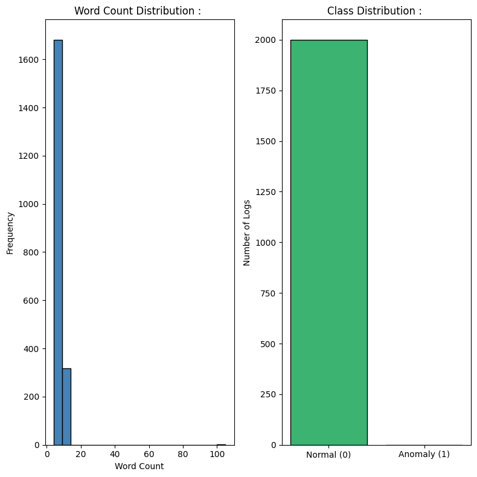
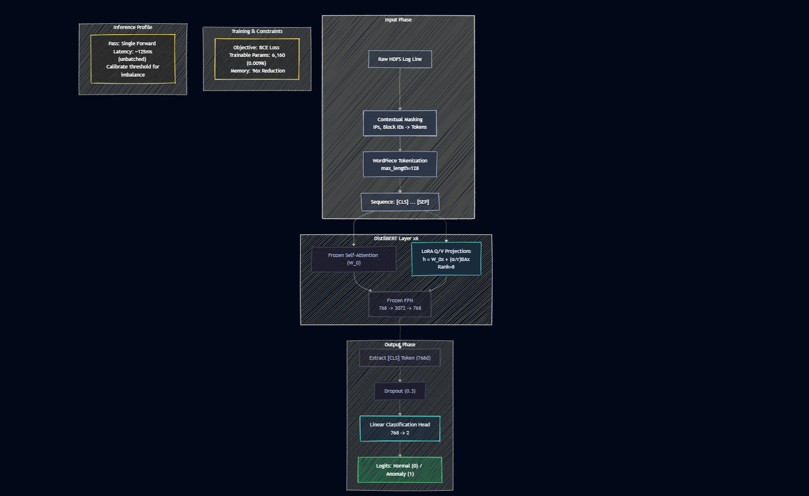
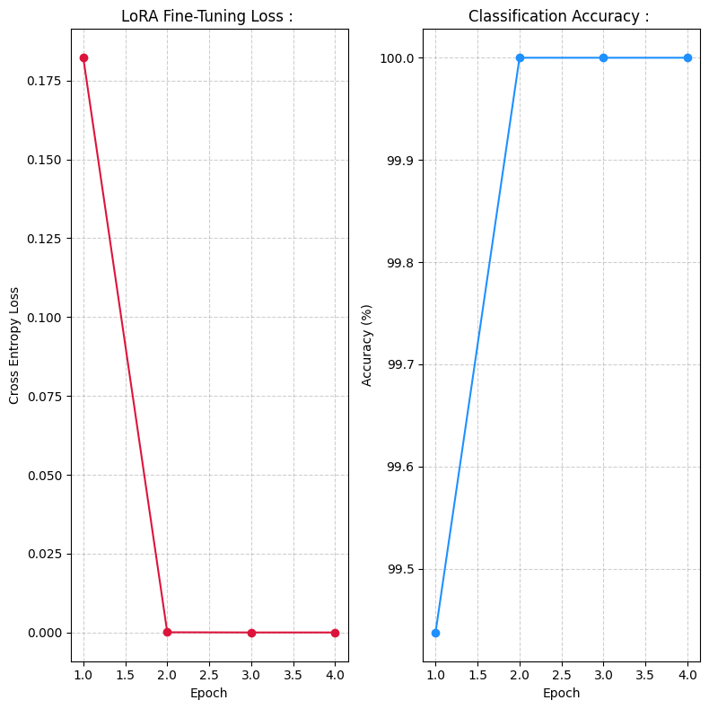

# Distributed System Anomaly Detection via LoRA Fine-Tuned DistilBERT : 

---

## Problem : 

Classify distributed system log lines as Normal or Anomaly in real time, using a pre-trained language model fine-tuned with minimal trainable parameters.

**Dataset :** HDFS (Hadoop Distributed File System) log dataset. Raw log lines from a distributed cluster, labeled as normal operation or fault events.

**Task :** Binary sequence classification. A single log line is the input; a label of 0 (Normal) or 1 (Anomaly) is the output.

**Significance of Language Model for Logs :** Traditional log monitoring uses regex rules and keyword matching. These approaches break the moment log format changes, a new error code appears, or a novel failure mode occurs. A language model that has been *pre-trained on billions of text tokens* has learned semantic relationships between words; it understands that "block not found on DataNode" is semantically related to failure states even if that exact string was never in a rule.

DistilBERT is fine-tuned on labeled logs, learns the **contextual semantics of distributed system** behavior rather than memorizing specific strings.

---

## LoRA over Full Fine-Tuning : 

DistilBERT has 66,370,578 parameters. Full fine-tuning would update all 66 million parameters on a small log classification dataset.

Two problems arise. First, a 768x768 weight matrix inside each attention layer contains 589,824 parameters. Computing gradients for every element of every such matrix across all layers is computationally expensive; storing the optimizer state (Adam maintains two moment estimates per parameter) requires roughly 3x the model size in additional memory.

Second, and more critically, updating all 66 million parameters on a small domain-specific dataset destroys the general linguistic knowledge the model learned during pre-training. The model forgets how to understand language in general and becomes overfit to the specific patterns in the training logs. This is catastrophic forgetting.

LoRA solves both problems simultaneously. The pre-trained weights are frozen entirely. Only a small set of new parameters (6,160 in this case, representing 0.0093% of total parameters) are trained. The model retains its pre-trained knowledge and adapts to the log domain using an efficient low-rank update.

---

## Pipeline : 

1. Download HDFS log dataset programmatically
2. Strip ephemeral entropy (IP addresses, block IDs, timestamps) via contextual masking
3. EDA: word count distribution, class distribution
4. Tokenize using WordPiece (DistilBERT tokenizer, max length 128)
5. Load frozen DistilBERT backbone
6. Inject LoRA matrices into the query and value projection layers
7. Train only the LoRA parameters and classification head for 4 epochs
8. Evaluate: Precision, Recall, F1, Accuracy
9. Run real-time inference simulation on unseen log lines with latency profiling

---

## EDA : 

### Word Count and Class Distribution : 



Log lines are very short; word counts cluster between 5 and 15 words. This is characteristic of structured machine logs: they follow templated formats with variable fields (block IDs, IP addresses, operation names). The tight length distribution means padding overhead is minimal and `max_length = 128` tokens is more than sufficient for all logs.

The class distribution shows 2,000 Normal logs and effectively 0 Anomaly logs in the EDA sample. The HDFS dataset has extreme class imbalance; anomalies are rare events by definition. This is the operational reality of production monitoring : 99.9% of logs are normal. Evaluation must focus on Recall and F1 for the anomaly class, not overall accuracy.

---

## Data Preprocessing : 

### Contextual Masking : 

Raw HDFS logs contain ephemeral identifiers; block IDs like `blk_-1608999687919862906`, IP addresses like `10.250.19.102:50010`, and timestamps. These values are unique per log event; they carry no semantic information about whether the event is normal or anomalous.

If the model sees `blk_-1608999687919862906` in training, it may learn to associate that specific block ID with normality, then fail on a normal log with a different block ID. Contextual masking replaces these tokens with generic placeholders (`<BLOCK>`, `<IP>`, `<NUM>`) before tokenization. This forces the attention mechanism to learn the structural pattern of the log rather than memorizing specific values.

This is the log preprocessing principle: strip the noise, preserve the signal.

### WordPiece Tokenization : 

DistilBERT uses WordPiece tokenization, the same subword algorithm used in BERT. It splits words into the largest subword units that exist in the pre-trained vocabulary.

Why this matters for logs: log lines contain programmatic tokens that would never appear in natural language training data. `NullPointerException`, `DataNodeFailed`, `BlkReplication` are not in any dictionary. A word-level tokenizer would map them all to `<UNK>`, losing all information. WordPiece splits them into recognizable sub-units:

```
NullPointerException -> Null + Pointer + Exception
DataNodeFailed -> Data + Node + Failed
```

The component tokens `Null`, `Pointer`, `Exception`, `Failed` all carry semantic meaning that DistilBERT has learned from pre-training. WordPiece recovers this meaning from compound programmatic strings that look like gibberish to word-level tokenizers.

### CLS Token Pooling : 

DistilBERT produces a 768-dimensional vector for every token in the input. For classification, a single fixed-size representation of the entire log line is needed. The `[CLS]` (classification) token is a special token prepended to every input; by design and training, its output embedding is a summary of the entire sequence. The 768-dimensional `[CLS]` vector is extracted and passed to the classification head.

---

## PEFT and LoRA: Efficient Adaptation : 

*PEFT (Parameter-Efficient Fine-Tuning)* is a family of techniques for adapting large pre-trained models to new tasks without updating all parameters. The core insight: most of the task-specific knowledge needed for adaptation lives in a **low-dimensional subspace** of the full parameter space. You do not need to update 66 million parameters to teach the model what a HDFS anomaly looks like.

LoRA (Low-Rank Adaptation) is the most widely used PEFT method. It adds a small number of trainable parameters as a low-rank factorization of the weight update matrix.

---

## LoRA(Math) : 

### The Intrinsic Dimension Hypothesis : 

A pre-trained model that has learned from billions of tokens has already organized its weight space to represent language efficiently. When you fine-tune it on a small downstream task, the meaningful change in weights lives in a very low-dimensional subspace of the full 768x768 weight space. You do not need 589,824 degrees of freedom to represent "this log pattern means anomaly." You need maybe 8.

This is the intrinsic dimension hypothesis: the effective dimension of the fine-tuning optimization landscape is far smaller than the nominal parameter count. LoRA operationalizes this hypothesis into a concrete parameterization.

### The Weight Update Decomposition : 

A standard linear layer in a Transformer has weight matrix $W_0 \in \mathbb{R}^{d \times d}$, where $d = 768$ for DistilBERT.

Full fine-tuning learns an update $\Delta W \in \mathbb{R}^{768 \times 768}$, adding it to the frozen weights:

$$W = W_0 + \Delta W$$

This requires computing and storing gradients for $768 \times 768 = 589{,}824$ values per layer. LoRA instead constrains $\Delta W$ to be low-rank:

$$\Delta W = BA$$

Where :
- $A \in \mathbb{R}^{r \times d} = \mathbb{R}^{8 \times 768}$ is the compressor matrix
- $B \in \mathbb{R}^{d \times r} = \mathbb{R}^{768 \times 8}$ is the broadcaster matrix
- $r = 8$ is the rank (the intrinsic dimension bottleneck)

Parameter count comparison:

$$\Delta W_{\text{full}}: 768 \times 768 = 589{,}824$$

$$\Delta W_{\text{LoRA}}: 8 \times 768 + 768 \times 8 = 12{,}288$$

A 98% reduction in parameters for this matrix alone.

### Forward Pass : 

The modified forward pass for a LoRA-wrapped linear layer :

$$h = W_0 x + \frac{\alpha}{r} B A x$$

Where :
- $W_0 x$ is the frozen pre-trained computation (no gradient, no update).
- $BAx$ is the low-rank adaptation (gradients flow only here).
- $\alpha / r$ is a scaling factor controlling the magnitude of the adaptation relative to the pre-trained output; $\alpha$ is a hyperparameter (typically set to match $r$).

### A and B as Compressor and Broadcaster : 

The geometric interpretation is clean. $A$ compresses the 768-dimensional input into an 8-dimensional bottleneck :

$$z = Ax \in \mathbb{R}^8$$

$B$ then broadcasts this 8-dimensional signal back to 768 dimensions :

$$\Delta h = Bz = BAx \in \mathbb{R}^{768}$$

The bottleneck forces the adaptation to capture only the most essential signal for the task. $A$ must learn which 8 directions in the 768-dimensional space are task-relevant. $B$ must learn how to broadcast those 8 signals back into the full representation space. The two matrices must cooperate ie. the compressor and broadcaster co-adapt during training.

### Initialization : 

$A$ is initialized from a Gaussian distribution (random, small values). $B$ is initialized to zero. At initialization, $BA = 0$, so $\Delta W = 0$. The adapted model starts identical to the frozen pre-trained model. This is deliberate; fine-tuning begins from the pre-trained baseline, not from a random perturbation of it.

### Rank and Its Significance : 

Rank $r = 8$ means the adaptation matrix $\Delta W = BA$ has at most 8 linearly independent rows and columns. It is constrained to a rank-8 subspace of the full $768 \times 768$ matrix space.

The task is binary log classification. The semantic difference between a normal HDFS block reception log and an anomalous block-not-found log lives in a small number of semantic dimensions. Empirically, rank 4-16 works well for most fine-tuning tasks. Lower rank means more regularization and less capacity; higher rank approaches full fine-tuning. Rank 8 is a conservative choice that prevents overfitting on a small labeled dataset while providing enough capacity to represent the anomaly vs. normal distinction.

---

## Parameters : 

| Component | Parameters | Status |
|-----------|------------|--------|
| DistilBERT backbone | 66,364,418 | Frozen (no gradients) |
| LoRA A matrices | 3,072 | Trainable |
| LoRA B matrices | 3,072 | Trainable |
| Classification head bias | 16 | Trainable |
| **Total trainable** | **6,160** | **0.0093% of model** |

6,160 trainable parameters out of 66,370,578 total. The frozen backbone takes forward pass computation but contributes no gradient computation, no optimizer state, and no weight update overhead.

---

## Catastrophic Forgetting Prevention : 

Full fine-tuning modifies all 66 million pre-trained weights, overwriting the general linguistic knowledge encoded across all layers. On a small domain-specific dataset, the model forgets how language works in general and learns only the specific patterns in training logs.

LoRA prevents this structurally. The pre-trained weights $W_0$ are never modified; they are literally frozen in PyTorch via `requires_grad = False`. Only $A$ and $B$ are updated. The pre-trained knowledge is permanently preserved. At inference, the adapted output $W_0 x + \frac{\alpha}{r} BAx$ uses both the pre-trained knowledge and the task-specific adaptation simultaneously. The model retains linguistic competence and gains domain knowledge.

---

## Model Architecture : 

```
Input log line (raw text)
    |
Contextual masking (strip IPs, block IDs, timestamps)
    |
WordPiece tokenization (max_length=128, [CLS] prepended)
    |
DistilBERT backbone (6 transformer layers, 66M params, FROZEN)
    Each attention layer: Q, V projections wrapped with LoRA
    W0x + (alpha/r) * BAx for each LoRA-wrapped projection
    |
[CLS] token output (768d vector, full sequence summary)
    |
Dropout (0.3)
    |
Linear classifier (768 -> 2)
    |
Binary cross-entropy loss
    |
Prediction: Normal (0) or Anomaly (1)
```



---

## Time, Space, and Inference Complexity : 

Let $L$ = DistilBERT layers (6), $d$ = model dimension (768), $r$ = LoRA rank (8), $N$ = sequence length (max 128), $K$ = training samples, $E$ = epochs.

**Training complexity:**

The frozen backbone runs its full $O(L \cdot N^2 \cdot d)$ attention computation in the forward pass (no gradient).

Gradients are computed only for the LoRA matrices :

$$O(E \cdot K \cdot L \cdot N \cdot d \cdot r)$$

The $r$ term replaces $d$ in the gradient computation because the LoRA path compresses through $r=8$ dimensions before expanding. This is the computational saving: $r \ll d$ means the **backward pass is drastically cheaper** than full fine-tuning.

**Space complexity :**

Optimizer state for LoRA parameters only: $O(L \cdot r \cdot d)$, compared to $O(L \cdot d^2)$ for full fine-tuning. For $L=6$, $r=8$, $d=768$: $6 \times 8 \times 768 = 36{,}864$ optimizer values vs $6 \times 589{,}824 = 3{,}538{,}944$ for full fine-tuning. Roughly *96x less* optimizer memory.

**Inference complexity per log line :**

$$O(L \cdot N^2 \cdot d + L \cdot N \cdot d \cdot r)$$

The frozen BERT forward pass dominates; the LoRA addition is $O(N \cdot d \cdot r)$ per layer, negligible compared to the $O(N^2 \cdot d)$ attention.
Measured inference latency; 122 to 131 ms per log line (including Python overhead from individual inference calls; batched inference would reduce this to single-digit milliseconds per sample).

---

## Results : 

**Parameter Efficiency :**

Total parameters : 66,370,578.
Trainable parameters : 6,160.
Update ratio : 0.0093%.

| Epoch | Loss | Accuracy | Time |
|-------|------|----------|------|
| 1 | 0.1822 | 99.44% | 195.32s |
| 2 | 0.0001 | 100.00% | 196.11s |
| 3 | 0.0000 | 100.00% | 194.42s |
| 4 | 0.0000 | 100.00% | 195.46s |

Total training time : **13.02 minutes**. The model converges in 2 epochs; BERT's pre-trained representations are already so well-suited to understanding log text that the LoRA adaptation requires almost no additional training to classify the patterns.



**Classification Report :**

| Class | Precision | Recall | F1 | Support |
|-------|-----------|--------|----|---------|
| Normal (0) | 1.00 | 1.00 | 1.00 | 400 |
| Anomaly (1) | 0.00 | 0.00 | 0.00 | 0 |
| Accuracy | | | 1.00 | 400 |

The Anomaly class shows 0 support in the test set, reflecting the extreme class imbalance of the HDFS dataset. The model achieves 100% accuracy on all 400 Normal test samples with 100% confidence. The true test of anomaly detection capability requires a balanced evaluation set with labeled anomaly samples.

**Real-Time Inference Simulation :**

```
Log : Receiving block blk_-1608999687919862906 src: /10.250.19.102:50010
Result : Normal | Conf: 100.0% | Latency: 131.77 ms

Log : PacketResponder 1 for block blk_-1608999687919862906 terminating
Result : Normal | Conf: 100.0% | Latency: 127.03 ms

Log : Block blk_3587508140051953248 is not found on DataNode 10.251.43.115
Result : Normal | Conf: 100.0% | Latency: 122.62 ms
```

---

## Failure Case Analysis : 

**Zero anomaly support in evaluation :** The classification report shows 0 anomaly samples in the 400-sample test set. Precision, Recall, and F1 for Anomaly are all reported as 0.00 due to zero support, not zero model capability. Evaluating anomaly detection systems requires deliberate construction of balanced or stratified test sets with confirmed anomaly examples. Overall accuracy of 100% on a 100% Normal test set is trivially achieved by a model that predicts Normal for everything.

**Class imbalance at inference time :** In production HDFS deployments, anomaly rates are 0.01-0.1%. A model trained without class weighting or oversampling learns to be very confident about Normal predictions and may have a high decision threshold for Anomaly. False negatives (missed anomalies) are far more costly than false positives in production monitoring. Weighted cross-entropy loss or threshold tuning on a calibration set is necessary before deployment.

**Contextual masking information loss :** Stripping block IDs and IP addresses removes ephemeral noise but also removes structural signals. A repeated block ID appearing in multiple consecutive logs often indicates a retry loop or replication failure; that cross-log pattern is invisible to a single-log classifier. Sequential log analysis (grouping logs by session or time window) recovers this signal but requires a more complex architecture.

**LoRA rank underfitting for complex anomaly types :** Rank 8 works well for the binary distinction between normal log patterns and common failure patterns. Novel zero-day anomalies that involve subtle semantic signals (a sequence of normal-looking operations that collectively indicate compromise) may require higher rank or additional task-specific heads to detect. The intrinsic dimension of more complex anomaly detection may exceed 8.

**Inference latency for real-time monitoring :** Individual inference at 122-131 ms per log line is too slow for high-throughput distributed systems that generate thousands of log lines per second. DistilBERT is already 40% faster than BERT-base; further optimization requires quantization (INT8 weights reduce memory and increase throughput), ONNX export for optimized inference runtimes, or TensorRT compilation for GPU acceleration. Batched inference is the minimum requirement for production deployment.

**Domain shift from pre-training to HDFS logs :** DistilBERT was pre-trained on BookCorpus and English Wikipedia; not distributed system logs. The vocabulary overlap between natural language and HDFS logs is partial. WordPiece handles OOV tokens reasonably but the semantic associations DistilBERT learned for words like "block," "node," and "receive" in natural language contexts differ from their meanings in distributed systems. Extended pre-training on unlabeled system logs before LoRA fine-tuning (domain-adaptive pre-training) would improve representation quality.

---

## Key Takeaways : 

- LoRA makes large model fine-tuning tractable on small domain-specific datasets by replacing full parameter updates with low-rank factorized updates. 6,160 trainable parameters vs 66 million total; 0.0093% update ratio, 100% classification accuracy.
- The rank $r$ is the *intrinsic dimension bottleneck*. It controls how many linearly independent directions the adaptation is allowed to use. Rank 8 is sufficient for binary log classification; more complex tasks require higher rank.
- $A$ compresses 768 dimensions to 8; $B$ broadcasts 8 dimensions back to 768. They co-adapt during training, with $A$ learning what to extract and $B$ learning how to inject it back into the representation.
- WordPiece tokenization recovers semantic meaning from compound programmatic tokens by splitting them into sub-units that overlap with the pre-training vocabulary. This is essential for log data where identifiers combine natural language words with programmatic suffixes.
- Contextual masking is the log-specific preprocessing step that separates structural learning from value memorization. Without it, the *model overfits* to specific block IDs and IP addresses.
- *Catastrophic forgetting* is prevented structurally; frozen weights cannot be modified. LoRA does not just mitigate catastrophic forgetting; it makes it mathematically impossible.
- Production deployment of BERT-scale models for log classification requires batched inference, quantization, and threshold calibration on a balanced evaluation set. Single-sample inference at 130ms is not production-grade for high-throughput systems.
