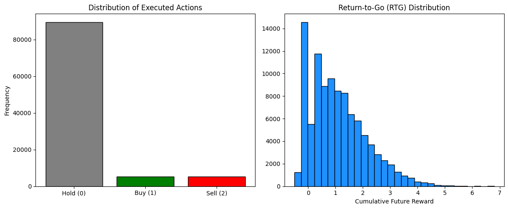
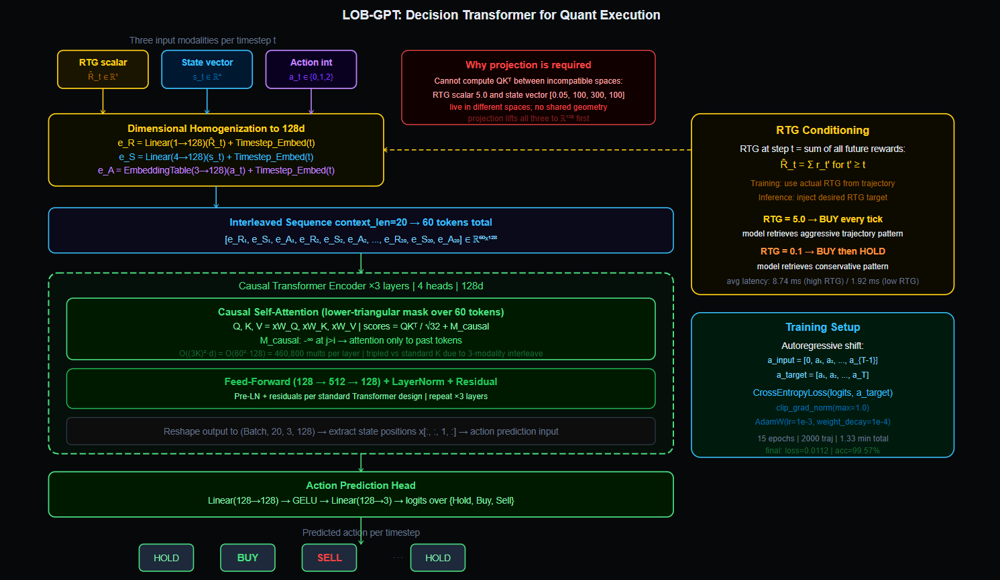
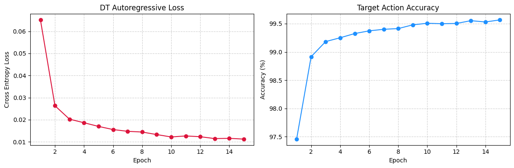

# Quantitative Trade Execution : 

---

## Problem : 

Generate a sequence of limit order book trading actions **(Buy, Hold, Sell)** conditioned on a desired profit target, using a causal Transformer trained entirely on offline market trajectory data.

**The Key Insight :** Instead of telling the model "maximize reward," we tell it "here is the reward I want; generate the action sequence that achieves it." The model learns from historical trajectories what action sequences led to which outcomes, then at inference time we specify the outcome and the model generates the corresponding actions.

**State space :** 4 continuous features per timestep: bid-ask spread, mid price, bid volume, ask volume.

**Action space :** 3 discrete actions: Hold (0), Buy (1), Sell (2).

**Target :** TO generate a 5-tick execution plan conditioned on a user-specified Return-to-Go (RTG) target.

---

## Moving past standard RL : 

Traditional RL agents learn by interacting with the environment, receiving rewards, and updating a policy through trial and error. For financial markets this is problematic : 


1. Live market interaction means real capital at risk. We can't let an exploratory RL agent place thousands of random orders while it "learns" the market. The exploration phase of RL is financially ruinous.

2. RL requires a reward signal from the environment after every action. Market rewards are *delayed and noisy*. The relationship between an action at tick $t$ and the resulting PnL at tick $t+5$ is confounded by market microstructure noise, competing agents, and macro events. Credit assignment is extremely hard.

3. Standard RL algorithms like PPO and SAC are *unstable* in high-dimensional, non-stationary environments. Financial markets change regime; a policy trained on 2020 data may completely fail in 2022 market conditions.

**The Decision Transformer reframes RL as a supervised sequence modeling problem.** No environment interaction during training. No exploration. No reward credit assignment. Just a given history of (state, action, RTG) triplets and a desired future return, predict the next optimal action.

---

## Fine Tuning over standard Language Modelling : 

A standard LLM like GPT or DistilBERT operates on text tokens; discrete integer IDs from a fixed vocabulary. Market data is fundamentally different. States are continuous 4-dimensional vectors (spread, price, bid volume, ask volume). RTG is a continuous scalar. Actions are discrete integers from a 3-class vocabulary.

We can't tokenize continuous market states into a discrete vocabulary without *catastrophic information loss*. Discretizing a float like `spread = 0.0472` into a token destroys the precision the model needs to distinguish tight from wide spreads. Fine-tuning a text LLM on market data would require *aggressive quantization* of continuous features into discrete bins, destroying the signal that drives trading decisions.

Hence DT here is built from scratch to handle the *mixed continuous-discrete modality* of market microstructure data.

---

## Dataset(Synthetic LOB Trajectories) : 

No public labeled dataset exists for (market state, optimal action) pairs at the tick level. Real LOB data is proprietary, expensive, and contains survivorship bias.
The synthetic generator produces trajectories with the statistical properties of real microstructure data.

### Dataset Generation : 

For each episode :

1. Initialize mid price at 100.0.
2. At each timestep, sample spread from a clipped normal distribution centered at 0.05, sample bid and ask volumes uniformly, add Brownian motion to mid price.
3. Apply a rule-based oracle policy ie. if spread is tight and bid volume significantly exceeds ask volume, BUY; if spread is tight and ask volume significantly exceeds bid volume, SELL; otherwise HOLD.
4. Record the reward for each action.
5. Compute Return-to-Go (RTG) for the entire trajectory by discounted backward summation.

**2,000 episodes of 50 timesteps each** produce 100,000 (state, action, RTG) triplets. The oracle policy creates economically meaningful action patterns ie. buy when order book shows buying pressure, sell when it shows selling pressure, hold when conditions are ambiguous.

---

## Pipeline : 

1. Generating 2,000 synthetic LOB trajectories of 50 steps each.
2. EDA; action distribution, RTG distribution.
3. Normalizing states to zero mean, unit variance across the training set.
4. Building sliding window dataset; random 20-step windows from trajectories.
5. Training (3 layers, 4 heads, 128d) for 15 epochs with causal masking.
6. Tracking cross-entropy loss and next-action accuracy per epoch.
7. Running a reward-conditioned inference at RTG = 5.0 (aggressive) and RTG = 0.1 (conservative).
8. Profile per-tick inference latency.

---

## EDA : 

### Action and RTG Distributions : 



Hold actions dominate at ~90,000 occurrences vs ~5,000 each for Buy and Sell. This reflects the economics of the oracle policy where *tight spreads with sufficient volume imbalance are relatively rare*.
Most market states are ambiguous; the correct action is to wait. The class imbalance is realistic; a good trading strategy holds most of the time and acts selectively.

The RTG distribution is right-skewed; most trajectories have low cumulative future reward (0-1) with a long tail extending to 7. This reflects that most Hold-heavy episodes generate little return, while episodes that executed multiple profitable Buy or Sell trades accumulate significant RTG.
The RTG distribution encodes the outcome quality of different trajectory patterns.

---

## Hyperparameters : 

| Parameter | Value | Significance |
|-----------|-------|-----|
| `context_len` | 20 | 20 timesteps of context. Each step contributes 3 tokens (RTG, State, Action), so the effective attention window is 60 tokens. |
| `d_model` | 128 | Latent dimension for all modalities after projection. Large enough to represent the joint embedding of all three input types; small enough to train fast on a synthetic dataset. |
| `num_heads` | 4 | 4 attention heads of 32 dimensions each. Heads specialize on different temporal patterns; short-term spread dynamics, volume imbalance momentum, price trend and RTG trajectory. |
| `num_layers` | 3 | 3 Transformer blocks. Sufficient depth to compose temporal patterns across the 20-step context without overfitting on 2,000 trajectories. |
| `state_dim` | 4 | Spread, mid price, bid volume, ask volume. The minimal sufficient statistics of LOB microstructure for tick-level trading decisions. |
| `act_dim` | 3 | Hold, Buy, Sell. The complete action space for a single-asset trading strategy. |

---

## Return-to-Go(The Conditioning Mechanism) : 

RTG at timestep $t$ is the sum of all future rewards from $t$ onward :

$$\hat{R}_t = \sum_{t'=t}^{T} r_{t'}$$

RTG is computed by backward summation over each trajectory; 

```
rtg[T] = reward[T]
rtg[t] = reward[t] + rtg[t+1]   for t = T-1 down to 0
```

This gives RTG a simple and powerful property ie. high RTG at the beginning of a trajectory means the episode was profitable overall. Low RTG means it was not.

During training, the model sees the actual RTG computed from the trajectory. Model learns; "when I see RTG = 5.0 at tick 1, the historical pattern shows that BUY actions were taken in subsequent ticks because the market conditions supported it."
During inference, you inject a desired RTG that you have not earned yet. We are telling the model; "generate the action sequence that a profitable trajectory with RTG = 5.0 would have produced at this market state." The model retrieves the corresponding behavioral pattern from its learned trajectory distribution and generates those actions.

This is the fundamental difference from standard RL here the model conditions on the desired outcome to generate behavior, rather than learning through reward maximization.

---

## Architecture :

```
For each timestep t, three inputs are prepared :
    RTG scalar:       R_hat_t  ∈ ℝ¹
    State vector:     s_t      ∈ ℝ⁴
    Action integer:   a_t      ∈ {0, 1, 2}

Projected to unified 128d space :
    e_R = Linear(1  → 128)(R_hat_t) + Timestep_Embedding(t)
    e_S = Linear(4  → 128)(s_t)     + Timestep_Embedding(t)
    e_A = Embedding(3 → 128)(a_t)   + Timestep_Embedding(t)

Interleaved sequence for context_len=20 timesteps :
    [e_R_1, e_S_1, e_A_1, e_R_2, e_S_2, e_A_2, ..., e_R_20, e_S_20, e_A_20]
    Shape: (Batch, 60, 128)  — 3 tokens per timestep

Causal Transformer (3 layers, 4 heads) :
    Causal mask: lower triangular over 60 tokens
    Output: (Batch, 60, 128)

Reshape back to (Batch, 20, 3, 128) :
    Extract state positions: x[:, :, 1, :]  — position 1 = state token in each triplet

Action prediction head :
    Linear(128 → 128) → GELU → Linear(128 → 3)
    → logits over {Hold, Buy, Sell} for each of the 20 timesteps

Loss : CrossEntropyLoss on predicted vs actual.
```


---

## Dimensional Homogenization(Importance of Linear Projection) : 

The three input modalities are *fundamentally incompatible* as raw values. The spread is a float near 0.05. The mid price is a float near 100.0. The action is an integer 0, 1, or 2. 
We can't directly compute attention ($QK^\top$) between a raw float and an integer; they live in completely different numeric spaces with no common geometry.

More fundamentally, $QK^\top$ is a dot product. For a dot product between two vectors to mean anything, those vectors must live in the same vector space. A scalar RTG value of 5.0 and a 4-dimensional state vector cannot be dot-producted.
They need to be lifted into the same ambient space first.

Linear projection to 128d does this. Each modality gets its own *learned projection matrix* that maps its native representation into the shared 128-dimensional space : 

**RTG Projection (scalar to 128d) :**

$$e_{R_t} = W_R \hat{R}_t + b_R, \quad W_R \in \mathbb{R}^{128 \times 1}$$

The single RTG scalar is expanded into 128 dimensions. The projection matrix $W_R$ learns which directions in the 128d space encode "high expected return" vs "low expected return."

**State Projection (4d to 128d) :**

$$e_{s_t} = W_S s_t + b_S, \quad W_S \in \mathbb{R}^{128 \times 4}$$

The 4 market features are jointly embedded into 128d. The projection learns that certain combinations of spread, price, and volume correspond to certain regions of the latent space.

**Action Embedding (Discrete to 128d) :**

$$e_{a_t} = \text{EmbeddingTable}(a_t), \quad \text{table} \in \mathbb{R}^{3 \times 128}$$

Each of the 3 actions gets a learned 128-dimensional vector. Unlike the continuous projections, this is a lookup table.

After projection, all three modalities live in the same $\mathbb{R}^{128}$ space. Now $Q$, $K$, $V$ can be computed uniformly across all tokens regardless of their original type.
The attention mechanism can learn that the RTG token at $t = 1$ is relevant to the action decision at $t = 5$.

---

## Timestep Embedding : 

Each of the three projected embeddings also receives a timestep embedding :

$$e_{\text{token}} = e_{\text{modality}} + \text{TimestepEmbedding}(t)$$

The timestep embedding is a learned lookup table over 1,000 possible timestep indices. It injects positional information in a semantically meaningful way; the model knows not just that two tokens are in positions 24 and 25, but that they belong to the same timestep (both at $t = 5$) or different timesteps.

This is *richer than sinusoidal PE* for trajectory data because temporal position matters differently in financial sequences than positional order matters in language.

---

## Sequence Interleaving and Causal Masking : 

For context length $K = 20$, the full input sequence is :

$$[R_1, s_1, a_1,\; R_2, s_2, a_2,\; \ldots,\; R_{20}, s_{20}, a_{20}]$$

Total length : $3K = 60$ tokens. The causal mask is *lower triangular matrix* over these 60 positions.
This enforces the following constraint at each position :

- $R_t$ can only attend to $R_1, s_1, a_1, \ldots, R_{t-1}, s_{t-1}, a_{t-1}$ (all previous triplets).
- $s_t$ can attend to all previous triplets and $R_t$.
- $a_t$ can attend to all previous triplets, $R_t$, and $s_t$.

Critically, action prediction at timestep $t$ is extracted from the state token's output ($s_t$ position), not the RTG or action token's output. The state position has seen the current state, the current RTG, and all history; it contains the *richest contextual information* for deciding what action to take next.

The time complexity scales as $O((3K)^2 \cdot d_{\text{model}})$. The factor of 3 from the triple interleave means the attention matrix is $9\times$ larger than a standard sequence of length $K$. For $K = 20$: $60^2 \times 128 = 460{,}800$ multiplications per attention layer per sample. For larger context windows, *quadratic scaling* becomes the bottleneck.

---

## Importance of Flash Attention : 

For the context length used here ($K = 20$, sequence length 60), standard attention is fast. The attention matrix is $60 \times 60 = 3{,}600$ entries; small. But LOB data at tick frequency may require much longer contexts (500-2,000 timesteps for intraday patterns), producing sequence lengths of 1,500-6,000 tokens.
At 6,000 tokens, the attention matrix is $36{,}000{,}000$ entries per layer; it no longer fits in L2 cache and requires repeated reads from GPU HBM (high-bandwidth memory), which is 10-50x slower than registers.

Flash Attention reorders the attention computation to use tiling; it processes blocks of the $QK^\top$ matrix that fit in SRAM, computing softmax incrementally without materializing the full matrix.

For sequence length 6,000, Flash Attention is 5-8x faster and uses $O(N)$ memory instead of $O(N^2)$. For production HFT systems that need sub-millisecond inference on long contexts, Flash Attention is not optional.

---

## Time, Space, and Inference Complexity :

Let $K$ = context length (20), $d$ = model dim (128), $H$ = heads (4), $L$ = layers (3), $N$ = training samples, $E$ = epochs.

**Training complexity :**

$$O\left(E \cdot N \cdot L \cdot (3K)^2 \cdot d\right)$$

The $3K$ factor reflects the triple interleaved sequence. The quadratic scaling in sequence length is the dominant term.
Average epoch time of ~5s on 20,000 samples confirms fast training for short contexts.

**Space complexity :**

$$O\left(L \cdot H \cdot (3K)^2\right)$$

Attention matrices per layer; $4 \times (60 \times 60) = 14{,}400$ entries. For 3 layers: 43,200 values. Trivial at this scale; the memory constraint only activates for much longer contexts.

**Inference per tick :**

$$O\left(L \cdot (3K)^2 \cdot d\right)$$

One full causal forward pass over the current context window. Measured latency: 1.84 to 34.57 ms per tick (first tick is slower due to CUDA warm-up; ticks 2-5 stabilize at ~2 ms).

Total training time : **1.33 minutes**.

---

## Results : 

| Epoch | Loss | Accuracy | Time |
|-------|------|----------|------|
| 1 | 0.0652 | 97.46% | 5.24s |
| 2 | 0.0263 | 98.92% | 4.96s |
| 3 | 0.0202 | 99.18% | 6.16s |
| 4 | 0.0186 | 99.25% | 5.25s |
| 5 | 0.0169 | 99.32% | 5.45s |
| 6 | 0.0155 | 99.37% | 4.41s |
| 7 | 0.0147 | 99.40% | 4.05s |
| 8 | 0.0144 | 99.41% | 5.47s |
| 9 | 0.0133 | 99.48% | 6.36s |
| 10 | 0.0122 | 99.51% | 7.39s |
| 11 | 0.0126 | 99.50% | 5.18s |
| 12 | 0.0123 | 99.50% | 5.92s |
| 13 | 0.0114 | 99.55% | 4.33s |
| 14 | 0.0116 | 99.53% | 4.61s |
| 15 | 0.0112 | 99.57% | 4.83s |



Loss drops from 0.065 to 0.011 and accuracy climbs from 97.46% to 99.57%. The high starting accuracy reflects that the oracle policy generating the training data is consistent, Hold is always correct when spread is wide, Buy is always correct when spread is tight and bid volume dominates.
The model quickly learns these deterministic rules from the synthetic data.

### Reward-Conditioned Inference : 

```
TARGET: PnL = +5.00 (aggressive)
Tick 1: BUY  | 34.57 ms
Tick 2: BUY  | 2.36 ms
Tick 3: BUY  | 2.27 ms
Tick 4: BUY  | 2.20 ms
Tick 5: BUY  | 2.29 ms
Avg Latency: 8.74 ms/tick

TARGET: PnL = +0.10 (conservative)
Tick 1: BUY  | 2.04 ms
Tick 2: BUY  | 1.86 ms
Tick 3: BUY  | 1.84 ms
Tick 4: HOLD | 1.84 ms
Tick 5: HOLD | 2.04 ms
Avg Latency: 1.92 ms/tick
```

The RTG-conditioned behavior is qualitatively sensible. The aggressive target (RTG = 5.0) generates continuous BUY orders; to hit a large profit target quickly, the model decides to act on every tick.
The conservative target (RTG = 0.1) generates initial buys then switches to HOLD; a small profit target is achievable with minimal action. The model has learned the return-behavior relationship from trajectory patterns.

---

## Failure Case Analysis : 

**Synthetic data ceiling :** The oracle policy is deterministic: tight spread with volume imbalance triggers action, everything else is Hold. The model achieves 99.57% accuracy because it **essentially memorizes** this rule. Real LOB data has stochastic optimal policies; the correct action depends on order flow, latent demand, and competitor behavior that is not observable from the 4-state features.

**RTG specification requires Calibration :** Injecting RTG = 5.0 works in the synthetic environment because trajectories with that RTG exist in training data. Specifying an out-of-distribution RTG (e.g., RTG = 100.0 when the maximum training RTG is 7.0) asks the model to generate behavior from a part of the trajectory space it never saw. The output is undefined and the model may generate plausible-looking but nonsensical action sequences.

**Hold class dominance suppresses signal :** 90% of training actions are Hold. The model learns to be **extremely confident about Hold** in ambiguous states. For a real trading strategy, this means the model is highly conservative; it requires very clear LOB imbalance signals before acting. This is correct behavior for the synthetic oracle but may miss real-world trading opportunities that require more nuanced pattern recognition.

**Fixed state representation limits generalization :** The 4-feature state (spread, mid price, bid volume, ask volume) is minimal. Real LOB data includes order queue depths at multiple price levels, trade flow imbalance, recent price velocity, and options market signals. A model trained on 4 features cannot generalize to the complexity of real microstructure without significant feature engineering or a richer state encoder.

**Quadratic attention bottleneck for long contexts :** For intraday strategies requiring 500-tick context windows, the sequence becomes $3 \times 500 = 1{,}500$ tokens. The attention matrix is $1{,}500^2 = 2{,}250{,}000$ entries per layer; 3 layers require ~27M attention values per sample. This requires Flash Attention or linear attention approximations to be computationally feasible.

**No market impact modeling :** The synthetic generator does not simulate how the agent's own orders affect the market. In real HFT, large orders move prices; a BUY order at tick $t$ increases ask prices at tick $t+1$. The model has no feedback loop between its actions and the state dynamics. Deploying this model in production without market impact modeling would cause strategy degradation under live conditions.

---

## Key Takeaways : 

- Decision Transformers **reframe offline RL** as supervised sequence modeling. No environment interaction, no exploration, no reward credit assignment; just learn the mapping from (context, desired return) to next action from historical trajectories.
- RTG conditioning enables return-level control at inference time. If we specify the outcome we want; the model generates the behavior that historically produced it.
- **Dimensional homogenization** via linear projection is the technical prerequisite for applying attention to mixed-modality sequences. You cannot compute dot products between incompatible representations; every modality must be projected into the same ambient space first.
- The triple interleave $[R_t, s_t, a_t]$ extends the effective sequence length by 3x, tripling the attention matrix size. **Flash Attention becomes mandatory** for production-length market contexts.
- Timestep embeddings carry **richer positional information** than sinusoidal PE for trajectory data because they encode which triplet a token belongs to, not just its sequence position.
- RTG calibration is critical. Out-of-distribution RTG targets produce undefined behavior. Model's action generation is bounded by the return levels it saw during training.
