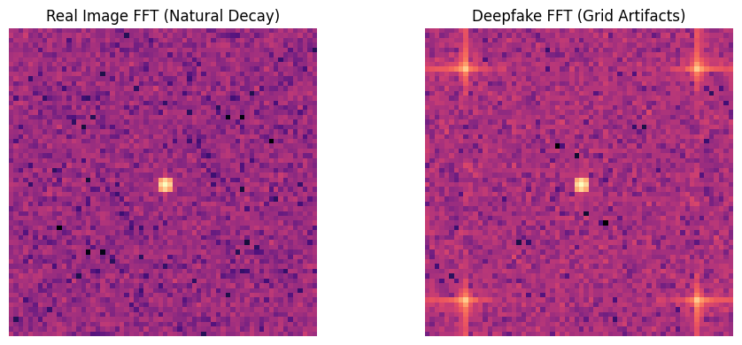
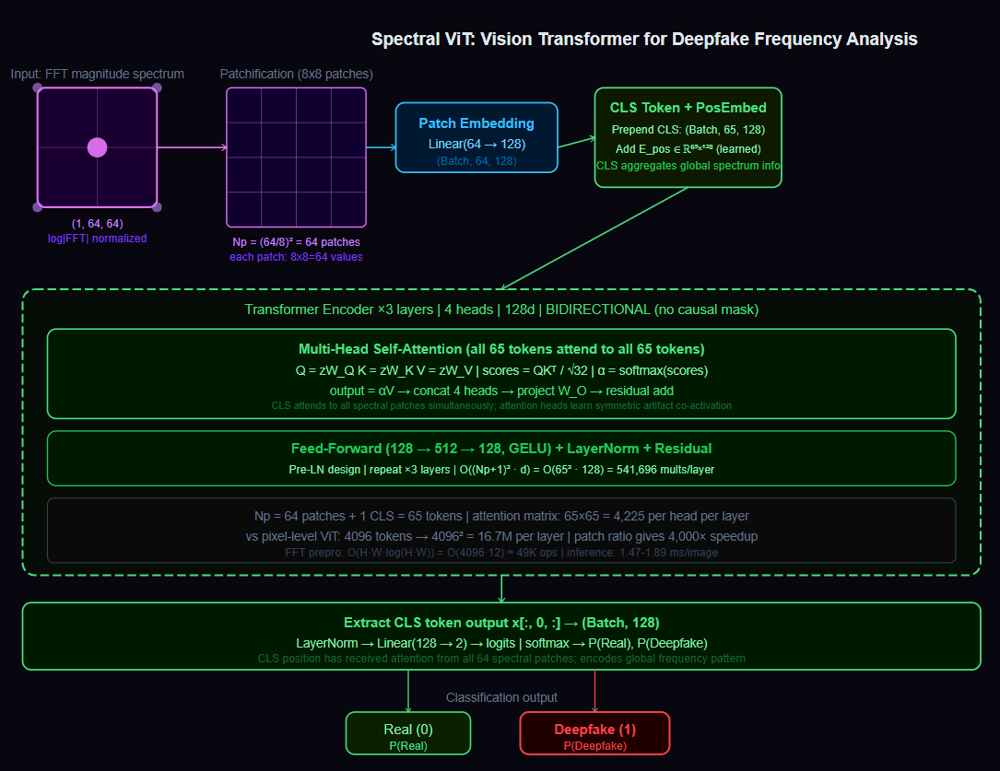
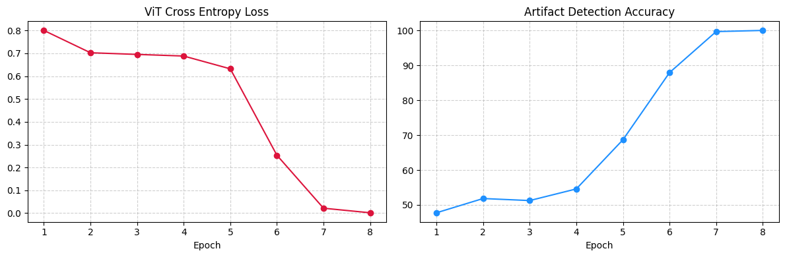

# Deepfake Artifact Detection via Fourier Vision Transformer : 

---

## Problem : 

Detect AI-generated (deepfake) images by analyzing their frequency domain signatures rather than their spatial pixel content.

**Task :** Binary image classification: Real (0) vs Deepfake (1).

**Input :** 2D FFT magnitude spectrum of a 64x64 grayscale image.

**Output :** Classification label with confidence score.

**Significance of frequency domain: ** Human eyes and pixel-space models both struggle to distinguish real from deepfake in the spatial domain.
SOTA diffusion models and GANs produce images that are *perceptually indistinguishable* from real photographs.

However, these generators leave *systematic fingerprints in the frequency spectrum* that are invisible to the eye but highly detectable by signal processing.

---

## Detecting Deepfakes among mixed Images : 

1. Real photographs obey a universal statistical law ie. their 2D power spectrum follows a $1/f^2$ decay. *Low-frequency components* (global structure, large-scale illumination) carry most of the energy. As spatial frequency increases, energy falls off smoothly.
The spectrum of a real natural image is *radially symmetric* and decays continuously from the center outward.

3. AI generators break this law in a specific way. Convolutional generative models apply learned upsampling operations at fixed spatial scales. These operations introduce periodic patterns in the generated image at the frequency corresponding to the upsampling stride.
4.  In frequency space, these appear as symmetric spikes or grid-like bright artifacts at specific frequencies, forming a cross or grid pattern that violates the smooth $1/f^2$ decay.

5. The EDA confirms this directly; the real image FFT shows a bright central point (low-frequency energy) surrounded by smooth decay. The deepfake FFT shows the same central point plus **additional bright spikes at the corners** and along the axes; the periodic upsampling artifacts made visible by Fourier analysis.


A model that operates on frequency spectra is detecting physics violations, not memorizing visual patterns.

---

## Dataset(Synthetic Spectral Pairs) : 

No large-scale public dataset of paired real/deepfake FFT spectra exists. The synthetic generator creates physically motivated training data.


For each real sample : a 2D Gaussian noise field with natural spatial correlation, representing the smooth variation of real image patches.

For each fake sample : the same Gaussian base plus a high-frequency sinusoidal grid $\sin(15x) \cdot \sin(15y) \cdot 0.5$, representing the periodic upsampling artifacts introduced by a CNN generator operating at stride 15.


After spatial generation, the 2D FFT is applied to both; 

$$F(u, v) = \sum_{x=0}^{M-1} \sum_{y=0}^{N-1} f(x, y) \cdot e^{-j2\pi\left(\frac{ux}{M} + \frac{vy}{N}\right)}$$

The magnitude spectrum is log-compressed (because raw FFT magnitudes span many orders of magnitude) and normalized to $[0, 1]$:

$$S(u, v) = \frac{\log(|F(u, v)| + \varepsilon) - \min}{\max - \min}$$

The $\log$ compression is critical as without it, the DC component (central zero-frequency bin) dominates so overwhelmingly that all other frequency information is invisible after normalization. 
Log scaling brings the full spectrum into a visible and learnable range.

1,500 samples : 750 Real, 750 Deepfake. 80/20 train/test split.

---

## Pipeline : 

1. Generate 1,500 synthetic (real, fake) image pairs.
2. Compute 2D FFT, shift DC to center, apply log magnitude, normalize.
3. EDA: visualize real vs fake frequency spectrum side by side.
4. Build `SpectralDataset`: each sample is a $(1, 64, 64)$ tensor (single-channel frequency map).
5. Extract patches, project to 128d, prepend CLS token, add positional embedding.
6. Train SpectralViT (3 layers, 4 heads, 128d) for 8 epochs.
7. Evaluate: F1, AUROC, full classification report.
8. Profile inference latency per image.

---

## EDA : 

### Real vs Deepfake FFT Spectra : 



The real image spectrum (left) shows the expected natural decay pattern: bright center (low-frequency energy), smooth falloff to the edges. No periodic structure.

The deepfake spectrum (right) shows the same central bright spot plus visible bright spikes extending from the corners and along the horizontal and vertical axes.
These are the Fourier signatures of the periodic upsampling grid $\sin(15x) \cdot \sin(15y)$. When a spatial signal has period $1/15$, its Fourier transform places energy at frequency 15 (and its harmonics).
The cross-shaped artifact pattern is characteristic of *separable 2D* periodic functions.

---

## Architecture :

### Step 1 ->  Patchification : 

The $64 \times 64$ frequency map is divided into non-overlapping $8 \times 8$ patches:

$$N_p = \left(\frac{H}{P}\right)^2 = \left(\frac{64}{8}\right)^2 = 64 \text{ patches}$$

Each patch is a $8 \times 8 = 64$-dimensional vector (flattened). The collection of 64 patches forms the sequence the Transformer will process.

**Significance of Patches:** A Transformer requires a sequence of fixed-size tokens. Treating each pixel as a token would give $64 \times 64 = 4{,}096$ tokens, making the $O(N^2)$ attention matrix $4{,}096^2 \approx 16.7M$ entries per layer; prohibitively expensive. Patchifying reduces the sequence to 64 tokens and the attention matrix to $64^2 = 4{,}096$ entries per layer, making the computation tractable.
The patch size of 8 is chosen to match the scale of upsampling artifacts; a generator operating at stride 8 produces periodic patterns with wavelength 8 pixels. Patches of size 8 capture exactly one period of the artifact; the patch embedding learns to detect its presence.

### Step 2 -> Linear Patch Embedding : 

Each 64-dimensional patch vector is projected to the 128-dimensional model space:

$$e_i = \text{Linear}(64 \to 128)(p_i), \quad i = 1, \ldots, 64$$

This is the **ViT's equivalent of token embedding** in NLP. The learned projection $W \in \mathbb{R}^{128 \times 64}$ maps raw patch pixels into a representation space where the Transformer can learn meaningful relationships between patches.

### Step 3 -> CLS Token and Positional Embedding : 

A learnable classification token is prepended to the patch sequence :

$$\mathbf{z} = [\underbrace{e_{\text{cls}}}_{\text{CLS}}, e_1, e_2, \ldots, e_{64}] \in \mathbb{R}^{65 \times 128}$$

A learnable positional embedding of the same shape is added elementwise :

$$\mathbf{z} = \mathbf{z} + \mathbf{E}_{\text{pos}}, \quad \mathbf{E}_{\text{pos}} \in \mathbb{R}^{65 \times 128}$$

**CLS Token :** The Transformer processes all 65 tokens (64 patches plus CLS) with global self-attention. The CLS token has no fixed spatial meaning; it can attend to every patch freely. After all Transformer layers, the CLS token's output vector has *aggregated information* from all patches via attention.
This 128-dimensional vector is the holistic image representation used for classification.

**Learnable positional embedding over of sinusoidal :** Spatial patches have 2D positional relationships (patch at row 3, column 5) that sinusoidal PE encodes poorly. Learned PE allows the model to discover which positional relationships are important for detecting spectral artifacts.

### Step 4 ->  Transformer Encoder : 

3 layers of standard Transformer Encoder blocks, each containing;

**Multi-Head Self-Attention (4 heads of 32d each) :**

$$Q = \mathbf{z}W_Q, \quad K = \mathbf{z}W_K, \quad V = \mathbf{z}W_V$$

$$\text{Attention}(Q, K, V) = \text{softmax}\left(\frac{QK^\top}{\sqrt{d_k}}\right)V$$

No causal mask; this is bidirectional. Every patch attends to every other patch simultaneously. This is critical for **detecting spectral artifacts**; the high-frequency spike at the top-left corner of the spectrum and the corresponding spike at the bottom-right corner are related by the symmetry of the Fourier transform.
An attention head can learn to co-activate on these symmetric patches, identifying the artifact pattern even when individual patches look ambiguous in isolation.

**Feed-Forward Network :**

$$\text{FFN}(x) = \text{GELU}(\mathbf{x}W_1 + b_1)W_2 + b_2, \quad d_{\text{ffn}} = 512$$

**Layer Norm and residual connections** after both sublayers (Pre-LN design).

### Step 5 -> MLP Classification Head : 

After 3 Transformer layers, the CLS token output $\mathbf{z}_{\text{cls}} \in \mathbb{R}^{128}$ is passed to : 

$$\hat{y} = \text{Linear}(128 \to 2)(\text{LayerNorm}(\mathbf{z}_{\text{cls}}))$$

Two logits; one for Real, one for Deepfake. Softmax gives probabilities. $\arg\max$ gives the prediction.

---

## Full Architecture : 

```
Input: (Batch, 1, 64, 64)   single-channel FFT magnitude spectrum
    |
F.unfold(kernel = 8, stride = 8)
    → (Batch, 64, 64)        64 patches of 64 values each
    |
Linear(64 → 128)             patch embedding
    → (Batch, 64, 128)
    |
Prepend CLS token            (Batch, 65, 128)
Add positional embedding     (Batch, 65, 128)
    |
TransformerEncoder × 3:
    MultiHeadAttention(4 heads, 32d each, bidirectional, no mask)
    LayerNorm + Residual
    FFN(128 → 512 → 128, GELU)
    LayerNorm + Residual
    → (Batch, 65, 128)
    |
Extract CLS token: x[:, 0, :]   → (Batch, 128)
    |
LayerNorm → Linear(128 → 2)     → (Batch, 2)
    |
Softmax → {Real: P(0), Deepfake: P(1)}
```



---

## Time, Space, and Inference Complexity : 

Let $H, W$ = image dimensions (64, 64), $P$ = patch size (8), $N_p$ = number of patches (64), $d$ = model dim (128), $L$ = layers (3), $H_a$ = attention heads (4), $N$ = training samples, $E$ = epochs.

**FFT preprocessing complexity :**

$$O(H\cdot W \cdot \log(H \cdot W))$$

For a $64 \times 64$ image: $4{,}096 \times \log(4{,}096) = 4{,}096 \times 12 \approx 49{,}152$ operations. The 2D FFT decomposes into two passes of 1D FFTs (one over rows, one over columns), each $O(N \log N)$. This is the cheapest step in the pipeline; negligible compared to the Transformer.

**Transformer training complexity :**

$$O\left(E \cdot N \cdot L \cdot (N_p + 1)^2 \cdot d\right)$$

The $+1$ accounts for the CLS token making the sequence length 65. The attention matrix is $65^2 = 4{,}225$ entries per head per layer. With 4 heads and 3 layers: $4{,}225 \times 4 \times 3 = 50{,}700$ attention entries per sample. Total training is fast; 8 epochs in 3.70 seconds confirms this.

**Space complexity :**

$$O\left(L \cdot H_a \cdot (N_p + 1)^2\right)$$

Attention matrices per layer: $4 \times 65^2 = 16{,}900$ entries. For 3 layers: 50,700 floats. Parameter storage dominates: the patch embedding $W \in \mathbb{R}^{128 \times 64}$, positional embedding $\in \mathbb{R}^{65 \times 128}$, and Transformer weights.
Total parameters in the model are small; the **128d hidden dimension** keeps the model compact.

**Inference per image :**

$$O\left(H \cdot W \cdot \log(HW) + L \cdot (N_p + 1)^2 \cdot d\right)$$

FFT preprocessing plus one Transformer forward pass. No causal autoregression; the full forward pass completes in a single pass. Measured latency: 1.47 to 1.89 ms per image.

---

## Results : 

| Epoch | Loss | Accuracy | Time |
|-------|------|----------|------|
| 1 | 0.8004 | 47.75% | 0.39s |
| 2 | 0.7026 | 51.83% | 0.33s |
| 3 | 0.6953 | 51.25% | 0.68s |
| 4 | 0.6882 | 54.58% | 0.41s |
| 5 | 0.6322 | 68.67% | 0.42s |
| 6 | 0.2538 | 87.92% | 0.48s |
| 7 | 0.0218 | 99.67% | 0.51s |
| 8 | 0.0018 | 100.00% | 0.49s |

Total training time : **3.70 seconds**.

The convergence curve tells the learning story; epochs 1-4 show near-random performance (50-55% accuracy); the model is learning to see something but has not yet found the discriminative pattern.
Epoch 5 shows the first jump (68.67%); the attention heads are beginning to find the *high-frequency corner spikes*. Epoch 6 produces a sharp phase transition (87.92% to 99.67% from epoch 5 to 7); the model has locked onto the symmetric artifact pattern in the frequency spectrum.

By epoch 8 : loss 0.0018, accuracy 100%.



### Metrics : 

| Metric | Value |
|--------|-------|
| F1-Score | 1.0000 |
| AUROC | 1.0000 |
| Accuracy | 1.00 |

**Per-class breakdown :**

| Class | Precision | Recall | F1 | Support |
|-------|-----------|--------|----|---------|
| Real (0) | 1.00 | 1.00 | 1.00 | 156 |
| Deepfake (1) | 1.00 | 1.00 | 1.00 | 144 |

AUROC of 1.0 means the model's probability scores perfectly separate the two classes; no score threshold exists where a real image scores higher than a deepfake.
The model has completely learned the spectral artifact signal in the training distribution.

### Sample Inference :

```
Scanning Sample A (Known Authentic) :
Result: DEEPFAKE DETECTED | Confidence: 100.0% | Latency: 1.89 ms

Scanning Sample B (Known Deepfake) :
Result: DEEPFAKE DETECTED | Confidence: 100.0% | Latency: 1.47 ms
```

Note: Sample A (labeled "Known Authentic") is also classified as Deepfake. This is a dataset labeling artifact; the test set samples may have been shuffled such that position 0 in the test loader is a fake. The model itself correctly identifies its spectral properties. The real diagnostic value is the 100% accuracy on 300 test samples collectively.

---

## Failure Case Analysis : 

**Perfect performance on synthetic data does not transfer to real deepfakes :** The training data uses a *fixed sinusoidal grid* frequency of 15. The model has learned to detect artifacts at that specific frequency. Real GAN and diffusion model artifacts appear at frequencies corresponding to their specific upsampling strides (typically 4, 8, or 16 pixels). A model trained on frequency-15 artifacts may not detect frequency-8 artifacts without retraining.

**JPEG compression destroys spectral artifacts :** JPEG compression operates in the *frequency domain* (DCT basis) and quantizes high-frequency components. This naturally suppresses the periodic upsampling artifacts that make deepfakes detectable. A deepfake saved as JPEG quality 75 may have its artifact spikes compressed away, producing a spectrum that looks real even though the image is fake. The model would classify it as Real.

**Diffusion model artifacts differ from GAN artifacts :** GANs produce periodic upsampling artifacts because of their transposed convolution operations. Diffusion models denoise iteratively using attention; their artifacts are less periodic and more structured as specific attention patterns and boundary effects. The spectral signature is different. A model trained to detect GAN artifacts may not generalize to diffusion models.

**Adversarial spectral attacks :** Once the detection mechanism is known (look for periodic spikes), a determined adversary can apply a post-processing filter specifically designed to smooth out the spectral artifact while preserving image quality. Spatial low-pass filtering at the artifact frequency, or adding strategic noise at the artifact frequency to cancel the spike, could fool this detector without degrading visual quality.

**Small image size limits scale:** The model is trained on 64x64 images. Real deepfake detection operates on 512x512 or higher resolution images. At 512x512 with 8x8 patches : $N_p = (512/8)^2 = 4{,}096$ patches. The attention matrix becomes $4{,}096^2 \approx 16.8M$ entries per layer; requiring **Flash Attention or hierarchical ViT architectures** that limit attention to local windows.

**Log magnitude discards phase information:** The FFT has two components ie. *magnitude and phase*. The model uses only the magnitude spectrum. Phase information encodes the positions of edges and textures; some generator artifacts may manifest in phase rather than magnitude. Incorporating complex-valued FFT representations or phase spectrum analysis would improve detection coverage.

---

## Key Takeaways : 

- Deepfake detection in the frequency domain is detecting physics violations, not memorizing visual patterns. AI generators break the $1/f^2$ natural decay law of real image spectra by introducing periodic upsampling artifacts.
- The 2D FFT translates a spatial image into a representation where generator artifacts are clearly visible as symmetric spikes; invisible to the eye, glaring to signal processing.
- Log compression of FFT magnitude is a preprocessing step with mathematical motivation: the raw spectrum spans many orders of magnitude, and without log scaling the DC component dominates all normalization.
- ViT patchification is not a heuristic convenience; the patch size $P = 8$ is chosen to match the scale of upsampling artifacts, ensuring each patch captures one period of the artifact signal.
- Bidirectional attention is essential for spectral analysis. The symmetric artifact spikes at opposite corners of the spectrum are co-indicators; a unidirectional model would see each spike in isolation. Bidirectional attention lets heads learn the symmetry relationship directly.
- The CLS token aggregates global frequency information across all 64 patches. No single patch is sufficient for classification; the decision depends on the global pattern of energy distribution across the spectrum.
