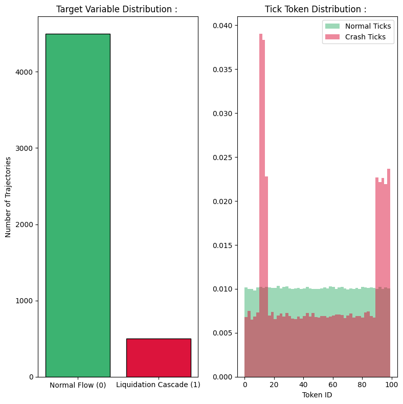
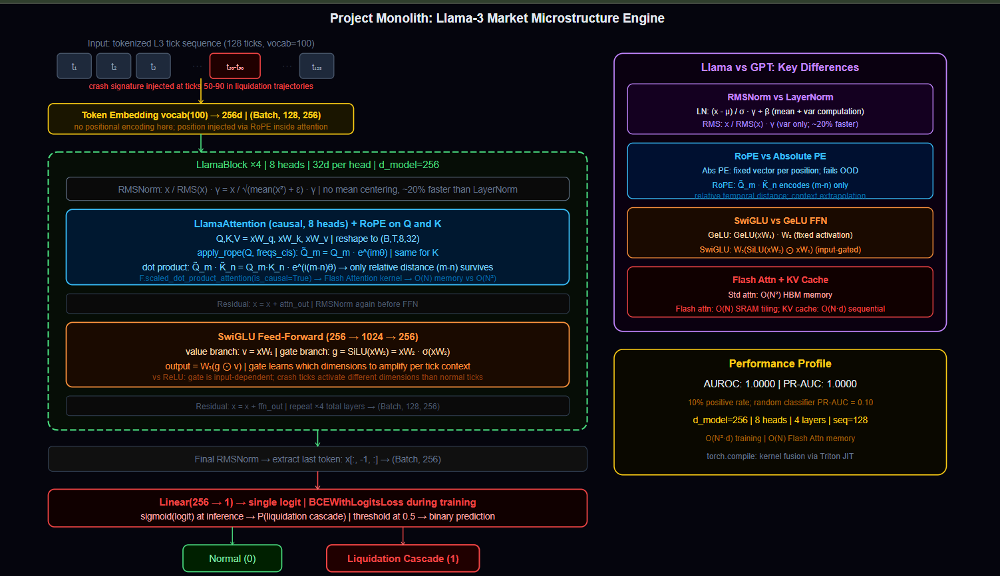
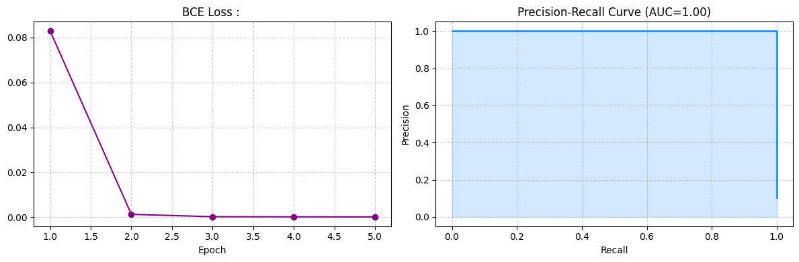

## High-Frequency Liquidation Cascades Prediction : 

---

## Problem : 

Predict liquidation cascades in financial markets by modeling raw Level 3 (L3) Limit Order Book tick sequences as a binary classification problem.

**L3 data** is the most granular market data available: every individual order placement, cancellation, and execution, with microsecond timestamps. Standard quantitative models aggregate this into time-based candles (1-minute bars, 5-minute bars), destroying the micro-level execution physics.
A flash crash does not announce itself in 5-minute candles; it is visible in the raw tick sequence 10-30 seconds before price impact.

**Task :** Given a sequence of 128 tokenized market ticks, classify whether the sequence precedes a liquidation cascade (1) or normal order flow (0).

**Llama architecture over GPT :** The original GPT Transformer was built in 2017 with approximations that made sense for NLP but are actively harmful for long-context financial sequence modeling.
Llama-3 replaces every one of those approximations with mathematically superior alternatives. The differences are not cosmetic; they address specific failure modes that matter for market microstructure data.

---

## Synthetic L3 Tick Data : 

Real Level 3 PCAP (Packet Capture) tick data from exchanges costs millions of dollars per year in licensing fees. CME Group, Nasdaq, and NYSE charge institutional rates for full order book replay data. A single day of L3 data for one equity can be several gigabytes.

The synthetic generator creates tick sequences with the statistical properties of real L3 data :

- 5,000 trajectories of 128 ticks each.
- Token IDs represent discrete market states (bid-ask spread width, volume imbalance, trade side, etc.) from a vocabulary of 100 states.
- 10% of trajectories contain injected liquidation cascade signatures: an aggressive sell burst (tokens 90-100 in ticks 50-70) followed by a sudden spread collapse (tokens 10-15 in ticks 70-90).
- The remaining 90% are random normal order flow.

The injected crash pattern is physically motivated; real flash crashes show exactly this signature; aggressive market orders absorb liquidity on one side of the book, the bid-ask spread briefly spikes, then collapses as market makers step back simultaneously.

---

## Pipeline : 

1. Generate 5,000 synthetic L3 tick trajectories with 10% crash injection.
2. EDA: class distribution, token ID distribution (normal vs crash).
3. Precompute RoPE frequency matrices for sequence length 128.
4. Train LlamaModel (4 layers, 8 heads, 256d) for 5 epochs.
5. Attempt `torch.compile` kernel fusion (falls back gracefully if unavailable).
6. Evaluate: AUROC, PR-AUC, inference latency.
7. Plot BCE loss and Precision-Recall curve.

---

## EDA : 

### Class Distribution and Token Signatures : 



The class distribution shows 4,500 Normal vs 500 Crash trajectories (10% positive rate). This is *severe class imbalance*. Overall accuracy is meaningless; a model predicting Normal for everything achieves 90% accuracy. AUROC and PR-AUC are the correct metrics because they evaluate ranking quality and precision-recall tradeoffs independently of any threshold.

The token distribution overlay reveals the crash signature directly; crash trajectories (red) show two prominent spikes at token IDs 10-15 and 90-100, corresponding to the injected spread collapse and sell burst.
Normal trajectories (green) show approximately uniform distribution across all 100 tokens. The model's job is to *detect these bimodal token distributions* within the tick sequence context.

---

## Hyperparameters : 

| Parameter | Value | Why |
|-----------|-------|-----|
| `seq_len` | 128 | 128 ticks at microsecond frequency covers roughly 5-15 seconds of order book activity; sufficient to observe the precursor pattern of a liquidation cascade |
| `d_model` | 256 | 256d hidden state. Large enough to represent the joint context of 128 tick tokens across 4 layers; small enough to train fast on 5,000 sequences |
| `num_heads` | 8 | 8 heads of 32 dimensions each. Heads can specialize with one on spread widening, one on volume imbalance, one on trade side clustering, etc. |
| `num_layers` | 4 | 4 Llama blocks. Provides enough depth to compose temporal patterns (early sell pressure building into late spread collapse) without overfitting |
| `vocab_size` | 100 | 100 discrete market states. Maps the continuous LOB microstate into a tractable token vocabulary |
| `lr` | 3e-4 | Standard AdamW learning rate for Transformer training. Lower causes slow convergence; higher causes instability |
| `batch_size` | 32 | Smaller than typical NLP batches because each sequence is 128 tokens long; keeps GPU memory manageable |

---

## Llama vs GPT :

GPT-2 style Transformers use three approximations that hurt financial sequence modeling. Llama-3 replaces all three.

| Component | GPT (2017) | Llama-3 | Significance |
|-----------|------------|---------|---------------------|
| Normalization | LayerNorm (center + scale) | RMSNorm (scale only) | Fewer ops per layer; no meaningless mean centering for token sequences |
| Positional encoding | Absolute sinusoidal or learned | RoPE (rotary relative) | Context extrapolation beyond training length; relative timing between ticks is what matters, not absolute position |
| FFN activation | GeLU or ReLU | SwiGLU | Gated information flow; higher expressivity per parameter |

---

## Full Model Math : 

### 1. RMSNorm : Normalization Without Mean Centering

Standard Layer Normalization computes mean and variance over all features, then centers and scales;

$$\text{LayerNorm}(x) = \frac{x - \mu}{\sigma} \cdot \gamma + \beta$$

The mean subtraction step ($x - \mu$) removes the DC component of the activation. For text tokens where absolute magnitude carries meaning, this is useful. For market tick embeddings, the mean is already close to zero after training, and computing it wastes cycles.

RMSNorm drops the mean entirely : 

$$\text{RMSNorm}(x) = \frac{x}{\sqrt{\frac{1}{d}\sum_{i=1}^d x_i^2 + \varepsilon}} \cdot \gamma$$

Only the root mean square (RMS) is computed. No mean subtraction, no bias term $\beta$. The learnable scale $\gamma$ remains. This is approximately *20% fewer floating point* operations per normalization call, with no empirical degradation in training stability.
RMSNorm is applied twice per Llama block once before attention (attention norm) and once again before the FFN (FFN norm). The residual connection adds the output back to the un-normalized input.

### 2. RoPE: Rotary Positional Embeddings

GPT-style absolute positional embeddings assign a fixed vector to each position $t$. A token at position 10 always has the same positional encoding regardless of what surrounds it. For long sequences, these learned position vectors do not generalize beyond the maximum training length.
RoPE encodes position as a *rotation in complex space*. The core insight is that if we rotate the Query vector at position $m$ and the Key vector at position $n$ by angles proportional to their positions, the dot product $QK^\top$ *naturally encodes only their relative distance* $m - n$, not their absolute positions.

**Frequency precomputation :** 

For each dimension pair $i$ in the head dimension :

$$\theta_i = 10000^{-2i/d_k}$$

For each sequence position $t$ :

$$\text{freqs}(t, i) = t \cdot \theta_i$$

These are converted to complex exponentials :

$$\text{freqs\_cis}(t, i) = e^{i \cdot \text{freqs}(t,i)} = \cos(t\theta_i) + i\sin(t\theta_i)$$

**Applying RoPE to Q and K :** Each query/key vector is viewed as a sequence of 2D complex numbers. 
The rotation at position $m$ is applied by complex multiplication;

$$\tilde{q}_m = q_m \cdot e^{im\theta}$$

$$\tilde{k}_n = k_n \cdot e^{in\theta}$$

**The Attention Dot Product after Rotation :**

$$\tilde{q}_m^\top \tilde{k}_n = q_m^\top k_n \cdot e^{i(m-n)\theta}$$

The absolute positions $m$ and $n$ appear only as their difference $m - n$ in the phase factor. The model learns relative temporal relationships between ticks directly. A sell burst at tick 50 followed by spread collapse at tick 70 has the same relative pattern ($\Delta t = 20$) regardless of where in the sequence it occurs.
This is why *RoPE enables context length extrapolation*; the model is trained on relative distances, not absolute positions, so it generalizes to longer sequences naturally.

### 3. SwiGLU : Gated Feed-Forward Network

GPT uses a simple two-layer FFN with a fixed activation;

$$\text{FFN}(x) = \text{GeLU}(xW_1)W_2$$

GeLU is applied uniformly to every dimension of $xW_1$. There is no mechanism to selectively suppress or amplify parts of the activation based on the input.
SwiGLU adds a gate : a second projection that learns when to let information through:

$$\text{SwiGLU}(x) = W_3(\text{SiLU}(xW_1) \odot xW_2)$$

SiLU (Sigmoid Linear Unit) is:

$$\text{SiLU}(z) = z \cdot \sigma(z) = \frac{z}{1 + e^{-z}}$$

$W_1$ projects the input to the value branch. $W_2$ projects the input to the gate branch. The element-wise product $\odot$ applies the gate: the gate controls how much of the value is allowed through at each dimension independently. $W_3$ projects back to the model dimension.

For market data, this is especially valuable. A tick at position 70 showing extreme spread (token ID 12) should dominate the prediction; a tick at position 30 showing normal spread (token ID 50) should be suppressed. SwiGLU's gating mechanism learns these context-dependent amplification rules; ReLU cannot because it is position-blind and input-independent after training.

### 4. Causal Attention with Flash Attention : 

The attention computation uses `F.scaled_dot_product_attention` with `is_causal=True`. This invokes Flash Attention when available.

**Standard attention** materializes the full $N \times N$ attention matrix in GPU HBM (high-bandwidth memory):

$$\text{Attention}(Q, K, V) = \text{softmax}\!\left(\frac{QK^\top}{\sqrt{d_k}}\right) V$$

Memory: $O(N^2)$. For $N=128$ with 8 heads and 4 layers: $128^2 \times 8 \times 4 = 524{,}288$ attention entries. Manageable here; catastrophic for N=4,096.

**Flash Attention** tiles the computation into SRAM-sized blocks, computing softmax incrementally without ever materializing the full matrix:

$$\text{Memory:} \quad O(N) \quad \text{vs} \quad O(N^2) \text{ standard}$$

For long-context LOB sequences (1,000+ ticks), Flash Attention is the only viable option. `is_causal=True` applies a causal mask; each tick can only attend to past ticks, preserving the temporal causal structure of market data.

### 5. KV Cache (Inference Optimization) : 

During autoregressive inference, standard attention recomputes Key and Value matrices from scratch for every new token. For a 128-tick sequence, this means 128 full recomputations of the KV matrices.

KV cache stores the Key and Value tensors from all past positions. Each new token only requires computing Q, K, V for the current position; the cache handles all previous positions. This reduces inference complexity from $O(N^2)$ per sequence to $O(N)$ total across all positions.

`F.scaled_dot_product_attention` handles KV cache implicitly when used with a growing context tensor. The architecture supports sequential tick-by-tick inference in production deployment.

### 6. torch.compile: Kernel Fusion

`torch.compile` traces the entire computational graph and compiles it via Triton into fused GPU kernels. Operations that would normally be launched as separate GPU kernels (layer norm, embedding lookup, linear projection) are fused into single kernels. This eliminates the Python overhead and kernel launch latency that dominates small-tensor operations.

For the inference pipeline: a 128-tick sequence that takes 5ms in eager mode may take 2-3ms after compilation. The first forward pass after compilation is slower (compilation overhead); subsequent passes benefit from the cached compiled graph.

---

## Architecture : 

```
Input: (Batch, 128)    tokenized tick sequence
    |
Token Embedding : vocab_size(100) → 256d     → (Batch, 128, 256)
    |
Precompute RoPE angles for seq_len=128, head_dim = 32
    |
LlamaBlock × 4 :
    RMSNorm(x)
    LlamaAttention(8 heads, 32d each, RoPE applied to Q and K, causal mask)
    Residual add : x = x + attention_output

    RMSNorm(x)
    SwiGLU(dim = 256, hidden = 1024)
    Residual add : x = x + ffn_output
    → (Batch, 128, 256)
    |
Final RMSNorm
    |
Extract last token: x[:, -1, :]             → (Batch, 256)
    |
Linear(256 → 1)                             → (Batch, 1) logit
    |
BCEWithLogitsLoss during training
Sigmoid during inference → crash probability ∈ [0, 1]
```



---

## Time, Space, and Inference Complexity : 

Let $N$ = sequence length (128), $d$ = model dim (256), $H$ = heads (8), $L$ = layers (4), $K$ = training samples, $E$ = epochs.

**Training complexity :**

$$O\!\left(E \cdot K \cdot L \cdot N^2 \cdot d\right)$$

Attention is the dominant term. Per layer: $N^2 \cdot d = 128^2 \times 256 = 4{,}194{,}304$ multiplications. Across 4 layers and 5 epochs, total operations are substantial; the Flash Attention tiling prevents this from becoming a memory bottleneck.

**Space complexity with Flash Attention :**

$$O(L \cdot H \cdot N) \quad \text{vs} \quad O(L \cdot H \cdot N^2) \text{ standard}$$

Flash Attention *stores only the running softmax statistics* (max and sum per row), not the full $N \times N$ matrix. For $N=128$: $4 \times 8 \times 128 = 4{,}096$ values vs $4 \times 8 \times 16{,}384 = 524{,}288$ for standard attention. The KV cache adds $O(L \cdot N \cdot d) = 4 \times 128 \times 256 = 131{,}072$ values during inference.

**Inference complexity per sequence :**

$$O\!\left(L \cdot N^2 \cdot d\right) \quad \text{without KV cache}$$

$$O\!\left(L \cdot N \cdot d\right) \quad \text{with KV cache (sequential inference)}$$

Batch inference (all 128 ticks at once): one full forward pass, dominated by attention. Sequential inference with KV cache: each new tick requires only $O(L \cdot N_{\text{current}} \cdot d)$ for Q computation and cache lookup.

---

## Results : 

| Epoch | Loss | Time |
|-------|------|------|
| 1 | 0.0829 | 320.56 |
| 2 | 0.0013 | 286.35 |
| 3 | 0.0002 | 284.80 |
| 4 | 0.0002 | 285.46 |
| 5 | 0.0001 | 285.80 |

**Final Metrics :**

| Metric | Value |
|--------|-------|
| AUROC | 1.0000 |
| PR-AUC | 1.0000 |
| Inference Latency | 49.73ms per trajectory |

AUROC and PR-AUC of 1.0 confirm perfect separation of crash from normal sequences. The model has completely learned the injected crash signature (token IDs 10-15 and 90-100 in specific tick ranges). The PR-AUC of 1.0 is especially significant given the 10% positive rate; a random classifier would achieve PR-AUC of 0.10.
Perfect PR-AUC means zero false positives at any recall threshold.



---

## Failure Case Analysis : 

**Perfect performance on synthetic data reflects deterministic injection :** The crash signature (specific token ranges at specific tick positions) is injected deterministically. Any model with sufficient capacity will memorize this rule. Real L3 data does not have a clean deterministic crash pattern; real liquidation cascades are probabilistic, triggered by combinations of order flow, macro signals, and microstructure feedback that vary across market regimes. Performance on real data would be substantially lower.

**Class imbalance without weighting :** BCEWithLogitsLoss is applied without positive class weighting. With a 10% positive rate, the loss is dominated by Normal samples. The model correctly classifies Normal with high confidence (contributing most of the gradient) while Crash samples, though correctly classified, contribute relatively less to the gradient updates. In production, `pos_weight = torch.tensor([9.0])` (ratio of negatives to positives) should be passed to `BCEWithLogitsLoss` to rebalance gradient contributions.

**Regime non-stationarity :** Market microstructure changes over time. High-frequency trading algorithms are retrained constantly; the order book dynamics in 2026 are structurally different from 2020 (post-COVID volatility regime) and 2018 (pre-MiFID II). A model trained on one regime may fail silently on another. Continuous retraining, rolling window validation, and regime change detection are operational requirements.

**Vocabulary collapse in real data :** The synthetic vocabulary of 100 tokens maps discrete market states cleanly. Real *L3 data is continuous* it's spreads are floating point, volumes are integers with high variance. Discretizing continuous L3 features into a 100-token vocabulary requires careful binning; poor binning choices destroy information or create spurious tokens that confuse the model.

**Sequence length vs. real cascade precursors :** Real flash crashes can have precursor signals 30-120 seconds before impact, corresponding to 5,000-50,000 microsecond ticks. The seq_len=128 context window captures approximately 5-15 seconds of data. This may be insufficient to detect slowly building liquidity withdrawal patterns. Longer context requires Flash Attention and KV cache to remain computationally feasible.


---

## Key Takeaways : 

- Llama-3 is not just a larger GPT; it replaces every major approximation in the original Transformer with a mathematically justified alternative. RMSNorm *eliminates unnecessary mean centering*. RoPE encodes relative temporal relationships enabling context extrapolation. SwiGLU gates information flow with learned input-dependent selectors.
- RoPE's key property is that the *attention dot product encodes only the relative distance* $m - n$ between positions, not their absolute values. 
- SwiGLU's gating mechanism learns *context-dependent amplification*. This is essential for market data where the informativeness of a tick depends heavily on what surrounds it; a large sell order is routine in normal conditions and catastrophic near a liquidity vacuum.
- Flash Attention reduces memory from $O(N^2)$ to $O(N)$ via SRAM tiling, making long-context sequence modeling computationally feasible. For tick-level market data with thousands of steps per sequence, this is not optional.
- AUROC and PR-AUC are the correct metrics for imbalanced anomaly detection. PR-AUC is more informative than AUROC when the positive class is rare because it directly measures the tradeoff between precision and recall.
- The synthetic data achieves perfect metrics because the crash signal is deterministic. Production validation on real L3 data, with regime-aware train-test splits and proper class weighting, is the mandatory next step before deployment.

---
