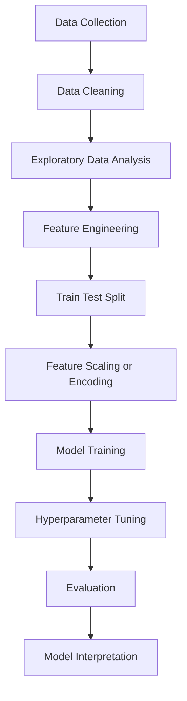

# 30 Days of Machine Learning — From Classical ML to Modern Deep Learning


A structured **30-day challenge implementing Machine Learning and Deep Learning models on real datasets**, progressing from **classical ML algorithms to modern attention-based architectures and transformers**.

The goal of this repository is to:

- Understand **mathematical intuition behind ML models**
- Build **complete end-to-end ML pipelines**
- Implement **deep learning architectures from scratch**
- Explore **modern transformer models**
- Document experiments clearly

Each day focuses on a **specific algorithm or architecture**, implemented on a real-world problem.

This repository serves as a **learning log, ML implementation reference, and portfolio project**.

---

# Repository

GitHub Profile  
https://github.com/Lemniscate-2525  

Repository  
https://github.com/Lemniscate-2525/30_Days_of_ML

---

# Repository Structure

Each folder represents a **self-contained ML project for that day**.

```
30_Days_of_ML
│
├── day01_logistic_regression_churn
├── day02_random_forest_credit
├── day03_linear_regression_housing
├── day04_decision_tree_titanic
├── day05_knn_iris
├── day06_svm_breast_cancer
├── day07_naive_bayes_spam
├── day08_gradient_boosting
├── day09_xgboost_credit_default
├── day10_lightgbm_loan_prediction
│
├── day11_kmeans_customer_segmentation
├── day12_pca_dimensionality_reduction
├── day13_autoencoder_feature_compression
├── day14_isolation_forest_anomaly_detection
├── day15_ensemble_stacking_model
│
├── day16_neural_network_mnist
├── day17_cnn_cifar10
├── day18_transfer_learning_resnet
├── day19_rnn_text_generation
├── day20_lstm_sentiment_analysis
├── day21_gru_sequence_classification
├── day22_bilstm_named_entity_recognition
├── day23_bigru_sequence_prediction
│
├── day24_attention_mechanism
├── day25_encoder_decoder_cross_attention
├── day26_transformer_self_attention
├── day27_bert_finetuning
├── day28_gpt_style_transformer
├── day29_vision_transformer
├── day30_modern_transformer_architecture
│
└── README.md
```

Each project folder contains:

- dataset or dataset reference
- implementation notebook or scripts
- visualizations and analysis
- evaluation metrics
- a detailed README explaining the model

---

# Machine Learning Pipeline

All projects follow a consistent **end-to-end ML workflow**.



This pipeline ensures experiments remain **reproducible and interpretable**.

---

# Mathematical Concepts Explored

The challenge emphasizes **mathematical understanding of ML algorithms**.

Key concepts explored throughout the projects include:

### Optimization
- Gradient Descent
- Loss Functions
- Convex Optimization

### Linear Models
- Least Squares
- Logistic Function
- Decision Boundaries

### Tree-Based Learning
- Entropy
- Information Gain
- Gini Impurity

### Ensemble Learning
- Bagging
- Boosting
- Variance Reduction

### Deep Learning
- Backpropagation
- Activation Functions
- Sequence Modeling
- Attention Mechanisms
- Transformer Architecture

The focus is understanding **why models work**, not just how to use them.

---

# Evaluation Metrics

Different ML tasks require different evaluation strategies.

### Classification
- Accuracy
- Precision
- Recall
- F1 Score
- ROC-AUC

### Regression
- Mean Squared Error (MSE)
- Root Mean Squared Error (RMSE)
- R² Score

### Clustering
- Silhouette Score
- Cluster Separation Metrics

---

# Tools and Technologies

Core ecosystem used throughout the challenge:

- Python
- NumPy
- Pandas
- Scikit-learn
- Matplotlib
- Seaborn

Deep learning experiments use:

- PyTorch
- HuggingFace Transformers
- Tokenizers
- GPU acceleration

---

# 30 Day Project Roadmap

| Day | Model / Architecture | Problem |
|----|----|----|
| 1 | Logistic Regression | Customer Churn Prediction |
| 2 | Random Forest | Credit Risk Prediction |
| 3 | Linear Regression | House Price Prediction |
| 4 | Decision Tree | Titanic Survival Prediction |
| 5 | K-Nearest Neighbors | Iris Classification |
| 6 | Support Vector Machine | Breast Cancer Detection |
| 7 | Naive Bayes | Email Spam Detection |
| 8 | Gradient Boosting | Customer Churn Prediction |
| 9 | XGBoost | Credit Default Prediction |
| 10 | LightGBM | Loan Approval Prediction |
| 11 | K-Means Clustering | Customer Segmentation |
| 12 | PCA | Dimensionality Reduction |
| 13 | Autoencoder | Feature Compression |
| 14 | Isolation Forest | Fraud / Anomaly Detection |
| 15 | Ensemble Stacking | Tabular Prediction System |
| 16 | Feedforward Neural Network | MNIST Digit Classification |
| 17 | CNN | CIFAR-10 Image Classification |
| 18 | Transfer Learning (ResNet) | Image Classification |
| 19 | RNN | Text Generation |
| 20 | LSTM | Sentiment Analysis |
| 21 | GRU | Sequence Classification |
| 22 | Bidirectional LSTM | Named Entity Recognition |
| 23 | Bidirectional GRU | Sequence Prediction |
| 24 | Attention Mechanism | Sequence-to-Sequence Translation |
| 25 | Encoder-Decoder + Cross Attention | Neural Machine Translation |
| 26 | Transformer (Self Attention) | Language Modeling |
| 27 | BERT Fine-Tuning | Text Classification |
| 28 | GPT-Style Transformer | Text Generation |
| 29 | Vision Transformer | Image Classification |
| 30 | Modern Transformer Architecture | Mini LLM Experiment |

---

# Datasets Used

Datasets are sourced from:

- UCI Machine Learning Repository
- Kaggle
- Scikit-learn datasets
- HuggingFace datasets
- Open academic datasets

All datasets are used for **educational experimentation**.

---

# Learning Goals

This challenge focuses on building strong intuition around:

- Selecting appropriate models for different tasks
- Building reproducible ML pipelines
- Understanding sequence models and attention
- Implementing transformer architectures
- Documenting ML experiments clearly

---

# Progress

Current Progress

Day **5 / 30**

This repository is updated **daily as the challenge progresses**.

---
